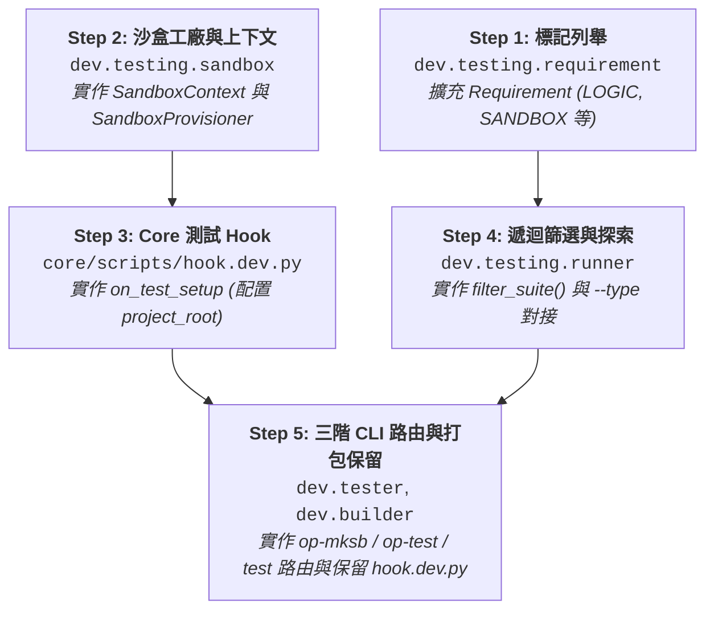

# API 規格與介面合約說明書 (API Specification & Contracts)

> 功能名稱：測試框架生命週期與全隔離虛擬沙盒重構 (Testing Lifecycle & Virtual Sandbox Refactor)  
> 建立日期：2026-08-25  
> 所屬主計畫：[2026_08_23_2030_architecture_refactor](../umbrella_overview.md)  
> 依據 P01/P02：[P01_requirements_spec.md](./P01_requirements_spec.md), [P02_architecture_plan.md](./P02_architecture_plan.md)  
> 狀態：Confirmed  
> 擴充項目：none  
> 模板版本：v1.4  

---

## 1. Public API 簽名與型態定義

### 1.1 測試需求標籤與過濾介面 (`dev.testing.requirement`)

```python
from enum import Flag, auto
from typing import Callable, Any

class Requirement(Flag):
    NONE = 0
    LOGIC = auto()     # 純內部邏輯測試
    HOST_CLI = auto()  # 需呼叫 yscb.py 子程序
    NETWORK = auto()   # 需對外聯網連線

def require(requirement: Requirement) -> Callable[[Callable[..., Any]], Callable[..., Any]]:
    """
    測試案例條件標記裝飾器。
    1. 標註測試方法之 requirement 屬性供 TestDiscovery 進行 --type 篩選。
    2. 執行期若環境不滿足條件（如離線時標註 NETWORK），自動觸發 unittest.SkipTest。
    """
    ...
```

---

### 1.2 沙盒上下文與建造工廠 (`dev.testing.sandbox`)

```python
from typing import Dict, Any, Optional, List

class SandboxContext:
    """傳遞予各模組 hook.dev.py 的沙盒操作上下文門面。"""
    sandbox_dir: str
    host_dir: str
    project_dir: str
    provider_dir: str

    def set_module_config(self, module_name: str, config_filename: str, data: Dict[str, Any]) -> None:
        """安全寫入沙盒 host/engine/config/{module}/{config_filename}。"""
        ...

    def create_mock_package(self, name: str, version: str = "1.0.0", deps: Optional[Dict[str, str]] = None) -> str:
        """在 sandbox/provider/ 下快速生成符合規範之 Mock 套件。"""
        ...

class SandboxProvisioner:
    """沙盒環境建造與銷毀工廠 (dev op-mksb 底層引擎)。"""
    
    @staticmethod
    def create_sandbox(target_dir: Optional[str] = None, copy_source: bool = True) -> SandboxContext:
        """
        建立微型虛擬環境：
        1. 建立 project/, host/, provider/ 三大子空間。
        2. 生成 host/yscb.config.json (yscb_root = "./engine", default_provider = provider/)。
        3. 複製 source/ 至 host/engine/source/。
        4. 廣播各模組 scripts/hook.dev.py : on_test_setup(context)。
        回傳 SandboxContext。
        """
        ...

    @staticmethod
    def cleanup_sandbox(sandbox_dir: str, force: bool = False) -> bool:
        """安全銷毀沙盒目錄，遇 Windows 檔案鎖定時進行防禦性重試與警告。"""
        ...
```

---

### 1.3 模組測試自治 Hook 介面 (`scripts/hook.dev.py`)

```python
# scripts/hook.dev.py 標準規格
from typing import Any

def on_test_setup(context: Any) -> None:
    """
    當沙盒建立時由 dev.testing 調度觸發。
    各模組在此為沙盒配置其專屬初始檔案。
    """
    ...

def on_test_teardown(context: Any) -> None:
    """測試結束時之模組清理 (選填)。"""
    ...
```

#### Core 模組具體實作：
```python
# source/core/scripts/hook.dev.py
from typing import Any

def on_test_setup(context: Any) -> None:
    # 僅配置 core 自身 project_root，解除 '!undefined' 阻斷
    context.set_module_config("core", "config.project.json", {
        "project_root": "../mock_downstream_project"
    })

def on_test_teardown(context: Any) -> None:
    pass
```

---

### 1.4 遞迴過濾器與套件探索 (`dev.testing.runner`)

```python
import unittest
from typing import Optional, List, Tuple
from dev.testing.requirement import Requirement

def filter_suite(
    suite: unittest.TestSuite,
    pattern: Optional[str] = None,
    req_type: Optional[str] = None
) -> unittest.TestSuite:
    """
    遞迴解構並過濾 TestSuite：
    1. 遍歷任意深度之子 TestSuite 與 TestCase。
    2. 依 pattern (名稱包含) 與 req_type (@require 屬性) 進行葉子節點篩選。
    3. 重構回傳純淨的過濾後 TestSuite。
    """
    ...

class TestDiscovery:
    @staticmethod
    def build_suite_for_module(
        module_name: str,
        test_type: Optional[str] = None,
        pattern: Optional[str] = None,
        contract_only: bool = False
    ) -> Tuple[unittest.TestSuite, int, int]:
        """原地載入 source/<mod>/tests/ 並調用 filter_suite 完成套件組裝。"""
        ...
```

---

### 1.5 三階 CLI 指令調度器 (`dev.tester:Tester`)

```python
from typing import List

class Tester:
    def run(self, argv: List[str]) -> int:
        """
        CLI 進入點路由：
        - argv[0] == 'op-mksb': 呼叫 SandboxProvisioner.create_sandbox()，印出沙盒路徑，返回 0。
        - argv[0] == 'op-test': 原地執行 TestDiscovery + TestRunner，不建立沙盒，返回 0 或 1。
        - argv[0] == 'test' (或直接 dev test):
            1. 調用 op-mksb 建造沙盒。
            2. 子程序呼叫 sandbox/host/yscb.py dev op-test [args]。
            3. 依結果清理沙盒或留存現場。
            4. 返回子程序退出碼。
        """
        ...
```

---

## 2. 實作依賴拓撲 (Implementation Order Topology)



---

## 3. 決策紀錄整合 (Decision Records Master List)

- `[P03:DR-01]`：`SandboxContext` 作為沙盒初始化的安全中介層，限制模組 Hook 僅能寫入其所屬的 `config/{module}/`。
- `[P03:DR-02]`：`filter_suite()` 採純函式遞迴設計，確保對 standard `unittest.TestSuite` 任何巢狀結構的 100% 相容性。
- `[P03:DR-03]`：`op-mksb` 與 `op-test` 作為內部原子指令，`test` 作為外層預設使用者指令，徹底杜絕二度沙盒遞迴。
