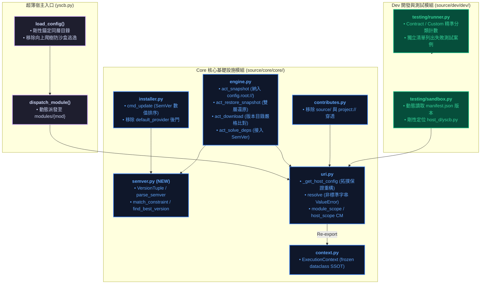
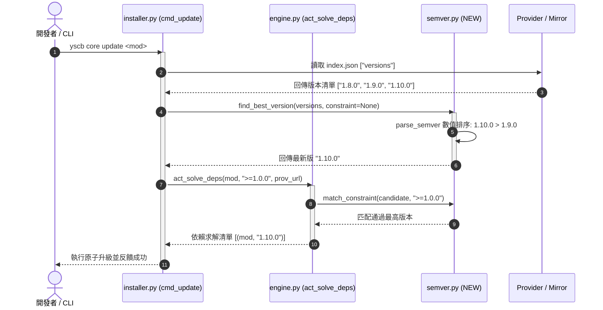
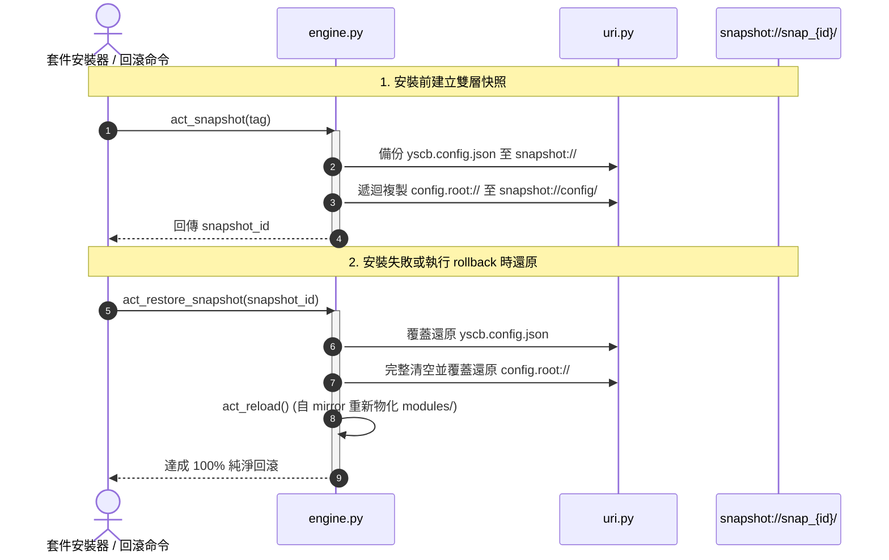

# 架構與模組設計說明書 (Architecture & Module Plan)

> 功能名稱：套件框架健壯性強化與缺陷修復 (Framework Robustness & Bug Fixes)  
> 建立日期：2026-08-25  
> 所屬主計畫：[2026_08_23_2030_architecture_refactor](../umbrella_overview.md)  
> 依據 P01：[P01_requirements_spec.md](./P01_requirements_spec.md)  
> 狀態：Confirmed  
> 擴充項目：none  
> 模板版本：v1.4  

---

## 1. 系統模組劃分與邊界 (Module Architecture & Boundaries)

---

## 2. 核心運作流程與循序圖 (Lifecycle Sequence Flow)

### 2.1 SemVer 版本求解與升級循序圖 (FR-05)

### 2.2 雙層組態快照備份與回滾循序圖 (FR-08)

---

## 3. 受影響模組與檔案矩陣 (Impacted Files Matrix)

| 檔案路徑 | 變更類型 | 核心職責與修改重點 | 對應 FR / EC |
| :--- | :---: | :--- | :--- |
| [`yscb.py`](file:///h:/UseFolder/CodeRepo/ys_codebase/yscb.py) | Modify | 移除 `load_config` 之 `while True` 向上爬樹，剛性錨定同層 `yscb.config.json`。 | FR-01 EC-01 |
| [`source/core/core/context.py`](file:///h:/UseFolder/CodeRepo/ys_codebase/ys_codebase/source/core/core/context.py) | Modify | 定義最新版 `@dataclass(frozen=True)` 之 `ExecutionContext` 作為單一真相來源 (SSOT)。 | FR-07 |
| [`source/core/core/semver.py`](file:///h:/UseFolder/CodeRepo/ys_codebase/ys_codebase/source/core/core/semver.py) | **NEW** | 純 Python 標準庫 SemVer 2.0.0 運算器：三元組解析、比較、排序與範圍過濾器（`>=, >, <=, <, ==, ~=, *`）。 | FR-05 EC-02, EC-03 |
| [`source/core/core/uri.py`](file:///h:/UseFolder/CodeRepo/ys_codebase/ys_codebase/source/core/core/uri.py) | Modify | 1. `_find_host_config` 重命名為 `_get_host_config` 並補齊拓撲註解。 2. `resolve()` 移除非法字串雙重猜測，非標準拋出 `ValueError`。 3. 提供 `module_scope` 與 `host_scope` 上下文管理器。 4. `from core.context import ExecutionContext` 重新導出。 | FR-03, FR-06, FR-07, FR-10 EC-01, EC-06 |
| [`source/core/core/engine.py`](file:///h:/UseFolder/CodeRepo/ys_codebase/ys_codebase/source/core/core/engine.py) | Modify | 1. `act_solve_deps` 接入 `core.semver` 範圍解算。 2. `act_snapshot` / `act_restore_snapshot` 納入 `config.root://` 雙層備份還原。 3. `act_download` 嚴格比對特定版本目錄與 manifest 版本。 4. 補齊 OS 原子鎖與快照還原註解。 | FR-05, FR-06, FR-08, FR-09 EC-03, EC-04, EC-05 |
| [`source/core/core/installer.py`](file:///h:/UseFolder/CodeRepo/ys_codebase/ys_codebase/source/core/core/installer.py) | Modify | 1. `cmd_update` 接入 SemVer 排序。 2. 移除 `default_provider` 3 層 fallback 與硬編碼後門。 | FR-04, FR-05 |
| [`source/core/core/contributes.py`](file:///h:/UseFolder/CodeRepo/ys_codebase/ys_codebase/source/core/core/contributes.py) | Modify | 移除對 `module.source.root://` 與 `project://` 的跨空間穿透 fallback。 | FR-02 |
| [`source/dev/dev/testing/sandbox.py`](file:///h:/UseFolder/CodeRepo/ys_codebase/ys_codebase/source/dev/dev/testing/sandbox.py) | Modify | 1. 拷貝模組時動態讀取真實 `manifest.json` 版本號。 2. 移除宿主 `yscb.py` 猜測，剛性定位 `host_d/yscb.py`。 | FR-04, FR-11 |
| [`source/dev/dev/testing/runner.py`](file:///h:/UseFolder/CodeRepo/ys_codebase/ys_codebase/source/dev/dev/testing/runner.py) | Modify | 1. 分離 Contract 與 Custom 通過數/失敗數統計。 2. 於測試結果印出獨立的失敗案例詳細清單。 | FR-12 |
| [`source/core/tests/test_semver.py`](file:///h:/UseFolder/CodeRepo/ys_codebase/ys_codebase/source/core/tests/test_semver.py) | **NEW** | SemVer 2.0.0 解析、排序、前綴範圍與邊界異常單元測試。 | FR-05 EC-02, EC-03 |
| [`source/core/tests/test_robustness.py`](file:///h:/UseFolder/CodeRepo/ys_codebase/ys_codebase/source/core/tests/test_robustness.py) | **NEW** | 雙層快照還原、Context Manager 隔離防護、無效 URI 攔截與 Provider 版本校驗整合測試。 | FR-03, FR-08, FR-09, FR-10 EC-01, EC-04, EC-05, EC-06 |

---

## 4. 決策紀錄整合 (Decision Records Master List)

- `[P02:DR-01]`：`yscb.py` 剛性錨定同層目錄 `yscb.config.json`，徹底移除向上爬樹以杜絕沙盒穿透。
- `[P02:DR-02]`：建立純標準庫 `core.semver` 子模組，支援標準三元組比對與 `>=, >, <=, <, ==, ~=, *` 範圍匹配，杜絕 `"1.10.0" < "1.9.0"` 字串排序 Bug。
- `[P02:DR-03]`：將 `_find_host_config()` 重構為 `_get_host_config()`，補齊微內核常量自定位物理拓撲不變量之架構註解。
- `[P02:DR-04]`：採方案 B 將 `ExecutionContext` 收斂於 `core/core/context.py` 作為唯一 SSOT，`core.uri` re-export 保持向後相容。
- `[P02:DR-05]`：`act_snapshot` 範圍擴充納入 `config.root://`，還原時雙層覆蓋還原，達成 100% 純淨的組態級回滾。
- `[P02:DR-06]`：`core.uri` 提供 `module_scope` 與 `host_scope` 上下文管理器，退出時 `finally` 自動還原舊狀態。
- `[P02:DR-07]`：沙盒繼承動態讀取真實 `manifest.json` 版本號；`dev.runner` 精準分離測試計數並以獨立清單展示失敗詳情。
