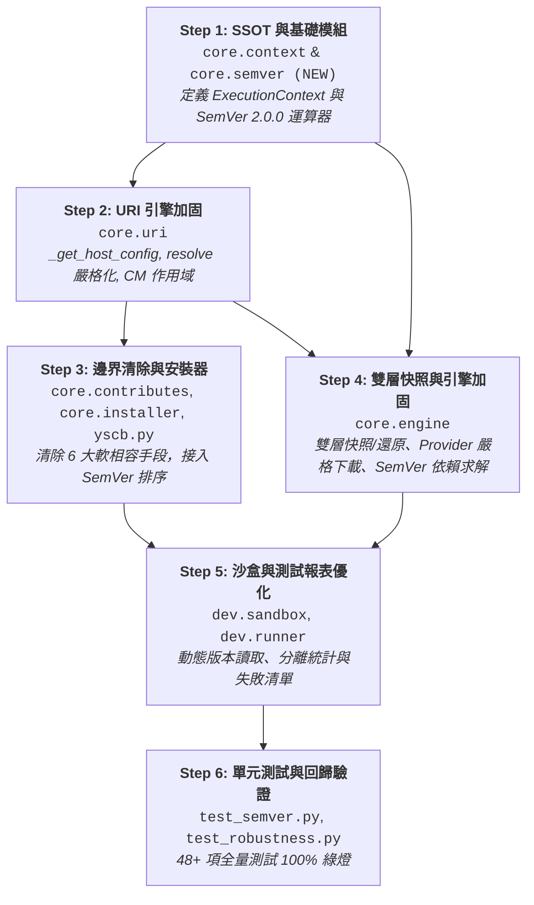

# API 規格與介面合約說明書 (API Specification & Contracts)

> 功能名稱：套件框架健壯性強化與缺陷修復 (Framework Robustness & Bug Fixes)  
> 建立日期：2026-08-25  
> 所屬主計畫：[2026_08_23_2030_architecture_refactor](../umbrella_overview.md)  
> 依據 P01/P02：[P01_requirements_spec.md](./P01_requirements_spec.md), [P02_architecture_plan.md](./P02_architecture_plan.md)  
> 狀態：Confirmed  
> 擴充項目：none  
> 模板版本：v1.4  

---

## 1. Public API 簽名與型態定義

### 1.1 SemVer 2.0.0 版本運算器介面 (`source/core/core/semver.py`)

```python
from typing import NamedTuple, Optional, List, Tuple

class VersionTuple(NamedTuple):
    """SemVer 2.0.0 版本數值四元組"""
    major: int
    minor: int
    patch: int
    prerelease: str = ""

    def __str__(self) -> str:
        base = f"{self.major}.{self.minor}.{self.patch}"
        return f"{base}-{self.prerelease}" if self.prerelease else base

def parse_semver(version_str: str) -> VersionTuple:
    """
    解析標準 SemVer 2.0.0 版本字串（如 '1.10.0', '2.0.0-beta.1'）。
    若格式畸形拋出 ValueError。
    """
    ...

def compare_semver(v1: str, v2: str) -> int:
    """
    比較兩版本大小：
    - 回傳 1: v1 > v2 (例如 '1.10.0' > '1.9.0')
    - 回傳 -1: v1 < v2
    - 回傳 0: v1 == v2
    """
    ...

def match_constraint(version: str, constraint: Optional[str]) -> bool:
    """
    判斷特定版本是否滿足範圍約束：
    - 支援標準前綴：'>=', '>', '<=', '<', '==', '~=', '*' 或 None (無約束全匹配)。
    - 例：match_constraint('1.10.0', '>=1.0.0') -> True
    - 例：match_constraint('2.0.0', '~=1.0.0') -> False
    """
    ...

def find_best_version(versions: List[str], constraint: Optional[str] = None) -> Optional[str]:
    """
    自版本字串清單中，篩選出符合 constraint 的最高版本（依 SemVer 數值排序）。
    若無可用或無合規版本，回傳 None。
    """
    ...
```

---

### 1.2 執行期上下文單一真相來源 (`source/core/core/context.py`)

```python
from dataclasses import dataclass, field
from typing import List, Dict, Any, Optional

@dataclass(frozen=True)
class ExecutionContext:
    """
    執行期語意上下文介面 (Execution Context Interface) - 單一真相來源 (SSOT)
    由 core.uri 重新導出保持向後相容。
    """
    module_name: str
    command: Optional[str] = None
    args: List[str] = field(default_factory=list)
    metadata: Dict[str, Any] = field(default_factory=dict)
```

---

### 1.3 URI 語意解析器與上下文管理器 (`source/core/core/uri.py`)

```python
from contextlib import contextmanager
from typing import Tuple, Optional, Generator
from core.context import ExecutionContext  # SSOT 引用與 Re-export

__all__ = [
    "ExecutionContext", "resolve", "to_uri", "exists", "read_text", "write_text",
    "read_json", "write_json", "copy", "makedirs", "listdir", "rmtree",
    "set_module_context", "get_module_context", "module_scope",
    "set_host_dir", "get_host_dir", "host_scope", "_get_yscb_root", "_get_host_config"
]

def _get_host_config(start_dir: Optional[str] = None) -> Tuple[str, str]:
    """
    獲取宿主組態目錄與微內核工具庫根目錄：
    基於微內核常量自定位物理拓撲保證，回傳 (host_dir, yscb_dir)。
    """
    ...

def resolve(uri: str) -> str:
    """
    將語意 URI (如 'module://entry') 解析為本機絕對實體路徑。
    - 嚴格僅接受合法 'token://...' 或本機絕對路徑。
    - 非標準格式直接拋出 ValueError，杜絕模糊推測。
    """
    ...

@contextmanager
def module_scope(module_name: Optional[str]) -> Generator[None, None, None]:
    """
    模組上下文安全作用域 (Context Manager)：
    退出區塊時保證 100% finally 還原舊全域 _active_module_context。
    """
    old = get_module_context()
    set_module_context(module_name)
    try:
        yield
    finally:
        set_module_context(old)

@contextmanager
def host_scope(host_dir: Optional[str]) -> Generator[None, None, None]:
    """
    宿主目錄安全作用域 (Context Manager)：
    退出區塊時保證 100% finally 還原舊全域 _active_host_dir。
    """
    old = get_host_dir()
    set_host_dir(host_dir)
    try:
        yield
    finally:
        set_host_dir(old)
```

---

### 1.4 原子操作引擎 API (`source/core/core/engine.py`)

```python
from typing import Optional, List, Tuple
from core import semver

class AtomicPackageEngine:
    def act_snapshot(self, tag: Optional[str] = None) -> str:
        """
        建立組態雙層快照：
        1. 備份宿主 yscb.config.json 至 snapshot://{snapshot_id}/yscb.config.json。
        2. 遞迴完整備份 config.root:// 至 snapshot://{snapshot_id}/config/。
        回傳 snapshot_id。
        """
        ...

    def act_restore_snapshot(self, snapshot_id: str) -> bool:
        """
        還原組態雙層快照：
        1. 還原 yscb.config.json。
        2. 若快照內包含 config/，清空並覆蓋還原 config.root://。
        3. 呼叫 act_reload() 自不可變 mirror 重新物化 modules/。
        """
        ...

    def act_download(self, module_name: str, version: str, provider_url: str) -> str:
        """
        自 Provider 鏡像下載特定模組版本：
        - 嚴格比對版本目錄 provider/{mod}/{ver} 或校驗內部 manifest.json 之 version。
        - 杜絕將多版本目錄整包拷貝產生巢狀污染。
        """
        ...

    def act_solve_deps(
        self, 
        target_module: str, 
        version_constraint: Optional[str], 
        provider_url: str
    ) -> List[Tuple[str, str]]:
        """
        遞迴解析依賴樹，並透過 core.semver.find_best_version 求解滿足約束的最高版本清單。
        若約束無法滿足拋出 RuntimeError。
        """
        ...
```

---

### 1.5 測試執行器與報表介面 (`source/dev/dev/testing/runner.py`)

```python
from typing import Dict, Any, List, Tuple
import unittest

class TestRunner:
    @staticmethod
    def run_suite(suite: unittest.TestSuite) -> Tuple[unittest.TestResult, Dict[str, Any]]:
        """
        執行測試套件並產出精確統計資訊：
        - 精確依據 TestCase 類型分離 contract_passed 與 custom_passed 計數。
        - 若有失敗或錯誤案例，收集包含 (module, test_name, error_type, message) 之清單。
        """
        ...
```

---

## 2. 實作依賴拓撲 (Implementation Order Topology)



---

## 3. 專案知識庫文檔衝擊清單 (Documentation Impact Matrix - 1:1 Delivery)

依據知識庫 7 大抽象維度與使用者指示（將本次詳細分析統整後的流程圖、架構拓撲 1:1 同步更新），預排以下文檔變更：

| 知識庫維度 | 目標文檔路徑 | 交付內容與重點 |
| :--- | :--- | :--- |
| **維度 1: 概念架構** | [`docs/core/ARCHITECTURE.md`](file:///h:/UseFolder/CodeRepo/ys_codebase/docs/core/ARCHITECTURE.md) | 同步微內核常量自定位物理拓撲圖、`_get_host_config` 設計意圖與零 I/O Fast-Path 保證。 |
| **維度 2: 模組手冊** | [`docs/core/SEMVER.md`](file:///h:/UseFolder/CodeRepo/ys_codebase/docs/core/SEMVER.md) | **[NEW]** 新增 SemVer 2.0.0 版本運算器專題手冊（四元組解析、數值排序與 `>=, ~, ^, *` 約束匹配規則）。 |
| **維度 3: 專題機制** | [`docs/core/SNAPSHOT_AND_ROLLBACK.md`](file:///h:/UseFolder/CodeRepo/ys_codebase/docs/core/SNAPSHOT_AND_ROLLBACK.md) | **[NEW]** 新增雙層組態快照與不可變 Mirror 原子還原流程圖與循序圖。 |
| **維度 4: 介面清單** | [`docs/core/API_REFERENCE.md`](file:///h:/UseFolder/CodeRepo/ys_codebase/docs/core/API_REFERENCE.md) | 登錄 `core.semver` 公開介面、`core.context` SSOT 與 `core.uri` Context Manager。 |
| **維度 5: 設計註記** | [`docs/core/DESIGN_NOTES.md`](file:///h:/UseFolder/CodeRepo/ys_codebase/docs/core/DESIGN_NOTES.md) | 登記 `DN-07`（OS 原子鎖與 10s 自修復設計）與 `DN-08`（剛性拓撲無猜測邊界原則）。 |
| **維度 2: 開發模組** | [`docs/dev/TESTING_FRAMEWORK.md`](file:///h:/UseFolder/CodeRepo/ys_codebase/docs/dev/TESTING_FRAMEWORK.md) | 更新測試報表 Contract/Custom 分類計數與失敗清單排版規範。 |

---

## 4. 決策紀錄整合 (Decision Records Master List)

- `[P03:DR-01]`：`core.semver` 採純 Python 標準庫實作，版本四元組 `VersionTuple(major, minor, patch, prerelease)` 封裝，保證數值排序正確性。
- `[P03:DR-02]`：`resolve()` 嚴格拒絕非語意 URI 且非絕對路徑的相對字串，拋出 `ValueError`，貫徹「零猜測」設計哲學。
- `[P03:DR-03]`：`ExecutionContext` 唯一定義於 `core.context`，`core.uri` 進行 re-export 達成 100% 向後相容。
- `[P03:DR-04]`：`act_snapshot` / `act_restore_snapshot` 將 `config.root://` 納入快照，達成宿主設定與模組設定雙層原子一致性。
- `[P03:DR-05]`：`core.uri` 上下文管理器 (`module_scope`, `host_scope`) 以 `try...finally` 保證退出區塊時全域狀態必然還原。
- `[P03:DR-06]`：`TestRunner` 依據 TestCase 類別名稱判定 Contract / Custom 歸屬，杜絕交叉扣減。
- `[P03:DR-07]`：所有本子計畫產出的流程圖與架構圖，於 Phase 7 1:1 同步交付至 `docs/` 專案知識庫。
