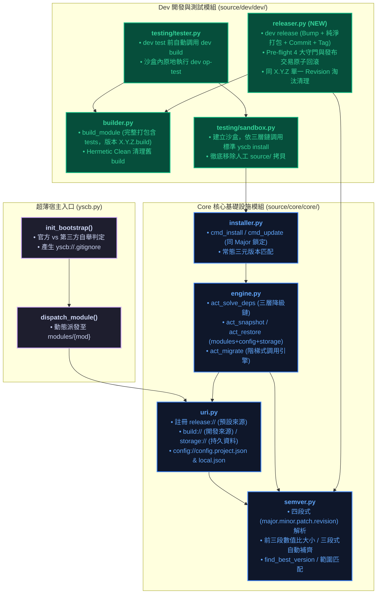
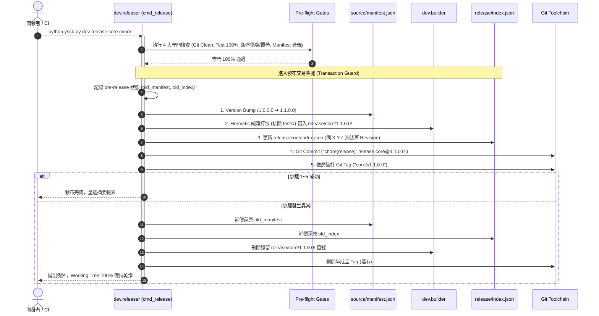
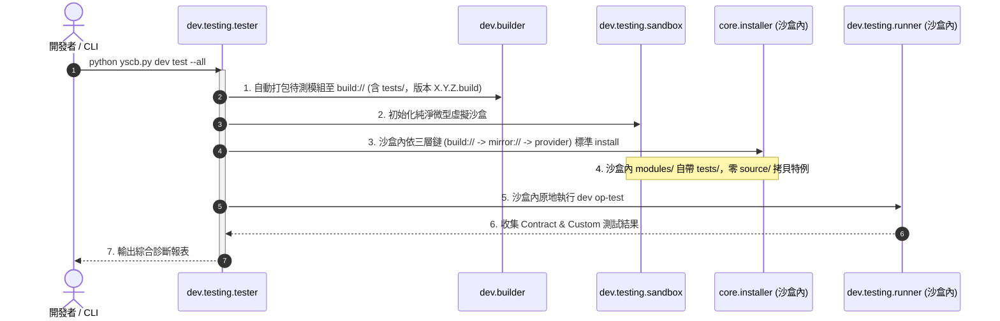
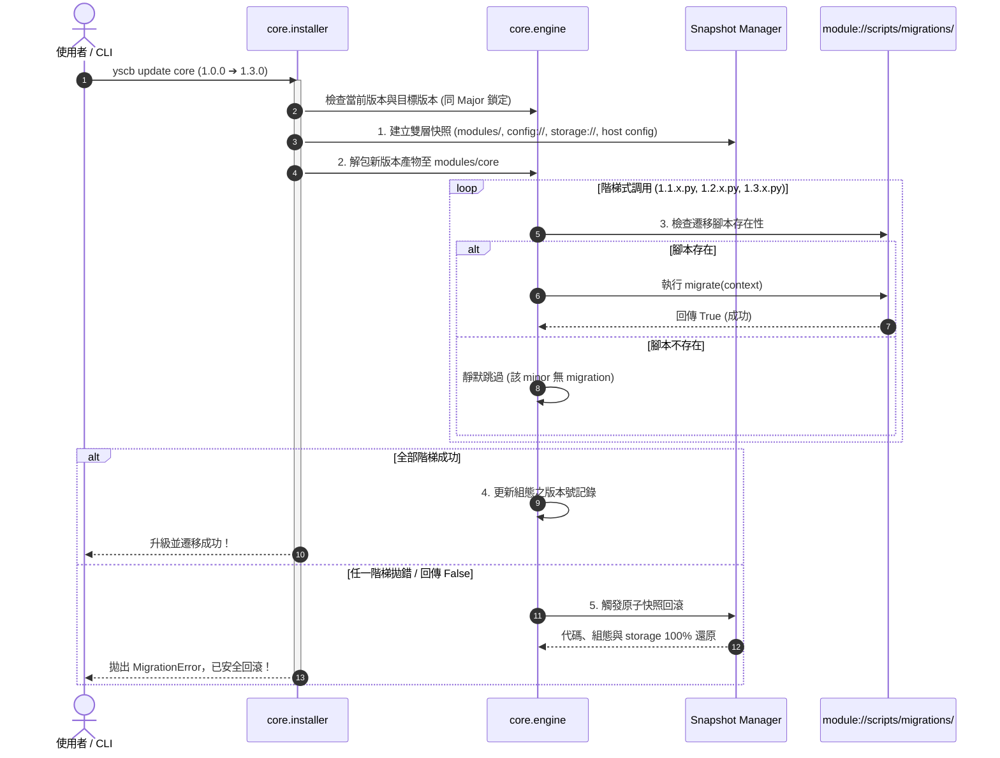

# 架構與模組設計說明書 (Architecture & Module Plan)

> 功能名稱：四段式版本號、雙軌來源庫 (Build vs Release)、三層安裝降級鏈、發布流水線與 Migration 機制重構  
> 建立日期：2026-08-25  
> 所屬主計畫：[2026_08_23_2030_architecture_refactor](../umbrella_overview.md)  
> 依據 P01：[P01_requirements_spec.md](./P01_requirements_spec.md)  
> 狀態：Draft (Phase 2 設計方案)  
> 擴充項目：none  
> 模板版本：v1.4  

---

## 1. 系統模組劃分與邊界 (Module Architecture & Boundaries)

---

## 2. 核心運作流程與循序圖 (Lifecycle Sequence Flow)

### 2.1 `dev release` 發布五步流水線與原子交易防護 (FR-07, FR-08, FR-09)

### 2.2 `dev test` 去特例化全黑盒流水線 (FR-05, FR-06)

### 2.3 模組 Migration 增量階梯調用流程 (FR-10, FR-12)

---

## 3. 受影響模組與檔案矩陣 (Impacted Files Matrix)

| 檔案路徑 | 變更類型 | 核心職責與修改重點 | 對應 FR / EC |
| :--- | :---: | :--- | :--- |
| [`source/core/core/semver.py`](file:///h:/UseFolder/CodeRepo/ys_codebase/ys_codebase/source/core/core/semver.py) | Modify | 升級四段式 `(major, minor, patch, revision)` 解析；前三段數值比大小；三段式自動補齊為 `X.Y.Z.0`；同級以最新 Revision 為準。 | FR-01, FR-02 EC-01 |
| [`source/core/core/uri.py`](file:///h:/UseFolder/CodeRepo/ys_codebase/ys_codebase/source/core/core/uri.py) | Modify | 註冊 `release://` 與 `release.root://`（預設來源庫）；維護 `build://`、`storage://`、`config://config.project.json` 與 `config://config.local.json`。 | FR-03, FR-11 |
| [`source/core/core/engine.py`](file:///h:/UseFolder/CodeRepo/ys_codebase/ys_codebase/source/core/core/engine.py) | Modify | 1. `act_solve_deps` 實作 `build://` ➔ `mirror://` ➔ `provider` 三層降級解析。 2. `act_snapshot` / `act_restore` 擴充納入 `storage://` 與雙軌 config。 3. 實作 `act_migrate` 增量階梯調用引擎。 | FR-04, FR-10, FR-12 EC-05, EC-06, EC-08 |
| [`source/core/core/installer.py`](file:///h:/UseFolder/CodeRepo/ys_codebase/ys_codebase/source/core/core/installer.py) | Modify | 1. `cmd_update` 實作同 Major 鎖定防護。 2. 支援常態三元版本號匹配對應唯一最新 Revision。 3. `default_provider` 導向 Git 遠端索引。 | FR-02, FR-03, FR-10 EC-07 |
| [`source/dev/dev/builder.py`](file:///h:/UseFolder/CodeRepo/ys_codebase/ys_codebase/source/dev/dev/builder.py) | Modify | 1. `build_module` 預設為完整打包（含 `tests/`，版本強制標記 `X.Y.Z.build`）。 2. 建置前清空目標目錄，版本遞進時自動清理舊 `*.build`。 3. 自動更新 `build/<mod>/index.json` 維持同構 Provider。 | FR-04, FR-05 |
| [`source/dev/dev/releaser.py`](file:///h:/UseFolder/CodeRepo/ys_codebase/ys_codebase/source/dev/dev/releaser.py) | **NEW** | 實作 `cmd_release`：Pre-flight 4 大守門、四段式 Bump、純淨打包、同 X.Y.Z 舊 Revision 淘汰清理、Git Commit/Tag 與發布交易原子回滾。 | FR-07, FR-08, FR-09 EC-02, EC-03, EC-04 |
| [`source/dev/dev/testing/sandbox.py`](file:///h:/UseFolder/CodeRepo/ys_codebase/ys_codebase/source/dev/dev/testing/sandbox.py) | Modify | 重構沙盒鋪設邏輯：移除人工 `source/` 拷貝，改為於沙盒內依三層鏈調用標準 `yscb install`，原地獲取自帶 tests 的模組。 | FR-06 |
| [`source/dev/dev/testing/tester.py`](file:///h:/UseFolder/CodeRepo/ys_codebase/ys_codebase/source/dev/dev/testing/tester.py) | Modify | `cmd_test` 測試前自動調用 `dev.builder` 打包待測模組至 `build://`，沙盒內原地調用 `dev op-test`。 | FR-06 |
| [`yscb.py`](file:///h:/UseFolder/CodeRepo/ys_codebase/yscb.py) | Modify | 1. `init` 時自動於 `yscb://.gitignore` 產生專屬忽略規則。 2. 依 `source/core/` 判定官方開發端 vs 第三方端自舉模式。 | FR-13 |
| [`source/core/tests/test_semver_v4.py`](file:///h:/UseFolder/CodeRepo/ys_codebase/ys_codebase/source/core/tests/test_semver_v4.py) | **NEW** | 四段式 SemVer 解析、三段式自動補齊、無比價 revision 運算與排序單元測試。 | FR-01, FR-02 EC-01 |
| [`source/core/tests/test_migration_ladder.py`](file:///h:/UseFolder/CodeRepo/ys_codebase/ys_codebase/source/core/tests/test_migration_ladder.py) | **NEW** | 增量 Migration 階梯調用、缺腳本跳過、拋錯快照回滾與同 Major 鎖定測試。 | FR-10, FR-12 EC-05, EC-06, EC-07 |
| [`source/dev/tests/test_release_pipeline.py`](file:///h:/UseFolder/CodeRepo/ys_codebase/ys_codebase/source/dev/tests/test_release_pipeline.py) | **NEW** | Pre-flight 4 大守門、Version Bump、純淨發布打包、同 X.Y.Z 淘汰清理、智慧 Tag 與失敗原子回滾整合測試。 | FR-07, FR-08, FR-09 EC-02, EC-03, EC-04 |

---

## 4. 決策紀錄整合 (Decision Records Master List)

- `[P02:DR-01]`：升級 `core.semver` 為四段式 `(major, minor, patch, revision)`，前三段數值決定大小，`revision` 不參與大小比較；三段式輸入解析期自動補齊為 `X.Y.Z.0`。
- `[P02:DR-02]`：`release/` 發布庫對同 `X.Y.Z` 僅存單一最新 Revision，發布新修復版時自動清理舊版目錄並更新 `index.json`；外部常態三元版本宣告。
- `[P02:DR-03]`：註冊 `release://` 為系統唯一預設來源庫；`build://` 重定義為本地開發完整包來源庫；安裝依循 `build://` ➔ `mirror://` ➔ `provider` 三層降級鏈。
- `[P02:DR-04]`：`dev build` 執行 100% 完整打包（保留 `tests/`，版本標記 `X.Y.Z.build`），建置前 Hermetic 清空，版本遞進清理舊 build，更新 `build/index.json` 保持同構。
- `[P02:DR-05]`：`dev test` 測試前自動執行 `dev build`，沙盒內依三層鏈標準 `yscb install`，原地執行測試，徹底消除人工 `source/` 拷貝特化。
- `[P02:DR-06]`：建立 `dev.releaser` 模組，實作 `dev release` 5 步流水線、Pre-flight 4 大守門與發布安全交易防護（失敗 100% 原子回滾）。
- `[P02:DR-07]`：實作智慧 Git Tag 觸發矩陣：Major/Minor 預設打 Tag (`{mod}/v{ver}`)，Patch/Revision 預設不打 Tag，支援 `--tag`/`--no-tag` 覆蓋。
- `[P02:DR-08]`：模組 Migration 採 `module://scripts/migrations/{major}.{minor}.x.py` 增量階梯調用；日常 `update` 實施同 Major 鎖定；升級失敗透過包含 `storage://` 的快照原子回滾。
- `[P02:DR-09]`：`yscb init` 於 `yscb://.gitignore` 自動生成內部忽略規則，實現零專案污染；依 `source/core/` 判定官方開發端 vs 第三方端自舉。
