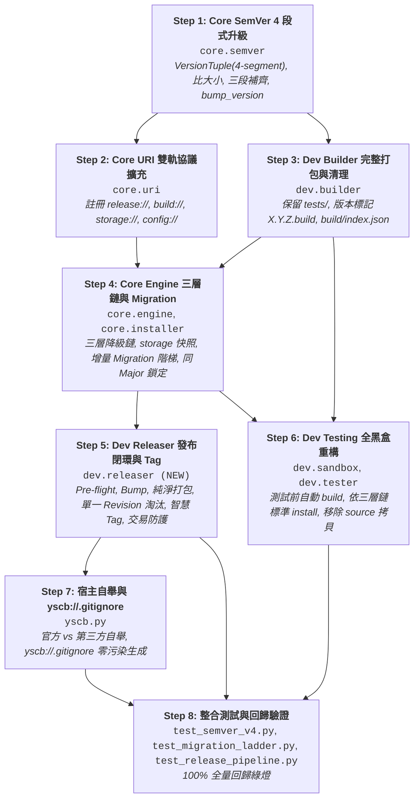

# API 規格與介面合約說明書 (API Specification & Contracts)

> 功能名稱：四段式版本號、雙軌來源庫 (Build vs Release)、三層安裝降級鏈、發布流水線與 Migration 機制重構  
> 建立日期：2026-08-25  
> 所屬主計畫：[2026_08_23_2030_architecture_refactor](../umbrella_overview.md)  
> 依據 P01/P02：[P01_requirements_spec.md](./P01_requirements_spec.md), [P02_architecture_plan.md](./P02_architecture_plan.md)  
> 狀態：Draft (Phase 3 介面規格)  
> 擴充項目：none  
> 模板版本：v1.4  

---

## 1. Public API 簽名與型態定義

### 1.1 四段式 SemVer 運算器介面 (`source/core/core/semver.py`)

```python
from typing import NamedTuple, Optional, List, Tuple, Union

class VersionTuple(NamedTuple):
    """四段式版本數值四元組 (major.minor.patch.revision)"""
    major: int
    minor: int
    patch: int
    revision: Union[int, str] = 0

    @property
    def is_build(self) -> bool:
        return str(self.revision).lower() == "build"

    @property
    def triplet(self) -> Tuple[int, int, int]:
        return (self.major, self.minor, self.patch)

    def __str__(self) -> str:
        return f"{self.major}.{self.minor}.{self.patch}.{self.revision}"

def parse_semver(version_str: str) -> VersionTuple:
    """
    解析四段式版本字串（如 '1.0.1.213', '1.0.1.build'）。
    - 解析期自動正規化：三段式 '1.0.0' 自動補齊為 (1, 0, 0, 0)。
    - 若格式畸形或無法解析拋出 ValueError。
    """
    ...

def compare_semver(v1: Union[str, VersionTuple], v2: Union[str, VersionTuple]) -> int:
    """
    比較兩版本大小（前三段 major.minor.patch 決定大小，revision 不參與比大小）：
    - 回傳 1: v1 前三段 > v2 前三段 (例如 '1.1.0.0' > '1.0.0.999')
    - 回傳 -1: v1 前三段 < v2 前三段
    - 回傳 0: 前三段相同判定為同級
    """
    ...

def match_constraint(version: Union[str, VersionTuple], constraint: Optional[str]) -> bool:
    """
    判斷特定版本是否滿足範圍約束：
    - 支援標準前綴：'>=', '>', '<=', '<', '==', '~=', '^', '*' 或 None。
    - 依據前三段數值進行範圍匹配。
    """
    ...

def find_best_version(versions: List[str], constraint: Optional[str] = None) -> Optional[str]:
    """
    自版本清單中，篩選出滿足 constraint 的最高版本。
    - 同一個 major.minor.patch 下若有多個 revision，以清單中最末或最新版本為準。
    """
    ...

def bump_version(current_ver: str, bump_type: str) -> str:
    """
    依據四大層級執行 Version Bump：
    - 'major': X+1, Y=0, Z=0, R=0 (例: 1.2.3.4 -> 2.0.0.0)
    - 'minor': Y+1, Z=0, R=0 (例: 1.2.3.4 -> 1.3.0.0)
    - 'patch': Z+1, R=0 (例: 1.2.3.4 -> 1.2.4.0)
    - 'revision': R+1 (純數字加1)
    """
    ...
```

---

### 1.2 雙軌來源庫與組態語意解析器 (`source/core/core/uri.py`)

```python
# 新增/擴充協議註冊
# 'release://<path>' -> 指向專案 release/ 目錄 (預設來源庫)
# 'release.root://<path>' -> release/ 根目錄
# 'build://<path>' -> 本地開發完整建置產物
# 'storage://<mod>/<path>' -> 專案級模組持久化儲存 (Git 追蹤)
# 'config://config.project.json' -> 模組專案級標準設定 (Git 追蹤)
# 'config://config.local.json' -> 模組本機個人設定 (Git 忽略)

def resolve(uri: str) -> str:
    """
    解析語意 URI 協議為作業系統實體絕對路徑。
    - 嚴格僅接受合法 'token://...' 或本機絕對路徑，非法字串拋出 ValueError。
    """
    ...
```

---

### 1.3 三層安裝降級鏈、快照與 Migration 引擎 (`source/core/core/engine.py`)

```python
from typing import Optional, List, Tuple, Dict, Any

class AtomicPackageEngine:
    def act_solve_deps(
        self, 
        target_module: str, 
        version_constraint: Optional[str], 
        provider_url: Optional[str] = None
    ) -> List[Tuple[str, str, str]]:
        """
        依循三層降級鏈解析模組產物來源：
        1. 檢查本地 build://{mod}/index.json 是否存在且含有效 *.build -> 採用 build://
        2. 檢查本地 mirror://{mod}/{ver} 是否存在快照 -> 採用 mirror://
        3. 兜底調用 provider_url (或 default_provider Git 遠端索引)
        回傳 List of (module_name, resolved_version, resolved_provider_source)。
        """
        ...

    def act_snapshot(self, tag: Optional[str] = None) -> str:
        """
        建立全域/模組安全快照：
        剛性納入：modules/ 實體代碼、config.root://、storage://、宿主 yscb.config.json。
        排除：cache://, mirror://, build://, source://, release://。
        回傳 snapshot_id。
        """
        ...

    def act_restore_snapshot(self, snapshot_id: str) -> bool:
        """
        還原安全快照：
        1. 還原 modules/ 代碼實體。
        2. 還原 config.root:// 與 storage://。
        3. 還原宿主 yscb.config.json。
        """
        ...

    def act_migrate(
        self, 
        module_name: str, 
        old_version: str, 
        new_version: str
    ) -> bool:
        """
        執行模組增量 Migration 階梯調用：
        - 解析 old_version 與 new_version 之 Minor 階梯差。
        - 依序尋找並調用 module://scripts/migrations/{major}.{minor}.x.py。
        - 腳本缺失時自動靜默跳過；腳本拋錯或回傳 False 時拋出 MigrationError 觸發回滾。
        """
        ...
```

---

### 1.4 `dev release` 發布流水線與交易防護 (`source/dev/dev/releaser.py`)

```python
from typing import Optional

class ReleasePipeline:
    def __init__(self, host_dir: str):
        self.host_dir = host_dir

    def preflight_check(
        self, 
        module_name: str, 
        target_version: str, 
        skip_test: bool = False
    ) -> None:
        """
        執行 Pre-flight 4 大守門檢查：
        1. Git Working Tree 是否 100% Clean。
        2. 執行 dev test <module> 是否 100% Passed (除非 skip_test=True)。
        3. 目標版本是否衝突 (若為同 X.Y.Z 新 Revision 則判定為合法修復)。
        4. Manifest 欄位合規性檢查。
        任一守門不通過拋出 PreflightGateError。
        """
        ...

    def run_release(
        self, 
        module_name: str, 
        bump_type: Optional[str] = None, 
        explicit_version: Optional[str] = None,
        yes: bool = False,
        dry_run: bool = False,
        tag: Optional[bool] = None,
        no_test: bool = False
    ) -> str:
        """
        執行發布 5 步流水線與交易防護 (All-or-Nothing)：
        1. 計算目標版本並通過 Pre-flight 守門。
        2. Version Bump 回寫 source/manifest.json。
        3. Hermetic 純淨打包 (排除 tests/) 寫入 release/<mod>/<ver>/。
        4. 更新 release/<mod>/index.json (同 X.Y.Z 自動淘汰清理舊 Revision)。
        5. Git Commit 與智慧 Git Tag (Major/Minor 預設打 Tag，Patch/Revision 預設不打，支援覆蓋)。
        異常時自動觸發交易補償還原。
        """
        ...
```

---

### 1.5 完整打包與 Hermetic 清理介面 (`source/dev/dev/builder.py`)

```python
from typing import Optional

def build_module(
    module_name: str, 
    source_dir: Optional[str] = None, 
    output_dir: Optional[str] = None,
    clean: bool = True
) -> str:
    """
    執行本地開發完整打包：
    - 100% 完整拷貝 source/<mod>/ (保留 tests/ 與開發檔案)。
    - 產物 manifest.json 之 revision 強制覆蓋為 'build' (版本 X.Y.Z.build)。
    - 打包前清空同名 X.Y.Z.build/ 目錄 (Hermetic Clean)。
    - 版本遞進時清理同模組下歷史 *.build 舊目錄。
    - 自動更新/生成 build/<mod>/index.json 維持同構 Provider 結構。
    回傳產物目錄絕對路徑。
    """
    ...
```

---

### 1.6 去特例化黑盒測試沙盒與執行器 (`source/dev/dev/testing/sandbox.py` & `tester.py`)

```python
class SandboxProvisioner:
    def create_sandbox(self, modules_to_test: List[str]) -> str:
        """
        建立微型虛擬測試沙盒：
        1. 建立純淨沙盒目錄拓撲。
        2. 拷貝 yscb.py 入口。
        3. 依三層降級鏈於沙盒內執行 yscb install <mod> (自帶 tests/，徹底移除 source/ 拷貝)。
        4. 初始化沙盒組態。
        回傳沙盒工作目錄。
        """
        ...

def run_test(
    module_name: Optional[str] = None, 
    all_modules: bool = False,
    verbose: bool = False
) -> bool:
    """
    執行測試流水線：
    1. 自動調用 builder.build_module 完整打包目標待測模組至 build://。
    2. 建立純淨沙盒並透過標準 install 安裝。
    3. 於沙盒內原地調用 dev op-test 執行 Contract 與 Custom 測試。
    4. 輸出精確計數與失敗清單診斷報表。
    """
    ...
```

---

## 2. 實作依賴拓撲 (Implementation Order Topology)



---

## 3. 專案知識庫文檔衝擊清單 (Documentation Impact Matrix - 1:1 Delivery)

依據知識庫 7 大抽象維度與使用者指示，預排以下文檔變更：

| 知識庫維度 | 目標文檔路徑 | 交付內容與重點 |
| :--- | :--- | :--- |
| **維度 1: 概念架構** | [`docs/core/ARCHITECTURE.md`](file:///h:/UseFolder/CodeRepo/ys_codebase/docs/core/ARCHITECTURE.md) | 登錄雙軌來源庫架構（`build://` 開發庫 vs `release://` 預設發布庫）與四大語意維度全景模型。 |
| **維度 2: 模組手冊** | [`docs/core/SEMVER.md`](file:///h:/UseFolder/CodeRepo/ys_codebase/docs/core/SEMVER.md) | 更新為四段式 SemVer 運算器手冊（`major.minor.patch.revision`、前三段數值比大小、同 X.Y.Z 單一 Revision 淘汰與常態三元約定）。 |
| **維度 3: 專題機制** | [`docs/core/MIGRATION_SUBSYSTEM.md`](file:///h:/UseFolder/CodeRepo/ys_codebase/docs/core/MIGRATION_SUBSYSTEM.md) | **[NEW]** 新增模組 Migration 增量階梯調用流程、腳本規範（`module://scripts/migrations/{major}.{minor}.x.py`）與安全快照回滾專題手冊。 |
| **維度 3: 專題機制** | [`docs/dev/RELEASE_PIPELINE.md`](file:///h:/UseFolder/CodeRepo/ys_codebase/docs/dev/RELEASE_PIPELINE.md) | **[NEW]** 新增 `dev release` 發布流水線專題手冊（Pre-flight 4 大守門、Version Bump、純淨打包、智慧 Git Tag 矩陣與交易原子回滾）。 |
| **維度 4: 介面清單** | [`docs/core/API_REFERENCE.md`](file:///h:/UseFolder/CodeRepo/ys_codebase/docs/core/API_REFERENCE.md) | 登錄四段式 SemVer 介面、三層安裝降級鏈、`act_migrate` 與新增語意 URI 協議。 |
| **維度 5: 設計註記** | [`docs/core/DESIGN_NOTES.md`](file:///h:/UseFolder/CodeRepo/ys_codebase/docs/core/DESIGN_NOTES.md) | 登記 `DN-09`（同 X.Y.Z 單一 Revision 淘汰原則）與 `DN-10`（發布交易防護與零污染 Git 邊界）。 |
| **維度 2: 開發工具** | [`docs/dev/TESTING_FRAMEWORK.md`](file:///h:/UseFolder/CodeRepo/ys_codebase/docs/dev/TESTING_FRAMEWORK.md) | 更新 `dev test` 去特例化全黑盒測試流水線架構（測試前自動 build，依三層鏈標準 install，零 source 拷貝）。 |

---

## 4. 決策紀錄整合 (Decision Records Master List)

- `[P03:DR-01]`：`core.semver` 升級為四段式 `(major, minor, patch, revision)`，前三段數值決定大小，`revision` 不參與大小比較；三段式輸入自動補齊為 `X.Y.Z.0`。
- `[P03:DR-02]`：`release/` 發布庫對同 `X.Y.Z` 僅存單一最新 Revision，發布新修復版時自動清理舊版目錄並更新 `index.json`；外部常態三元版本宣告。
- `[P03:DR-03]`：註冊 `release://` 為系統唯一預設來源庫；`build://` 重定義為本地開發完整包來源庫；安裝依循 `build://` ➔ `mirror://` ➔ `provider` 三層降級鏈。
- `[P03:DR-04]`：`dev build` 執行 100% 完整打包（保留 `tests/`，版本標記 `X.Y.Z.build`），建置前 Hermetic 清空，版本遞進清理舊 build，更新 `build/index.json` 保持同構。
- `[P03:DR-05]`：`dev test` 測試前自動執行 `dev build`，沙盒內依三層鏈標準 `yscb install`，原地執行測試，徹底消除人工 `source/` 拷貝特化。
- `[P03:DR-06]`：建立 `dev.releaser` 模組，實作 `dev release` 5 步流水線、Pre-flight 4 大守門與發布安全交易防護（失敗 100% 原子回滾）。
- `[P03:DR-07]`：實作智慧 Git Tag 觸發矩陣：Major/Minor 預設打 Tag (`{mod}/v{ver}`)，Patch/Revision 預設不打 Tag，支援 `--tag`/`--no-tag` 覆蓋。
- `[P03:DR-08]`：模組 Migration 採 `module://scripts/migrations/{major}.{minor}.x.py` 增量階梯調用；日常 `update` 實施同 Major 鎖定；升級失敗透過包含 `storage://` 的快照原子回滾。
- `[P03:DR-09]`：`yscb init` 於 `yscb://.gitignore` 自動生成內部忽略規則，實現零專案污染；依 `source/core/` 判定官方開發端 vs 第三方端自舉。
