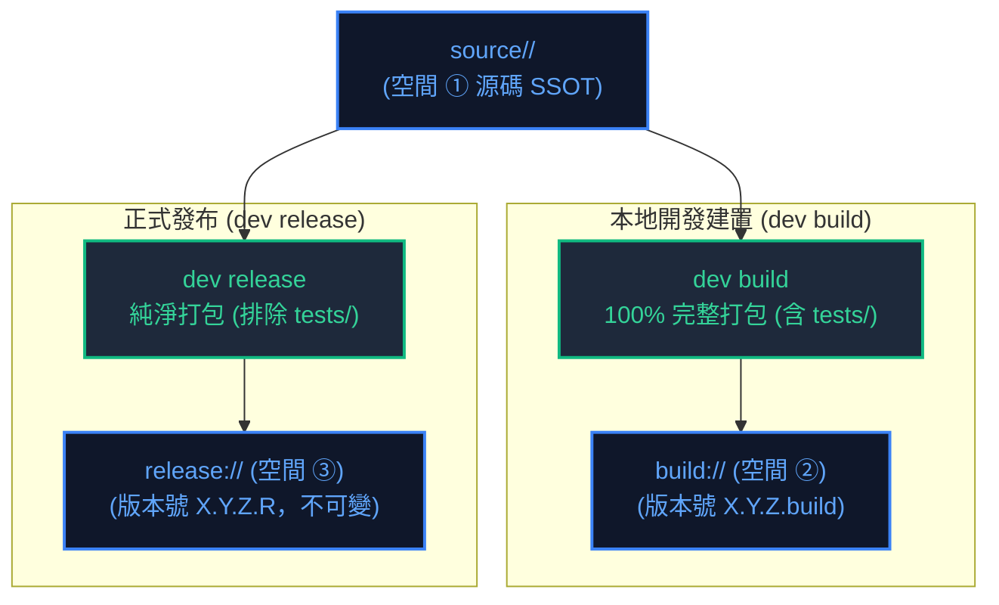
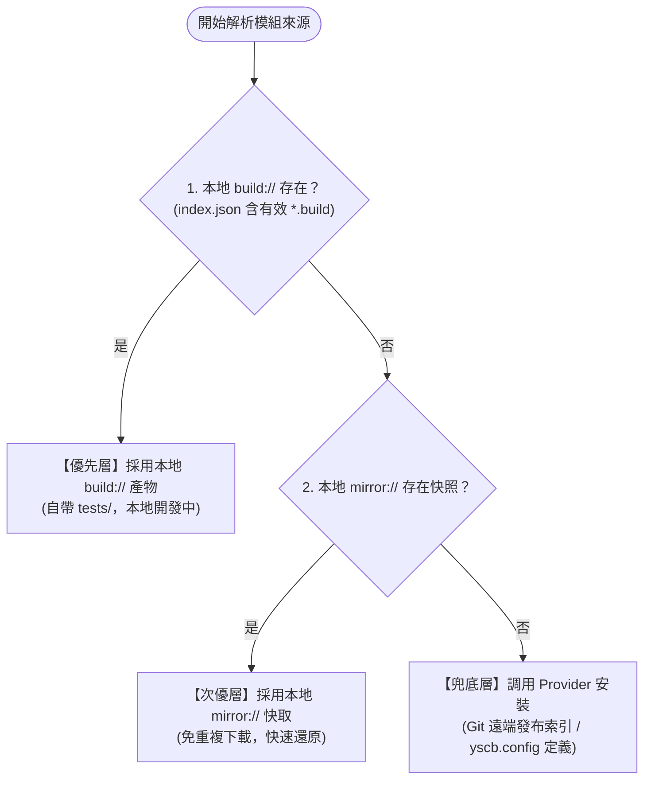
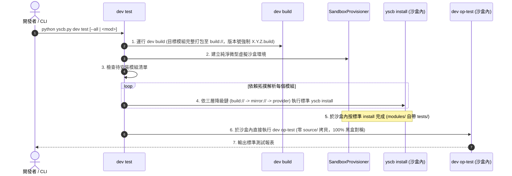

# 專題調研報告：版本號四段式重定義、雙軌來源庫 (Build vs Release) 與黑盒測試流水線 (R01)

> 調研主題：版本號四段式體系 (Major.Minor.Patch.Revision)、雙軌來源庫 (build:// vs release://)、安裝三層降級鏈與 dev test 去特例化黑盒流水線  
> 建立日期：2026-08-25  
> 所屬計畫：[sub_12_versioning_and_release_pipeline](./P00_semantic_requirements.md)  
> 狀態：Completed (六大架構議題全數收斂定稿)  
> 擴充項目：none  
> 模板版本：v1.0  

---

## 1. 核心痛點回溯與重構動機

在既有架構中，由於來源庫（`build/` 與 `mirror/`）被定義為「純淨發布產物（嚴格剝除 tests 與開發檔案）」，導致：
1. **沙盒混血與特化複製**：`dev test` 無法透過標準 `yscb install` 獲取包含測試代碼的模組，被迫自行以 `shutil.copytree` 複製 `source/` 到沙盒，破壞了黑盒測試對稱性。
2. **三段式版本號無法表達開發態與熱修復**：三段式 `major.minor.patch` 無法精確區分「正式發布版」與「本地開發中建置版 (build)」，亦無法表達內部 revision 覆寫行為。
3. **來源解析缺乏清晰優先順序**：未將本地開發、本機鏡像快取與遠端發布庫形成剛性降級鏈。

---

## 2. 版本號適配性全新定義 (Four-Segment SemVer)

### 2.1 版本格式：`major.minor.patch.revision`

```text
  X   .   Y   .   Z   .      R
Major   Minor   Patch     Revision
```

### 2.2 四大維度語意界定

| 段別 | 級別名稱 | 語意定義 | 典型場景 |
| :---: | :--- | :--- | :--- |
| **`major`** | 破壞性變更 | 無法適配性升級的版本 | 資料庫格式改變且無法遷移、Public API 簽名不相容移除 |
| **`minor`** | 適配性變更 | 需要進行 migration 適配性升級，或增量內容過多需上提級別 | 資料結構微調、config 條目重命名、架構局部調整 |
| **`patch`** | 無體感變更 | 使用者角度完全無感之功能增加或修復 | 增量功能、添加新 CLI 指令、向後完全相容擴充 |
| **`revision`**| 內部修復/標籤 | Bug 修復、內部邏輯/效能優化、特殊版本標籤 | 內部編譯序號 (如 `213`)、開發建置標籤 (`build`) |

### 2.3 `revision` 運算、排序與單一存在原則
1. **無大小比較意義**：在版本大小比對中，`revision` 不參與數值大小排序（前三段 `major.minor.patch` 決定大小）。
2. **同 `X.Y.Z` 僅存單一最新 Revision 原則 (Single Active Revision per X.Y.Z)**：
   - 因 `revision` 僅為內部 Bug 修復與效能優化，無任何外部 API 變更，因此在 `release/` 發布庫中，對於相同的 `major.minor.patch`，**嚴格只能存在一份最新版本**。
   - 例：現有 release `1.0.0.1`，發布修復版 `1.0.0.2` 時，系統自動移除舊版 `1.0.0.1/` 目錄並替換 `index.json`，防止發布庫碎片化與膨脹。
3. **常態三元版本號安裝約定**：
   - 外部使用者、依賴宣告（`manifest.json`）與 CLI 安裝常態性**以三元版本號宣告**（如 `core@1.0.0`）。微內核解析時自動匹配該 `X.Y.Z` 下的唯一最新 Revision（如 `1.0.0.2`）。
4. **`index.json` 排序**：`major` ➔ `minor` ➔ `patch` 數值升序；同級下以當前唯一的最新 revision 記錄。

---

## 3. 雙軌來源庫體系與物理目錄佈局



### 3.1 三大空間物理目錄佈局

```text
ys_codebase/
  ├── source/                           # 【空間 ①】源碼空間 (開發維護端，SSOT)
  │     ├── core/
  │     │     ├── manifest.json         # version: "1.0.1.213"
  │     │     ├── core/
  │     │     ├── tests/                # 測試代碼
  │     │     └── .yscbignore
  │     └── dev/
  │
  ├── build/                            # 【空間 ②】本地完整開發建置庫 (供 dev test 使用)
  │     ├── core/
  │     │     ├── 1.0.1.build/          # 版本目錄名直接為 "1.0.1.build"
  │     │     │     ├── manifest.json   # version 強制標記為 "1.0.1.build"
  │     │     │     ├── core/
  │     │     │     └── tests/          # 100% 完整保留 tests
  │     │     └── index.json            # build 索引清冊
  │     └── dev/
  │
  └── release/                          # 【空間 ③】純淨發布來源庫 (全系統唯一預設 Provider)
        ├── core/
        │     ├── 1.0.0.0/              # 純淨發布版本目錄 (不可變)
        │     │     ├── manifest.json   # version: "1.0.0.0"
        │     │     └── core/           # 嚴格依 .yscbignore 排除 tests 與開發檔案
        │     └── index.json            # release 索引清冊
        └── dev/
```

### 3.2 `dev build` Hermetic Clean 清理與覆蓋
- 每次建置前，強制執行 `shutil.rmtree` 清空同名 `X.Y.Z.build/` 目錄，達成 Hermetic 密封性。
- 版本號遞進時，自動清理舊版本 `*.build` 目錄，保持 `build/<module>/` 內僅有當前單一最新建置產物。

---

## 4. 模組安裝三層降級解析鏈 (3-Tier Resolution Chain)

在執行模組安裝、依賴解析或沙盒構建時，系統嚴格依循以下順序解析產物來源：



### 4.1 `build://` 同構 Provider 規範與存在性判定標準
1. **同構 Provider 結構**：`build/<mod>/` 嚴格遵循標準 Provider 拓撲（包含 `index.json` 與版本目錄）。`dev build` 打包後自動更新 `build/<mod>/index.json`。
2. **存在性判定 SSOT**：微內核判定 `build://<module>` 存在的依據為 **`build/<module>/index.json` 實體存在且 `versions` 陣列包含有效的 `*.build` 版本**。此舉讓三層降級鏈可 100% 復用標準 `ProviderResolver` 解析邏輯，零特化開門。

---

## 5. `dev test` 去特例化黑盒測試流水線

無論是單模組測試 (`dev test <module>`) 還是全量測試 (`dev test --all`)，均執行以下標準閉環：



---

## 6. Core 自舉特化判定 (Official Dev vs Third-Party Consumer)

`core` 微內核作為整個系統唯一的自舉基石：
1. **官方開發端 (Official Dev Repo)**：
   - **判定依據**：工作區物理存在 `source/core/manifest.json`（或源碼目錄）。
   - **自舉行為**：`yscb init` 或測試沙盒優先指向本地 `build://core` 進行自舉安裝。
2. **第三方消費端 (Third-Party Consumer Repo)**：
   - **判定依據**：工作區不存在 `source/core/`。
   - **自舉行為**：`yscb init` 將 `default_provider` 導向 Git 遠端 release 索引（而非本機相對路徑），從遠端拉取 `core` 模組安裝。
