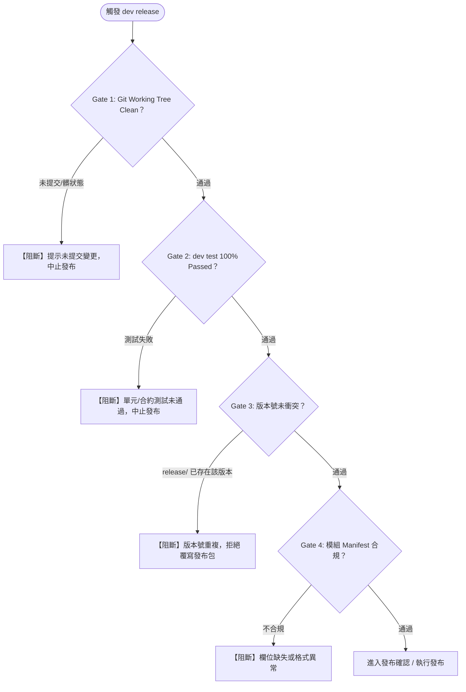
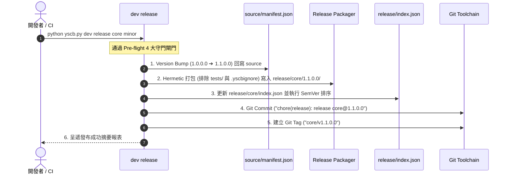

# 專題調研報告：Release CLI 指令邊界、參數設計與發布流水線分析 (R02)

> 調研主題：`dev release` CLI 介面規格、Pre-flight 守門閘門、Version Bump 演算法與 Git 標籤聯動機制  
> 建立日期：2026-08-25  
> 所屬計畫：[sub_12_versioning_and_release_pipeline](./P00_semantic_requirements.md)  
> 狀態：Completed (待與開發者逐項研討對齊)  
> 擴充項目：none  
> 模板版本：v1.0  

---

## 1. 調研背景與目標

在 [R01](./R01_release_and_build_distinction_analysis.md) 中，我們確立了 `build://` (本地開發含 tests) 與 `release://` (純淨發布包) 的根本解耦。本調研 (R02) 旨在進一步釐清 **`dev release` CLI 的具體指令邊界、參數語意、守門檢查與自動化流水線各階段的精確行為**。

---

## 2. CLI 指令簽名與參數語意設計 (CLI Signature & Arguments)

### 2.1 標準指令簽名

```bash
python yscb.py dev release <module> [bump_type | explicit_version] [options]
```

### 2.2 參數與選項規格矩陣

| 參數 / 選項 | 類型 | 預設值 | 說明與典型用法 |
| :--- | :---: | :---: | :--- |
| **`<module>`** | `str` (必填) | - | 目標模組名稱（例：`core`、`dev`） |
| **`[bump_type]`** | `enum` (選填) | 當前版本 | 四大層級遞進關鍵字：`major`、`minor`、`patch`、`revision`，或直接給定明確版本號（例：`1.2.0.0`） |
| **`--yes` / `-y`** | `bool` | `False` | 跳過終端互動式確認提示，直接執行發布 |
| **`--dry-run`** | `bool` | `False` | 試運行模式：執行 Pre-flight 檢查並輸出預計發布變更，不實際修改檔案或打 Tag |
| **`--tag`** | `bool` | `None` (依級別動態決定) | 強制建立 Git Tag（若為 `patch`/`revision` 預設不加，可顯式加 `--tag` 覆蓋） |
| **`--no-tag`** | `bool` | `False` | 強制不建立 Git Tag（若為 `major`/`minor` 預設會加，可顯式加 `--no-tag` 覆蓋） |
| **`--no-test`** | `bool` | `False` | 跳過 Pre-flight 回歸測試（適用於緊急熱修復，需顯式宣告） |

---

## 3. 四段式版本遞進演算法 (Version Bump Semantics)

若當前 `source/<module>/manifest.json` 的版本為 `1.2.3.4`：

```text
       ┌─── major    ➔  2.0.0.0   (X+1, Y=0, Z=0, R=0)
       ├─── minor    ➔  1.3.0.0   (Y+1, Z=0, R=0)
bump ──┼─── patch    ➔  1.2.4.0   (Z+1, R=0)
       ├─── revision ➔  1.2.3.5   (R+1)
       └─── <ver>    ➔  指定版本號 (如 1.5.0.0，必須 > 當前版本)
```

1. **進位清零原則**：當高階維度（`major`/`minor`/`patch`）遞進時，其所有低階欄位一律**剛性歸零**（`0`），確保版本號嚴格遞進。
2. **無參數模式**：若未指定 `bump_type`，系統檢查當前 manifest 的版本號是否為合法發布版（非 `*.build`）且未被發布過，若通過則直接以當前版本發布。

---

## 4. Pre-flight 剛性守門閘門矩陣 (Pre-flight Gate Matrix)

在進行任何實質發布變更前，`dev release` 必須依序通過以下 4 大守門閘門：



1. **Gate 1 (Git 乾淨度)**：確保發布基準點具有 100% 可回溯性，禁止在 Working Tree 處於髒狀態（Dirty）時發布正式版。
2. **Gate 2 (測試全通)**：自動於虛擬沙盒中執行該模組的 `dev test <module>`，確保測試 100% 通過（除非 `--no-test`）。
3. **Gate 3 (不可變性與 Revision 淘汰檢查)**：
   - 若發布完全相同的版本字串（例：已存在 `1.0.0.1` 再次嘗試發布 `1.0.0.1`）➔ 強制阻斷。
   - 若發布同 `major.minor.patch` 的新 Revision（例：`1.0.0.2`）➔ 允許發布，並於流水線中自動淘汰清理舊版 `1.0.0.1/` 目錄與更新 `index.json`。
4. **Gate 4 (語意合規)**：驗證 Manifest 包含所有必要欄位且語法正確。

---

## 5. 標準發布五步執行流水線與原子交易防護 (Execution Pipeline & Transaction Guard)

### 5.1 標準發布五步執行流水線

通過 Pre-flight 後，系統以原子交易方式依序執行以下 5 步：



### 5.2 發布安全交易防護與例外回滾機制 (Release Transaction Guard)

為防止發布中途發生異常導致版本號與產物裂解，`dev release` 實作 **「全成功或全回滾 (All-or-Nothing Transaction)」**：
1. **發布前狀態記錄**：記錄 `source/manifest.json` 與 `release/index.json` 原有內容。
2. **例外自動清理與補償**：若步驟 1~5 任一步驟失敗或中斷：
   - 自動將 `source/<mod>/manifest.json` 復原為舊版本。
   - 自動刪除剛生成的 `release/<mod>/<new_ver>/` 不完整目錄。
   - 自動還原 `release/<mod>/index.json`。
   - 若已建立半成品 Git Tag 則立即自動刪除。
   - 確保 Working Tree 與發布庫 100% 乾淨無損。

---

## 6. Git Tag 觸發策略與命名格式約定

### 6.1 智慧 Tag 觸發矩陣 (Smart Tag Trigger Matrix)

為防止高頻的小修復或增量功能導致 Git Tag 氾濫，系統採用**依發布層級動態決定 Tag 策略**：

| 發布層級 (Bump Level) | 預設行為 | 說明 | 覆蓋旗標 |
| :---: | :---: | :--- | :--- |
| **`major`** | **自動打 Tag** | 重大破壞性里程碑，剛性記錄 | `--no-tag` 可跳過 |
| **`minor`** | **自動打 Tag** | 代際功能演進 / 適配性升級里程碑 | `--no-tag` 可跳過 |
| **`patch`** | **預設不打 Tag** | 使用者無感之增量功能或指令 | `--tag` 可顯式建立 |
| **`revision`** | **預設不打 Tag** | 內部邏輯優化或小 Bug 修復 | `--tag` 可顯式建立 |

### 6.2 Git Tag 命名格式約定

在無 Server、純 Repo 維護的架構下，為了支援多模組各自獨立演進：
- **預設 Git Tag 格式**：`{module}/v{version}`（例如：`core/v2.0.0.0`、`core/v1.1.0.0`）。
- **優勢**：
  - 各模組擁有獨立版本演進線，互不衝突。
  - CI/CD 或第三方工具可依 Tag 前綴快速過濾特定模組的發布歷程。
