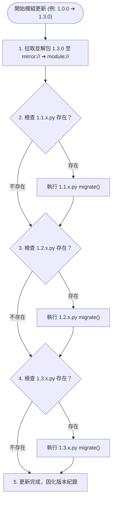

# 專題調研報告：模組 Migration 機制、四大語意維度與 Git 邊界分析 (R03)

> 調研主題：模組適配性升級 (Migration Subsystem)、四大語意維度、模組組態解耦 (config.project vs config.local) 與 Git 追蹤矩陣  
> 建立日期：2026-08-25  
> 所屬計畫：[sub_12_versioning_and_release_pipeline](./P00_semantic_requirements.md)  
> 狀態：Completed (四大維度全景表、Git 追蹤表與 Migration 架構定稿)  
> 擴充項目：none  
> 模板版本：v1.0  

---

## 1. 調研背景與目標

在 [R01](./R01_release_and_build_distinction_analysis.md) 與 [R02](./R02_release_cli_boundary_and_pipeline_analysis.md) 中，我們確立了四段式版本號體系，其中 **`minor` 級別變更被明確定義為「適配性變更（需要進行 migration 適配性升級，如資料結構微調、config 條目重命名）」**。

為建立嚴謹自洽的系統治理邊界，並專注於模組領域與來源庫之純粹語意 URI 協定，本調研 (R03) 聚焦探討：
1. **四大語意維度底層模型**（檔案意義/可再生性/影響半徑/更新時效）。
2. **模組組態雙軌解耦架構**（`config://config.project.json` vs `config://config.local.json`）。
3. **表格 1：四大語意維度全景分析表**（`storage://` 歸屬專案級持久資料，`cache://` 歸屬揮發中介層）。
4. **表格 2：模組與來源庫 Git 追蹤與忽略對照表**。
5. **模組 Migration 生命週期與安全快照回滾管線**。

---

## 2. 四大語意維度底層架構模型 (The 4 Semantic Dimensions)

```text
  維度 ① 檔案意義 ──► [ 運行核心 | 運行中介層 | 專案級設定/資料 | 本地端設定 ]
  維度 ② 可再生性 ──► [ 🔴 不可再生 (Primary SSOT) | 🟢 100% 可再生 (Derived) ]
  維度 ③ 影響半徑 ──► [ 🔒 自我收斂 (Hermetic) | 🌍 外部影響 (Coupled) ]
  維度 ④ 更新時效 ──► [ 🔥 熱更新 (Immediate) | ❄️ 冷更新 (Reload Required) ]
```

### 2.1 模組組態雙軌解耦體系 (Module Config Hierarchy)

```text
┌────────────────────────────────────────────────────────────────────────┐
│ 1. config://config.project.json (模組專案級設定)                       │
│    • 主體：各業務模組 (Module Domain)                                  │
│    • 職責：定義該模組在專案中的「共享業務規則、專案標準參數」          │
│    • 特徵：【🔴 不可再生】【🌍 外部影響】【✅ 100% 納入 Git 追蹤】      │
├────────────────────────────────────────────────────────────────────────┤
│ 2. config://config.local.json (模組本機個人設定)                         │
│    • 主體：各業務模組 (Module Domain)                                  │
│    • 職責：開發者本機個人覆蓋（個人除錯旗標、本機特化參數、本機金鑰）  │
│    • 特徵：【🟡 可再生】【🔒 自我收斂】【❌ 強制忽略 .gitignore】        │
└────────────────────────────────────────────────────────────────────────┘
```

---

## 3. 表格 1：四大語意維度全景分析表 (模組與來源庫體系)

| 語意 URI 協議 | 維度 ① 檔案意義 | 維度 ② 可再生性 | 維度 ③ 影響半徑 | 維度 ④ 更新時效 | 本質定位與說明 |
| :--- | :--- | :---: | :---: | :---: | :--- |
| **`source://`** | 運行核心 | 🔴 不可再生 | 🌍 外部影響 | 🔥 熱更新 | 模組源碼、測試、遷移腳本之 SSOT，修改即時被 build 讀取 |
| **`release://`** | 運行核心 (分發端) | 🔴 不可再生 | 🌍 外部影響 | ❄️ 冷更新 | 純 Repo 模式下不可變對外發布產物與 `index.json` |
| **`config://config.project.json`** | 專案級設定 (模組) | 🔴 不可再生 | 🌍 外部影響 | 雙軌 (視項目) | 模組專案共享業務規則與標準參數 |
| **`storage://`** | 專案級資料 (模組) | 🔴 不可再生 | 🌍 外部影響 | 🔥 熱更新 | 專案級模組持久化儲存（如中繼資料庫 meta.db、索引等） |
| **`config://config.local.json`** | 本地端設定 (模組) | 🟡 可再生 | 🔒 自我收斂 | 雙軌 (視項目) | 開發者本機個人覆蓋與特化狀態，不波及外界 |
| **`build://`** | 運行中介層 | 🟢 100% 可再生 | 🔒 自我收斂 | 🔥 熱更新 | 本地開發測試中繼包 (含 tests)，隨時可 `dev build` 重建 |
| **`modules://`** | 運行中介層 | 🟢 100% 可再生 | 🌍 外部影響 | ❄️ 冷更新 | 本機已安裝運行實體，隨時可由 `yscb install` 動態重建 |
| **`mirror://`** | 運行中介層 | 🟢 100% 可再生 | 🔒 自我收斂 | ❄️ 冷更新 | 離線快顯快取，隨時可由 Provider 重新下載 |
| **`cache://`** | 運行中介層 | 🟢 100% 可再生 | 🔒 自我收斂 | 🔥 熱更新 | 模組專屬快取、揮發性運算暫存、沙盒實例，可隨時銷毀重建 |

---

## 4. 表格 2：模組與來源庫 Git 追蹤與忽略對照表

| 語意 URI 協議 | 所屬主體 | Git 追蹤判定 | 忽略規則生效邊界 | 判定理論依據 (Rationale) |
| :--- | :--- | :---: | :--- | :--- |
| **`source://`** | 模組源碼 | **✅ 100% 追蹤** | - | 模組源碼、合約、測試代碼之唯一真相來源 (SSOT) |
| **`release://`** | 發布來源庫 | **✅ 100% 追蹤** | - | 純 Repo 模式下不可變對外發布產物與版本清冊 |
| **`config://config.project.json`** | 業務模組 | **✅ 100% 追蹤** | - | 模組團隊共享標準業務組態與預設參數 |
| **`storage://`** | 業務模組 | **✅ 100% 追蹤** | - | 專案級模組持久化中繼資料庫/狀態，協同共享必備 |
| **`config://config.local.json`** | 業務模組 | **❌ 強制忽略** | `yscb://.gitignore` | 本機個人 Provider 覆蓋與除錯參數，防止污染 Git |
| **`build://`** | 開發建置工具 | **❌ 強制忽略** | `yscb://.gitignore` | 本地測試完整建置產物，100% 可隨時由源碼重新衍生 |
| **`modules://`** | 模組運行環境 | **❌ 強制忽略** | `yscb://.gitignore` | 本機已安裝運行實體，100% 可隨時由 Provider 安裝重建 |
| **`mirror/`** | 快顯鏡像快取 | **❌ 強制忽略** | `yscb://.gitignore` | 離線快照快取，100% 可隨時由 Provider 重新拉取 |
| **`cache://`** | 系統運算暫存 | **❌ 強制忽略** | `yscb://.gitignore` | 揮發性運算快取與測試沙盒，高度揮發無保留價值 |

### 4.1 `yscb://.gitignore` 零污染自動生成機制
在執行 `python yscb.py init` 時，系統自動於 **`yscb://.gitignore`**（工具庫自治目錄內）生成專屬規則，嚴禁篡改或污染使用者專案根目錄的 `.gitignore`。

---

## 5. 模組 Migration 協定與增量階梯管線 (Migration Subsystem)

### 5.1 檔案路徑與版本命名格式規範

任何模組若有版控適應性升級需求，必須遵循以下語意路徑與命名格式：
- **語意路徑**：`module://scripts/migrations/{version}.py`
- **版本格式**：`{major}.{minor}.x.py`（例如 `1.1.x.py`、`1.2.x.py`、`1.3.x.py`）。
- **升級語意**：`{A}.{B}.x.py` 嚴格定義為 **「從 {A}.{B-1}.x 版本升級為 {A}.{B}.x」**。
- **Major 邊界與升級防護機制**：
  1. **同 Major 鎖定原則 (Major Boundary Lock)**：日常 `yscb update <mod>` 或 `update --all` 預設**僅在當前 Major 範圍內解析最新版本**，絕不自動跨入下一 Major 破壞性版本。
  2. **顯式跨 Major 升級**：若需升級至新 Major，必須顯式執行 `yscb install <mod>@<new_major>`。此操作會建立安全快照、給予破壞性變更警告，並直接安裝（不執行 Migration 腳本階梯）。

### 5.2 增量 Migration 階梯式調用流程 (Incremental Migration Ladder)

當 `core` 微內核執行更新/安裝相關操作時（例：當前安裝版本為 `1.0.0`，更新至 `1.3.0`），按以下管線依序執行：

```text
1. 拉取並安裝 1.3.0 版本產物至 mirror:// ➔ module://
2. 調用 module://scripts/migrations/1.1.x.py
3. 調用 module://scripts/migrations/1.2.x.py
4. 調用 module://scripts/migrations/1.3.x.py
   *(靜默容錯：步驟 2~4 若找不到對應檔案不報錯，視為該模組於該版本無需 Migration)*
5. 完成本次更新並固化新版本記錄
```



### 5.3 遷移腳本標準簽名協定

```python
# module://scripts/migrations/1.1.x.py
from typing import Dict, Any

def migrate(context: Dict[str, Any]) -> bool:
    """
    執行從 {A}.{B-1}.x 升級至 {A}.{B}.x 的遷移邏輯：
    - context 提供：
        - host_config_path: 宿主配置路徑
        - storage_dir: 模組 storage:// 持久化目錄
        - old_version: 升級前舊版本字串 (如 "1.0.0.0")
        - target_version: 目標版本字串 (如 "1.1.0.0")
    - 回傳 True 表示遷移成功，拋出例外或回傳 False 將觸發快照回滾
    """
    # 範例：更新 config://config.project.json 某項舊欄位或遷移 storage:// 中繼資料庫 schema
    return True
```

---

## 6. Snapshot 快照範圍與原子回滾對照表 (Snapshot Scope Matrix)

當執行模組安裝、更新或 Migration 時，為確保失敗時能 **100% 原子無損回滾 (Atomic Rollback)**，系統嚴格規範快照範圍：

### 6.1 快照範圍與還原職責對照表

| 語意 URI 協議 | Snapshot 納入範圍 | 備份對象與回滾職責 (Rationale) |
| :--- | :---: | :--- |
| **`modules://`** | **✅ 剛性納入** | 當前已安裝運行模組之代碼。升級/遷移失敗時原子還原舊代碼。 |
| **`config://config.project.json`** | **✅ 剛性納入** | 模組專案級組態。Migration 變更欄位結構失敗時還原舊組態。 |
| **`config://config.local.json`** | **✅ 剛性納入** | 模組本機個人組態。若涉及本機設定遷移，失敗時同步還原。 |
| **`storage://`** | **✅ 剛性納入** | 模組持久化儲存（如 SQLite `meta.db`）。Migration 資料庫變更失敗時**從快照無損還原，捍衛零資料損壞**。 |
| **宿主組態 (伴隨 `yscb.py`)** | **✅ 剛性納入** | 記錄當前已安裝模組版本清冊。失敗時還原回舊版本記錄。 |
| **`cache://`** | **❌ 排除 (不快照)** | 揮發性暫存與沙盒實例，升級時直接清空，快照暫存會造成 I/O 與磁碟浪費。 |
| **`mirror://`** | **❌ 排除 (不快照)** | 本機離線套件包快取（只增不減），作為安裝來源，無破壞性修改風險。 |
| **`build://`** | **❌ 排除 (不快照)** | 本地開發建置中繼產物，與生產運行升級/快照生命週期無關。 |
| **`source://`** | **❌ 排除 (不快照)** | 源碼 SSOT，受 Git 版控保護，非運行時安裝升級的變更目標。 |
| **`release://`** | **❌ 排除 (不快照)** | 不可變對外發布來源庫，升級操作僅讀取不覆寫。 |

### 6.2 快照粒度策略
1. **單模組精準快照 (Targeted Module Snapshot)**：`yscb update <module>` 僅鎖定並快照該模組的 `modules/<mod>/`、`config://` 與 `storage://<mod>/`，精準隔離回滾。
2. **全系統快照 (Global System Snapshot)**：全量操作時封裝全域 `modules/`、`config://`、`storage://` 與宿主組態，提供整機級還原點。

