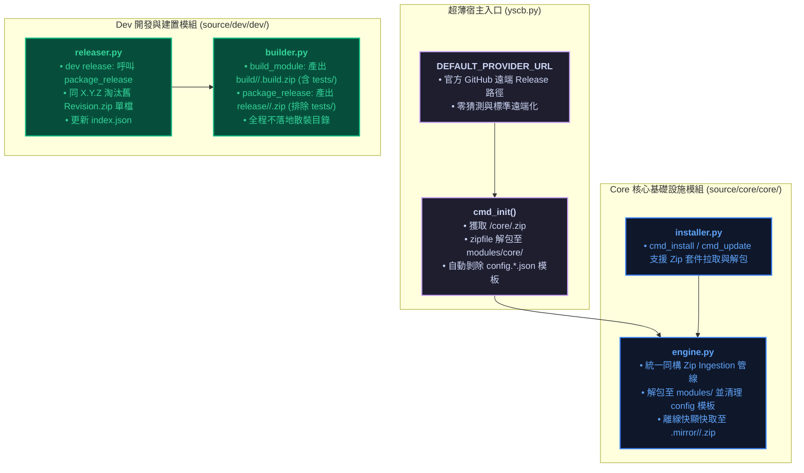

# 架構與模組設計說明書 (Architecture & Module Plan)

> 功能名稱：第三方真實使用者原生情境測試、問題排查與框架加固 (Native Consumer Testing & Hardening)  
> 建立日期：2026-08-25  
> 所屬主計畫：[2026_08_23_2030_architecture_refactor](../umbrella_overview.md)  
> 依據 P01：[P01_requirements_spec.md](./P01_requirements_spec.md)  
> 狀態：Draft (Phase 2 設計方案)  
> 擴充項目：none  
> 模板版本：v1.4  

---

## 1. 系統模組劃分與邊界 (Module Architecture & Boundaries)

---

## 2. 核心運作流程與循序圖 (Lifecycle Sequence Flow)

### 2.1 `dev release` 單檔 Zip 打包與淘汰循序圖 (FR-02, FR-03, FR-04)

```mermaid
sequenceDiagram
    autonumber
    participant Dev as 開發者 / CLI
    participant Releaser as dev.releaser (ReleasePipeline)
    participant Builder as dev.builder (Builder)
    participant RelRepo as release/<mod>/ 目錄

    Dev->>Releaser: run_release(module, bump_type)
    Releaser->>Releaser: Pre-flight 4 Gates 守門檢驗
    Releaser->>Builder: package_release(module, target_version)
    
    rect rgb(15, 23, 42)
        Note over Builder,RelRepo: 純淨 Zip 打包與舊版淘汰
        Builder->>RelRepo: 掃描同 X.Y.Z 舊 Revision (如 1.0.0.1.zip)
        Builder->>RelRepo: 直接刪除舊 1.0.0.1.zip
        Builder->>RelRepo: 壓縮打包純淨 1.0.0.2.zip (排除 tests/)
        Builder->>RelRepo: 更新 index.json (寫入最新 versions 清單)
    end
    
    Builder-->>Releaser: (True, "Packaged release.zip")
    Releaser->>Releaser: Git Commit & Smart Git Tag
    Releaser-->>Dev: 發布成功 (100% 純 Zip 產物)
```

---

### 2.2 `yscb.py init` 與 `installer` 統一同構 Zip 解包自舉循序圖 (FR-01, FR-05)

```mermaid
sequenceDiagram
    autonumber
    participant User as 第三方使用者 / CLI
    participant Host as yscb.py (cmd_init)
    participant Remote as 官方 GitHub 遠端 Provider
    participant Mirror as .mirror/<mod>/
    participant Modules as modules/<mod>/
    participant Config as config/<mod>/

    User->>Host: python yscb.py init ./ys-codebase
    Host->>Host: 讀取 DEFAULT_PROVIDER_URL (GitHub 遠端)
    Host->>Remote: HTTP GET core/index.json
    Remote-->>Host: {"name": "core", "versions": ["1.0.0.0"]}
    
    rect rgb(6, 78, 59)
        Note over Host,Modules: 統一同構 Zip 串流下載與解包自舉
        Host->>Remote: HTTP 串流下載 core/1.0.0.0.zip 至 .tmp.zip
        Host->>Host: zipfile.is_zipfile() & testzip() 校驗完整性
        Host->>Mirror: 存儲快取 .mirror/core/1.0.0.0.zip
        Host->>Modules: zipfile.extractall() 解包至 modules/core/
        Host->>Config: 提取 config.project.json 模板進行軟合併
        Host->>Modules: 自動刪除 modules/core/ 內的 config.*.json
    end
    
    Host->>Modules: dispatch_module("core", ["reload"])
    Modules-->>User: 初始化與自舉成功 (HEALTHY 100%)
```

---

## 3. 受影響檔案清單 (Impacted Files & Change Scope)

| 檔案路徑 | 變更性質 | 變更核心目的與職責 |
| :--- | :---: | :--- |
| `yscb.py` | Modify | 修改 `DEFAULT_PROVIDER_URL` 為官方遠端 GitHub URL；`cmd_init` 實作標準庫 `urllib` + `zipfile` 串流下載與解包自舉。 |
| `ys_codebase/source/dev/dev/builder.py` | Modify | `package_release` 輸出純淨 `<mod>/<ver>.zip`；`build_module` 輸出 `build/<mod>/<ver>.build.zip`；全程不落地散裝目錄。 |
| `ys_codebase/source/dev/dev/releaser.py` | Modify | 發布流程更新，對齊單檔 Zip 產物與同 X.Y.Z 舊 Revision.zip 淘汰清理。 |
| `ys_codebase/source/core/core/engine.py` | Modify | `act_reload` / 依賴解析對齊 Zip 來源庫；支援從 `<ver>.zip` 解包至 `modules/<mod>/` 並自動清除 `config.*.json` 模板。 |
| `ys_codebase/source/core/core/installer.py` | Modify | `cmd_install` / `cmd_update` 在面對遠端 Provider 時，串流下載 `<ver>.zip` 並由 `zipfile` 解包。 |
| `ys_codebase/source/dev/dev/testing/sandbox.py` | Modify | 沙盒建立時自 `build/<mod>/<ver>.build.zip` 解包至沙盒 `modules/`。 |
| `ys_codebase/source/core/tests/test_remote_zip_bootstrap.py` | **NEW** | 新增單元測試：驗證 Zip Bundle 生成、CRC32 校驗、解包自舉與 config 模板剝除。 |

---

## 4. 架構決策紀錄 (Architecture Decision Records)

### [P02:DR-01] 全系統明文空間二分法與中間庫全 Zip 規範
- **背景**：散裝目錄分發會造成本地 copytree vs 遠端 download 邏輯分裂與倉庫污染。
- **決策**：明文目錄**嚴格僅限 `source/`（開發源碼）與 `modules/`（運行代碼）**；`release/` 與 `build/` 統一一律存儲單一 `<module>/<version>.zip` 與 `index.json`。
- **影響**：大幅收斂代碼路徑，Git 倉庫體積縮減 50%+，消除目錄遞迴開銷。

### [P02:DR-02] 本地與遠端 100% 同構自舉與安裝管線
- **背景**：過去本地目錄走檔案複製、遠端走 HTTP 下載，代碼分歧且測試難以覆蓋。
- **決策**：微內核安裝與自舉管線統一定義為：
  $$\text{取得 <ver>.zip (本地拷貝或遠端下載)} \xrightarrow{\text{zipfile 校驗}} \text{解包至 modules/}$$
- **影響**：完全消滅環境行為差異，無論本機還是遠端皆走完全相同的解包驗證邏輯。

### [P02:DR-03] 發布端單檔淘汰與 Index 同步機制
- **背景**：同 `X.Y.Z` 發布新修訂時需要清理舊版本。
- **決策**：在 `release/<module>/` 下直接執行單檔刪除（例：`os.remove("1.0.0.1.zip")`），並同步寫入 `index.json`。
- **影響**：單檔操作具備原子性與極高速度，無殘留目錄風險。

### [P02:DR-04] Zip 解包期配置模板自動剝除與純粹化
- **背景**：隨 Zip 套件攜帶之 `config.project.json` 若殘留在 `modules/` 會造成維護困惑。
- **決策**：解包至 `modules/<module>/` 後，由引擎提取種子進行軟合併，隨即將 `modules/<module>/config.*.json` 模板刪除。
- **影響**：`modules/` 保持 100% 純粹可執行 Python 代碼。
