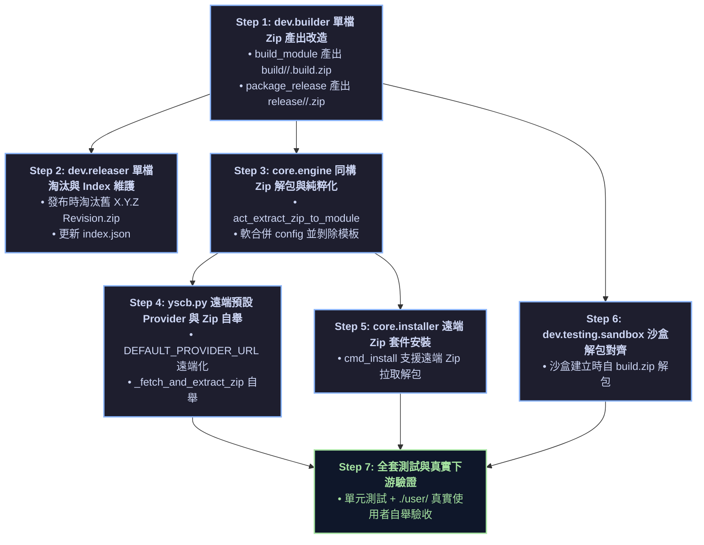

# API 規格與介面合約說明書 (API Specification & Contracts)

> 功能名稱：第三方真實使用者原生情境測試、問題排查與框架加固 (Native Consumer Testing & Hardening)  
> 建立日期：2026-08-25  
> 所屬主計畫：[2026_08_23_2030_architecture_refactor](../umbrella_overview.md)  
> 依據 P01/P02：[P01_requirements_spec.md](./P01_requirements_spec.md), [P02_architecture_plan.md](./P02_architecture_plan.md)  
> 狀態：Draft (Phase 3 介面規格)  
> 擴充項目：none  
> 模板版本：v1.4  

---

## 1. Public API 簽名與型態定義

### 1.1 Dev Builder 單檔 Zip 打包介面 (`source/dev/dev/builder.py`)

```python
from typing import Tuple, Dict, Any, Optional

class Builder:
    def __init__(self):
        pass

    def build_module(self, module_name: str, clean: bool = True) -> Tuple[bool, str]:
        """
        將指定模組源碼打包為單一開發測試 Zip 包：
        - 輸出路徑：build/<module_name>/<version>.build.zip (module.build.root://<mod>/<ver>.build.zip)
        - 內部 100% 完整包含 tests/ 與開發檔案，全程不落地展開散裝目錄。
        - 自動更新 build/<module_name>/index.json (寫入 versions: ["<version>.build"])。
        - clean=True 時自動刪除舊的 *.build.zip。
        """
        ...

    def package_release(self, module_name: str, target_version: str) -> Tuple[bool, str]:
        """
        將指定模組源碼打包為單一純淨發布 Zip 包：
        - 輸出路徑：release/<module_name>/<target_version>.zip (release.root://<mod>/<target_version>.zip)
        - 依 .yscbignore 排除 tests/、__pycache__ 與開發專用檔案。
        - 執行同 X.Y.Z 淘汰：若發布 1.0.0.2.zip，自動刪除舊 1.0.0.1.zip。
        - 自動更新 release/<module_name>/index.json 清冊。
        - 全程不落地展開散裝目錄。
        """
        ...
```

---

### 1.2 Core 微內核同構 Zip 解包與自舉介面 (`source/core/core/engine.py`)

```python
from typing import Optional, Dict, Any, Tuple

class AtomicEngine:
    def act_extract_zip_to_module(self, zip_path: str, module_name: str) -> bool:
        """
        將指定的模組 Zip 檔案解包至 module.root://{module_name}/：
        1. 透過 zipfile.is_zipfile() 與 testzip() 驗證完整性。
        2. 清空既有 module.root://{module_name}/。
        3. 解包所有 Python 代碼與資源至 module.root://{module_name}/。
        4. 提取 config.project.json / config.local.json 進行軟合併至 config.root://{module_name}/。
        5. 自動刪除 module.root://{module_name}/ 內的 config.*.json 模板，保持運行空間純淨。
        """
        ...

    def act_fetch_module_zip(self, module_name: str, version: str, provider_url: str) -> str:
        """
        自 Provider 獲取指定模組版本的 Zip 檔案：
        - 本地 Provider：自本地複製 <provider>/<module>/<version>.zip 至 .mirror/<module>/<version>.zip。
        - 遠端 HTTP Provider：單次串流下載至 .mirror/<module>/<version>.zip.tmp，驗證後重命名。
        - 回傳本地 .mirror/ 中 .zip 檔案的實體絕對路徑。
        """
        ...
```

---

### 1.3 超薄宿主遠端自舉介面 (`yscb.py`)

```python
# 剛性定義官方 GitHub 遠端 Release Gateway
DEFAULT_PROVIDER_URL: str = "https://raw.githubusercontent.com/ysnaive/agent.workflow/main/release"

def _fetch_and_extract_zip(source_url_or_path: str, dest_dir: str) -> None:
    """
    100% Python 標準庫原生 Zip 獲取與解包 Helper：
    - 支援 local 檔案路徑與 http/https/file 遠端 URL。
    - 遠端模式：以 30s timeout 下載至 dest_dir + '.tmp.zip'，驗證後解包至 dest_dir，清除 tmp.zip。
    - 解包後自動清理 dest_dir 內的 config.*.json 模板。
    """
    ...

def cmd_init(argv: List[str]) -> int:
    """
    初始化 YS-Codebase 宿主環境：
    - 讀取 yscbRoot 與 --provider (預設為 DEFAULT_PROVIDER_URL)。
    - 生成 yscb://.gitignore。
    - 自舉 core 模組：獲取 core/<version>.zip ➔ 解包至 modules/core/ ➔ reload。
    """
    ...
```

---

## 2. 實作依賴關係拓撲圖 (Implementation Dependency Graph)



---

## 3. 知識庫 7 大抽象維度預排交付清單

| 維度編號 | 維度名稱 | 預排交付檔案路徑 | 核心內容規劃 |
| :---: | :--- | :--- | :--- |
| **維度 3** | 中觀專題手冊 | `docs/core/ZIP_PACKAGE_SPEC.md` **[NEW]** | 全面 Zip 單檔打包標準、目錄結構、同構自舉協定與 CRC32 校驗規範。 |
| **維度 3** | 中觀專題手冊 | `docs/dev/RELEASE_PIPELINE.md` | 更新 `dev release` 單檔 `.zip` 打包與同 X.Y.Z 單檔淘汰章節。 |
| **維度 5** | 工程妥協與設計註記 | `docs/core/DESIGN_NOTES.md` | 登記 `DN-12`（明文空間嚴格二分法與 Provider 同構 Zip 規範）。 |
