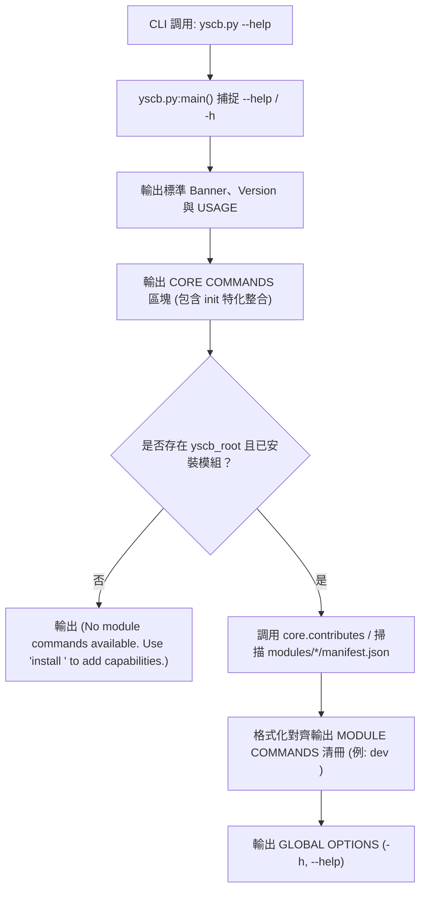

# 架構與模組設計說明書 (Architecture Plan)

> 功能名稱：框架骨架最終打磨與 CLI UX 體驗優化 (Framework Final Polish & CLI UX)  
> 建立日期：2026-08-25  
> 所屬主計畫：[2026_08_23_2030_architecture_refactor](../umbrella_overview.md)  
> 依據需求規格：[P01_requirements_spec.md](./P01_requirements_spec.md)  
> 狀態：Confirmed (Phase 2 已確認)  
> 擴充項目：none  
> 模板版本：v1.4  

---

## 1. 系統架構與呼叫流程 (Architecture Overview)

### 1.1 `yscb.py --help` 動態派發與排版架構



### 1.2 `releaser.py` Pre-flight 守門精簡架構

```text
[dev:release 觸發]
       │
       ▼
[Gate 1: 移除] (不再檢查 Git Dirty)
       │
       ▼
[Gate 2: 測試守門] ───► 執行沙盒測試 (可透過 --no-test 略過)
       │
       ▼
[Gate 3: 版本不可變性] ──► 檢查 release/<mod>/<ver>.zip 是否已存在 (禁止覆蓋)
       │
       ▼
[Gate 4: Manifest 合規] ──► 驗證 Entry Point 與相依欄位
       │
       ▼
[原子發布打包] ────► 產出 release/<mod>/<ver>.zip 並更新 index.json
```

---

## 2. 模組影響盤點與設計決策 (Design Decisions)

### 2.1 模組影響矩陣

| 模組 | 檔案路徑 | 變更性質 | 變更職責說明 |
| :--- | :--- | :---: | :--- |
| **宿主層** | `yscb.py` | Modify | 實作全域 Banner、`init` 整併、動態模組指令聚合掃描、智慧拼寫比對 (`difflib`)。 |
| **Dev 工具** | `source/dev/dev/releaser.py` | Modify | 移除 Gate 1 Git Dirty 阻斷，保持本地發布純粹性。 |
| **Core 微內核** | `source/core/core/engine.py` | Modify | 提供 `get_installed_module_commands_summary()` 供宿主快速查詢各模組能力。 |

### 2.2 關鍵設計決策記錄

- **`[P02:DR-01]` 宿主極簡動態探測**：
  `yscb.py` 輸出 Help 時，優先透過極低 I/O 讀取 `cache://contributes.merged.json` 或 `modules/*/manifest.json`，在未安裝模組時優雅降級，確保執行效能為毫秒級。
- **`[P02:DR-02]` 零外部依賴之拼寫建議演算法**：
  採用 Python 標準庫 `difflib.get_close_matches(word, possibilities, n=1, cutoff=0.6)`，兼顧高召回率與零誤報。

---

## 3. 受影響檔案清冊 (Impacted Files)

1. `yscb.py`
2. `ys_codebase/source/dev/dev/releaser.py`
3. `ys_codebase/source/core/core/engine.py`
