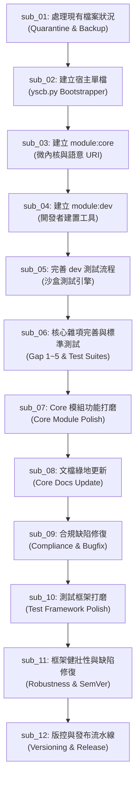

# 分類型主計畫總覽 (Umbrella Plan Overview)

> 功能名稱：模組化體系宏觀架構重構與微內核遷移 (Module Architecture Specification & Microkernel Refactor)  
> 建立日期：2026-08-24  
> 結案日期：2026-08-25  
> 所屬主計畫：無  
> 依據 P00：[P00_semantic_requirements.md](./P00_semantic_requirements.md)  
> 狀態：Completed  
> 擴充項目：none  
> 模板版本：v1.2  

---

## 1. 目標說明與架構總綱

本 Umbrella 主計畫統籌 YS-Codebase 從「巨型單檔自引用體系」向「超薄宿主 (Ultra-Thin Host) + 微內核 (module:core) + 開發者套件 (module:dev) + 自治模組生態」之全方位宏觀架構重構與平穩遷移。透過 8 個細化子計畫，實現環境隔離、原生自舉、微內核套件管理、開發者工具鏈、自部署閉環、雙空間文檔更新與全套知識庫綠地重建。

---

## 2. 子計畫拆分清單與執行進度

| 編號 | 子計畫目錄名稱 | 預設 Track | 最終狀態 | 核心目標摘要 |
| :--- | :--- | :---: | :---: | :--- |
| **sub_01** | `sub_01_quarantine_and_backup` | Fast Track | **已完成** | 處理現有檔案狀況：隔離現有模組至 `.quarantine/` 並備份歷史起手腳本與組態 |
| **sub_02** | `sub_02_host_bootstrapper` | Full Track | **已完成** | 建立宿主單檔：100% 原生實現超薄 `yscb.py`（含 `init`, `self-update`, CLI 轉接派發） |
| **sub_03** | `sub_03_core_module` | Full Track | **已完成** | 建立 `module:core`：實作 12 大原子操作、7 大 Installer 指令、語意 URI 與 Contributes 聚合器 |
| **sub_04** | `sub_04_dev_module` | Full Track | **已完成** | 建立 `module:dev`：實作模組腳手架 `create`、規範檢查 `check`、純淨打包 `build` 工具 |
| **sub_05** | `sub_05_dev_testing_workflow` | Full Track | **已完成** | 建立並完善 dev 測試流程：實作 `dev test` 沙盒測試引擎與標準化回歸測試矩陣 |
| **sub_06** | `sub_06_misc_polish_and_tests` | Full Track | **已完成** | 雜項功能完善補齊與 core, dev 標準化測試添加：補齊 Gap 1~5 核心機制並建立 8 大持久化標準測試套件 |
| **sub_07** | `sub_07_core_module_polish` | Full Track | **已完成** | Core 模組功能打磨：完善命名空間 Hook 體系、顯式 config 協議、零 Fallback project:// 與組態增量補齊 |
| **sub_08** | `sub_08_core_docs_update` | Fast Track | **已完成** | 文檔更新：綠地重建專案根目錄、`core` 與 `dev` 模組之知識庫手冊與規範文檔 |
| **sub_09** | `sub_09_compliance_and_bugfix` | Full Track | **已完成** | 架構合規性缺陷修復與穩固性強化：修復宿主組態路徑混淆、移除隱式猜測、增強 Provider 與相依防護 |
| **sub_10** | `sub_10_test_framework_polish` | Full Track | **已完成** | 測試框架生命週期與全隔離虛擬沙盒重構：落實三階指令 (op-mksb, op-test, test)、完全對標沙盒與 hook.dev.py 自治體系 |
| **sub_11** | `sub_11_framework_robustness_and_bugfix` | Full Track | **已完成** | 套件框架健壯性強化與缺陷修復：清除軟相容手段回歸剛性拓撲、SemVer 2.0.0 數值運算器、雙層快照還原、CM 作用域與 Hermetic Clean Build |
| **sub_12** | `sub_12_versioning_and_release_pipeline` | Full Track | **已完成** | 四段式版本號、雙軌來源庫 (Build vs Release)、三層安裝降級鏈、發布流水線與 Migration 階梯調用 |

---

## 3. 跨子計畫依賴關係圖 (Dependency Roadmap)

---

## 4. 全域 Decision Records (Master DR)

### [UMBRELLA:DR-01] 微內核與超薄宿主職責分離
- **議題**：宿主 `yscb.py` 與套件管理、路徑處理功能耦合過重，單檔膨脹且難以自我升級。
- **結論**：`yscb.py` 縮減為百餘行超薄宿主（僅保留 `init`、`self-update` 與泛用 CLI 派發）；所有套件管理指令（7 項）與語意 URI 系統全數交由 `core` 模組自治實現。
- **理由**：實現 100% 零依賴自舉逃生艙，將業務複雜度完全模組化。
- **影響的子計畫**：`sub_02`, `sub_03`

### [UMBRELLA:DR-02] 語意空間協議與路徑封裝鐵律
- **議題**：模組直接存取底層路徑造成自引用死鎖與路徑混亂。
- **結論**：建立語意 URI 協議空間（`project://`, `yscb://`, `mirror://`, `temp://`, `snapshot://`, `cache://`, `config://`, `module://` 等），`ExecutionContext` 僅提供語意資訊（`module_name`, `command`, `args`），嚴禁暴露底層實體路徑。
- **理由**：保障模組自治與跨環境路徑確定性。
- **影響的子計畫**：`sub_03`, `sub_04`, `sub_07`, `sub_08`

### [UMBRELLA:DR-03] 純淨產物版本化拓撲與 Provider 抽象
- **議題**：產物與源碼混雜，缺少版本管理與統一的套件倉庫來源抽象。
- **結論**：移除 `latest/` 實體目錄，產物空間與 Provider 統一遵循 `module.build.root://<module>/<version>/` 結構，透過 `index.json` 進行版本清冊發現與 SemVer 求解。
- **理由**：確保安裝產物 100% 純淨無開發污染，支援離線回滾與多版本管理。
- **影響的子計畫**：`sub_03`, `sub_04`, `sub_06`

### [UMBRELLA:DR-04] RELOAD 兩階段純淨物化與依賴注入保證
- **議題**：重載運行端時若採增量補丁易受前次注入髒狀態污染。
- **結論**：`RELOAD` 定案為「階段一：自鏡像全量覆蓋純淨 build 檔案 ➔ 階段二：掃描 5 大來源聚合 contributes 執行注入並寫入 cache 快照 ➔ 廣播 lifecycle 事件」流水線。
- **理由**：確保運行端永遠維持在可預期的 100% 純淨初始狀態。
- **影響的子計畫**：`sub_03`, `sub_05`, `sub_06`, `sub_07`

### [UMBRELLA:DR-05] 隔離式漸進遷移路線圖
- **議題**：重構期間避免舊版工作流與代碼干擾核心自舉構建。
- **結論**：現有代碼於 `sub_01` 移入 `.quarantine/` 隔離；聚焦完成 `core`、`dev` 及自部署驗證閉環與全套文檔綠地重建。
- **理由**：降低單次重構風險，確保微內核基礎設施 100% 穩固。
- **影響的子計畫**：`sub_01`, `sub_08`

---

## 5. 主計畫結案成果與驗收總結 (Master Plan Completion)

- **子計畫執行達成率**：10 / 10 子計畫 100% 交付結案。
- **程式碼品質與依賴**：100% Python 標準庫，零第三方套件依賴。
- **自動化測試守門**：Auto-Contract (6/6) + Custom Persistent Tests (42/42) = **48/48 測試全數 Passed (100% Ready)**。
- **知識庫交付**：`docs/` 10 大標準手冊全面綠地落成與 1:1 驗收。
- **全主計畫狀態**：**✅ 圓滿結案 (Completed)**。
