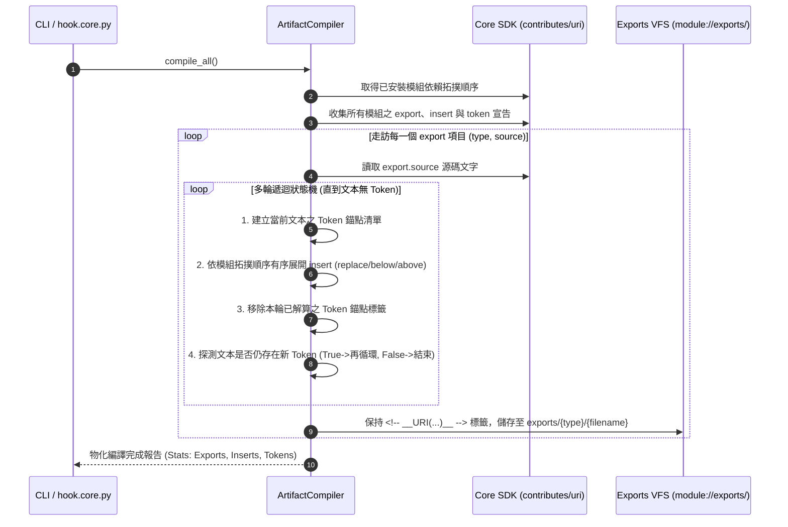

# 架構與模組設計說明書 (Architecture & Module Plan)

> 功能名稱：agents-workflow 核心骨架與 SOP 本體遷移 (Core Skeleton & SOP Body Migration)  
> 建立日期：2026-08-26  
> 所屬主計畫：[2026_08_25_2200_agents_workflow_migration](../umbrella_overview.md)  
> 依據需求：[P01_requirements_spec.md](./P01_requirements_spec.md), [R01_core_skeleton_and_sop_redesign.md](./R01_core_skeleton_and_sop_redesign.md)  
> 狀態：`Confirmed`  
> 擴充項目：none  
> 模板版本：v1.4  

---

## 1. 模組架構分層與職責邊界 (Layered Architecture)

`agents-workflow` 作為 YSCB 體系的一等公民模組，採用「工廠化與三層資產解耦」架構：

```text
┌────────────────────────────────────────────────────────────────────────┐
│                        CLI 終端交互與調度層                            │
│  • python yscb.py agents-workflow <compile | tokens | list>            │
└───────────────────────────────────┬────────────────────────────────────┘
                                    │ (調度)
┌───────────────────────────────────▼────────────────────────────────────┐
│                    工廠物化編譯引擎 (ArtifactCompiler)                 │
│  • 依賴拓撲排序 (Topological Order)                                    │
│  • 多輪遞迴狀態機 (Snapshot ➔ Inject ➔ Purge ➔ Recurse ➔ Emit)        │
└───────────────────┬───────────────────────────────────┬────────────────┘
                    │ (讀取宣告)                        │ (物化儲存)
┌───────────────────▼───────────────────┐   ┌───────────▼────────────────┐
│   模組宣告式 Contributes 註冊來源      │   │  物化導出空間              │
│   • export: 資產導出清冊              │   │  module://exports/         │
│   • insert: 錨點注入宣告              │   │  ├── standards/            │
│   • token:  錨點元數據說明            │   │  ├── workflows/            │
└───────────────────────────────────────┘   │  └── templates/            │
                                            └────────────────────────────┘
```

---

## 2. 核心資料流與多輪遞迴狀態機循序圖 (Data Flow & Sequence Diagram)



---

## 3. 受影響檔案與新建檔案清單 (Impacted & New Files Inventory)

| 檔案路徑 | 類型 | 職責與變更說明 |
| :--- | :---: | :--- |
| `source/agents-workflow/manifest.json` | New | 模組元數據，宣告 `export` 16 項、`insert` (header replace) 與 `token`。 |
| `source/agents-workflow/scripts/cli.py` | New | CLI 進入點，實作 `compile`、`tokens`、`list` 指令解析與調度。 |
| `source/agents-workflow/scripts/hook.core.py` | New | 微內核 Hook，監聽 `on_reload` 事件並觸發工廠編譯物化。 |
| `source/agents-workflow/agents_workflow/compiler.py` | New | 核心工廠編譯器，實現多輪遞迴狀態機解算與物化分流儲存。 |
| `source/agents-workflow/standards/DocumentationStandards.md` | New | 通用文檔標準規範（7 大抽象維度、Topic 專題文檔標準）。 |
| `source/agents-workflow/standards/DevelopmentStandards.md` | New | 通用開發標準規範（SOP 0~7 階段標準生命週期與防呆紀律）。 |
| `source/agents-workflow/workflows/ContextInit.md` | New | 通用上下文熱啟動流程。 |
| `source/agents-workflow/templates/header.md` | New | P 系列模板共通標準標頭片段。 |
| `source/agents-workflow/templates/P00~P07.md` (8 個) | New | P 系列階段模板（P01~P07 頂部放置 `<!-- __PHASEXX_STANDARD_HEADER__ -->`）。 |
| `source/agents-workflow/templates/FT_plan.md` | New | Fast Track 敏捷計畫模板。 |
| `source/agents-workflow/templates/umbrella_overview.md` | New | Umbrella 主計畫總覽模板。 |
| `source/agents-workflow/templates/changelog.md` | New | 計畫變更日誌模板。 |
| `source/agents-workflow/templates/R_research_report.md` | New | 深度技術調研報告模板。 |
| `source/agents-workflow/templates/handoff.md` | New | 現場凍結交接文檔模板。 |
| `source/agents-workflow/tests/test_compiler.py` | New | 工廠編譯器、自注入與多輪遞迴狀態機單元測試套件。 |

---

## 4. 架構決策記錄 (Architecture Decision Records)

- **[P02:DR-01] 模組內部代碼命名空間**：模組 Python 邏輯統一置於 `source/agents-workflow/agents_workflow/`（以底線命名符合 Python Package 規範），進入點為 `scripts/cli.py`。
- **[P02:DR-02] Exports 物化空間隔離**：物化產物儲存於 `module://exports/`，與源碼空間 `standards/`、`workflows/`、`templates/` 嚴格物理隔離，防止源碼被增量寫入污染。
