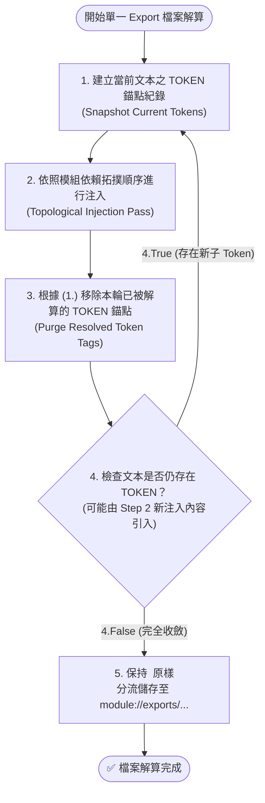

# 技術調研報告：agents-workflow 核心骨架與 SOP 重新設計調研 (Redesign Research)

> 功能名稱：agents-workflow 核心骨架與 SOP 重新設計 (Core Skeleton & SOP Redesign)  
> 建立日期：2026-08-25  
> 所屬主計畫：[2026_08_25_2200_agents_workflow_migration](../umbrella_overview.md)  
> 所屬子計畫：[sub_01_core_skeleton_migration](./P00_semantic_requirements.md)  
> 狀態：`Draft` (Ch1 語意概述草擬中)  
> 擴充項目：none  
> 模板版本：v1.4  

---

## 1. 三大維度語意概述 (Three Semantic Dimensions Overview)

本章旨在確立 `sub_01` 核心骨架遷移與重新設計的三大核心維度語意定義與職責邊界，為後續具體規格化提供統一的語意基底：

```text
┌────────────────────────────────────────────────────────────────────────┐
│             agents-workflow 核心骨架三大語意維度架構                    │
├───────────────────┬───────────────────┬────────────────────────────────┤
│  維度 1：SOP 本體  │  維度 2：依賴注入 │  維度 3：CLI 指令               │
│  (SOP & Templates)│  (Contributes)    │  (CLI Governance)              │
│                   │                   │                                │
│  • 9 大標準工作流  │  • 語意 URI 註冊   │  • 計畫合規校驗 (verify)        │
│  • 13 大標準模板   │  • 模組配置注入   │  • 計畫狀態掃描 (scan)          │
│  • 100% 純淨無擴充│  • 最小依賴宣告   │  • 計畫封存歸檔 (archive)       │
└───────────────────┴───────────────────┴────────────────────────────────┘
```

---

### 1.1 維度 1 語意概述：SOP 本體與 Templates 模板資產 (SOP & Templates Body)

- **核心語意**：
  SOP（Standard Operating Procedure）與文檔模板是整個 Agent 工程協同的**核心認知骨架與防呆紀律基準**。
- **職責範疇**：
  1. **標準作業流程庫 (`workflows/`)**：規範 Agent 從「需求探索 (NewPlan)」、「狀態中斷接續 (Continue/Pause)」、「深度歸因 (Discuss/Research)」、「知識沉澱 (DocumentationStandards/Idea)」到「結案審查 (Review)」的完整行為邊界。
  2. **標準文檔模板庫 (`workflows/templates/`)**：提供自 `P00` 語意需求至 `P07` 結案 Walkthrough 的 100% 結構化 Markdown 契約模板。
- **純淨邊界原則**：
  本次子計畫 `sub_01` 專注於 **SOP 本體**，徹底排除 `sop_ext://` (ext) 與 IDE 動態轉譯指令，維持規範核心的自洽與純淨。

---

### 1.2 維度 2 語意概述：依賴注入格式定義 (Declarative Contributes)

- **核心語意**：
  在 YSCB 微內核架構中，`agents-workflow` 不再是一個鬆散的腳本集合，而是一個具備**自宣告式依賴注入能力的一等公民模組 (First-Class Module)**。
- **職責範疇**：
  1. **語意 URI 協議宣告 (`contributes.uris`)**：向微內核註冊計畫目錄 (`plans://`)、歸檔目錄 (`archive://`) 等業務語意 URI，消除路徑硬編碼。
  2. **配置項宣告 (`contributes.configurations`)**：宣告模組運行所需的預設參數（如預設計畫路徑、命名規則等）。
  3. **最小相依性 (`dependencies`)**：剛性依賴 `core` 微內核與 `dev` 工具箱。

---

### 1.3 維度 3 語意概述：CLI 指令集定義 (CLI Command Governance)

- **核心語意**：
  為開發者與 Agent 提供**定式化、可編程、低心智負擔的計畫生命週期治理工具鏈**。
- **職責範疇**：
  1. **計畫合規性校驗 (`verify`)**：自動掃描 `plans://` 目錄，檢驗所有 Phase 文件是否嚴格對齊模板版本與防呆鐵律。
  2. **計畫狀態掃描 (`scan`)**：秒級彙整當前活躍計畫的進度、Phase 狀態與 DR 決策清單。
  3. **計畫生命週期流轉 (`archive`)**：支援將已結案的 Dev Plan 安全遷移至歷史歸檔區 (`archive://`)。
- **調用風格**：
  統一由宿主路由器轉發：`python yscb.py agents-workflow <command> [options]`。

---

## 2. 維度 1 重構設計：純淨通用內核架構 (Pure Generic Architecture)

為確保 `agents-workflow` 作為 100% 通用模組（可開箱供任何專案使用，不包含任何專案特化規則），內核進行極致純淨化重構：

```text
┌────────────────────────────────────────────────────────────────────────┐
│             agents-workflow 純淨通用內核資產劃分                        │
├───────────────────┬───────────────────┬────────────────────────────────┤
│  1. 規範 (Standards)│  2. 流程 (Workflows)│  3. 模板 (Templates)           │
│  【通用不變性底線】    │  【最小極簡流程】    │  【完全鏡像產物骨架】          │
│                   │                   │                                │
│  • Documentation  │  • ContextInit    │  • P00 ~ P07 階段計畫模板       │
│    Standards      │    (目前僅保留此核心，│  • FT_plan 敏捷計畫模板        │
│  • Development    │     其餘流程後續詳定義│  • umbrella_overview 總覽模板  │
│    Standards      │     後再逐一移植)    │  • changelog 計畫變更日誌模板  │
│                   │                   │  • R_research_report 調研模板  │
│                   │                   │  • handoff 現場凍結模板        │
└───────────────────┴───────────────────┴────────────────────────────────┘
```

---

### 2.1 資產劃分清冊與核心職責

#### 1. 【規範空間】`standards/`（通用底線不變性 - 2 項）
- **`DocumentationStandards.md`（文檔標準規範）**：
  定義通用專案知識庫的 7 大抽象維度、Topic 專題文檔判定、Design Notes 工程妥協登錄與 1:1 交付驗收原則。
- **`DevelopmentStandards.md`（開發標準規範）**：
  整合並定義通用的 SOP 0~7 階段標準生命週期、三大分流模式（Fast Track / Full Track / Umbrella）、剛性追溯鏈（P00 ➔ FR/EC ➔ DR ➔ Code ➔ Test）、核心防呆紀律（零臆測、問答 $\neq$ 推進、Turn 限制、沙盒模式安全防護、除錯排查範疇保護）。

#### 2. 【流程空間】`workflows/`（最小核心流程 - 1 項）
- **`ContextInit.md`（上下文熱啟動流程）**：
  作為唯一第一批次保留之核心流程，負責在 Session/Chat 啟動時秒級建立專案記憶、探測環境語意與載入規範地圖。
  > 其餘流程（`NewPlan`, `Continue`, `Discuss`, `Review`, `Pause`, `Research`, `Idea` 等）暫不遷移，留待後續詳細重新定義後再逐一增量移植。

#### 3. 【模板空間】`templates/`（完全鏡像移植 - 13 項）
- **計畫生命週期系列**：
  - `P00_semantic_requirements.md`（Phase 0 語意需求說明書）
  - `P01_requirements_spec.md`（Phase 1 需求規格說明書）
  - `P02_architecture_plan.md`（Phase 2 架構與模組設計說明書）
  - `P03_api_spec.md`（Phase 3 API 與介面規格書）
  - `P04_implementation_plan.md`（Phase 4 實作定稿計畫書）
  - `P05_task.md`（Phase 5 任務執行追蹤表）
  - `P06_test_plan.md`（Phase 6 測試與驗證計畫書）
  - `P07_walkthrough.md`（Phase 7 成果展示與結案報告）
- **分流與統籌系列**：
  - `FT_plan.md`（Level 0 Fast Track 敏捷計畫）
  - `umbrella_overview.md`（Level 2 Umbrella 分類型主計畫總覽）
- **調研 / 日誌 / 交接系列**：
  - `changelog.md`（計畫微觀變更日誌）
  - `R_research_report.md`（深度技術專題調研報告）
  - `handoff.md`（現場狀態凍結交接文檔）

---

### 2.2 模組實體目錄拓撲結構 (source/agents-workflow/)

```text
source/agents-workflow/
├── manifest.json                  (模組元數據與 contributes 宣告)
├── scripts/
│   ├── cli.py                     (模組 CLI 進入點)
│   └── hook.core.py               (微內核生命週期對接)
├── standards/                     (【規範空間】：通用不變性底線)
│   ├── DocumentationStandards.md  (文檔標準規範)
│   └── DevelopmentStandards.md    (開發標準規範 SOP 0~7)
├── workflows/                     (【流程空間】：最小核心流程)
│   └── ContextInit.md             (上下文熱啟動)
├── templates/                     (【模板空間】：完全鏡像標準模板庫)
│   ├── P00_semantic_requirements.md
│   ├── P01_requirements_spec.md
│   ├── P02_architecture_plan.md
│   ├── P03_api_spec.md
│   ├── P04_implementation_plan.md
│   ├── P05_task.md
│   ├── P06_test_plan.md
│   ├── P07_walkthrough.md
│   ├── FT_plan.md
│   ├── umbrella_overview.md
│   ├── changelog.md
│   ├── R_research_report.md
│   └── handoff.md
└── tests/                         (模組自包含單元測試)
    ├── __init__.py
    └── test_basic.py
```

---

## 3. 維度 2 重構設計：協議產物工廠化與宣告式依賴注入架構 (Artifact Factory & Injection)

為徹底消除規範與流程的硬編碼寫死問題，實現「**協議產物工廠化**」，`agents-workflow` 引入宣告式 `export` 與 `insert` 錨點依賴注入引擎。任何安裝的模組皆可向標準規範、流程與模板中動態注入自定義片段。

---

### 3.1 宣告式依賴注入 Schema 規格 (Contributes Format)

在模組之 `manifest.json` 或 `contributes` 中定義兩大資料結構：

#### 1. `export` 宣告（資產導出註冊）
宣告模組導出的基礎規範、流程或模板骨架（`agents-workflow` 自身將導出 16 項核心資產）：
```json
{
  "export": [
    { "type": "standard", "source": "module.root://agents-workflow/standards/DocumentationStandards.md", "description": "專案文檔標準規範" },
    { "type": "standard", "source": "module.root://agents-workflow/standards/DevelopmentStandards.md", "description": "開發標準規範 SOP 0~7" },
    { "type": "workflow", "source": "module.root://agents-workflow/workflows/ContextInit.md", "description": "上下文熱啟動流程" },
    { "type": "template", "source": "module.root://agents-workflow/templates/P00_semantic_requirements.md", "description": "Phase 0 語意需求模板" },
    { "type": "template", "source": "module.root://agents-workflow/templates/P01_requirements_spec.md", "description": "Phase 1 需求規格模板" },
    { "type": "template", "source": "module.root://agents-workflow/templates/P02_architecture_plan.md", "description": "Phase 2 架構設計模板" },
    { "type": "template", "source": "module.root://agents-workflow/templates/P03_api_spec.md", "description": "Phase 3 API規格模板" },
    { "type": "template", "source": "module.root://agents-workflow/templates/P04_implementation_plan.md", "description": "Phase 4 實作計畫模板" },
    { "type": "template", "source": "module.root://agents-workflow/templates/P05_task.md", "description": "Phase 5 任務清單模板" },
    { "type": "template", "source": "module.root://agents-workflow/templates/P06_test_plan.md", "description": "Phase 6 測試計畫模板" },
    { "type": "template", "source": "module.root://agents-workflow/templates/P07_walkthrough.md", "description": "Phase 7 結案報告模板" },
    { "type": "template", "source": "module.root://agents-workflow/templates/FT_plan.md", "description": "Fast Track 敏捷計畫模板" },
    { "type": "template", "source": "module.root://agents-workflow/templates/umbrella_overview.md", "description": "Umbrella 主計畫總覽模板" },
    { "type": "template", "source": "module.root://agents-workflow/templates/changelog.md", "description": "計畫變更日誌模板" },
    { "type": "template", "source": "module.root://agents-workflow/templates/R_research_report.md", "description": "深度調研報告模板" },
    { "type": "template", "source": "module.root://agents-workflow/templates/handoff.md", "description": "現場凍結交接模板" }
  ]
}
```
> [!TIP]
> **路徑語意安全建議**：`source` 推薦使用 `{xxx.root://module/...}` 形式（如 `module.root://agents-workflow/...`），徹底避免直接使用未初始化的抽象協議產生 Undefined Behavior。

#### 2. `insert` 宣告（錨點注入註冊）
宣告欲注入至目標 export 資產之特定錨點片段（以 `PHASEXX_STANDARD_HEADER` 為標準自注入閉環範例）：
```json
{
  "insert": [
    {
      "type": "uri",
      "token": "PHASEXX_STANDARD_HEADER",
      "value": "module.root://agents-workflow/templates/header.md",
      "mode": "replace"
    }
  ]
}
```
- **`type`**：
  - `"const"`：直接取用 `value` 字串常數。
  - `"uri"`：動態自 `value` 指定之語意 URI 讀取檔案文字。
- **`token`**：目標注入錨點識別名稱。
- **`mode`**：
  - `"replace"`：完全替換錨點標籤本體。
  - `"below"`：保留錨點標籤本體，並在其**下方**插入內容。
  - `"above"`：保留錨點標籤本體，並在其**上方**插入內容。

#### 3. `token` 宣告（錨點元數據註冊）
宣告本模組所定義或開放插拔的 Token 錨點清單與說明（無運行時副作用，純粹供自省與 CLI 查詢）：
```json
{
  "token": [
    {
      "value": "PHASEXX_STANDARD_HEADER",
      "description": "P01~P07 模板共通標準標頭注入錨點（位於各 P 系列模板頂部）"
    }
  ]
}
```
> [!NOTE]
> `token` 宣告僅作為宣告式元數據註冊，供開發者未來透過 CLI 指令（如 `python yscb.py agents-workflow --list-token` 或 `tokens`）即時檢視全系統所有可插拔之錨點名稱與用途說明。

---

### 3.2 Export 文件內插語法 (Interpolation Syntax)

在導出的 Markdown 文件（Standards / Workflows / Templates）中支援以下兩大語法：

#### 語法 1：Token 動態錨點標籤
- **語法格式**：`<!-- __TOKEN_NAME__ -->`（即 `"<!-- __" + token + "__ -->"`）。
- **多模組有序注入支援**：
  - 同一 Token 錨點**支援被多個外部模組依拓撲順序多次匹配與注入**（例如多個模組皆以 `mode: "below"` 或 `"above"` 向同一錨點連續追加內容，直到被 `replace` 替換或保留為延伸錨點）。
  - 若注入之內容本身包含其他子 Token（如 `<!-- __SUB_TOKEN__ -->`），引擎支援多輪收斂展開。
- **防無窮遞迴與單向性原則**：
  - 嚴禁單一注入片段引用自身同名 Token 導致自我無窮自指展開（Self-Referential Deadlock）。注入處理嚴格依據模組依賴拓撲單向推進。

#### 語法 2：動態 URI 引用標籤
- **語法格式**：`<!-- __URI("URI_PATH")__ -->`（即 `"<!-- __URI(\"" + uri + "\")__ -->"`）。
- **解算行為**：以**絕對路徑優先**的方式進行動態定位與解算。
- **邊界隔離**：在模組內部內部展開階段**暫不對 URI 標籤進行物化解算**，保留至未來編譯/建置輸出到 `yscb://` 外部空間（如專案根目錄或 IDE 工作空間）時，由輸出端統一進行路徑轉換與解算。

---

### 3.3 依賴注入工廠物化流水線與多輪遞迴解算演算法 (Factory Pipeline & Resolution Algorithm)



#### 具體多輪遞迴解算狀態機演算法 (The Resolution Algorithm)

對每個 export 檔案的解算流程嚴格執行以下狀態機：

1. **Step 1 (建立 TOKEN 錨點紀錄)**：
   - 掃描目標文本中當前所有存在的 `<!-- __TOKEN__ -->` 標籤，建立本輪次的目標錨點快照集合 `CurrentTokens`。
2. **Step 2 (依照依賴拓撲順序進行注入)**：
   - 依模組依賴拓撲順序，走訪所有宣告了匹配 `CurrentTokens` 的 `insert` 項目：
     - **`replace` 模式**：將錨點標籤直接替換為注入內容。
     - **`below` 模式**：在錨點標籤**下方**追加注入內容（本輪中多個模組可連續追加）。
     - **`above` 模式**：在錨點標籤**上方**插入內容。
3. **Step 3 (移除本輪已被解算之 TOKEN 錨點)**：
   - 根據 Step 1 的錨點紀錄，將本輪已完成注入解算的 `<!-- __TOKEN__ -->` 標籤（如 below/above 殘留之錨點）自文本中乾淨移除。
---

## 4. 維度 3 重構設計：CLI 指令集與 Hook 自治閉環 (CLI Commands & Autonomous Lifecycle)

在 `sub_01` 邊界下，CLI 指令聚焦於「工廠物化編譯」與「錨點自省查詢」，計畫治理工具鏈（`verify`, `scan`, `archive`）則明確留待後續子計畫實作。

---

### 4.1 CLI 指令集定義 (`source/agents-workflow/scripts/cli.py`)

| 指令語法 | 核心職責 | 輸出 / 效果 |
| :--- | :--- | :--- |
| **`python yscb.py agents-workflow compile`**<br>(別名: `build`) | 觸發維度 2 的 4-Step 工廠流水線與多輪遞迴狀態機解算。 | 將全模組之 `export` 與 `insert` 解算物化至 `module://exports/{standards \| workflows \| templates}/`。 |
| **`python yscb.py agents-workflow tokens`**<br>(別名: `--list-token`) | 錨點自省查詢。列出全系統已註冊的所有 Token 錨點名稱、來源模組與用途說明。 | 格式化終端表格輸出 Token 清單與說明。 |
| **`python yscb.py agents-workflow list`** | 導出物料清冊自省。列出當前已導出與物化的 Standards、Workflows 與 Templates 清冊。 | 格式化終端表格輸出導出物料類別、名稱與路徑。 |

---

### 4.2 微內核 Hook 自治閉環 (`scripts/hook.core.py`)

為保證在任何模組安裝、升級或執行 `yscb reload` 後，導出資產始終保持最新狀態，`agents-workflow` 透過 `scripts/hook.core.py` 監聽微內核生命週期事件：

```python
# ── source/agents-workflow/scripts/hook.core.py ───────────────────────────

def on_reload(ctx):
    """
    微內核 Stage 4 依賴注入與事件廣播時自主觸發。
    自動調用 agents-workflow 工廠編譯器，執行多輪遞迴解算並物化 exports/。
    """
    from agents_workflow.compiler import ArtifactCompiler
    compiler = ArtifactCompiler()
    compiler.compile_all()
```

- **全自動自癒**：開發者執行 `python yscb.py reload` 或安裝新擴充模組時，系統自動重算並物化最新規範與模板，無需開發者手動執行 compile。

---

## 5. R01 調研結論與 sub_01 落地規格總結 (Synthesis)

1. **維度 1 (資產純淨化)**：
   - 規範：`DocumentationStandards.md`, `DevelopmentStandards.md` (SOP 0~7)。
   - 流程：僅保留 `ContextInit.md`。
   - 模板：13 大標準模板完全鏡像移植。
   - 徹底剝離本專案特化規則，保持模組 100% 通用。
2. **維度 2 (協議產物工廠化)**：
   - 實作宣告式 `export`, `insert`, `token` Schema 結構。
   - 實作多輪遞迴錨點解算狀態機（建立紀錄 ➔ 拓撲注入 ➔ 移除本輪已解算標籤 ➔ 遞迴檢查 ➔ 分流儲存）。
3. **維度 3 (CLI 與 Hook 自治)**：
   - CLI 提供 `compile` (`build`), `tokens`, `list` 三大工廠與自省指令。
   - 註冊 `hook.core.py` 於 `on_reload` 自主執行編譯物化。


