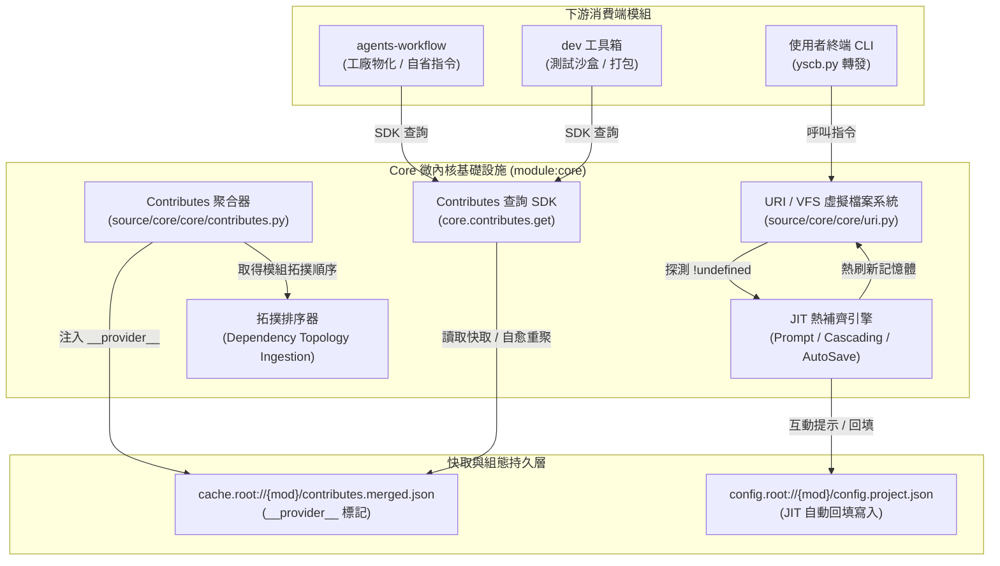
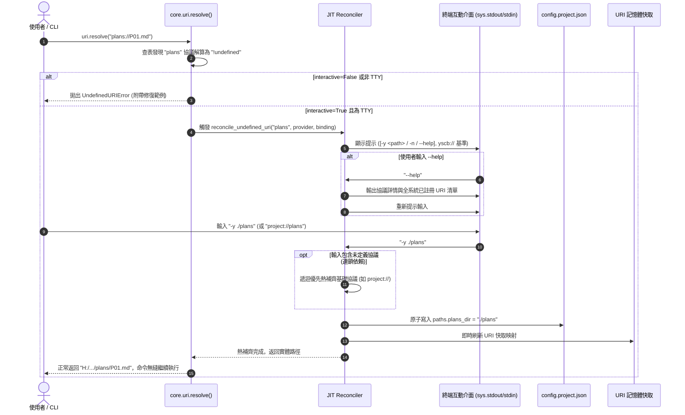
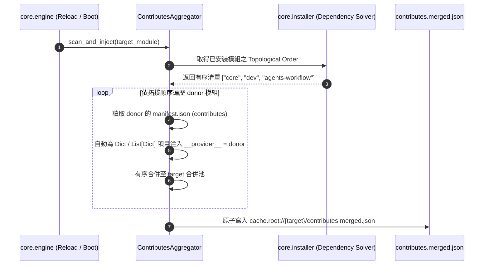

# 架構設計說明書 (Architecture Plan)

> 功能名稱：core contribute 系統優化與路徑系統打磨 (Core Contribute Optimization & URI Polish)  
> 建立日期：2026-08-26  
> 所屬主計畫：[2026_08_25_2200_agents_workflow_migration](../umbrella_overview.md)  
> 依據需求規格：[P01_requirements_spec.md](./P01_requirements_spec.md)  
> 狀態：`Confirmed`  
> 擴充項目：none  
> 模板版本：v1.4  

---

## 1. 系統架構拓撲 (Architecture Topology)

---

## 2. 核心呼叫循序圖 (Sequence Diagrams)

### 2.1 JIT 協議熱補齊與自動持久化循序圖

### 2.2 依賴拓撲搜集與 `__provider__` 注入循序圖

---

## 3. 模組影響盤點 (Impact Inventory)

| 影響檔案 | 變更類型 | 變更核心職責說明 |
| :--- | :---: | :--- |
| `source/core/core/uri.py` | Modify | 實作 `!undefined` 攔截、JIT 互動熱補齊、`--help` 協議清冊展開、連鎖遞迴解算與 `UndefinedURIError`。 |
| `source/core/core/contributes.py` | Modify | 實作 `__provider__` 自動注入、依賴拓撲順序遍歷、`core.contributes.get()` 與 `get_for_current_module()` SDK。 |
| `source/core/core/engine.py` | Modify | 在 Reload Stage 4 串接拓撲排序與 Contributes 聚合。 |
| `source/core/tests/test_contributes.py` | Modify / Add | 測試 `__provider__` 標記、拓撲合併順序與 SDK 查詢 API。 |
| `source/core/tests/test_uri.py` | Modify / Add | 測試 JIT 熱補齊、`--help` 清單展開、非 TTY 異常防護與連鎖未定義解析。 |
| `docs/core/README.md` | Modify | 更新 VFS JIT 熱補齊與 Contributes SDK 使用說明。 |
| `docs/core/DESIGN_NOTES.md` | Modify | 登記 `[DN-CORE-05]`（JIT 協議熱補齊哲學）與 `[DN-CORE-06]`（`__provider__` 追溯性）。 |

---

## 4. 架構決策記錄 (Architecture Decisions)

- **[P02:DR-01] VFS 最底層收斂 JIT 熱補齊**：
  - 將未初始化攔截統一下沉至 `core.uri.resolve()`，上層所有模組與 CLI 自動享有開箱即用的熱更新補齊能力，杜絕各模組重複造輪子。
- **[P02:DR-02] `yscb://` 統一相對路徑基準與語意協議直通**：
  - 熱補齊提示明確以 `yscb://` 為相對起始基準，並原生支援輸入語意協議（如 `project://`），消除路徑歧義並保持零臆測。
- **[P02:DR-03] `__provider__` 隱式自動注入與非破壞性**：
  - 微內核在搜集階段自動補齊來源模組標籤，對業務無感且不覆蓋顯式指定值，使所有聚合配置具備 100% 來源可追溯性。
