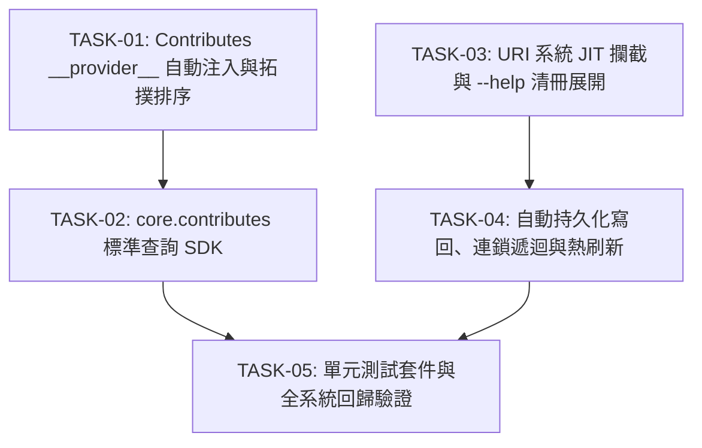

# API 規格說明書 (API Specification)

> 功能名稱：core contribute 系統優化與路徑系統打磨 (Core Contribute Optimization & URI Polish)  
> 建立日期：2026-08-26  
> 所屬主計畫：[2026_08_25_2200_agents_workflow_migration](../umbrella_overview.md)  
> 依據架構設計：[P02_architecture_plan.md](./P02_architecture_plan.md)  
> 狀態：`Confirmed`  
> 擴充項目：none  
> 模板版本：v1.4  

---

## 1. 公開介面與函式簽名 (Public API Signatures)

### 1.1 URI 系統 JIT 攔截與熱補齊介面 (`source/core/core/uri.py`)

```python
class UndefinedURIError(ValueError):
    """當語意協議未設定 (!undefined) 且處於非互動環境或拒絕補齊時拋出之結構化異常。"""
    def __init__(self, scheme: str, provider: Optional[str] = None, binding: Optional[str] = None, message: Optional[str] = None):
        ...

def resolve(path_or_uri: str, interactive: bool = True) -> str:
    """
    將語意 URI 解析為本機實體絕對路徑。
    
    參數:
      - path_or_uri: 語意 URI (例: 'plans://P01.md') 或實體路徑。
      - interactive: 是否允許在檢測到 !undefined 且處於 TTY 終端時觸發 JIT 互動熱補齊 (預設 True)。
    
    返回:
      - 解析後之本機實體絕對路徑。
    
    異常:
      - UndefinedURIError: 當協議為 !undefined 且 interactive=False 或非 TTY 時拋出。
      - CyclicURIDependencyError: 檢測到自引用或循環協議死鎖時拋出。
    """
    ...

def reconcile_undefined_uri(
    scheme: str,
    raw_target: str,
    provider: Optional[str] = None,
    config_binding: Optional[str] = None,
    description: Optional[str] = None,
    interactive: bool = True
) -> str:
    """
    執行 !undefined 協議之 JIT 終端互動、輸入解析、寫回設定檔與熱重載。
    
    參數:
      - scheme: 協議名稱 (例: 'plans')
      - raw_target: 原始未定義字串 (例: '!undefined')
      - provider: 提供該協議之模組名稱 (例: 'agents-workflow')
      - config_binding: 在 config.project.json 中之鍵值路徑 (例: 'paths.plans_dir')
      - description: 協議說明文字
      - interactive: 是否互動模式
    
    返回:
      - 熱補齊並寫入後之實體基準路徑。
    """
    ...

def list_registered_schemes_summary() -> List[Dict[str, Any]]:
    """
    列出當前全系統已註冊之所有語意 URI 協議摘要清冊 (供 --help 展開與自省展示)。
    
    返回清單項目結構:
      { "token": "plans", "type": "config", "value": "paths.plans_dir", "provider": "agents-workflow", "resolved_path": "H:/.../plans", "description": "..." }
    """
    ...
```

---

### 1.2 微內核 Contributes 查詢 SDK 與聚合器 (`source/core/core/contributes.py`)

```python
def get(target_module: str, key: Optional[str] = None, default: Any = None) -> Any:
    """
    標準 Contributes 查詢 SDK:
    查詢指定目標模組之已合併 Contributes 字典或特定鍵值。
    
    參數:
      - target_module: 目標接收模組名稱 (例: 'agents-workflow', 'core')
      - key: 特定欄位名稱 (例: 'export', 'insert', 'token', 'commands')。若為 None 則返回全字典。
      - default: 若目標或 key 不存在時之預設返回值。
    
    返回:
      - 已注入 __provider__ 之合併資料物件。
    """
    ...

def get_for_current_module(key: Optional[str] = None, default: Any = None) -> Any:
    """
    根據當前 active module 上下文 (uri.get_module_context()) 自動查詢本模組之 Contributes。
    """
    ...

class ContributesAggregator:
    @staticmethod
    def scan_and_inject(target_module: str, topological_order: Optional[List[str]] = None) -> Dict[str, Any]:
        """
        全量搜集所有 donor 模組對 target_module 貢獻之 contributes，依拓撲排序合併並注入 __provider__。
        
        參數:
          - target_module: 目標模組名稱
          - topological_order: 可選的已安裝模組拓撲順序清單。若為 None 則自動向 installer 取得。
        
        返回:
          - 合併後之完整資料字典，並原子持久化至 cache.root://{target_module}/contributes.merged.json。
        """
        ...
```

---

## 2. 資料結構與 Schema 定義 (Data Structures & Schemas)

### 2.1 `__provider__` 注入後之 Contributes 結構
```json
{
  "export": [
    {
      "type": "template",
      "source": "module.root://agents-workflow/assets/templates/P01_requirements_spec.md",
      "description": "Phase 1 需求規格模板",
      "__provider__": "agents-workflow"
    }
  ],
  "token": [
    {
      "value": "PHASEXX_STANDARD_HEADER",
      "description": "P01~P07 模板共通標準標頭注入錨點",
      "__provider__": "agents-workflow"
    }
  ],
  "insert": [
    {
      "type": "uri",
      "token": "PHASEXX_STANDARD_HEADER",
      "value": "module.root://agents-workflow/assets/templates/header.md",
      "mode": "replace",
      "__provider__": "agents-workflow"
    }
  ]
}
```

### 2.2 URI 協議註冊 Schema（天然支援 Config Binding）
```json
{
  "token": "plans",
  "type": "config",
  "value": "paths.plans_dir",
  "description": "指向專案活躍開發計畫目錄"
}
```

---

## 3. 錯誤處理與狀態碼 (Error Handling & Exit Codes)

| 異常類別 / 情境 | 觸發條件 | 處理與防禦行為 | 退出代碼 / 行為 |
| :--- | :--- | :--- | :---: |
| `UndefinedURIError` | 協議為 `!undefined` 且非互動模式 | 拋出異常並印出指引訊息 | 拋出 Python Exception |
| `CyclicURIDependencyError` | 使用者設定自引用或循環協議 | 立即阻斷遞迴並拋出異常 | 拋出 Python Exception |
| 使用者輸入 `-n` | 終端互動熱補齊時輸入 `-n` | 印出取消提示並優雅退出 | `sys.exit(1)` |
| Manifest 損毀 | donor JSON 語法錯誤 | 印出警告並跳過該 donor | 略過該 donor 繼續聚合 |

---

## 4. 實作任務依賴拓撲 (Implementation Task Topology)


