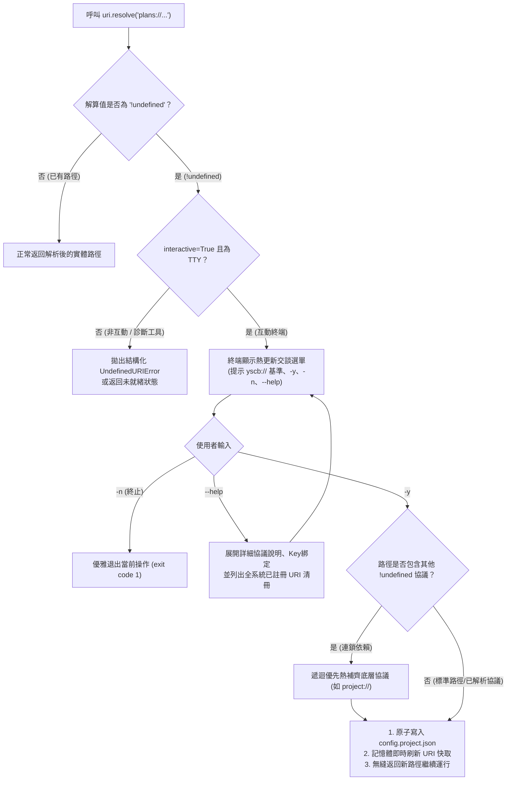

# 技術調研報告 (Research Report)

> 報告編號：R01  
> 調研主題：core contribute 依賴注入系統優化與語意路徑打磨  
> 建立日期：2026-08-26  
> 所屬計畫：[sub_02_core_contribute_optimization_and_uri_polish](./P00_semantic_requirements.md)  
> 調研狀態：`In Progress`  
> 模板版本：v1.4  

---

## 1. 調研背景與核心問題 (Background & Core Problem)

在 `sub_01` 實作 `agents-workflow` 的協議產物工廠化過程中，模組深度依賴微內核 `core` 的 **Contribute 依賴注入系統** 與 **語意 URI 路徑系統**。

### 1.1 現行 Contribute 系統現狀梳理 (`source/core/core/contributes.py`)
現行 `ContributesAggregator.scan_and_inject()` 支援 5 大來源聚合：
1. `module://manifest.json` ➔ `contributes`
2. `module://contributes.{target}.json`
3. `config://config.project.json`
4. `config://contributes.{target}.json`
5. `config://config.local.json`
並將合併結果快照持久化至 `cache.root://{target}/contributes.merged.json`。

### 1.2 潛在痛點與待優化維度
1. **拓撲依賴順序性**：目前的 `_deep_merge` 為單純的字典與列表追加，若模組間存在依賴拓撲關係（Dependency Topology），如何保證基礎模組的注入優先於上層模組？
2. **列表合併語意**：現行列表合併為 `base[k].extend(x for x in v if x not in base[k])`，對於需要精確有序插入（如 `above`/`below` 或權重排序）或去重判定時，如何提供更強大的語意支援？
3. **動態查詢 API 與開發者自省**：目前外部模組需要自行定位讀取 `contributes.merged.json` 或掃描 Manifest，是否應由 `core` 提供標準的 SDK 查詢介面（例如 `core.contributes.get(target, key)`）？
4. **型別校驗與防禦**：若 donor 模組提供了格式錯誤的 JSON，如何精確定位錯誤來源模組並提供防護？

---

---

## 2. 依賴注入來源自動標記機制 (`__provider__` Invariant Tagging)

### 2.1 背景與核心痛點
在多模組協同生態中，多個 donor 模組會向同一 target 貢獻 contributes 資產（如 `export`, `insert`, `token`, `commands`, `uri_schemes` 等）。
- **痛點**：在現行微內核 `scan_and_inject()` 聚合後，合併於 `contributes.merged.json` 的資料項失去了「**由誰貢獻**」的來源脈絡。接收端模組（如 `agents-workflow`）在執行自省查詢（CLI `tokens` / `list`）或錯誤排查時，無法直接獲知特定配置項的發起者。

### 2.2 規格設計：自動注入 `__provider__`

在微內核 `ContributesAggregator` 的自動搜集階段（Collection Pass），針對每個 donor 模組提供的 contributes 物件：
1. **物件層級自動標記**：
   - 若貢獻內容為字典（`dict`），自動注入欄位：`"__provider__": donor_module_name`。
   - 若貢獻內容為列表中的字典項目（`list[dict]`，如 `export`, `insert`, `token` 清單中的每一筆宣告），自動為該字典項目注入：`"__provider__": donor_module_name`。
2. **非破壞性與優先級**：
   - 僅在該物件尚未顯式宣告 `__provider__` 時由引擎自動補齊，不覆蓋顯式指定值。
   - 標記採用雙底線命名 `__provider__`，確保與業務欄位無衝突。

### 2.3 範例：聚合後的 `contributes.merged.json`

```json
{
  "token": [
    {
      "value": "PHASEXX_STANDARD_HEADER",
      "description": "P01~P07 模板共通標準標頭注入錨點",
      "__provider__": "agents-workflow"
    },
    {
      "value": "MY_CUSTOM_TOKEN",
      "description": "來自擴充插件的自定義錨點",
      "__provider__": "my-custom-plugin"
    }
  ]
}
```

---

## 3. 拓撲依賴聚合排序與微內核 Contribute 查詢 SDK (Topological Order & SDK)

基於開發者裁決，落實 1.2 痛點中的 (1.) 拓撲依賴順序性 與 (3.) 微內核標準查詢 SDK：

---

### 3.1 拓撲依賴聚合排序 (Topological Ingestion Order)

在微內核 `ContributesAggregator.scan_and_inject()` 搜集各 donor 模組時：
- **現行問題**：使用無序的 `uri.listdir("module.root://")`，造成基礎模組與擴充模組在清單合併時先後順序不穩定。
- **優化規格**：
  1. 向微內核依賴解析器（`core.installer` / `core.engine` 之 `act_solve_dependencies` 拓撲結果）取得所有已安裝模組的**依賴拓撲順序 (Topological Dependency Order)**（例：`["core", "dev", "agents-workflow", "my-plugin"]`）。
  2. 聚合引擎嚴格按照此拓撲順序遍歷 donor 模組。
  3. 保證基礎模組導出的資產或注入優先被註冊，上層擴充模組後續追加，實現 100% 確定性 (Deterministic Merge)。

---

### 3.2 微內核標準 Contribute 查詢 SDK (`core.contributes`)

在 `core` 模組中建立對外公開的標準高階查詢介面：

```python
# ── source/core/core/contributes.py ───────────────────────────────────────

def get(target_module: str, key: Optional[str] = None, default: Any = None) -> Any:
    """
    查詢指定目標模組之已合併 Contributes 資料：
    1. 優先從 cache.root://{target_module}/contributes.merged.json 讀取。
    2. 若快取不存在或損毀，自動調用 scan_and_inject() 進行即時自愈聚合。
    3. 若指定 key 則返回該特定欄位（如 "export", "insert", "token", "commands"），否則返回全字典。
    """
    ...

def get_for_current_module(key: Optional[str] = None, default: Any = None) -> Any:
    """
    自動根據當前 active module 上下文 (uri.get_module_context()) 查詢本模組之 Contributes。
    """
    ...
```

- **效益**：
  - 徹底消除各模組（如 `agents-workflow`、`dev`）自行拼湊快取路徑與重複撰寫讀取 fallback 代碼的冗餘。
  - 下游模組僅需一行：`from core import contributes; data = contributes.get("agents-workflow")`。

---

## 4. `!undefined` 語意協議及時熱補齊機制 (JIT URI Hot-Reconciliation Engine)

### 4.1 背景與設計哲學
本專案堅持「**零臆測 (Zero Speculation)**」原則，所有專案層級的路徑設定（如 `core` 中的 `project://`，以及 `agents-workflow` 中的 `plans://`, `sop_ext://`, `docs://`, `archive://` 等），在預設範本中**剛性必須標記為 `!undefined`**。

在現行 `core` 的 URI 註冊 Schema 中，配置型協議已天然具備 Key 綁定語意：
```json
{
  "token": "plans",
  "type": "config",
  "value": "paths.plans_dir",
  "description": "指向專案活躍開發計畫目錄"
}
```
結合搜集階段自動標記之 `__provider__`，微內核可 100% 精準定位其所屬模組、目標設定檔（`config.root://{__provider__}/config.project.json`）與目標巢狀欄位（`paths.plans_dir`）。

---

### 4.2 核心規格設計：`uri.resolve()` 及時攔截與熱補齊流程

當 `core.uri.resolve(uri_str)` 檢測到目標 URI 協議之解算值為 `!undefined`（或以 `!undefined` 開頭）時，觸發 **JIT 及時熱補齊引擎**：



#### 1. 終端提示交互規格 (Interactive Prompt)
在終端標準輸出呈現提示，**明確標示相對路徑起始基準為 `yscb://`**：
```text
[agents-workflow] 語意協議 'plans://' 尚未設定 (當前為 !undefined)。
  • 說明: 指向專案活躍開發計畫目錄
  • 目標設定檔: config://agents-workflow/config.project.json (paths.plans_dir)
  • 路徑基準: 相對路徑一律以 'yscb://' (工具庫根目錄) 為起始，支援 '../' 穿透或直接輸入語意協議格式 (例: project://plans)

是否進行及時熱更新補齊?
  -y <path> : 設定路徑、自動更新設定檔並繼續運行
  -n        : 終止當前操作
  --help    : 展開詳細協議資訊與全系統可用協議清單
請輸入 [-y <path> / -n / --help]: 
```

#### 2. `--help` 展開行為
當使用者輸入 `--help` 時：
- 展開目標協議的詳細資訊（Token、Type、Key 綁定、說明）。
- **即時列出全系統當前已註冊之所有可用 URI 協議清冊**（Token、當前解析路徑、說明），方便使用者選用協議進行複合組合。
- 顯示完畢後重新回到輸入提示。

#### 3. 路徑解算、連鎖依賴與自引用防護
- **路徑解算**：使用者可輸入相對路徑（以 `yscb://` 為基準展開）、絕對路徑（如 `D:/plans`）或複合語意協議（如 `project://plans`）。
- **連鎖未定義依賴 (Cascading Undefined)**：若使用者輸入 `project://plans`，但 `project://` 自身也是 `!undefined`，引擎自動先遞迴發起 `project://` 的熱補齊，補齊後再順暢完成 `plans://` 的寫入。
- **自引用死鎖防護 (Self-Referencing Cycle Guard)**：微內核維護 `_reconciling_tokens` 集合，若檢測到自引用協議（如 `foo://` 指向 `foo://foo`）或循環依賴，立即阻斷並報錯，防止無窮遞迴。
- **自動持久化與熱重載**：
  1. 定位 `config.root://{__provider__}/config.project.json`。
  2. 將解析/輸入之路徑原子寫入對應鍵值。
  3. 記憶體立即刷新 URI 映射快取。
  4. `uri.resolve()` 無縫返回正確路徑，當前命令繼續執行。

#### 4. 靜態診斷與非 TTY 防護
- `uri.resolve(path_or_uri, interactive=True)`：
  - 當 `interactive=False`（例如在 `uri check` 靜態診斷、合規掃描工具）或處於非 TTY 環境時，不彈出 prompt。
  - 直接拋出標準 `UndefinedURIError`（繼承自 `ValueError`），並附帶詳細修復建議。

---

## 5. R01 調研結論與 sub_02 落地規格總結 (Synthesis)

1. **`[P00:DR-01]` 依賴注入來源標記 (`__provider__`)**：
   - 搜集階段自動為 Dict 與 List[Dict] 項目注入 `"__provider__": donor_module_name`，保證 100% 來源可追溯。
2. **`[P00:DR-02]` 拓撲依賴聚合排序**：
   - 聚合引擎嚴格按模組依賴拓撲順序遍歷 donor 模組，保證 100% 確定性合併。
3. **`[P00:DR-03]` 微內核標準查詢 SDK (`core.contributes`)**：
   - 提供 `core.contributes.get(target_module, key=None, default=None)` 與 `get_for_current_module()` 高階查詢介面。
4. **`[P00:DR-04]` `!undefined` 語意協議 JIT 及時熱補齊引擎**：
   - 在 `uri.resolve()` 中攔截 `!undefined`，互動終端提供 `[-y <path> / -n / --help]` 選單，支援 `yscb://` 基準提示、複合協議輸入、連鎖遞迴補齊與自引用防護，自動原子持久化寫回 `config.project.json` 並記憶體熱重載無縫繼續執行。


