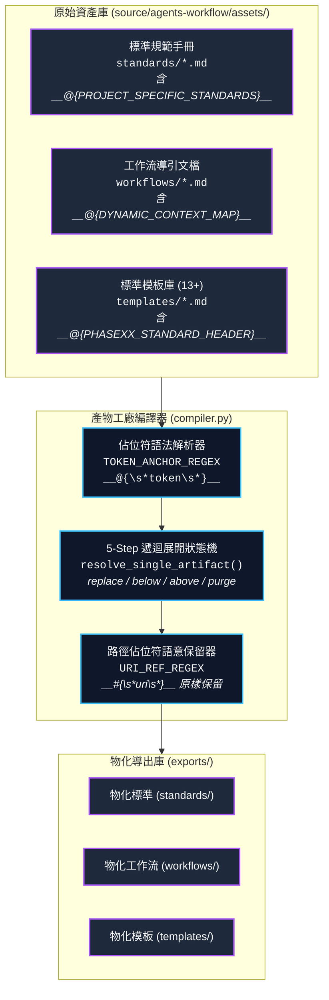
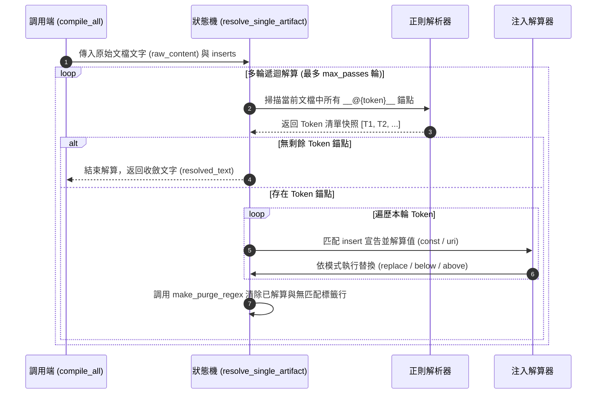

# Phase 2: 架構設計說明書 (Architecture Plan) - workflow 佔位符格式修改

> 計畫名稱：`sub_03_workflow_placeholder_format_migration`  
> 建立日期：2026-08-26  
> 所屬主計畫：[2026_08_25_2200_agents_workflow_migration](../umbrella_overview.md)  
> 依據需求規格：[P01_requirements_spec.md](./P01_requirements_spec.md)  
> 當前狀態：`Confirmed` (Phase 2 架構設計確認完成)  
> 擴充項目：none  
> 模板版本：v1.4  

---

## 1. 架構拓撲與模組互動圖 (System Topology)



---

## 2. 核心正則與狀態機設計 (Engine Design)

### 2.1 佔位符正則表達式引擎
```python
# 1. 插入佔位符 (Token Anchor) 全域掃描正則
TOKEN_ANCHOR_REGEX = re.compile(r"__@\{\s*([A-Za-z0-9_]+)\s*\}__")

# 2. 路徑佔位符 (URI Reference) 全域識別正則
URI_REF_REGEX = re.compile(r"__#\{\s*([^}]+)\s*\}__")

# 3. 指定 Token 標籤替換正則工廠
def make_token_tag_regex(token_name: str) -> re.Pattern:
    return re.compile(r"__@\{\s*" + re.escape(token_name) + r"\s*\}__")

# 4. 殘留標籤行完整抹除正則工廠 (含行首縮排與換行)
def make_purge_regex(token_name: str) -> re.Pattern:
    return re.compile(r"([ \t]*__@\{\s*" + re.escape(token_name) + r"\s*\}__[ \t]*\r?\n?)")
```

### 2.2 5-Step 狀態機多輪解算時序圖 (Sequence Diagram)



---

## 3. 架構決策記錄 (Architecture Decision Records)

### [P02:DR-01] 佔位符可視化字元集選型
- **決策**：採用 `__@{token}__` 代表「主動注入點 (At-injection)」，`__#{uri}__` 代表「被動路徑引用 (Hash-reference)」。
- **理由**：
  1. 雙底線 `__` 與大括號 `{}` 提供極高的視覺識別度，且在 Markdown、代碼區塊與註解中均不易產生語法衝突。
  2. `@` 與 `#` 語意鮮明：`@` 代表定點注入目標，`#` 代表路徑位址錨點。

### [P02:DR-02] 殘留錨點行乾淨抹除策略
- **決策**：抹除正則包含可選之行首空白 `[ \t]*` 與行尾換行符 `\r?\n?`。
- **理由**：確保錨點標籤在被抹除或無匹配被清除後，文檔中不會殘留多餘的空行或孤立空格，維持產物排版純淨。

---

## 4. 模組變更與衝擊清單 (Impact Inventory)

| 檔案路徑 | 衝擊性質 | 變更細節說明 |
| :--- | :---: | :--- |
| `source/agents-workflow/agents_workflow/compiler.py` | 核心修改 | 更新正則表達式、5-Step 狀態機標籤匹配與抹除邏輯，移除舊 HTML 註解格式。 |
| `source/agents-workflow/assets/standards/DevelopmentStandards.md` | 資產修改 | 將 `<!-- __PROJECT_SPECIFIC_STANDARDS__ -->` 替換為 `__@{PROJECT_SPECIFIC_STANDARDS}__`。 |
| `source/agents-workflow/assets/workflows/ContextInit.md` | 資產修改 | 將 `<!-- __DYNAMIC_CONTEXT_MAP__ -->` 替換為 `__@{DYNAMIC_CONTEXT_MAP}__`。 |
| `source/agents-workflow/assets/templates/P01~P07.md` (7 檔) | 資產修改 | 將 `<!-- __PHASEXX_STANDARD_HEADER__ -->` 替換為 `__@{PHASEXX_STANDARD_HEADER}__`。 |
| `source/agents-workflow/tests/test_compiler.py` | 測試修改 | 更新單元測試以覆蓋新佔位符語法、空白容錯、路徑佔位符語意保留與自指防護。 |

---

## 5. 當前階段確認狀態

- **當前狀態**：`Draft` (Phase 2 架構設計草擬完成)  
- **推進關卡**：請開發者審查本架構設計說明書，若確認無誤，請明確指示「**確認無誤，推進至 Phase 3**」！
