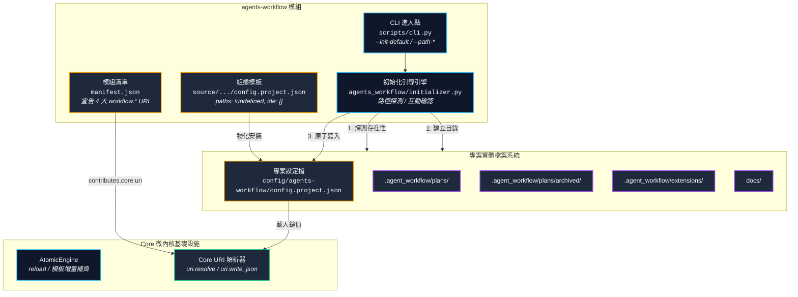
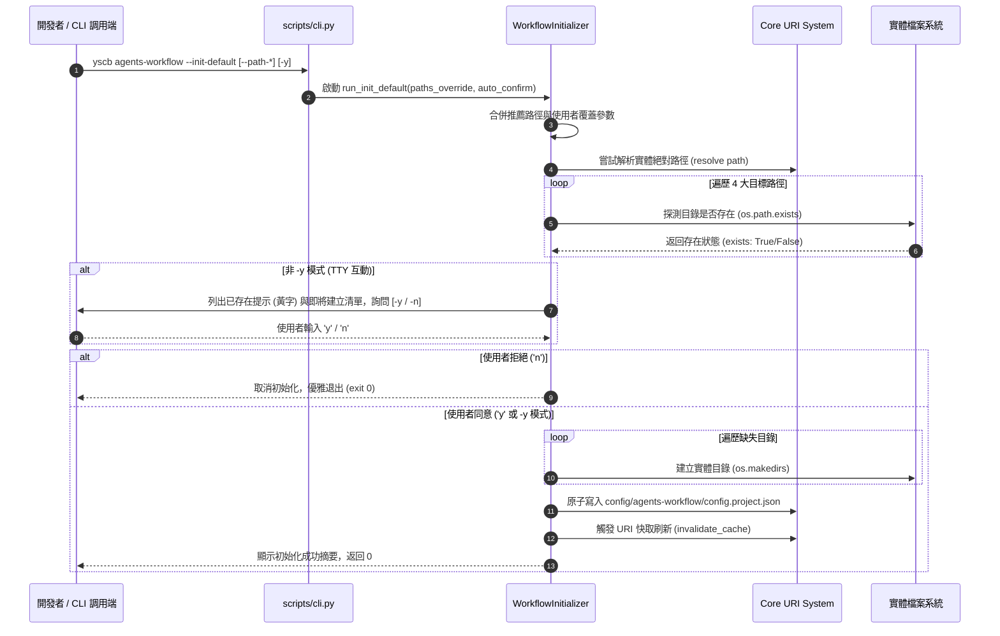

# Phase 2: 架構設計說明書 (Architecture Plan) - agents-workflow 配置治理與一鍵初始化

> 計畫名稱：`sub_04_agents_workflow_injection_config_and_init_default`  
> 建立日期：2026-08-26  
> 所屬主計畫：[2026_08_25_2200_agents_workflow_migration](../umbrella_overview.md)  
> 依據需求規格：[P01_requirements_spec.md](./P01_requirements_spec.md)  
> 當前狀態：`Confirmed` (Phase 2 架構設計確認完成)  
> 擴充項目：none  
> 模板版本：v1.4  

---

## 1. 架構拓撲與模組互動圖 (System Topology)

---

## 2. 核心架構與時序設計 (Sequence Design)

### 2.1 `--init-default` 互動式初始化時序圖 (Sequence Diagram)

---

## 3. 架構決策記錄 (Architecture Decision Records)

### [P02:DR-01] 4 大 Workflow URI 命名空間標準化
- **決策**：協議採用 `workflow.plans://`、`workflow.archived://`、`workflow.ext://`、`workflow.docs://`。
- **理由**：
  1. 統一以 `workflow.*` 命名空間前綴，避免與 Core 的基礎協議（如 `plans://`、`docs://`）產生語意衝突。
  2. 允許未來 Core 基礎協議透過別名或直接轉發指向 `workflow.*`。

### [P02:DR-02] 推薦路徑與靜態組態模板徹底解耦
- **決策**：
  - `config.project.json` 模板中預設值剛性為 `"!undefined"`。
  - `"project://.agent_workflow/plans"` 等推薦路徑硬編碼於 `WorkflowInitializer.DEFAULT_RECOMMENDED_PATHS` 常數中，僅由 CLI 指令攜帶。
- **理由**：貫徹微內核 DN-01 / DN-06 零臆測鐵律，靜態模板不預設任何專案特定路徑，由使用者顯式初始化或手動配置。

---

## 4. 模組變更與衝擊清單 (Impact Inventory)

| 檔案路徑 | 衝擊性質 | 變更細節說明 |
| :--- | :---: | :--- |
| `source/agents-workflow/manifest.json` | 配置新增 | 在 `contributes.core.uri` 中註冊 4 大 `workflow.*` 協議。 |
| `source/agents-workflow/config.project.json` | 新增檔案 | 新增專案級組態模板，`paths` 均為 `"!undefined"`，包含 `ide: []` 等保留欄位。 |
| `source/agents-workflow/agents_workflow/initializer.py` | 新增檔案 | 封裝 `WorkflowInitializer` 類別，實作路徑探測、提示、目錄建立與原子寫入。 |
| `source/agents-workflow/scripts/cli.py` | 核心修改 | 擴充命令解析器，支援 `--init-default` 與 `--path-*` 參數調度。 |
| `source/agents-workflow/tests/test_initializer.py` | 新增檔案 | 覆蓋 `--init-default` 互動/非互動初始化、已存在路徑提醒與參數覆蓋單元測試。 |

---

## 5. 當前階段確認狀態

- **當前狀態**：`Draft` (Phase 2 架構設計草擬完成)  
- **推進關卡**：請開發者審查本架構設計說明書，若確認無誤，請明確指示「**確認無誤，推進至 Phase 3**」！
