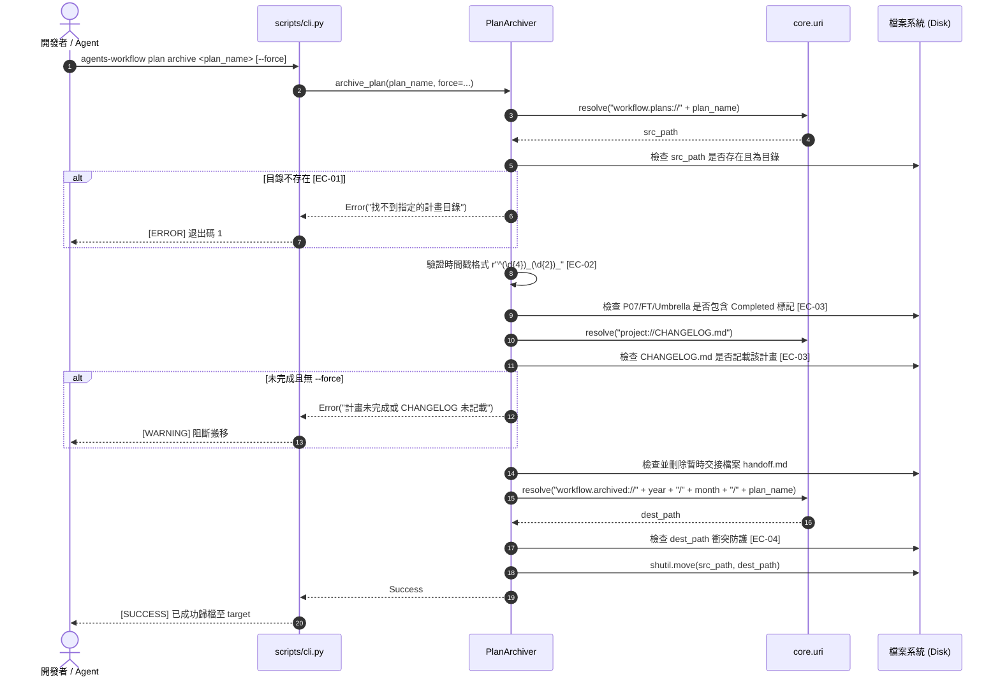
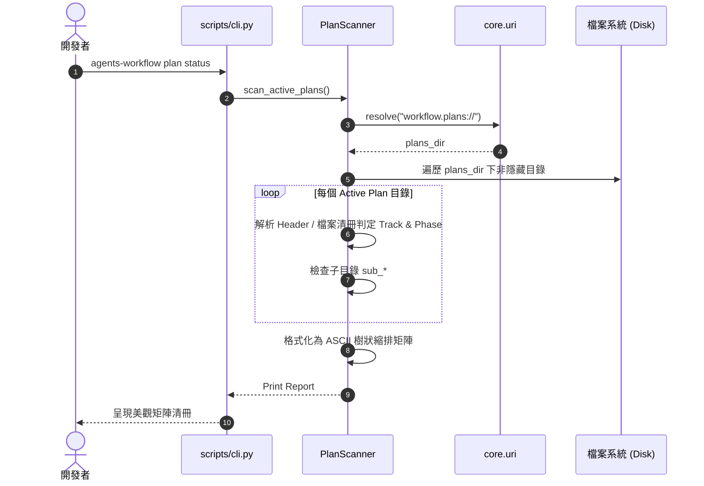

# 架構設計說明書 (Architecture Design)

> 功能名稱：Plans CLI 工具鏈補齊與舊版功能遷移 (Plans CLI Toolchain Migration)  
> 建立日期：2026-08-26  
> 所屬主計畫：[agents-workflow 模組全面遷移與升級 (2026_08_25_2200_agents_workflow_migration)](../umbrella_overview.md)  
> 狀態：Confirmed  
> 依據 P01：[P01_requirements_spec.md](./P01_requirements_spec.md)  
> 模板版本：v1.2  

---

## 1. 模組架構分層與職責邊界 (Layered Architecture)

```text
┌─────────────────────────────────────────────────────────────────────────────┐
│ 1. 表現層 (CLI Routing Layer) - scripts/cli.py                              │
│    • agents-workflow plan <action> [options]                                │
│    • 支援子命令：archive, status, search, verify                           │
│    • 支援平鋪別名：plan-archive, plan-status, plan-search, plan-verify      │
└──────────────────────────────────────┬──────────────────────────────────────┘
                                       │
                                       ▼
┌─────────────────────────────────────────────────────────────────────────────┐
│ 2. 應用服務層 (Plans Application Services) - agents_workflow/plans/         │
│    ┌───────────────────────────┐     ┌────────────────────────────────┐     │
│    │ PlanArchiver (archiver.py)│     │ PlanScanner (scanner.py)       │     │
│    │ • 4 重安全守門檢查        │     │ • 4 大 Track 與 Phase 識別     │     │
│    │ • 清理 handoff.md         │     │ • ASCII 狀態矩陣清冊輸出       │     │
│    │ • 時間戳分流安全搬移      │     │ • 專注掃描進行中 plans://      │     │
│    └─────────────┬─────────────┘     └───────────────┬────────────────┘     │
│                  │                                   │                      │
│    ┌─────────────┴─────────────┐     ┌───────────────┴────────────────┐     │
│    │ PlanSearcher (searcher.py)│     │ PlanVerifier (verifier.py)     │     │
│    │ • DR 結構化正則提取去重   │     │ • 指引註解殘留檢測 (GUIDANCE)  │     │
│    │ • 跨目錄全文程式碼片段檢索│     │ • Blockquote Header 元數據稽核 │     │
│    └─────────────┬─────────────┘     └───────────────┬────────────────┘     │
└──────────────────┼───────────────────────────────────┼──────────────────────┘
                   │                                   │
                   └─────────────────┬─────────────────┘
                                     ▼
┌─────────────────────────────────────────────────────────────────────────────┐
│ 3. 核心基礎設施層 (Core Infrastructure & Semantic URI Layer)                │
│    • core.uri: resolve()                                                    │
│      - workflow.plans://   -> 進行中計畫目錄                                │
│      - workflow.archived://-> 歷史歸檔目錄 (YYYY/MM/)                       │
│      - project://          -> 專案根目錄 (CHANGELOG.md)                     │
└─────────────────────────────────────────────────────────────────────────────┘
```

---

## 2. 核心資料流與循序圖 (Data Flow & Sequence Diagram)

### 2.1 `plan archive` 安全歸檔循序圖



### 2.2 `plan status` 狀態掃描循序圖



---

## 3. 受影響檔案與新建檔案清單 (Impacted & New Files Inventory)

| 檔案路徑 | 類型 | 職責與變更說明 |
| :--- | :---: | :--- |
| `source/agents-workflow/agents_workflow/plans/__init__.py` | `New` | Plans 子套件進入點，導出 `PlanArchiver`, `PlanScanner`, `PlanSearcher`, `PlanVerifier` |
| `source/agents-workflow/agents_workflow/plans/archiver.py` | `New` | 實作 `PlanArchiver`，負責 4 重安全守門檢查、交接清理與時間戳目錄歸檔 |
| `source/agents-workflow/agents_workflow/plans/scanner.py` | `New` | 實作 `PlanScanner`，負責 4 大 Track 與 Phase 狀態解析及 ASCII 樹狀矩陣渲染 |
| `source/agents-workflow/agents_workflow/plans/searcher.py` | `New` | 實作 `PlanSearcher`，負責 DR 結構化正則提取去重與跨計畫全文程式碼片段檢索 |
| `source/agents-workflow/agents_workflow/plans/verifier.py` | `New` | 實作 `PlanVerifier`，負責模板指引註解殘留檢測與 Header 元數據規範稽核 |
| `source/agents-workflow/scripts/cli.py` | `Modify` | 擴充 `plan` 子命令路由（`archive`, `status`, `search`, `verify`）與平鋪別名支援 |
| `test/test_agents_workflow_plans_toolchain.py` | `New` | 專用單元與整合測試套件，涵蓋 FT-01~04 與 ET-01~06 |

---

## 4. 架構決策記錄 (Architecture Decision Records)

- **[P02:DR-01] 子套件職責解耦 (Single Responsibility Principle)**：將 4 大功能分別封裝為獨立類別（`PlanArchiver`, `PlanScanner`, `PlanSearcher`, `PlanVerifier`），各類別提供乾淨的 Python API 介面（接收可選路徑與參數），便於單元測試與 CLI 調用。
- **[P02:DR-02] 語意 URI 動態求解標準 (Semantic URI Resolution)**：所有類別預設透過 `core.uri.resolve` 求解目錄，若無 core 上下文或測試隔離環境時，提供可選的 `plans_dir`、`archive_dir`、`project_root` 參數注入，達成完美測試隔離性。
- **[P02:DR-03] 正則健壯性與多樣 Header 相容 (Robust Header Parsing)**：`PlanScanner` 與 `PlanVerifier` 支援相容中文全形冒號 `：` 與半形冒號 `:`，並容忍大小寫與空白。
- **[P02:DR-04] DR 去重與排序規則 (Decision Records Deduplication)**：`PlanSearcher` 在 `--dr` 模式下以 `(plan_name, dr_id)` 為去重鍵，依計畫時間戳降序排列，確保最新決策優先可見。
