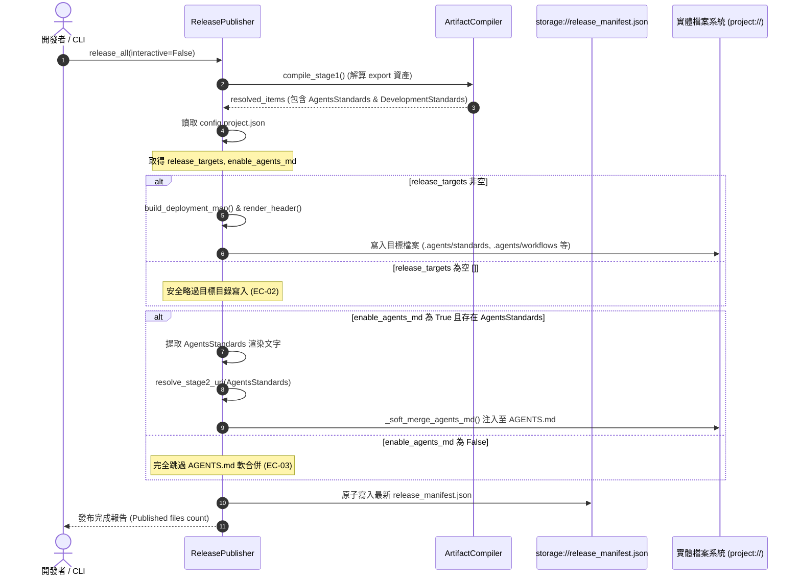

# 架構設計說明書 (Architecture Design)

> 功能名稱：開發標準規範與流程分離重構及 Contributes 文檔建立 (Standards & Workflow Separation & Contributes Doc)  
> 建立日期：2026-08-26  
> 所屬主計畫：[agents-workflow 模組全面遷移與升級 (2026_08_25_2200_agents_workflow_migration)](../umbrella_overview.md)  
> 狀態：Confirmed  
> 模板版本：v1.2  

---

## 1. 模組架構分層與職責邊界 (Layered Architecture)

```text
+---------------------------------------------------------------------------------------+
|                             agents-workflow 模組資產與發布體系                        |
+---------------------------------------------------------------------------------------+
  |
  +---> 1. 資產層 (Assets Layer: source/agents-workflow/assets/)
  |       |-- standards/AgentsStandards.md        [NEW] (通用核心原則與防呆紀律)
  |       |-- standards/DevelopmentStandards.md   [MOD] (工作目錄/ID追溯鏈/分流/SOP 0~7 流程)
  |       \-- workflows/NewPlan.md               [REF] (載入完整 DevelopmentStandards)
  |
  +---> 2. 宣告層 (Contributes Layer: manifest.json & config.project.json)
  |       |-- manifest.json                      [MOD] (註冊 AgentsStandards export & Token)
  |       |-- config.project.json                [MOD] (release_targets 預設值調整為 [])
  |       \-- contributes.format.md              [NEW] (官方 Contributes 規格格式手冊)
  |
  +---> 3. 發布與渲染層 (Publisher Layer: ReleasePublisher)
          |-- _soft_merge_agents_md()            [MOD] (提取 AgentsStandards 注入 AGENTS.md)
          |-- enable_agents_md 開關守門          [MOD] (false 時完全跳過 AGENTS.md 維護)
          \-- release_targets 拓撲映射與發布     [MOD] (空清單安全略過，輸出 0 files)
+---------------------------------------------------------------------------------------+
```

---

## 2. 核心資料流與循序圖 (Data Flow & Sequence Diagram)



---

## 3. 受影響檔案與新建檔案清單 (Impacted & New Files Inventory)

| 檔案路徑 | 類型 | 職責與變更說明 |
| :--- | :---: | :--- |
| `source/agents-workflow/assets/standards/AgentsStandards.md` | **New** | 存放 Agent 必須強制遵守的「1. 核心原則與防呆紀律 (Core Principles & Guardrails)」，作為注入至 `AGENTS.md` 的極簡核心標準。 |
| `source/agents-workflow/assets/standards/DevelopmentStandards.md` | **Modify** | 移除「核心原則與防呆紀律」後保留「工作目錄規範、ID 追溯鏈、模板尋址指針、三大分流矩陣、SOP 0~7 流程、Fast Track 敏捷流程」。 |
| `source/agents-workflow/contributes.format.md` | **New** | 官方 Contributes 規格手冊，詳述 `core.uri_schemes`、`export`、`token`、`insert`、`release_target` 之宣告規範與欄位型別。 |
| `source/agents-workflow/manifest.json` | **Modify** | `export` 清單新增 `AgentsStandards.md`；`insert` 清單新增 `AGENTS_STANDARDS` Token 宣告。 |
| `source/agents-workflow/config.project.json` | **Modify** | 將 `"release_targets"` 預設值由 `["antigravity"]` 改為 `[]`。 |
| `source/agents-workflow/agents_workflow/publisher.py` | **Modify** | 1. 調整 `_soft_merge_agents_md` 提取 `AgentsStandards`。<br/>2. 落實 `enable_agents_md: false` 跳過邏輯。<br/>3. 支援 `release_targets: []` 安全發布。 |
| `source/agents-workflow/tests/test_publisher.py` | **Modify** | 擴充測試覆蓋 `AgentsStandards` 軟合併、`enable_agents_md` 開關與空 `release_targets` 發布。 |

---

## 4. 架構決策記錄 (Architecture Decision Records)

- **`[P02:DR-01]` (標準規範 1:1 獨立資產與軟合併對齊)**：
  - `AgentsStandards.md` 成為獨立 `standard` 資產，在 Antigravity release 時亦會生成 `.agents/standards/AgentsStandards.md`。
  - `ReleasePublisher` 在提取內容時以 `AgentsStandards` 為標的，並透過 `compiler.resolve_stage2_uri` 進行 URI 轉譯後軟合併注入至根目錄 `AGENTS.md`。
- **`[P02:DR-02]` (`enable_agents_md` 嚴格守門邊界)**：
  - 當 `enable_agents_md` 為 `False` 時，`ReleasePublisher` 絕不觸碰專案根目錄的 `AGENTS.md`，無論 `release_targets` 是否包含 IDE target。
- **`[P02:DR-03]` (`contributes.format.md` 與 core/dev 一致性架構)**：
  - 格式嚴格比照 `core/contributes.format.md` 與 `dev/contributes.format.md`，採用三級章節體系（概覽、宣告語法、欄位型別表與完整 JSON 範例）。
