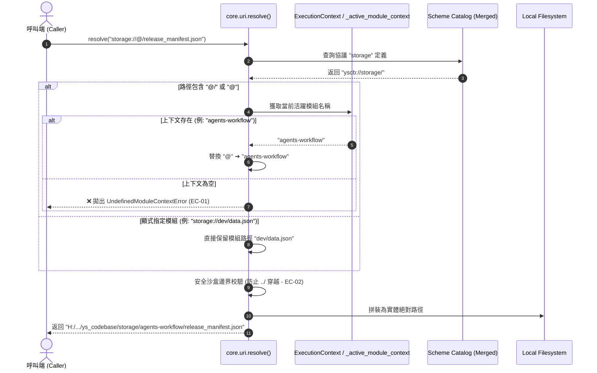
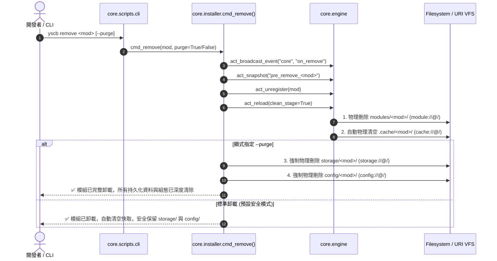

# 架構設計說明書 (Architecture Design)

> 功能名稱：模組資料管理相關 URI 協議釐清與遷移 (Module Data Management URI Protocol Alignment & Migration)  
> 建立日期：2026-08-26  
> 所屬主計畫：[core 與 dev 模組功能打磨 (2026_08_26_1747_core_dev_refinement)](../umbrella_overview.md)  
> 狀態：Confirmed  
> 依據 P01：[P01_requirements_spec.md](./P01_requirements_spec.md)  
> 模板版本：v1.2  

---

## 1. 模組架構分層與職責邊界 (Layered Architecture)

```text
┌─────────────────────────────────────────────────────────────────────────────┐
│ 1. 應用與工作流層 (Applications & Workflow Domain)                           │
│    • agents-workflow / publisher.py   -> 修正發布清冊為 storage://@/release_manifest │
│    • agents-workflow / compiler.py    -> 快取遷移為 cache://@/resolved_contents/    │
├─────────────────────────────────────────────────────────────────────────────┤
│ 2. 開發工具鏈與沙盒層 (Dev Tools & Sandboxing Domain)                        │
│    • dev / testing / sandbox.py       -> 測試沙盒全面遷移至 cache://sandbox/{id}     │
│    • dev / builder, releaser, checker -> 移除 *.root://，全面對齊 Option B 標準協議│
├─────────────────────────────────────────────────────────────────────────────┤
│ 3. 微內核生命週期與狀態治理層 (Microkernel State & Lifecycle Domain)          │
│    • core / engine.py                 -> 互斥鎖 cache://.yscb.lock、--purge 清除機制│
│    • core / installer.py              -> cmd_remove 支援 --purge 參數               │
├─────────────────────────────────────────────────────────────────────────────┤
│ 4. 核心 VFS 語意解算引擎層 (Core URI & VFS Resolver Domain)                  │
│    • core / uri.py                    -> 方案 B 全量 Root 化 + @/ 自省解算引擎      │
│    • core / manifest.json             -> 精簡為 8 個基礎協議 (廢除 *.root 與 temp)  │
└─────────────────────────────────────────────────────────────────────────────┘
```

---

## 2. 核心資料流與循序圖 (Data Flow & Sequence Diagram)

### 2.1 URI 方案 B 解算流程 (`uri.resolve()`)



---

### 2.2 模組卸載生命週期治理 (`remove` vs `remove --purge`)



---

## 3. 受影響檔案與新建檔案清單 (Impacted & New Files Inventory)

| 檔案路徑 | 類型 | 職責與變更說明 |
| :--- | :---: | :--- |
| `source/core/manifest.json` | Modify | 精簡 URI 協議宣告：移除 8 個 `*.root` 與 `temp`，確立 8 大標準協議。 |
| `source/core/core/uri.py` | Modify | 升級 `_BOOTSTRAP_FALLBACK_SCHEMES`，重構 `resolve()` 支援 `@/` 語法引擎、防穿越校驗與舊協議重定向。 |
| `source/core/core/engine.py` | Modify | 互斥鎖改為 `cache://.yscb.lock`，消除硬編碼路徑，落實卸載快取清空與 `--purge` 機制。 |
| `source/core/core/installer.py` | Modify | `cmd_remove` 擴充 `purge: bool = False` 參數與深度清除邏輯。 |
| `source/core/scripts/cli.py` | Modify | CLI 說明與參數解析支援 `--purge`。 |
| `source/dev/manifest.json` | Modify | 移除 `module.source.root` 等 3 個 `.root` 協議宣告。 |
| `source/dev/dev/testing/sandbox.py` | Modify | 測試沙盒路徑全面自 `temp://` 遷移為 `cache://sandbox/`。 |
| `source/dev/dev/testing/case.py` | Modify | 測試 Fixture 沙盒 URI 遷移為 `cache://sandbox/`。 |
| `source/dev/dev/builder.py` | Modify | 移除 `module.build.root://` 等，改用 `module.build://` 與 `module.release://`。 |
| `source/dev/dev/releaser.py` | Modify | 發布來源路徑移除 `.root://`。 |
| `source/dev/dev/checker.py` | Modify | 程式碼檢查路徑移除 `.root://`。 |
| `source/dev/dev/testing/runner.py` | Modify | 測試執行器移除 `.root://`。 |
| `source/agents-workflow/agents_workflow/publisher.py` | Modify | 修正 `MANIFEST_STORAGE_URI` 為 `storage://@/release_manifest.json`，追加歷史遺留目錄自動清理遷移 (EC-05)。 |
| `source/agents-workflow/agents_workflow/compiler.py` | Modify | 消除 `.cache` 硬編碼，改用 `cache://@/resolved_contents/...`。 |
| `source/core/tests/test_uri.py` | Modify | 全面覆蓋方案 B、`@/` 自省、`UndefinedModuleContextError` 與舊協議相容測試。 |
| `source/core/tests/test_installer.py` | Modify | 追加 `--purge` 深度清除與快取自動清空專屬測試。 |
| `source/dev/tests/` | Modify | 更新所有測試案例中的 `temp://` 與 `*.root://` 斷言至新標準協議。 |

---

## 4. 架構決策記錄 (Architecture Decision Records)

- **[P02:DR-01] 方案 B 核心解算演算法形式化**：
  `uri.resolve()` 統一以物理根目錄（`yscb://{dir}/`）為基準；若遇到路徑以 `@/` 或 `@` 開頭，強制綁定 `ExecutionContext` / `_active_module_context` 替換為模組名稱；無上下文時觸發 `UndefinedModuleContextError`。
- **[P02:DR-02] 舊協議向下相容轉譯層 (Deprecation Redirection)**：
  在過渡期間，若遇到包含 `.root` 的舊協議（如 `storage.root://`），解算器自動剥除 `.root` 並發出 `DeprecationWarning`，保證既有工具與外部自定義腳本平滑過渡。
- **[P02:DR-03] `--purge` 深度清理之原子保護**：
  `--purge` 僅針對目標模組專屬之 `storage/{module}/` 與 `config/{module}/` 執行物理銷毀，絕對禁止誤刪全域或其他模組之儲存目錄。
