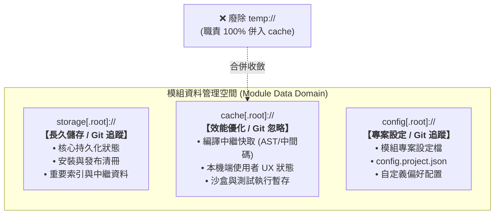
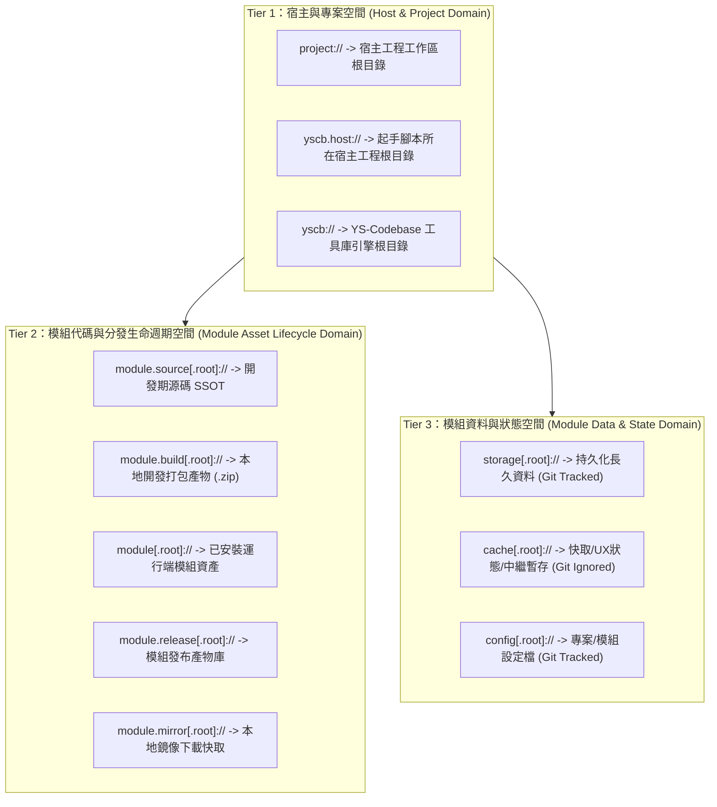

# 技術調研報告：語意空間分布與模組資料協議體系拓撲 (Semantic Space Distribution & Data Schemes)

> 調研主題：模組資料管理相關 URI 協議釐清與遷移 — 語意空間分布 (R01)  
> 建立日期：2026-08-26  
> 所屬主計畫：[core 與 dev 模組功能打磨 (2026_08_26_1747_core_dev_refinement)](../umbrella_overview.md)  
> 調研狀態：Concluded  
> 模板版本：v1.0  

---

## 1. 背景痛點與問題本質 (Problem Statement)

在 YS-Codebase 系統演進中，語意 URI 承載了「消除硬編碼路徑、實現模組自省與路徑解耦」的核心職責。然而，隨著模組數量增加，現有與模組資料管理相關的協議存在四大核心問題：

1. **資料語意與定義邊界不全**：過去對 `storage`、`cache`、`temp` 的定義模糊，缺乏依據「資料生命週期」與「Git 版本控制策略」的清晰邊界。
2. **`temp` 與 `cache` 語意高度重複**：兩者本質皆為「非關鍵、可丟棄、可重建」之本機臨時資料，導致開發者與模組在選用時產生二義性。
3. **Git 追蹤邊界不明確**：哪些資料應隨代碼庫長久提交（Tracked）？哪些資料應被忽略（Ignored）？缺乏統一架構約束。

---

## 2. 模組資料三位一體全新定義 (The Data Scheme Trinity)

根據系統設計原則，正式廢除 `temp` 協議，將模組資料空間精確收斂為**三大正交核心協議**：

### 三大資料協議精確定義與 Git 策略矩陣：

| 協議 Token | 完整定義與職責 | 典型存放內容 | Git 追蹤策略 | 物理路徑映射 |
| :--- | :--- | :--- | :---: | :--- |
| **`storage[.root]://`** | **長久儲存 / 重要狀態資料** 不可隨意刪除，遺失會導致系統或模組狀態斷裂。 | • 模組安裝與相依清冊 • 發布產物清單 (`release_manifest.json`) • 持久化資料庫/索引 | **✅ Git 追蹤** (Tracked) | `yscb://storage/{module}/` `yscb://storage/` |
| **`cache[.root]://`** | **效能優化 / 中繼檔案 / 本機 UX 狀態** 隨時可清空刪除，且必須保證能從源碼或輸入自動重建。 | • 編譯快取、AST 分析快取 • 本機端使用者 UX 狀態 (視窗/選中項/歷史快取) • 沙盒測試環境、單次程序執行暫存 | **🚫 Git 忽略** (Ignored in `.gitignore`) | `yscb://.cache/{module}/` `yscb://.cache/` |
| **`config[.root]://`** | **任何設定檔 (Configuration)** 專案或模組層級的配置宣告與自定義參數。 | • `config.project.json` • 模組自定義組態檔案 | **✅ Git 追蹤** (Tracked) | `yscb://config/{module}/` `yscb://config/` |
| ~~`temp://`~~ | **【已廢除】** 與 `cache` 語意重複。 | 沙盒臨時目錄、測試環境 ➔ 改用 `cache://sandbox/` 或 `cache://.temp/` | 🚫 廢除 | 物理目錄 `.temp/` 由 `.cache/` 完全取代 |

---

## 3. 全局語意空間正交三層模型 (3-Tier Semantic Space Model)

結合上述模組資料全新定義，整體系統 URI 拓撲完整定調如下：

---

## 4. R01 調研結論與後續執行指引

1. **資料協議三位一體定稿**：確立 `storage` (長久/Git)、`cache` (快取/UX/忽略)、`config` (設定檔) 為模組資料讀寫的唯一標準協議。
2. **`temp` 廢除流水線**：
   - 在 `core/manifest.json` 與 `core/uri.py` 中移除 `temp` 協議宣告。
   - 將現有代碼中所有指向 `temp://` 的邏輯（如沙盒執行目錄、測試暫存）全面遷移至 `cache://` 或 `cache.root://`。
   - 物理目錄收斂：移除 `yscb://.temp/`，統一收斂至 `yscb://.cache/`。
3. **推進 R02 調研**：
   - 確立空間分布與協議定義後，下一步進入 **`R02`**，攻堅解決 `storage://` vs `storage.root://` 與 `module://` vs `module.root://` 之上下文隱式綁定與二義性問題！
