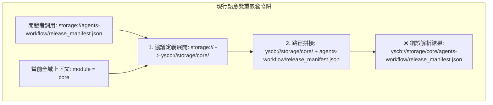
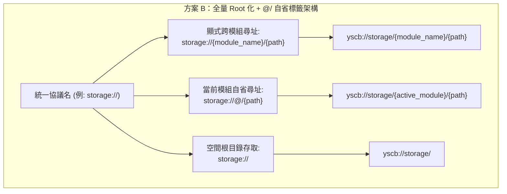

# 技術調研報告：上下文隱式綁定 vs. 顯式跨模組尋址二義性 (Module Context Ambiguity & Syntax Normalisation)

> 調研主題：模組資料管理相關 URI 協議釐清與遷移 — 上下文二義性 (R02)  
> 建立日期：2026-08-26  
> 所屬主計畫：[core 與 dev 模組功能打磨 (2026_08_26_1747_core_dev_refinement)](../umbrella_overview.md)  
> 調研狀態：Concluded  
> 模板版本：v1.0  

---

## 1. 背景痛點與二義性根因 (Problem Statement)

目前微內核 URI 系統為了支援「當前模組上下文自省」，引入了 `{module}` 佔位符動態替換機制。然而，這造成了**「隱式上下文」與「顯式跨模組存取」的嚴重衝突與語意雙重嵌套陷阱**：

### 核心問題表徵：
1. **協議成雙成對膨脹 (16 個協議 / 8 對)**：
   - 系統被迫註冊了 `storage`/`storage.root`、`cache`/`cache.root`、`config`/`config.root`、`module`/`module.root` 等，極度冗餘且維護成本高。
2. **缺乏防呆與靜態錯誤提示**：
   - 當開發者忘記寫 `.root` 而寫出 `module://agents-workflow/assets/` 時，系統在 `core` 上下文下會默默解析為 `modules/core/agents-workflow/assets/`，導致難以排查的檔案找不到 (404) 異常。

---

## 2. 方案決策：方案 B（全量 Root 化 + `@/` 標籤語法模型）

經調研評估與決策，正式採納 **方案 B：全量 Root 化 + `@/` 標籤語法模型**，作為全系統 URI 協議的統一定式標準！

---

## 3. 方案 B 規範細則 (Normative Specification)

### 3.1 廢除所有 `*.root://` 協議清單（協議庫精簡 50%）

| 廢除之舊協議 (Deprecated) | 統一收斂後之標準協議 | 物理根目錄映射 | 跨模組存取範例 | 當前模組自省存取範例 |
| :--- | :--- | :--- | :--- | :--- |
| `storage.root://` | **`storage://`** | `yscb://storage/` | `storage://dev/data.json` | `storage://@/data.json` |
| `cache.root://` | **`cache://`** | `yscb://.cache/` | `cache://core/temp.json` | `cache://@/temp.json` |
| `config.root://` | **`config://`** | `yscb://config/` | `config://core/cfg.json` | `config://@/cfg.json` |
| `module.root://` | **`module://`** | `yscb://modules/` | `module://core/entry.py` | `module://@/entry.py` |
| `module.source.root://` | **`module.source://`** | `yscb://source/` | `module.source://core/` | `module.source://@/` |
| `module.build.root://` | **`module.build://`** | `yscb://build/` | `module.build://core/` | `module.build://@/` |
| `module.release.root://` | **`module.release://`** | `yscb://release/` | `module.release://core/` | `module.release://@/` |
| `module.mirror.root://` | **`module.mirror://`** | `yscb://.mirror/` | `module.mirror://core/` | `module.mirror://@/` |

---

### 3.2 解算器 (`uri.py`) 語法解析定式

當調用 `uri.resolve("{scheme}://{path}")` 時：
1. **全域根目錄**：若 `{path}` 為空 ➔ 直接回傳 `{scheme}` 的物理根目錄。
2. **`@/` 自省語法**：
   - 若 `{path}` 以 `@/` 或 `@` 開頭 ➔ 讀取當前 active module context。
   - 若有上下文 ➔ 將 `@` 替換為當前模組名稱（例：`storage://@/manifest.json` ➔ `storage://agents-workflow/manifest.json` ➔ `yscb://storage/agents-workflow/manifest.json`）。
   - 若無上下文 ➔ 拋出清晰異常 `UndefinedModuleContextError`。
3. **顯式模組路徑**：
   - 若 `{path}` 第一段為普通字串（非 `@`）➔ 直接視為物理根目錄下的子路徑（例：`storage://agents-workflow/data.json` ➔ `yscb://storage/agents-workflow/data.json`）。
4. **徹底終結雙重嵌套**：無論全域上下文是什麼，`storage://agents-workflow/...` 永遠精確指向 `yscb://storage/agents-workflow/...`！

---

## 4. R02 結論與後續執行指引

1. **決策定稿**：採納 **方案 B（全量 Root 化 + `@/` 標籤）**，作為微內核 URI 系統的唯一尋址標準。
2. **推進 R03 調研**：進入 **`R03`**，針對 `storage`、`cache`、`config` 三大資料空間的生命週期治理（模組解除安裝時的保留與清理策略）進行專題調研！
