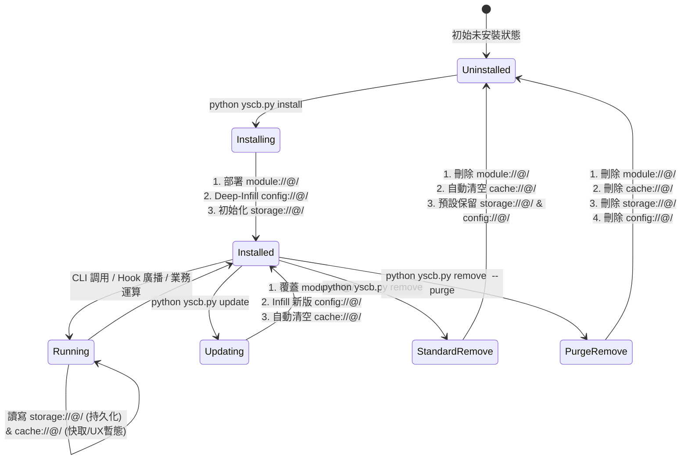

# 技術調研報告：模組資料生命週期與狀態治理 (Module Data Lifecycle & State Governance)

> 調研主題：模組資料管理相關 URI 協議釐清與遷移 — 生命週期治理 (R03)  
> 建立日期：2026-08-26  
> 所屬主計畫：[core 與 dev 模組功能打磨 (2026_08_26_1747_core_dev_refinement)](../umbrella_overview.md)  
> 調研狀態：Draft  
> 模板版本：v1.0  

---

## 1. 背景痛點與治理缺失 (Problem Statement)

在模組資料三位一體（`storage`、`cache`、`config`）與全量 Root 化（`@/` 語法）確立後，微內核面臨的下一個核心問題是：**各資料空間在模組的「安裝、運行、更新、卸載、清除」完整生命週期中，應當遵循怎樣的自動化治理規則？**

### 現行代碼痛點：
1. **卸載殘留未定義**：
   - 執行 `core:remove <module>` 時，僅刪除 `modules/{module}`。
   - `cache`（本機暫存快取）長期未被清理，持續佔用開發者本機硬碟空間。
   - `storage`（持久化資料）與 `config`（設定檔）缺乏明確的保留/銷毀邊界。
2. **升級期的快取污染風險**：
   - 模組升級時，舊版本的 `cache`（如 AST 分析快取、編譯快取）若未被失效清理，容易引發運行期詭異的快取不相容錯誤。
3. **缺少深度重置指令 (Purge)**：
   - 當開發者需要徹底乾淨重置某模組的所有狀態與歷史資料時，缺乏標準的 `--purge` 指令支援。

---

## 2. 模組生命週期狀態轉移動態模型 (Lifecycle State Machine)

---

## 3. 各資料空間之全生命週期治理矩陣 (Governance Matrix)

| 空間協議 | 安裝期 (`install`) | 運行期 (`runtime`) | 升級期 (`update`) | 標準卸載 (`remove`) | 深度清除 (`remove --purge`) |
| :--- | :--- | :--- | :--- | :--- | :--- |
| **`module://@/`** (代碼與資產) | 從 mirror 解壓部署 | 唯讀 (Read-only) | 解壓覆蓋新版代碼 | **✅ 自動物理刪除** | **✅ 自動物理刪除** |
| **`cache://@/`** (快取/中繼暫存) | 空/保持 | 模組讀寫快取與本機 UX 暫態 | **✅ 自動清空** (防舊快取污染) | **✅ 自動物理清空** (不留垃圾暫存) | **✅ 自動物理清空** |
| **`storage://@/`** (長久狀態/Git) | 保持既有 (若有) | 模組讀寫重要持久化狀態 | 保持不變 (平滑升級) | **🛡️ 預設保留** (防誤刪重要狀態) | **⚠️ 強制物理刪除** (徹底銷毀所有狀態) |
| **`config://@/`** (專案偏好設定) | Deep-Infill 範本組態 | 讀取專案組態 | Deep-Infill 新增欄位 (保留使用者舊設定) | **🛡️ 預設保留** (保留專案偏好) | **⚠️ 強制物理刪除** (徹底清除配置) |

---

## 4. 關鍵治理機制細則

### 4.1 標準卸載 (Safe Uninstall - Default)
- 指令：`python yscb.py remove <module>`
- **行為**：
  1. 移除 `yscb.config.json` 註冊項。
  2. 物理刪除 `modules/<module>/`。
  3. **自動物理清空 `yscb://.cache/<module>/`**（確保本機不留無用垃圾快取）。
  4. **保留 `yscb://storage/<module>/` 與 `yscb://config/<module>/`**（保障使用者資料與組態安全，以便未來重新安裝時能無縫接軌）。

### 4.2 深度重置清除 (Deep Purge Uninstall)
- 指令：`python yscb.py remove <module> --purge`
- **行為**：
  1. 執行標準卸載的所有動作。
  2. **強制物理刪除 `yscb://storage/<module>/`**。
  3. **強制物理刪除 `yscb://config/<module>/`**。
  4. 提示開發者所有資料已完全抹除。

### 4.3 模組升級之快取自癒 (Update Cache Invalidation)
- 指令：`python yscb.py update <module>`
- **行為**：在完成新代碼覆蓋與 `config` deep-infill 後，微內核**自動清空 `yscb://.cache/<module>/`**，迫使模組在新版本中重新構建編譯中繼與 AST 分析快取，避免跨版本快取污染。

---

## 5. R03 結論與後續執行指引

1. **生命週期邊界確立**：正式確立 `install`、`update`、`remove`、`remove --purge` 四大操作對 `module`、`cache`、`storage`、`config` 的標準處置定式。
2. **推進 R04 調研**：進入 **`R04`**，全量掃描整個代碼庫中所有使用硬編碼路徑（如 `os.path.join(yscb_root, "storage", ...)`）之處，制定 100% 全面遷移至新 URI 體系之執行清冊！
