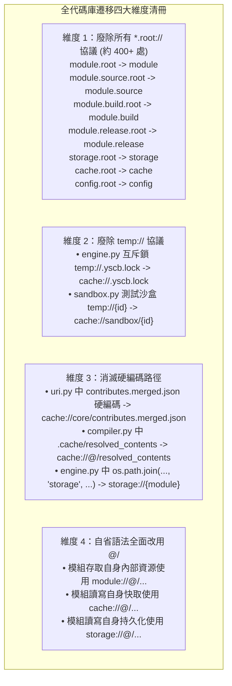
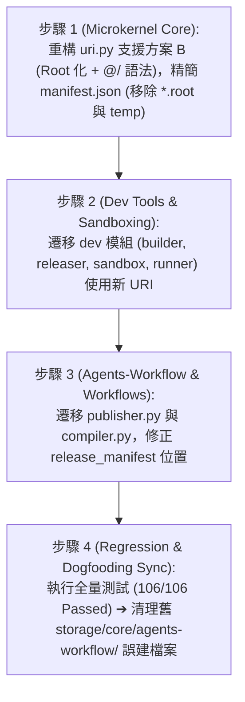

# 技術調研報告：全代碼庫硬編碼路徑盤點與 100% URI 全面遷移策略 (Comprehensive Path Audit & Migration Strategy)

> 調研主題：模組資料管理相關 URI 協議釐清與遷移 — 全面遷移策略 (R04)  
> 建立日期：2026-08-26  
> 所屬主計畫：[core 與 dev 模組功能打磨 (2026_08_26_1747_core_dev_refinement)](../umbrella_overview.md)  
> 調研狀態：Concluded  
> 模板版本：v1.0  

---

## 1. 背景痛點與經典錯誤實例剖析 (Case Study: Ambiguous Path Bug)

在現行代碼庫中，因「隱式上下文」與「硬編碼路徑」導致了具體的真實 Bug。

### 🚨 經典錯誤案例剖析：`storage/core/agents-workflow/release_manifest.json`
- **錯誤現象**：在 `agents-workflow` 執行 `release` 指令後，發布清冊被錯誤建立在 `storage/core/agents-workflow/release_manifest.json`，而非預期的 `storage/agents-workflow/release_manifest.json`。
- **根因追溯 (RCA)**：
  - `publisher.py` 第 37 行定義了：`MANIFEST_STORAGE_URI = "storage://agents-workflow/release_manifest.json"`。
  - 當調用端透過 CLI 進入時，預設上下文為 `"core"`。
  - 舊版 `storage://` 定義為 `yscb://storage/{module}/`，因此 `{module}` 被替換為 `"core"`，得到 base = `yscb://storage/core/`。
  - 隨後拼接路徑 `agents-workflow/release_manifest.json`，最終導致了雙重嵌套目錄：`yscb://storage/core/agents-workflow/release_manifest.json`！
- **方案 B 徹底修復機制**：
  - 在方案 B（全量 Root 化）下，`storage://` 定義為 `yscb://storage/`。
  - `storage://agents-workflow/release_manifest.json` 精準解析為 `yscb://storage/agents-workflow/release_manifest.json`！
  - 亦可直接在 `publisher.py` 中寫 `storage://@/release_manifest.json`，無論上下文何時切換，永遠指向自身模組空間！

---

## 2. 全代碼庫硬編碼與舊協議盤點清冊 (Audit Catalog)

經過全量代碼庫靜態分析掃描，盤點出以下四大類遷移對象：

### 遷移對照清冊表格：

| 檔案 / 模組 | 當前寫法 (Legacy / Hardcoded) | 重構後標準寫法 (Option B Standard) | 改善效益 |
| :--- | :--- | :--- | :--- |
| **`core/manifest.json`** | 宣告 `storage` + `storage.root` 等 16 個協議與 `temp` | **僅宣告 8 個標準協議**（`storage`, `cache`, `config`, `module`, `module.source`, `module.build`, `module.release`, `module.mirror`） | 協議庫簡化 50%，廢除 `temp` |
| **`core/core/uri.py`** | `_BOOTSTRAP_FALLBACK_SCHEMES` (16 個成雙成對協議) + `temp` | **8 個 Root 化協議** + 內建 `@/` 上下文展開引擎 | 徹底消滅雙重嵌套歧義 |
| **`core/core/engine.py`** | `temp://.yscb.lock` | `cache://.yscb.lock` | 統一進入快取/暫存空間 |
| **`core/core/engine.py`** | `os.path.join(yscb_dir, "storage", module_name)` | `uri.resolve(f"storage://{module_name}")` | 100% 透過 URI VFS |
| **`core/core/engine.py`** | `config.root://{module}/config.project.json` | `config://{module}/config.project.json` | 移除 `.root` |
| **`dev/dev/testing/sandbox.py`** | `temp://{sandbox_id}` | `cache://sandbox/{sandbox_id}` | 廢除 `temp`，沙盒隔離至快取空間 |
| **`dev/dev/testing/case.py`** | `self.sandbox_uri = f"temp://{self.sandbox_id}"` | `self.sandbox_uri = f"cache://sandbox/{self.sandbox_id}"` | 測試沙盒環境標準化 |
| **`dev/dev/builder.py`** | `module.build.root://{name}` / `module.release.root://{name}` | `module.build://{name}` / `module.release://{name}` | 移除 `.root` |
| **`dev/dev/releaser.py`** | `module.release.root://{module_name}/...` | `module.release://{module_name}/...` | 移除 `.root` |
| **`dev/dev/checker.py`** | `module.source.root://{name}` | `module.source://{name}` | 移除 `.root` |
| **`agents-workflow/publisher.py`** | `storage://agents-workflow/release_manifest.json` | `storage://@/release_manifest.json` | 修復路徑錯誤，精確寫入 `storage/agents-workflow/` |
| **`agents-workflow/compiler.py`** | `os.path.join(self.module_root, ".cache", ...)` | `uri.resolve("cache://@/resolved_contents/...")` | 消除本機快取硬編碼 |

---

## 3. 實施與遷移流水線 (Migration Execution Pipeline)

---

## 4. R04 調研結論

1. **R01~R04 四大調研全數圓滿收斂**：
   - `R01`：確立空間三層正交邊界與模組資料三位一體（`storage`/`cache`/`config`，廢除 `temp`）。
   - `R02`：確立方案 B（全量 Root 化 + `@/` 標籤語法），協議數量減少 50%。
   - `R03`：確立模組資料全生命週期治理矩陣（`remove` 自動清空 cache、安全保留 storage/config、`--purge` 深度清除）。
   - `R04`：完成全代碼庫硬編碼與舊協議盤點清冊，定位並鎖定 `release_manifest.json` 誤建問題之根因與解法。
2. **後續推進**：全量調研結論收斂回填 `P00_semantic_requirements.md`，可由開發者宣告 Phase 0 結束並推進至 **Phase 1 需求規格轉譯 (`P01_requirements_spec.md`)**！
