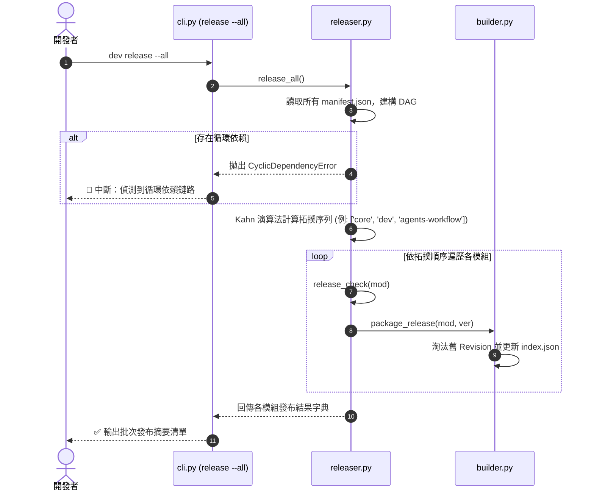

# 架構設計說明書 (Architecture Design)

> 功能名稱：Dev 模組發布與驗證工具鏈重構 (Dev Release & Verification Toolchain Refactor)  
> 建立日期：2026-08-26  
> 所屬主計畫：[core 與 dev 模組功能打磨 (2026_08_26_1747_core_dev_refinement)](../umbrella_overview.md)  
> 狀態：Confirmed  
> 依據 P01：[P01_requirements_spec.md](./P01_requirements_spec.md)  
> 專題報告：[R01_dev_toolchain_refactor.md](./R01_dev_toolchain_refactor.md), [R02_release_toolchain_support.md](./R02_release_toolchain_support.md)  
> 模板版本：v1.2  

---

## 1. 模組架構分層與職責邊界 (Layered Architecture)

```text
┌─────────────────────────────────────────────────────────────────────────────┐
│ 1. 表現層 (CLI Routing Layer) - source/dev/scripts/cli.py                    │
│    • 解析 build / release / test / bump-* / release-check / release-git     │
│    • 極簡路由派發，參數防呆校驗 (例：release-check 拒絕 --all)                │
└──────────────────────────────────────┬──────────────────────────────────────┘
                                       │
        ┌──────────────────────────────┴──────────────────────────────┐
        ▼                                                             ▼
┌──────────────────────────────────────────┐  ┌───────────────────────────────┐
│ 2. 發布調度層 (Releaser Pipeline)        │  │ 2. 測試調度層 (Tester Pipeline)│
│    source/dev/dev/releaser.py            │  │    source/dev/dev/tester.py   │
│    • Releaser.release_check() [3-Gate]   │  │    • Tester._run_test()       │
│    • Releaser.release_module()           │  │    • 預設前置調用 Builder.build │
│    • Releaser.release_all() [DAG 拓撲]   │  │    • 支援 --no-build 跳過     │
│    • Releaser.release_git() [4 步流水線] │  │    • 虛擬沙盒配置與跑測       │
└───────────────────┬──────────────────────┘  └───────────────┬───────────────┘
                    │                                         │
                    └──────────────────┬──────────────────────┘
                                       ▼
┌─────────────────────────────────────────────────────────────────────────────┐
│ 3. 核心建置與校驗引擎層 (Engine & Core Services Layer)                      │
│    • source/dev/dev/builder.py: Builder                                     │
│      - build_module() (自動清空 build/<mod>/，保留 tests/)                  │
│      - package_release() (純淨打包，3-Revision 滑動窗口淘汰，index.json SSOT)│
│    • source/dev/dev/checker.py: Checker                                     │
│      - check_module() (靜態規格檢查、entry 實體存在性、依賴格式校驗)        │
│    • source/core/core/semver.py                                             │
│      - bump_version() (版本單向遞增 major/minor/patch/revision)             │
│      - compare_semver(), match_constraint()                                 │
└─────────────────────────────────────────────────────────────────────────────┘
```

---

## 2. 核心資料流與循序圖 (Data Flow & Sequence Diagram)

### 2.1 `dev release-git` 4 步發布與版本控制流水線

```mermaid
sequenceDiagram
    autonumber
    actor Dev as 開發者
    participant CLI as cli.py (release-git)
    participant Tester as tester.py (test)
    participant Releaser as releaser.py (release-check / release)
    participant Builder as builder.py
    participant Git as 本地 Git 倉庫

    Dev->>CLI: dev release-git <mod> "<msg>"
    
    rect rgb(20, 50, 40)
        Note over CLI,Tester: 步驟 1: 自動前置 build ➔ 沙盒跑測
        CLI->>Tester: run_test(mod)
        Tester->>Builder: build_module(mod)
        alt 測試失敗
            Tester-->>CLI: 測試未通過 (exit 1)
            CLI-->>Dev: 🚨 中斷：測試失敗，終止發布
        end
    end

    rect rgb(50, 40, 20)
        Note over CLI,Releaser: 步驟 2: 發布就緒 3-Gate 預檢
        CLI->>Releaser: release_check(mod)
        alt 預檢失敗 (Gate 1 靜態合規 / Gate 2 版本重複 / Gate 3 版本倒退)
            Releaser-->>CLI: 預檢失敗報告 (exit 1)
            CLI-->>Dev: 🚨 中斷：發布預檢失敗，終止發布
        end
    end

    rect rgb(60, 40, 20)
        Note over CLI,Releaser: 步驟 3: 純淨發布打包與產物治理
        CLI->>Releaser: release_module(mod)
        Releaser->>Builder: package_release(mod, ver)
        Builder-->>Releaser: 產出 zip、3-Revision 淘汰、更新 index.json
    end

    rect rgb(30, 40, 60)
        Note over CLI,Git: 步驟 4: 本地 Git 提交與打標 (Local-Only)
        CLI->>Git: git add -A
        CLI->>Git: git commit -m "<msg>"
        CLI->>Git: git tag -a "<mod>/v<ver>" -m "<msg>"
        Note over Git: 🚨 禁止自動 push 到 remote！
        CLI-->>Dev: ✅ 成功完成 4 步發布與本地 Git Commit/Tag
    end
```


### 2.2 `dev release --all` DAG 依賴拓撲排序批次發布


---

## 3. 受影響檔案與新建檔案清單 (Impacted & New Files Inventory)

| 檔案路徑 | 類型 | 職責與變更說明 |
| :--- | :---: | :--- |
| [`source/dev/scripts/cli.py`](file:///h:/UseFolder/CodeRepo/ys_codebase/ys_codebase/source/dev/scripts/cli.py) | Modify | • 簡化 `build` 路由（移除 `--clean` 解析）<br/>• 重構 `release` 路由（移除所有 bump 引數與流水線 options，對標 `build`）<br/>• 重構 `test` 路由（加入預設前置 build 與 `--no-build` 解析）<br/>• 新增 `bump-major`, `bump-minor`, `bump-patch`, `bump-revision` 路由<br/>• 新增 `release-check` 路由（阻斷 `--all`）<br/>• 新增 `release-git` 路由 |
| [`source/dev/dev/builder.py`](file:///h:/UseFolder/CodeRepo/ys_codebase/ys_codebase/source/dev/dev/builder.py) | Modify | • `build_module`：預設自動清空 `build/<mod>/`，保留 `tests/`<br/>• `build_all`：移除 `clean` 參數<br/>• `package_release`：純淨排除 `tests/` 與 `.yscbignore`<br/>• `_update_release_index`：實作 3-Revision 滑動窗口保留演算法與跨三元組升級舊版收斂邏輯，以磁碟實體 zip 為 SSOT 更新 `index.json` |
| [`source/dev/dev/releaser.py`](file:///h:/UseFolder/CodeRepo/ys_codebase/ys_codebase/source/dev/dev/releaser.py) | Modify | • 徹底重構為純淨發布調度器 `Releaser`<br/>• 實作 3-Gate 校驗：`release_check(mod)`（Gate 1 靜態合規、Gate 2 不可重複、Gate 3 不可倒退）<br/>• 實作 `release_module(mod)` 與 `release_all()`（DAG 拓撲排序批次發布）<br/>• 實作 `release_git(mod, commit_msg)` 4 步安全流水線（本地 Git 操作，禁 push） |
| [`source/dev/dev/tester.py`](file:///h:/UseFolder/CodeRepo/ys_codebase/ys_codebase/source/dev/dev/tester.py) | Modify | • `_run_test`：在建立沙盒前若無 `--no-build` 則自動調用 `Builder().build_module()` 或 `Builder().build_all()`，失敗立即阻斷報錯 |
| [`test/test_dev_toolchain_refactor.py`](file:///h:/UseFolder/CodeRepo/ys_codebase/test/test_dev_toolchain_refactor.py) | New | • 單元與整合測試：覆蓋 `build` 自動清理、`release` 3-Gate 校驗、3-Revision 淘汰演算法、`bump-*`、`release-check`、`release-git` 本地流水線與 DAG 拓撲排序 |

---

## 4. 架構決策記錄 (Architecture Decision Records)

- **[P02:DR-01] 職責分離原則 (Releaser vs. Builder)**：
  - `Releaser` 專注於高階發布業務邏輯、3-Gate 品質預檢、DAG 依賴拓撲排序與 `release-git` 本地提交流水線。
  - `Builder` 專注於底層物理 Zip 打包、`.yscbignore` 過濾與 `release/<mod>/` 產物目錄之 3-Revision 淘汰清理。
- **[P02:DR-02] 3-Revision 時序滑動窗口與跨三元組收斂淘汰演算法**：
  - 同三元組保留最多 3 個最新 Revision（`X.Y.Z.W`, `X.Y.Z.W-1`, `X.Y.Z.W-2`），淘汰更早舊包。
  - 跨三元組升級時，所有歷史舊三元組僅保留最後最高 1 份 Revision（`X.Y.Z.W_max`），淘汰其餘延遲 Revision。
  - `release/<mod>/index.json` 100% 以磁碟真實存在的 zip 檔案為準動態生成。
- **[P02:DR-03] Kahn's Algorithm DAG 拓撲排序**：
  - 批次全量發布時，將模組間的 `dependencies` 轉換為有向無環圖，依入度為 0 依序出列，保障基礎模組優先發布。
- **[P02:DR-04] `release-git` 順序阻斷與本地操作防呆**：
  - 嚴格遵守「測試 ➔ 預檢 ➔ 發布 ➔ 本地 Commit & Tag」四步順序，前一步失敗立即中斷。
  - 嚴格禁止調用 `git push`，所有 Git 操作封閉於本地工作區。
