# 專題調研與重構收斂報告：Dev 工具鏈與發布治理重構 (R01)

> 專題編號：R01  
> 建立日期：2026-08-26  
> 所屬計畫：[sub_02_dev_release_verification_refactor](./P00_semantic_requirements.md)  
> 狀態：Completed  

---

## 1. 調研背景與重構動機 (Motivation & Background)

在過去的演進中，`dev` 工具鏈承載了過多職責與附加功能，導致指令邊界模糊、參數複雜：
1. **`dev build`**：依賴手動指定 `--clean` 旗標，若未傳入可能殘留舊版產物。
2. **`dev release`**：深度耦合了版本遞增 (SemVer bump)、免確認交互 (`-y`)、模擬 (`--dry-run`)、Git Tag、Git Commit 等流水線行為，違反了「單一職責」與「工具鏈純粹化」原則。
3. **`dev test`**：與 `dev build` 解耦，開發者修改源碼後常忘記先手動跑 `build`，導致沙盒測試跑在舊的 build 包上。
4. **版本產物治理與索引同步**：過去發布包缺乏清晰的多版本治理邊界，`index.json` 維護與四元版本號匹配規則需要明確定錨。

---

## 2. 三大核心指令重構方案 (Refactored CLI Specification)

```mermaid
graph TD
    classDef dev fill:#1e293b,stroke:#3b82f6,stroke-width:2px,color:#fff;
    classDef build fill:#064e3b,stroke:#10b981,stroke-width:2px,color:#fff;
    classDef rel fill:#78350f,stroke:#f59e0b,stroke-width:2px,color:#fff;

    Dev["<code>python yscb.py dev</code>"]:::dev

    subgraph BuildPipeline ["1. 本地開發建置 (dev build)"]
        B_Cmd["<code>build [mod | --all]</code>"]:::build
        B_Clean["自動清空 <code>build/{mod}/</code>"]:::build
        B_Pack["完整打包 <code>build/{mod}/{ver}.build.zip</code><br/><i>(保留 tests/ 與開發檔案)</i>"]:::build
        B_Index["更新 <code>build/{mod}/index.json</code>"]:::build
        B_Cmd --> B_Clean --> B_Pack --> B_Index
    end

    subgraph ReleasePipeline ["2. 純淨發布打包 (dev release)"]
        R_Cmd["<code>release [mod | --all]</code>"]:::rel
        R_Gov["多版本治理：保留不同 X.Y.Z，淘汰同 X.Y.Z 舊 Revision.zip"]:::rel
        R_Pack["純淨打包 <code>release/{mod}/{ver}.zip</code><br/><i>(排除 tests/ 與 .yscbignore)</i>"]:::rel
        R_Index["更新 <code>release/{mod}/index.json</code><br/><i>(排除已刪除 Revision)</i>"]:::rel
        R_Cmd --> R_Gov --> R_Pack --> R_Index
    end

    subgraph TestPipeline ["3. 端到端驗證流水線 (dev test)"]
        T_Cmd["<code>test [mod | --all] [options]</code>"]:::dev
        T_Build{"是否有 <code>--no-build</code> 旗標？"}:::dev
        T_ExecBuild["自動調用 <code>dev build</code> 產出最新 zip"]:::build
        T_Sandbox["建立虛擬沙盒 <code>.cache/dev/sandbox/</code>"]:::dev
        T_Run["沙盒內安裝並執行測試 (Contract + Custom)"]:::dev
        T_Teardown["自動銷毀沙盒並輸出診斷報告"]:::dev

        T_Cmd --> T_Build
        T_Build -- No (預設) --> T_ExecBuild --> T_Sandbox
        T_Build -- Yes --> T_Sandbox
        T_Sandbox --> T_Run --> T_Teardown
    end
```

---

## 3. 詳細重構規格與決策收斂 (Detailed Specifications)

### 3.1 `dev build` (本地開發建置)
- **指令格式**：`python yscb.py dev build [module_name | --all]`
- **移除項目**：移除 `--clean` 選項。
- **執行行為**：
  1. 打包前**一律自動先清空**目標模組的 `build/<module>/` 資料夾。
  2. 讀取 `source/<module>/manifest.json`，將版本號標記為 `{major}.{minor}.{patch}.build`。
  3. 100% 完整打包所有檔案（包含 `tests/` 與內部開發資產）。
  4. 產出 `build/<module>/<major>.<minor>.<patch>.build.zip` 並更新 `build/<module>/index.json`。

### 3.2 `dev release` (純淨發布打包)
- **指令格式**：`python yscb.py dev release [module_name | --all]`
- **移除項目**：
  - 移除 `bump_type`（`major` / `minor` / `patch` / `revision`）與顯式指定版本引數。
  - 移除 `--yes` / `-y`、`--dry-run`、`--tag` / `--no-tag`、`--no-test`。
  - 移除發布時的自動 Git Commit、Git Tag 與版本遞增邏輯（版本維護回歸開發者編輯 `manifest.json` 或專屬版本管理）。
- **多版本治理與產物行為**：
  1. **發布前版本安全校驗 (Release Validation Guardrail)**：
     - **不可重複發布 (Immutability)**：待發布版本號 $V_{\text{target}}$ 絕對不可與 `release/<mod>/` 中已存在的完整四元版本相同（若已存在同四元組 zip 或 index 記錄，拋出 `ReleaseVersionExistsError` 阻斷發布）。
     - **版本號不可回退 (Monotonicity)**：待發布版本號 $V_{\text{target}}$ 必須嚴格大於該模組發布庫中同三元組的最高已有 revision 版本（$V_{\text{target}} > V_{\text{highest\_in\_triplet}}$），且不可小於已發布歷史版本，嚴禁版本倒退。
  2. **禁止清空整個 `release/<module>/` 目錄**：安全保留不同 `major.minor.patch` 的歷史發布包（例：`1.0.0.0.zip`, `1.1.0.0.zip`）。
  3. **同 X.Y.Z 舊 Revision 淘汰**：通過校驗的新 revision（如 `1.0.0.1`）成功打包後，自動淘汰並清理同三元組的舊 revision zip 檔案（如 `1.0.0.0.zip`）。
  4. **純淨排除**：嚴格依據 `.yscbignore` 與 `RELEASE_IGNORES` 排除 `tests/`、`__pycache__` 等非發布檔案。
  5. **索引實體同步 (Index SSOT)**：`release/<module>/index.json` 的 `versions` 清單以磁碟上真實存在的 zip 檔案為準動態生成，**被淘汰/刪除的舊 revision 100% 排除於索引之外**，並依 SemVer 更新 `latest` 指標。

### 3.3 `dev test` (端到端驗證流水線)
- **指令格式**：`python yscb.py dev test [module_name | --all] [options]`
- **流水線化核心行為**：
  1. **預設自動前置執行 `dev build`**：確保測試沙盒使用的是最新源碼編譯出的 build zip 產物。
  2. **支援 `--no-build`**：若使用者傳入 `--no-build`，則跳過 build 步驟，直接使用現有產物進沙盒跑測。
  3. 保留其餘過濾參數：`-k <pattern>`、`--type=<type>`、`--contract-only`、`-v` / `--verbose`、`--keep-sandbox`。

---

## 4. 原始碼清理與模組架構調整清冊 (Source Code Cleanup Checklist)

| 檔案路徑 | 清理與重構重點 |
| :--- | :--- |
| [`source/dev/scripts/cli.py`](file:///h:/UseFolder/CodeRepo/ys_codebase/ys_codebase/source/dev/scripts/cli.py) | • 簡化 `build` 路由（移除 `--clean` 解析） • 重構 `release` 路由（移除所有 bump 引數與流水線 options，對標 `build`） • 重構 `test` 路由（加入預設前置 build 與 `--no-build` 解析） |
| [`source/dev/dev/builder.py`](file:///h:/UseFolder/CodeRepo/ys_codebase/ys_codebase/source/dev/dev/builder.py) | • `build_module`：預設一律自動清理舊 `build/<mod>/` 產物 • `build_all`：移除 `clean` 參數 • `package_release` / `package_release_all`：加入版本重複檢查與版本不可回退檢查，強化同三元組 revision 淘汰與索引 SSOT 生成 |
| [`source/dev/dev/releaser.py`](file:///h:/UseFolder/CodeRepo/ys_codebase/ys_codebase/source/dev/dev/releaser.py) | • 徹底廢除/簡化 `ReleasePipeline`，移除 Git 操作（`_git_commit`, `_git_tag`）、版本遞增計算（`_bump_version`）、交互確認等舊代碼，全面轉發至 `Builder.package_release` |
| [`source/dev/dev/tester.py`](file:///h:/UseFolder/CodeRepo/ys_codebase/ys_codebase/source/dev/dev/tester.py) | • `_run_test`：在建立沙盒前判斷若無 `--no-build` 則自動調用 `Builder().build_all()` 或 `Builder().build_module()`，若 build 失敗立即中止並報錯 |
| `tests/` | • 更新 `dev` 模組的所有單元測試與契約測試斷言，覆蓋新 CLI 簽名與行為 |

---

## 5. 結論與決策定錨 (Summary & Decisions Anchor)

- **[P00:DR-01]** `dev build` 自動清空目標資料夾，移除 `--clean`。
- **[P00:DR-02]** `dev release` 純粹化並對標 `build`，語法 `dev release [mod | --all]`。
- **[P00:DR-03]** `dev test` 流水線化，預設前置 `build`，提供 `--no-build`。
- **[P00:DR-04]** 多版本治理與索引實體同步（排除已刪除 revision，三段式匹配對四元尾號不敏感）。
- **[P00:DR-05]** 發布不可變性與防回退校驗閘門（完全四元版本不可重複存在、版本號不可倒退）。
