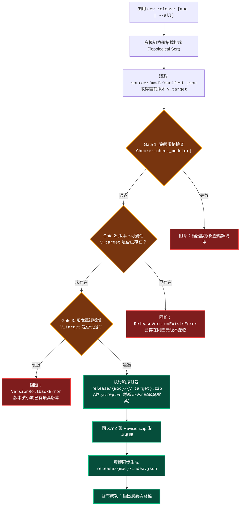

# 專題調研與架構設計：Release 工具鏈支援與純淨發布治理 (R02)

> 專題編號：R02  
> 建立日期：2026-08-26  
> 所屬計畫：[sub_02_dev_release_verification_refactor](./P00_semantic_requirements.md)  
> 狀態：Completed  

---

## 1. 調研背景與設計目標 (Background & Objectives)

在舊設計中，`dev release` 試圖同時承擔「版本決策 (Bump)」、「品質驗證 (Test)」、「發布打包 (Pack)」與「版本控制 (Git Commit / Tag)」四重職責，導致指令複雜且容易產生副作用（如誤觸發 Git Commit 與 Tag）。

本次重構的核心目標：
1. **純粹化與對標 `build`**：將 `dev release` 定位為純淨發布打包工具，語法為 `dev release [module_name | --all]`，完全剝離 Git 操作與自動 Bump 行為。
2. **發布品質守門 (Release Gates)**：在發布打包前，強制執行靜態檢查、版本不可變性校驗與防回退校驗。
3. **多模組批次拓撲發布 (`--all`)**：支援多模組批次發布時依 `dependencies` 拓撲順序依序發布。
4. **多版本倉庫治理與索引 SSOT**：保留歷史大/次版本，同三元組僅保留最新單一活躍 Revision，`index.json` 以磁碟實體檔案為唯一真相來源。

---

## 2. 發布工具鏈流水線與 3 大守門關卡 (3-Gate Release Pipeline)



---

## 3. 三大發布守門規則詳解 (Detailed Gate Rules)

### 3.1 Gate 1：靜態規格合規性檢查 (Manifest Compliance Gate)
- 調用 `dev.checker.Checker.check_module(module_name)`。
- 檢查項：
  - `manifest.json` 必填欄位存在且格式合法（`name`, `version`, `entry`）。
  - `entry` 所指向的腳本檔案真實存在。
  - `dependencies` 宣告符合 SemVer 約束格式。
  - `contributes.core.uri_schemes` 符合方案 B 標準協議格式。

### 3.2 Gate 2：版本不可變性校驗 (Immutability Gate)
- **校驗邏輯**：
  ```python
  target_zip_uri = f"module.release://{module_name}/{target_version}.zip"
  if uri.exists(target_zip_uri):
      raise ReleaseVersionExistsError(
          f"Cannot release '{module_name}@{target_version}': "
          f"Package '{target_version}.zip' already exists in release repository. "
          f"Published release artifacts are immutable."
      )
  ```
- **保護目的**：杜絕任何人為失誤導致已發布至倉庫的產物被無聲篡改。若需修改已釋出版本代碼，必須至少遞增 revision（例：`1.0.0.0` ➔ `1.0.0.1`）。

### 3.3 Gate 3：版本號防回退校驗 (Monotonicity Gate)
- **校驗邏輯**：
  1. 掃描 `release/{module_name}/` 目錄下所有現存的 `*.zip` 檔案，解析出已存在的版本清單 $S_{\text{existing}}$。
  2. 篩選與 $V_{\text{target}}$ 具有相同 `(major, minor, patch)` 三元組的已存在版本：
     $$S_{\text{same\_triplet}} = \{v \in S_{\text{existing}} \mid v.\text{triplet} == V_{\text{target}}.\text{triplet}\}$$
  3. 若 $S_{\text{same\_triplet}}$ 非空，則計算同三元組已發布最高版本 $V_{\text{highest}}$：
     - 若 $V_{\text{target}} \le V_{\text{highest}}$，立即拋出 `VersionRollbackError` 阻斷發布！
- **保護目的**：防止因分支合併錯誤或失誤將舊 revision 覆蓋發布，確保發布倉庫版本序列嚴格單調遞增。

---

### 3.4 發布產物時序滑動窗口保留與淘汰演算法 (Version Retention Policy)

```mermaid
graph TD
    classDef curr fill:#064e3b,stroke:#10b981,stroke-width:2px,color:#fff;
    classDef hist fill:#1e293b,stroke:#3b82f6,stroke-width:2px,color:#fff;
    classDef del fill:#7f1d1d,stroke:#ef4444,stroke-width:2px,color:#fff;

    subgraph Rule1 ["規則 1：同三元組 (X.Y.Z) 至多保留 3 份 Revision (滑動窗口)"]
        R1_V3["<code>X.Y.Z.W</code> (最新)"]:::curr
        R1_V2["<code>X.Y.Z.W-1</code> (次新)"]:::curr
        R1_V1["<code>X.Y.Z.W-2</code> (第 3 新)"]:::curr
        R1_V0["<code>X.Y.Z.W-3 及更早</code><br/>❌ 自動刪除淘汰"]:::del
        R1_V3 ~~~ R1_V2 ~~~ R1_V1 ~~~ R1_V0
    end

    subgraph Rule2 ["規則 2：跨三元組 (Patch/Minor/Major 升級) 舊三元組收斂至 1 份"]
        R2_New["當前三元組：<code>X.Y.Z+1.W</code> (依規則 1 最多 3 份)"]:::curr
        R2_OldKeep["歷史三元組 <code>X.Y.Z</code> 僅保留最高：<code>X.Y.Z.W_max</code>"]:::hist
        R2_OldDel["歷史三元組 <code>X.Y.Z</code> 之延遲 Revision<br/>❌ 自動全數刪除淘汰"]:::del
        R2_New --> R2_OldKeep
        R2_OldKeep --> R2_OldDel
    end
```



- **演算法核心邏輯**：
  1. **同三元組滑動窗口**：發布新 Revision（如 `1.0.0.3`）時，同三元組最多保留 `1.0.0.3`, `1.0.0.2`, `1.0.0.1`。若出現第 4 份及更舊的 Revision（如 `1.0.0.0`），自動物理刪除其 zip 包。
  2. **跨三元組升級舊版收斂**：當發布新三元組（如 `1.0.1.0` 或 `2.0.0.0`）時，掃描所有舊三元組（如 `1.0.0`）：
     - 取得該舊三元組中 Revision 最大的單一 zip（`1.0.0.3.zip`）予以保留。
     - 其餘所有較舊的 Revision zip（`1.0.0.2.zip`, `1.0.0.1.zip` 等）一律物理刪除。
  3. **索引實體同步 (Index SSOT)**：`release/<module>/index.json` 始終以物理磁碟上真實存在的 zip 包為準進行收集與排序，已被淘汰刪除的 Revision 100% 自索引中排除。

---

## 4. 全新發布工具鏈指令矩陣 (Release Toolchain CLI Matrix)

```text
python yscb.py dev <subcommand> [args]
```

| 指令 (Command) | 語法範例 | 核心職責與行為 | 支援範圍 |
| :--- | :--- | :--- | :---: |
| **`bump-*`** | `dev bump-major <mod>`<br/>`dev bump-minor <mod>`<br/>`dev bump-patch <mod>`<br/>`dev bump-revision <mod>` | **[P00:DR-07] 獨立版本遞增**：<br/>讀取 `source/<mod>/manifest.json`，對當前版本進行單向遞增並寫回檔案，輸出遞增前後版本號。 | 單一模組 |
| **`release-check`** | `dev release-check <module>` | **[P00:DR-08] 發布就緒檢查獨立門面**：<br/>• 執行 Gate 1 (靜態規格合規)<br/>• 執行 Gate 2 (版本未重複存在)<br/>• 執行 Gate 3 (版本單調未倒退)<br/>若不合格回報錯誤並回傳 exit 1。 | **僅單一模組**<br/>(不支援 --all) |
| **`release-git`** | `dev release-git <mod> "<commit msg>"` | **[P00:DR-09] 本地發布與版本控制工具鏈**（依序執行 4 步）：<br/>1. `test <mod>` (沙盒跑測，失敗即中斷)<br/>2. `release-check <mod>` (發布預檢，失敗即中斷)<br/>3. `release <mod>` (純淨發布打包，失敗即中斷)<br/>4. `git commit -m "<msg>"` 並打上版本標籤<br/>🚨 **嚴禁自動 push 到 remote，僅完成本地操作**。 | 單一模組 |
| **`release`** | `dev release [module_name \| --all]` | **[P00:DR-02/06] 純淨發布打包器**（對標 `build`）：<br/>• 依序執行 3-Gate 校驗<br/>• 打包產出 `release/<mod>/<ver>.zip`<br/>• 依 3-Revision 滑動窗口與跨三元組收斂規則淘汰舊產物<br/>• 實體同步生成 `release/<mod>/index.json` | 單一模組 /<br/>全量拓撲 |

---

## 5. `release-git` 順序流水線設計 (Sequential Quality Pipeline)

```mermaid
sequenceDiagram
    autonumber
    actor Dev as 開發者
    participant CLI as dev release-git
    participant Tester as dev test
    participant Checker as dev release-check
    participant Releaser as dev release
    participant Git as 本地 Git 庫

    Dev->>CLI: python yscb.py dev release-git <module> "<commit msg>"
    
    rect rgb(20, 50, 40)
        Note over CLI,Tester: 步驟 1: 品質驗證守門
        CLI->>Tester: 執行 dev test <module> (自動前置 build)
        alt 測試失敗
            Tester-->>CLI: 回報測試失敗日誌 (exit 1)
            CLI-->>Dev: 🚨 中斷流程：測試未通過，終止流程
        end
        Tester-->>CLI: 測試全數通過 (100% Passed)
    end

    rect rgb(50, 40, 20)
        Note over CLI,Checker: 步驟 2: 發布就緒校驗守門
        CLI->>Checker: 執行 dev release-check <module>
        alt 檢查失敗 (Manifest 不合法 / 版本重複 / 版本倒退)
            Checker-->>CLI: 回報錯誤原因 (exit 1)
            CLI-->>Dev: 🚨 中斷流程：發布就緒檢查失敗，終止流程
        end
        Checker-->>CLI: 檢查通過 (Ready for Release)
    end

    rect rgb(60, 40, 20)
        Note over CLI,Releaser: 步驟 3: 純淨發布打包
        CLI->>Releaser: 執行 dev release <module>
        alt 打包失敗
            Releaser-->>CLI: 回報發布失敗原因 (exit 1)
            CLI-->>Dev: 🚨 中斷流程：發布打包失敗，終止流程
        end
        Releaser-->>CLI: 發布打包完成 (產出 zip 與更新 index.json)
    end

    rect rgb(30, 40, 60)
        Note over CLI,Git: 步驟 4: 本地 Git 提交與打標 (Local-Only)
        CLI->>Git: git add -A
        CLI->>Git: git commit -m "<commit msg>"
        CLI->>Git: git tag -a "<module>/v<version>" -m "<commit msg>"
        Note over Git: 🚨 禁止自動 push 到 remote！
        CLI-->>Dev: ✅ 成功完成測試、檢查、發布與本地 Git Commit / Tag
    end
```



---

## 6. 模組架構與職責劃分 (Module Architecture & Division)

```text
source/dev/dev/
  ├── builder.py          # 【底層建置引擎】專注 build/release 物理 Zip 打包與 .yscbignore 過濾
  ├── releaser.py         # 【發布調度門面】負責 release-check 3-Gate 校驗、3-Revision 淘汰演算法、依賴拓撲排序、release-git 本地流水線
  ├── checker.py          # 【靜態檢查引擎】專注 manifest 與宣告式結構校驗
  └── scripts/cli.py      # 【CLI 路由入口】解析 bump-*, release-check, release-git, release, build, test
```

---

## 7. 調研結論與決策收斂 (Summary & Decisions Anchor)

- **[P00:DR-01]** `dev build` 自動清空目標資料夾，移除 `--clean`。
- **[P00:DR-02]** `dev release` 純粹化並對標 `build`，語法 `dev release [mod | --all]`；多版本治理落實「同三元組至多 3 份 Revision 滑動窗口、跨三元組升級舊版僅留 1 份 Revision」。
- **[P00:DR-03]** `dev test` 流水線化，預設前置 `build`，提供 `--no-build`。
- **[P00:DR-04]** 多版本治理與索引實體同步（排除已刪除 revision，三段式匹配對四元尾號不敏感）。
- **[P00:DR-05]** 發布不可變性與防回退校驗閘門（完全四元版本不可重複存在、版本號不可倒退）。
- **[P00:DR-06]** `dev release --all` 支援依 `dependencies` 拓撲順序發布。
- **[P00:DR-07]** 新增獨立版本遞增指令 `dev bump-[major|minor|patch|revision] <module>`。
- **[P00:DR-08]** 新增獨立發布就緒檢查指令 `dev release-check <module>`（僅支援單一模組，不支援 `--all`）。
- **[P00:DR-09]** 新增發布與版本控制工具鏈 `dev release-git <module> <commit msg>`（依次執行 `test` ➔ `release-check` ➔ `release` ➔ 本地 `git commit & tag`，嚴禁 push 到 remote）。
