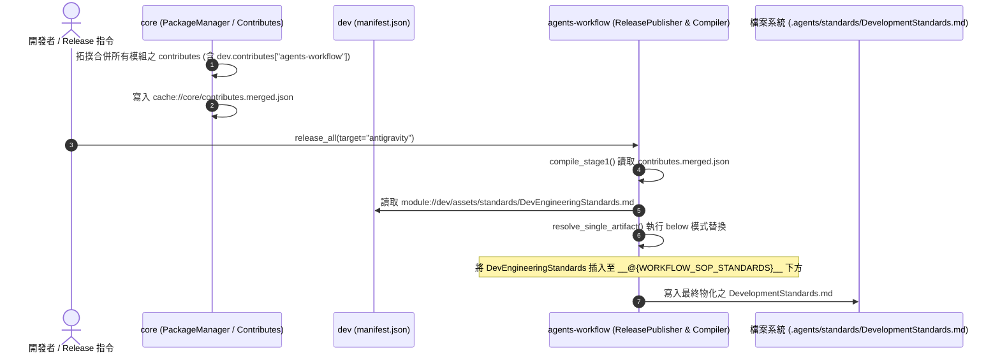
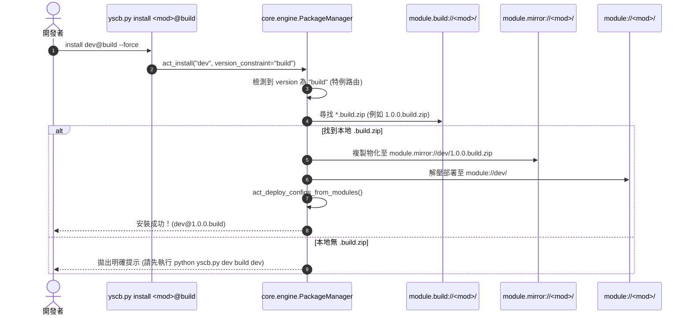

# 架構設計說明書 (Architecture Design)

> 功能名稱：Dev 與 Agents-Workflow 模組連動注入 (Dev & Agents-Workflow Linkage Injection)  
> 建立日期：2026-08-26  
> 所屬主計畫：[core 與 dev 模組功能打磨 (2026_08_26_1747_core_dev_refinement)](../umbrella_overview.md)  
> 狀態：Completed  
> 模板版本：v1.2  

---

## 1. 模組架構分層與職責邊界 (Layered Architecture)

```text
+-----------------------------------------------------------------------------------------------+
|                            YS-Codebase 跨模組連動注入與開發建置安裝體系                      |
+-----------------------------------------------------------------------------------------------+
  |
  +---> 1. dev 模組層 (Dev Module Layer: source/dev/)
  |       |-- assets/standards/DevEngineeringStandards.md  [NEW] (YS-Codebase 模組開發專案特化工程規範)
  |       \-- manifest.json                                [MOD] (宣告 contributes["agents-workflow"])
  |
  +---> 2. core 模組層 (Core Infrastructure Layer: source/core/)
  |       \-- core/engine.py                               [MOD] (act_download & _solve 支援 @build 特例)
  |             ├── 當 version 包含 "build" 時強制路由至 module.build://{module_name}/
  |             \-- 本地找不到 .build.zip 時拋出引導提示 (EC-01)
  |
  +---> 3. agents-workflow 模組層 (Workflow Consumer Layer: source/agents-workflow/)
          |-- contributes.merged.json 拓撲解析             [AUTO] (自動讀取 dev 貢獻之 insert 宣告)
          \-- compiler.py 5-Step 狀態機                    [AUTO] (below 模式將規範掛載至 DevelopmentStandards)
+-----------------------------------------------------------------------------------------------+
```

---

## 2. 核心資料流與循序圖 (Data Flow & Sequence Diagram)

### 2.1 宣告式連動注入流水線 (Linkage Injection Flow)


### 2.2 `install @build` 特例解析與安裝流水線 (Install @Build Flow)


---

## 3. 受影響檔案與新建檔案清單 (Impacted & New Files Inventory)

| 檔案路徑 | 類型 | 職責與變更說明 |
| :--- | :---: | :--- |
| `source/dev/assets/standards/DevEngineeringStandards.md` | **New** | 存放 YS-Codebase 模組開發專案特化工程規範（禁止主動 release/install、三層空間 SSOT、虛擬沙盒測試規範、靜態合規守門）。 |
| `source/dev/manifest.json` | **Modify** | 宣告 `contributes["agents-workflow"]`，向 `WORKFLOW_SOP_STANDARDS` 註冊 `insert` (`mode: "below"`)。 |
| `source/core/core/engine.py` | **Modify** | 在 `_get_module_manifest_from_provider_or_local` 與 `act_download` 中擴充 `@build` 特例，強制自 `module.build://` 解析下載。 |
| `source/core/tests/test_engine.py` | **Modify** | 新增 `install @build` 特例解析與安裝單元測試。 |
| `source/dev/tests/test_basic.py` | **Modify** | 新增 `DevEngineeringStandards.md` 存在性與 Contributes 宣告合規測試。 |
| `docs/dev/user_guide.md` | **Modify** | 補充 `install <mod>@build` 快捷開發安裝指令說明。 |

---

## 4. 架構決策記錄 (Architecture Decision Records)

- **`[P02:DR-01]` (宣告式標準注入模式)**：
  - `dev` 模組透過 `contributes["agents-workflow"]` 宣告注入，不修改 `agents-workflow` 任何核心代碼，達成 100% 模組解耦。
  - 使用 `mode: "below"` 模式插入 `__@{WORKFLOW_SOP_STANDARDS}__`，保留錨點擴充性。
- **`[P02:DR-02]` (`@build` 本地建置產物專屬通道)**：
  - `core.engine` 將版本約束為 `build` 或以 `.build` 結尾的請求視為本機開發特例，直接旁路遠端/發布 provider，直連 `module.build://`。
