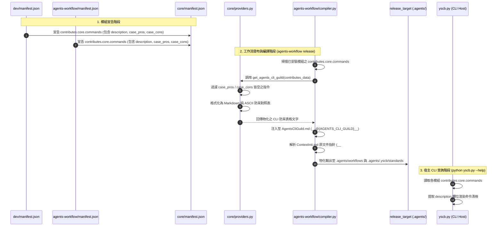

# 架構設計說明書 (Architecture Design)

> 功能名稱：擴充 Dev 模組對 Agents-Workflow 注入之工程規範與指令防呆 (Dev Injection Expansion & Command Abuse Guardrails)  
> 建立日期：2026-08-27  
> 所屬主計畫：2026_08_27_0143_dev_agents_workflow_injection_expansion  
> 狀態：Confirmed  
> 依據 P01：[P01_requirements_spec.md](./P01_requirements_spec.md)  
> 模板版本：v1.2  

---

## 1. 模組架構分層與職責邊界 (Layered Architecture)

```text
+-----------------------------------------------------------------------------------+
| 空間 ① 源碼開發空間 (yscb://source/) 【唯一修改 SSOT】                             |
|                                                                                   |
|  [core 模組]                                                                      |
|   - manifest.json: 宣告 core.commands 規範與 AGENTS_CLI_GUILD 動態 Token 注入        |
|   - core/providers.py: 實作 get_agents_cli_guild 動態計算函數 (過濾/格式化)          |
|                                                                                   |
|  [agents-workflow 模組]                                                           |
|   - assets/standards/AgentsCliGuild.md [NEW]: 標準文檔資產 (內嵌 AGENTS_CLI_GUILD)   |
|   - manifest.json: 宣告 export AgentsCliGuild.md，遷移至 core.commands             |
|   - assets/standards/AgentsStandards.md: 注入 CLI 比對與未列情境強制確認守門       |
|   - assets/workflows/ContextInit.md: 修復 __#{module://...}__ 原文件指針轉譯      |
|                                                                                   |
|  [dev 模組]                                                                       |
|   - manifest.json: 宣告 core.commands 補齊 6 大子指令之 description, pros, cons   |
|   - assets/standards/DevEngineeringStandards.md: 清理冗餘手動表格，使用標準體系  |
+-----------------------------------------------------------------------------------+
                                         │
                                         ▼ (編譯發布 / CLI 讀取)
+-----------------------------------------------------------------------------------+
| 空間 ③ 運行與消費空間 (project://) 【運行消費與 IDE Context】                     |
|                                                                                   |
|  [yscb.py 宿主起手腳本]                                                            |
|   - 僅自 contributes.core.commands 讀取，提取 description 渲染標準 CLI Help       |
|                                                                                   |
|  [release_target 投射產物 (如 .agents/)]                                           |
|   - .agents/.yscb/standards/AgentsCliGuild.md (由 Core 動態物化之 CLI 防呆指南)    |
|   - .agents/workflows/ContextInit.md (自動轉譯為相對超連結之熱啟動工作流)         |
+-----------------------------------------------------------------------------------+
```

---

## 2. 核心資料流與循序圖 (Data Flow & Sequence Diagram)



---

## 3. 受影響檔案與新建檔案清單 (Impacted & New Files Inventory)

| 檔案路徑 | 類型 | 職責與變更說明 |
| :--- | :---: | :--- |
| `ys_codebase/source/core/manifest.json` | `MODIFY` | 宣告 `contributes.core.commands`，宣告提供 `AGENTS_CLI_GUILD` computed token。 |
| `ys_codebase/source/core/core/providers.py` | `MODIFY` | 實作 `get_agents_cli_guild`：過濾 pros/cons 皆空之指令，編譯為 Markdown 防呆對照表。 |
| `ys_codebase/source/agents-workflow/assets/standards/AgentsCliGuild.md` | `NEW` | 新增標準文檔資產，包含 `__@{AGENTS_CLI_GUILD}__` 錨點。 |
| `ys_codebase/source/agents-workflow/manifest.json` | `MODIFY` | 宣告 export `AgentsCliGuild.md`；將頂層 commands 遷移至 `contributes.core.commands`。 |
| `ys_codebase/source/agents-workflow/assets/standards/AgentsStandards.md` | `MODIFY` | 注入 CLI 調用比對與未列情境強制向開發者確認之剛性守門。 |
| `ys_codebase/source/agents-workflow/assets/workflows/ContextInit.md` | `MODIFY` | 修正步驟 2 指向原文件指針（`DevelopmentStandards.md`, `AgentsCliGuild.md`），步驟 4 清理過時設定。 |
| `ys_codebase/source/dev/manifest.json` | `MODIFY` | 宣告 `contributes.core.commands` 補齊 6 大子指令之 `description`, `case_pros`, `case_cons`。 |
| `ys_codebase/source/dev/assets/standards/DevEngineeringStandards.md` | `MODIFY` | 移除冗餘指令表，改為指引參閱 `AgentsCliGuild.md`。 |
| `yscb.py` | `MODIFY` | 修改 `_get_installed_module_commands`，僅讀取 `contributes.core.commands` 並提取 `description`。 |
| `ys_codebase/source/core/tests/test_cli_guild.py` | `NEW` | 測試 `get_agents_cli_guild` 過濾邏輯、邊界型別與 Markdown 格式化。 |

---

## 4. 架構決策記錄 (Architecture Decision Records)

- **[P02:DR-01] (Core 原生宣告式 CLI Schema 與過濾演算法)**：
  - 徹底廢除頂層 `contributes.commands`，統一於 `contributes["core"]["commands"]`。
  - `get_agents_cli_guild` 演算法：遍歷所有模組的 commands，若 `not case_pros and not case_cons` 則略過；若有任一項非空，則格式化為表格行（支援字串與陣列防禦轉換）。
- **[P02:DR-02] (AgentsCliGuild 獨立標準資產與編譯轉譯)**：
  - 由 `agents-workflow` 官方導出 `AgentsCliGuild.md` 標準資產，內嵌 `AGENTS_CLI_GUILD` 錨點，使 CLI 防呆規範成為全系統一等標準公民。
- **[P02:DR-03] (CLI 調用強制確認守門與 Default-Deny 閉環)**：
  - 在 `AgentsStandards.md` 明定：Agent 調用 `yscb` CLI 前必須比對 `AgentsCliGuild.md`。若無對應欄位或非推薦情境，嚴禁擅自執行，必須向開發者確認獲准後方可執行。

---
