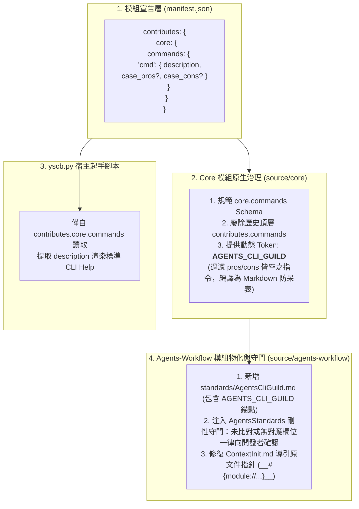

# 技術調研報告：問題歸納與統整 (Problem Summary & Synthesis)

> 調研主題：Agent 工具濫用、認知越界、ContextInit 導引缺陷與 Core-Workflow 宣告式 CLI 防呆治理體系  
> 建立日期：2026-08-27  
> 所屬主計畫：2026_08_27_0143_dev_agents_workflow_injection_expansion  
> 調研狀態：Concluded  
> 模板版本：v1.0  

---

## 1. 背景與痛點 (Background & Context)

在 YS-Codebase 多模組與自引用 (Dogfooding) 開發環境中，Agent 頻繁出現行為失控與工具濫用樣態：
1. **認知邊界混淆與越界探測**：忽視當前 Context 與 IDE 投射之工作流指引，憑藉過往記憶在 Phase 0 階段就擅自深挖 `source/` 模組內部代碼與模板。
2. **指令使用場景嚴重錯亂**：在日常模組開發、跑測與本地調試時，頻繁採用錯誤、冗餘甚至高破壞性的指令流水線。
3. **`ContextInit.md` 導引斷層**：上下文熱啟動流程未引導 Agent 閱讀投射之核心開發規範 `DevelopmentStandards.md`，且殘留過時的 `config.project.json` 讀取，導致 Agent 缺乏全局 SOP 與特化規範視野。
4. **缺少宣告式與統一規格治理**：歷史上各模組的 CLI 指令宣告在非標準的頂層 `contributes.commands`，且僅有單純字串描述，無法表達「推薦使用情境 (case_pros)」與「嚴格禁止情境 (case_cons)」。

本調研旨在系統化統整痛點情境，建立由 `core` 模組原生治理、`agents-workflow` 全局物化與守門之宣告式 CLI 防呆體系，並徹底修復 `ContextInit.md` 導引斷層。

---

## 2. 核心問題與具體情境盤點 (Problem & Scenario Inventory)

### 📌 問題 1：認知邊界混淆，未優先依賴 Context-First 而越界深挖 `source/` 源碼
- **現象描述**：在接收到工作流指令（如 `/NewPlan`）或需求討論初期（Phase 0），Agent 忽視當前會話已載入之工作流環境，第一時間向 `yscb://source/<module>/...` 進行底層檔案檢索。
- **根因分析**：
  1. **SSOT 概念過度泛化**：誤將「修改代碼需在 source」推廣為「讀取規範與模板也要去 source」，忽略了規範/模板的運行時 SSOT 是當前會話與 IDE 投射環境。
  2. **缺少 Context-First 節制紀律**：未建立「眼前 Context 優先」的四層檢索階層約束。
- **治理結論**：
  - 確立 **SSOT 讀寫二分法**：讀取規範/模板以當前 Context/IDE 投射環境為 SSOT；修改源碼以 `yscb://source/<module>/` 為 SSOT。
  - 確立 **檢索四層梯隊**：Level 1 (Prompt Context) ➔ Level 2 (IDE 投射工作流) ➔ Level 3 (`AGENTS.md` / `CHANGELOG.md`) ➔ Level 4 (`source/` 精準讀寫)。

---

### 📌 問題 2：`dev` 指令使用場景嚴重錯亂 (6 大真實情境)

| 編號 | 場景情境 | Agent 常見錯誤行為 (Wrong Action) | 標準正確方案 (Canonical Action) | 危害與根因 |
| :---: | :--- | :--- | :--- | :--- |
| **情境 1** | **模組開發測試**<br/>正在開發 `<mod>` 模組，需進行測試 | 先調用 `dev build` ➔ 再執行 `dev test --all` | **直接調用 `python yscb.py dev test <mod>`** | `dev test` 內部自動包含前置 build 與沙盒物化，手動 build 多餘；跑 `--all` 浪費大量時間。 |
| **情境 2** | **本地自引用部署調試**<br/>邏輯跑測通過，需在本地宿主自引用調試 | 擅自 `dev bump-*` ➔ `dev release` ➔ 重新安裝全部模組 | **直接執行 `python yscb.py install <mod>@build --force`**，不更新無關模組 | 本地建置直裝通道 (`@build`) 專為本地調試設計；未獲指示前嚴禁 bump 與 release，嚴禁牽連其他模組。 |
| **情境 3** | **未授權版本號遞增**<br/>開發微調過程中 | 擅自調用 `dev bump-*` 遞增版本號 | **嚴禁擅自 bump**；版本號遞增僅能在開發者顯式指示升版時執行 | 破壞版本單調性與正式發布規劃，造成版本號虛增膨脹。 |
| **情境 4** | **高頻度全模組跑測**<br/>每次修改一點代碼或微小重構 | 頻繁執行 `dev test --all` | **僅執行 `dev test <mod>`**，微調時優先附加 `--no-build` 或 `-k` | 全量沙盒測試代價高昂，日常開發僅針對當前單一模組跑測；`--all` 僅限全系統回歸或顯式指示時調用。 |
| **情境 5** | **內部原子測試指令濫用**<br/>模組內部測試除錯 | 隨意調用 `dev op-test` 原子操作 | **剛性禁止 Agent 調用 `op-test`**；測試統一走 `dev test <mod>` | `op-test` 為低階原子工具，跳過沙盒生命週期管理，易引發測試沙盒目錄殘留與環境污染。 |
| **情境 6** | **CLI 查詢盲目翻閱源碼**<br/>需要了解 CLI 命令用法與參數 | 忽略內建說明，直接翻查 `scripts/cli.py` 源碼 | **優先執行 `python yscb.py dev <cmd> --help` (Help-First)** | CLI 內建 `--help` 提供即時精確說明，翻查源碼浪費 Token 且易受內部細節干擾。 |

---

### 📌 問題 3：`ContextInit.md` 流程導引斷層與過時配置
- **現象與根因**：
  1. **遺漏載入核心開發規範與 CLI 指南**：現行 `ContextInit.md` 步驟 2 僅引導讀取專案文檔 `docs/_project/STANDARDS.md`，未引導 Agent 讀取投射於本地的 `DevelopmentStandards.md` 與 `AgentsCliGuild.md`。
  2. **編譯器原文件路徑指針錯誤**：若在模板中直接寫死產物目錄 `project://.agents/...`，違反編譯器轉譯規則。應指向原文件 `__#{module://agents-workflow/assets/standards/...}__`，由編譯器自動轉譯為各 Target 的相對連結。
  3. **殘留過時的 `config.project.json`**：在純淨語意 URI 體系下，步驟 4 應直接檢查 `workflow.plans://` 與 `workflow.archived://`。

---

## 3. 核心架構：Core-Workflow 宣告式 CLI 防呆治理體系



### 3.1 `core.commands` Schema 規格升級
- **廢止頂層**：徹底廢除舊版 `contributes.commands` 特例格式，100% 統一宣告於 `contributes["core"]["commands"]`。
- **欄位定義**：
  ```json
  "commands": {
    "<subcommand>": {
      "description": "<字串，必填，指令核心說明>",
      "case_pros": ["<字串陣列，可選，推薦/適用情境>"],
      "case_cons": ["<字串陣列，可選，嚴格禁止/不適用情境>"]
    }
  }
  ```

### 3.2 `AGENTS_CLI_GUILD` 動態 Token 生成與過濾規則
- **生成職責**：由 `core` 模組向 `agents-workflow` 宣告並提供動態計算函數。
- **過濾規則 (Filtering Rule)**：
  - 若某個指令的 `case_pros` 與 `case_cons` **兩者皆未定義、或皆為空陣列/空字串**，則**自動排除於 `AGENTS_CLI_GUILD` 生成清單**。
- **宿主 CLI (`yscb.py --help`)**：
  - 不受防呆過濾影響，直接讀取 `contributes.core.commands` 提取 `description` 輸出完整 CLI 說明。

### 3.3 `agents-workflow` 標準資產與剛性守門
1. **新增 `standards/AgentsCliGuild.md`**：
   - 在 `manifest.json` 宣告為 `standard` 導出資產。
   - 檔案主體直接放置 `__@{AGENTS_CLI_GUILD}__` 錨點，由 `core` 動態物化。
2. **在 `AgentsStandards.md` 與重要文檔注入剛性確認守門 (Confirmation Gate)**：
   > **🚨 CLI 調用比對與授權守門鐵律**：  
   > Agent 在想要調用任何 `yscb` CLI 或子模組指令前，**必須嚴格比對 `AgentsCliGuild.md` 對照表**：  
   > - 若操作情境完全符合表內 ✅ 推薦/適用情境，方可按標準指令執行。  
   > - 若欲調用之指令在對照表中**無對應欄位、或屬於 🚨 禁止/未明確定義情境**，Agent **絕對禁止擅自執行**！必須向開發者明確確認調用意圖與預期指令，**獲明確允許後方可執行**。
3. **修復 `ContextInit.md` 模板原文件指針**：
   - 步驟 2 指向：`[DevelopmentStandards.md](__#{module://agents-workflow/assets/standards/DevelopmentStandards.md}__)` 與 `[AgentsCliGuild.md](__#{module://agents-workflow/assets/standards/AgentsCliGuild.md}__)`。
   - 步驟 4 指向：直接掃描 `workflow.plans://` 與 `workflow.archived://`。

---

## 4. 模組職責拆分與落地清單 (Responsibility Matrix)

| 模組 | 職責與具體改動 |
| :--- | :--- |
| **`core`** | 1. 規範 `contributes.core.commands` Schema（`description`, `case_pros`, `case_cons`）。<br/>2. 實作 `AGENTS_CLI_GUILD` 動態 Token Provider。<br/>3. 在 `manifest.json` 宣告對 `agents-workflow` 提供 Token 注入。 |
| **`yscb.py`** | 僅讀取 `contributes.core.commands`，提取 `description` 渲染標準 CLI Help。 |
| **`agents-workflow`** | 1. 新增 `assets/standards/AgentsCliGuild.md` 並宣告 export。<br/>2. 在 `AgentsStandards.md` 注入 CLI 比對與未列情境強制確認守門。<br/>3. 修復 `ContextInit.md` 使用 `__#{module://...}__` 導引原文件指針，清理廢棄設定讀取。 |
| **`dev`** | 在 `manifest.json` 的 `contributes.core.commands` 宣告 6 大子指令防呆 (`case_pros`, `case_cons`)。 |

---
