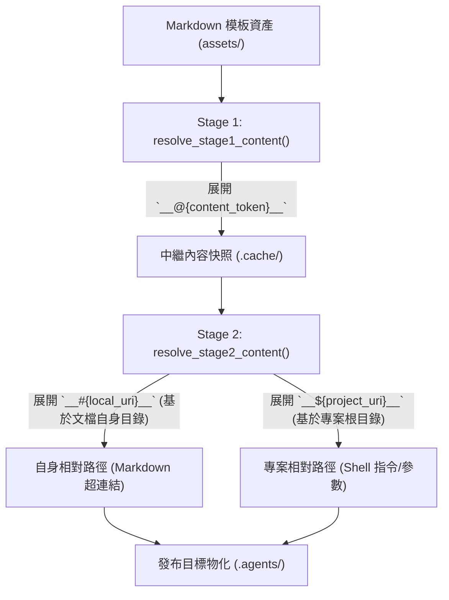

# Fast Track 敏捷開發計畫 (Fast Track Plan)

> 功能名稱：編譯器支援專案根目錄相對路徑佔位符 __${uri}__ 與三大佔位符語意規範明確化  
> 建立日期：2026-08-27  
> 所屬主計畫：2026_08_27_0143_dev_agents_workflow_injection_expansion  
> 狀態：Completed  
> 計畫類型：Level 0 Fast Track  
> 依據 P00：[P00_semantic_requirements.md](./P00_semantic_requirements.md)  
> 模板版本：v1.1  

---

## 1. 敏捷需求與實作計畫 (FT-1 Specification & Plan)

### 1.1 核心需求與邊界

#### 需求說明 (Requirements)
- **FR-01 (`__${uri}__` 專案相對路徑佔位符支援)**：
  - 在 `agents-workflow` 編譯器 (`compiler.py`) 中新增 `PROJECT_URI_REF_REGEX`，支援 Stage 2 解析 `__${uri}__` 協議標籤。
  - 解算基準點為專案根目錄 (`project://`)：`os.path.relpath(target_path, project_root_path)`。
  - 當目標檔案位於專案根目錄時輸出乾淨檔名（如 `yscb.py`）；位於子目錄時輸出相對於根目錄之路徑（如 `tools/yscb.py`），去除 `./` 前綴並統一使用正斜線 `/`。
- **FR-02 (代碼塊內部穿插替換語意)**：
  - 支援在反引號代碼塊中穿插其他文字（例如 `` `python __${yscb.host://yscb.py}__ agents-workflow plan status` ``），展開時**僅替換佔位符字串本體**，精確保留外層反引號與前後穿插文字。
- **FR-03 (未包裹佔位符安全阻斷與警示)**：
  - 佔位符強制必須由反引號包裹。若文本中出現未包裹的裸佔位符（如裸 `__@{...}__`, `__#{...}__`, `__${...}__`），編譯器**絕對不予展開**，並輸出 `[compiler:warning]` 警示訊息。
- **FR-04 (文檔規範與 ContextInit.md 實裝)**：
  - 更新 `source/agents-workflow/contributes.format.md` 與 `docs/agents-workflow/user_guide.md` 登載三大佔位符體系（`__@{token}__`, `__#{uri}__`, `__${uri}__`）。
  - 更新 `ContextInit.md` 步驟 4 指令為 `` `python __${yscb.host://yscb.py}__ agents-workflow plan status` ``。

#### 邊界防禦 (Edge Cases)
- **EC-01 (專案根目錄未配置防禦)**：若 `project://` 尚未配置或解析失敗，安全降級為直接解析實體路徑或保留原標籤。
- **EC-02 (路徑反斜線統一)**：所有 Windows 路徑一律防禦性替換 `\` 為 `/`。

---

### 1.2 架構設計與變更檔案清單



| 檔案路徑 | 變更類型 | 變更說明 |
| :--- | :---: | :--- |
| `ys_codebase/source/agents-workflow/agents_workflow/compiler.py` | MODIFY | 實作三大佔位符正則、Stage 2 專案相對路徑解算與未包裹佔位符檢查 |
| `ys_codebase/source/agents-workflow/tests/test_compiler.py` | MODIFY | 新增 `__${uri}__`、代碼塊穿插展開與未包裹警示之單元測試 |
| `ys_codebase/source/agents-workflow/assets/workflows/ContextInit.md` | MODIFY | 步驟 4 指令套用 `__${yscb.host://yscb.py}__` |
| `ys_codebase/source/agents-workflow/contributes.format.md` | MODIFY | 登載三大佔位符體系語意與使用範例 |
| `docs/agents-workflow/user_guide.md` | MODIFY | 登載三大佔位符體系使用指南 |

---

### 1.3 實作任務拆解 (FT-TASK List)

- [x] **FT-TASK-01 (`compiler.py` 核心狀態機擴充)**：
  - 定義 `CONTENT_TOKEN_REGEX` (`__@{...}__`)、`LOCAL_URI_REGEX` (`__#{...}__`)、`PROJECT_URI_REGEX` (`__${...}__`) 與未包裹偵測正則。
  - 在 `resolve_stage2_uri` 實作 `__${uri}__` 解析，以 `project://` 實體目錄計算 `relpath` 並格式化為純淨相對路徑。
  - 實作未包裹裸佔位符警示機制。
- [x] **FT-TASK-02 (單元測試與驗證)**：
  - 於 `test_compiler.py` 撰寫測試案例 FT-01 ~ FT-04，驗證專案相對路徑解析、子目錄解析、代碼塊穿插展開與未包裹警示。
  - 實機執行 `python yscb.py dev test agents-workflow` (26/26 Passed)。
- [x] **FT-TASK-03 (文檔規範與 ContextInit.md 套用)**：
  - 更新 `contributes.format.md`、`docs/agents-workflow/user_guide.md` 與 `ContextInit.md`。
- [x] **FT-TASK-04 (Dogfooding 自引用構建、安裝與驗收)**：
  - 執行 `dev build agents-workflow` ➔ `install agents-workflow@build --force` ➔ `agents-workflow release antigravity`。
  - 實機驗證物化後之 `ContextInit.md` 正確輸出 `python yscb.py agents-workflow plan status`。
  - 執行全系統回歸 `python yscb.py dev test --all` (125/125 Passed)。

---

### 1.4 測試案例清單 (Test Cases)

| 測試編號 | 測試類型 | 驗證目標與斷言 | 執行方法 | 測試結果 |
| :--- | :--- | :--- | :--- | :---: |
| **FT-01** | 單元測試 | 驗證 `` `__${project://yscb.py}__` `` 在專案根目錄下正確展開為 `` `yscb.py` ``。 | `test_compiler.py` | ✅ Passed |
| **FT-02** | 單元測試 | 驗證 `` `__${project://tools/sub/cli.py}__` `` 正確展開為 `` `tools/sub/cli.py` ``。 | `test_compiler.py` | ✅ Passed |
| **FT-03** | 單元測試 | 驗證代碼塊內穿插 `` `python __${project://yscb.py}__ plan status` `` 正確展開為 `` `python yscb.py plan status` ``。 | `test_compiler.py` | ✅ Passed |
| **FT-04** | 單元測試 | 驗證裸佔位符（無反引號包裹）不被展開並輸出 warning 提示訊息。 | `test_compiler.py` | ✅ Passed |
| **FT-05** | 回歸測試 | `python yscb.py dev test agents-workflow` 26/26 通過。 | CLI 跑測 | ✅ Passed |
| **FT-06** | 全系統回歸 | `python yscb.py dev test --all` 125/125 通過。 | CLI 跑測 | ✅ Passed |

---

## 2. 實作與驗證成果 (FT-2 Execution & Test Log)

### 實機跑測報告 (Execution Logs)
```text
======================================================================
YS-Codebase Test Execution Diagnostic Report
======================================================================
[*] Module: agents-workflow                                        [PASS]
    |-- [Contract] Auto-Contract Suite ... (3/3)
    \-- [Custom]   Custom Tests ........... (23/23)
[*] Module: core                                                   [PASS]
    |-- [Contract] Auto-Contract Suite ... (3/3)
    \-- [Custom]   Custom Tests ........... (66/66)
[*] Module: dev                                                    [PASS]
    |-- [Contract] Auto-Contract Suite ... (3/3)
    \-- [Custom]   Custom Tests ........... (27/27)
----------------------------------------------------------------------
Summary : 125 Total, 125 Passed, 0 Failed, 0 Skipped (48.400s)
Status  : PASSED (100% Ready)
======================================================================
```

---

## 3. 結案與交付確認 (FT-3 Closure & Walkthrough)

### 3.1 成果展示與結案確認
- **三大佔位符體系**：
  1. `` `__@{token}__` ``：Stage 1 文件內容狀態機展開。
  2. `` `__#{uri}__` ``：Stage 2 相對於當前 Markdown 文件目錄展開（超連結）。
  3. `` `__${uri}__` ``：Stage 2 相對於專案根目錄 (`project://`) 展開（Shell 指令與專案路徑）。
- **自適應成果**：
  `ContextInit.md` 之起手式指令 `` `python __${yscb.host://yscb.py}__ agents-workflow plan status` `` 已成功物化為 `` `python yscb.py agents-workflow plan status` ``，當宿主移動至子目錄時可 100% 自動無縫自適應展開為 `` `python sub/path/yscb.py ...` ``！
- **結案狀態**：`Completed`

