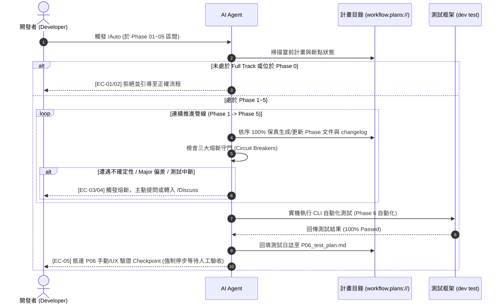

# 架構設計說明書 (Architecture Design)

> 功能名稱：Agents-Workflow 模組新增 Auto 工作流 (Add Auto Workflow to Agents-Workflow)  
> 建立日期：2026-08-27  
> 狀態：Confirmed  
> 依據 P01：[P01_requirements_spec.md](./P01_requirements_spec.md)  
> 模板版本：v1.2  

---

## 1. 模組架構分層與職責邊界 (Layered Architecture)

```text
+-------------------------------------------------------------------------------+
|                           IDE & Slash Command Layer                           |
|       /Auto (Antigravity Slash Command / Developer Prompt Trigger)            |
+-------------------------------------------------------------------------------+
                                      │
                                      ▼
+-------------------------------------------------------------------------------+
|                       Workflow Guidelines Layer (資產層)                       |
|  source/agents-workflow/assets/workflows/Auto.md                              |
|  - 步驟 1：識別當前計畫與斷點 Phase (Phase 1~5)                                 |
|  - 步驟 2：連續推進管線 (Phase 1 -> Phase 2 -> Phase 3 -> Phase 4 -> Phase 5)   |
|  - 步驟 3：Phase 6 自動化測試執行與日誌登載                                     |
|  - 步驟 4：阻斷於 P06 UX/人工驗收關卡 (Mandatory UX Gate)                       |
+-------------------------------------------------------------------------------+
                                      │
                                      ▼
+-------------------------------------------------------------------------------+
|                     Standards & Guardrails Layer (規範治理層)                  |
|  source/agents-workflow/assets/standards/DevelopmentStandards.md              |
|  - 定義 Auto 指令跳過中間 Checkpoint 之授權與範圍 (Full Track / Umbrella)      |
|  - 剛性聲明三大熔斷原則 (零臆測熔斷 / 偏差熔斷 / P06 UX 阻斷)                  |
+-------------------------------------------------------------------------------+
                                      │
                                      ▼
+-------------------------------------------------------------------------------+
|                    Compilation & Export Layer (模組宣告與發布層)               |
|  source/agents-workflow/manifest.json                                         |
|  - contributes["agents-workflow"]["export"] 註冊 Auto.md                     |
|  - ReleasePublisher 自動轉譯佔位符並物化至 .agents/workflows/Auto.md           |
+-------------------------------------------------------------------------------+
```

---

## 2. 核心資料流與循序圖 (Data Flow & Sequence Diagram)



---

## 3. 受影響檔案與新建檔案清單 (Impacted & New Files Inventory)

| 檔案路徑 | 類型 | 職責與變更說明 |
| :--- | :---: | :--- |
| `source/agents-workflow/assets/workflows/Auto.md` | **New** | Auto 工作流指引文檔，定義觸發條件、連續推進生命週期、步驟與三大熔斷機制。 |
| `source/agents-workflow/manifest.json` | **Modify** | 於 `contributes["agents-workflow"]["export"]` 宣告註冊 `Auto.md`。 |
| `source/agents-workflow/assets/standards/DevelopmentStandards.md` | **Modify** | 於生命週期與分流章節中補充 `/Auto` 連續推進模式之授權與三大熔斷原則。 |
| `source/agents-workflow/tests/test_auto_workflow.py` | **New** | 單元測試：驗證 `Auto.md` 結構合規、`manifest.json` 導出齊備與編譯解析正確性。 |

---

## 4. 架構決策記錄 (Architecture Decision Records)

- **[P02:DR-01] (Auto 執行管線與四大核心步驟)**：
  - 確立 Auto 工作流分為：
    1. **步驟 1 (狀態掃描)**：定位進行中 Full Track 計畫與當前斷點。
    2. **步驟 2 (連續推進閉環)**：依序執行 Phase 1 ➔ Phase 5，產出 100% 完整鏡像標準模板文件與代碼。
    3. **步驟 3 (自動化跑測與日誌回填)**：實機執行 CLI 測試並更新 P06。
    4. **步驟 4 (P06 UX 阻斷關卡)**：強制停步並呈遞測試報告，等待人工驗收。
- **[P02:DR-02] (佔位符與編譯相容性保證)**：
  - `Auto.md` 引用內部模板與規範採用 `__#{uri}__` 自身相對路徑佔位符；開頭採用 `__@{DYNAMIC_CONTEXT_MAP}__` 動態地圖注入，100% 相容既有 `ReleasePublisher`。

---

## 5. 追溯矩陣 (Traceability Matrix)

| 需求編號 | 架構組件 / 檔案 | 測試案例 (Phase 2 Test-First) |
| :--- | :--- | :--- |
| **FR-01** | `Auto.md` | `FT-01` |
| **FR-02** | `manifest.json` | `FT-02` |
| **FR-03** | `DevelopmentStandards.md` | `FT-01` |
| **FR-04** | `Auto.md` 推進規範 | `FT-03` |
| **EC-01~06** | `Auto.md` 熔斷守門條款 | `ET-01`, `ET-02`, `ET-03` |
