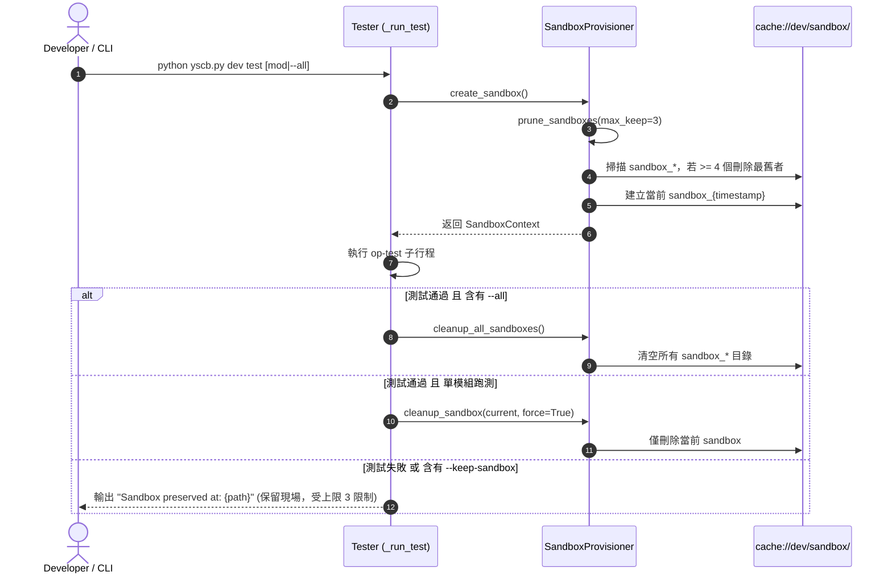

# 架構設計說明書 (Architecture Design)

> 功能名稱：殘留 sandbox 清理機制 (Residual Sandbox Cleanup)  
> 建立日期：2026-08-27  
> 所屬主計畫：`plans://2026_08_27_1506_dev_test_architecture_optimization/`  
> 狀態：`Confirmed`  
> 模板版本：v1.2  

---

## 1. 模組架構分層與職責邊界 (Layered Architecture)

```text
+-------------------------------------------------------------------------+
|                              Tester CLI                                 |
|   _run_test(argv) -> 判斷 --all 與 returncode                           |
|      +-- 若 --all 且 code==0: SandboxProvisioner.cleanup_all_sandboxes()|
|      +-- 若一般成功且無 --keep-sandbox: cleanup_sandbox(current)        |
|      +-- 若失敗/保留: 保留 current，滾動上限由 prune_sandboxes 守門    |
+-------------------------------------------------------------------------+
                                    |
                                    v
+-------------------------------------------------------------------------+
|                         SandboxProvisioner                              |
|   +-- create_sandbox() -> 呼叫 prune_sandboxes(max_keep=3)              |
|   +-- prune_sandboxes(max_keep=3) -> 掃描 sandbox_*，依時間排序，刪除超額 |
|   +-- cleanup_all_sandboxes() -> 清空 cache://dev/sandbox/ 所有 sandbox_*|
|   +-- cleanup_sandbox(sandbox_dir, force=True)                          |
+-------------------------------------------------------------------------+
                                    |
                                    v
+-------------------------------------------------------------------------+
|                  VFS Cache (cache://dev/sandbox/)                       |
|   .cache/dev/sandbox/sandbox_20260827_150000_123456/                    |
|   .cache/dev/sandbox/sandbox_20260827_150500_654321/                    |
+-------------------------------------------------------------------------+
```

---

## 2. 核心資料流與循序圖 (Data Flow & Sequence Diagram)



---

## 3. 受影響檔案與新建檔案清單 (Impacted & New Files Inventory)

| 檔案路徑 | 類型 | 職責與變更說明 |
| :--- | :---: | :--- |
| `ys_codebase/source/dev/dev/testing/sandbox.py` | Modify | 新增 `prune_sandboxes(max_keep=3)` 與 `cleanup_all_sandboxes()` 靜態方法，並在 `create_sandbox` 與保留時整合滾動修剪。 |
| `ys_codebase/source/dev/dev/tester.py` | Modify | 在 `_run_test` 結尾處判斷 `"--all"` 且 `ret_code == 0` 時呼叫 `cleanup_all_sandboxes()`。 |
| `ys_codebase/source/dev/tests/test_sandbox.py` | Modify | 新增滾動修剪（保留上限 3 個）與全量清空之單元測試案例。 |
| `ys_codebase/source/dev/tests/test_tester.py` | Modify | 增補 `dev test --all` 成功時清空沙盒緩存之行為驗證。 |

---

## 4. 架構決策記錄 (Architecture Decision Records)

- **[P02:DR-01] 滾動修剪時機點**：在 `SandboxProvisioner.create_sandbox()` 建立新沙盒前呼叫 `prune_sandboxes(max_keep=3)`，確保建立前已釋放超額沙盒，且新生成後總數 $\le 4$；若失敗保留，下次建立前立即淘汰最舊者。
- **[P02:DR-02] 沙盒時間戳排序演算法**：沙盒目錄命名為 `sandbox_YYYYMMDD_HHMMSS_ffffff`，其字串自然排序 (lexicographical sorting) 100% 等價於時間倒序/正序，以目錄名稱排序作為第一基準，精確穩定且不依賴作業系統 mtime 差異。
