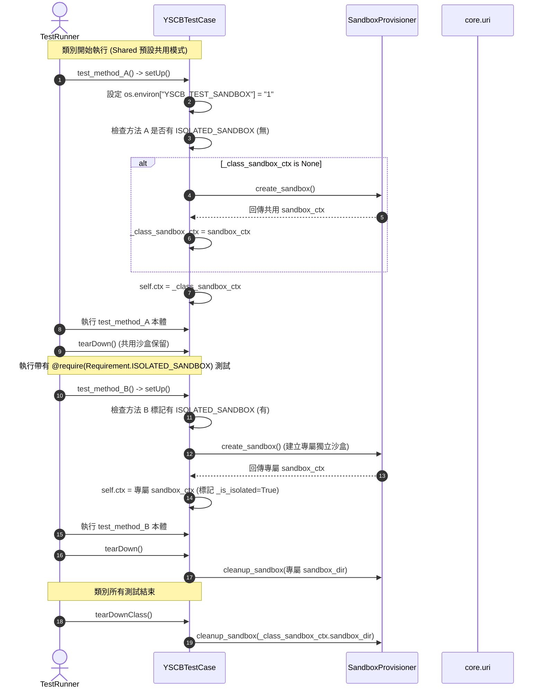
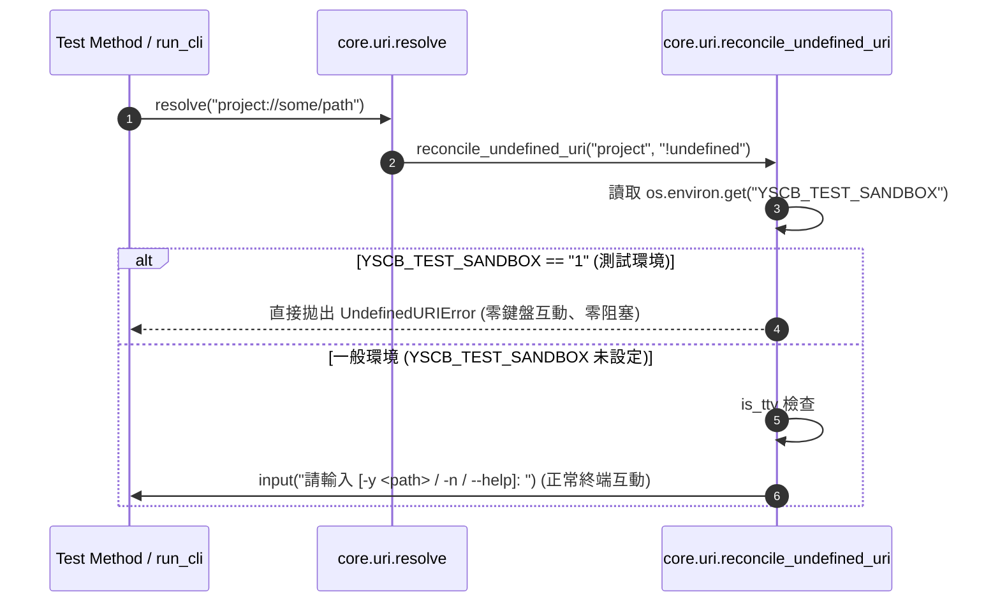

# 架構設計說明書 (Architecture Design)

> 功能名稱：測試架構完善 (Test Architecture Refinement)  
> 建立日期：2026-08-27  
> 所屬主計畫：`plans://2026_08_27_1506_dev_test_architecture_optimization/`  
> 狀態：`Confirmed`  
> 模板版本：v1.2  

---

## 1. 模組架構分層與職責邊界 (Layered Architecture)

```text
+-------------------------------------------------------------------------------+
|                             core.uri (VFS 協議解析層)                         |
|   reconcile_undefined_uri : 增設 YSCB_TEST_SANDBOX 環境變數感應               |
|                             -> 當為 "1" 時立即抑制 input() 並拋出 UndefinedURIError |
+-------------------------------------------------------------------------------+
                                        ^
                                        | (YSCB_TEST_SANDBOX 環境變數透傳)
+-------------------------------------------------------------------------------+
|                      dev.testing.requirement (能力需求宣告層)                  |
|   Requirement.ISOLATED_SANDBOX = auto() : 定義專屬獨立沙盒 Flag               |
+-------------------------------------------------------------------------------+
                                        ^
                                        | (裝飾器元數據與沙盒分流判定)
+-------------------------------------------------------------------------------+
|                         dev.testing.case (基底 TestCase 層)                   |
|   YSCBTestCase                                                                |
|     |-- _class_sandbox_ctx : Class-Level 延遲初始化共用沙盒實例               |
|     |-- setUp() : 設置 YSCB_TEST_SANDBOX=1; 檢查當前方法是否標記 ISOLATED_SANDBOX|
|     |             -> 若無: 複用 _class_sandbox_ctx (共用模式)                 |
|     |             -> 若有: 建立專屬 self.ctx (獨立模式)                       |
|     |-- tearDown() : 獨立模式銷毀專屬沙盒; 共用模式保留沙盒供同類別後續測試複用  |
|     |-- tearDownClass() : 類別測試全部結束後統一清理 _class_sandbox_ctx       |
|     \-- run_cli() : 子行程環境自動透傳 YSCB_TEST_SANDBOX="1"                  |
+-------------------------------------------------------------------------------+
                                        ^
                                        | (測試執行調度)
+-------------------------------------------------------------------------------+
|                      dev.testing.runner & dev.tester (執行器層)               |
|   TestRunner / Tester : 執行前自動注入 YSCB_TEST_SANDBOX="1"                   |
+-------------------------------------------------------------------------------+
```

---

## 2. 核心資料流與循序圖 (Data Flow & Sequence Diagram)

### 2.1 沙盒分流生命週期 (Shared vs. Isolated Lifecycle)



### 2.2 URI JIT 測試模式非互動防護循序圖



---

## 3. 受影響檔案與新建檔案清單 (Impacted & New Files Inventory)

| 檔案路徑 | 類型 | 職責與變更說明 |
| :--- | :---: | :--- |
| `ys_codebase/source/core/core/uri.py` | Modify | 在 `reconcile_undefined_uri` 增加 `YSCB_TEST_SANDBOX` 檢測，為 `"1"` 時強制非互動模式並拋出 `UndefinedURIError`。 |
| `ys_codebase/source/dev/dev/testing/requirement.py` | Modify | `Requirement` 列舉新增 `ISOLATED_SANDBOX = auto()`。 |
| `ys_codebase/source/dev/dev/testing/case.py` | Modify | 實作 Class-level 共用沙盒與 Per-Method 獨立沙盒分流，於 `setUp` 設置 `YSCB_TEST_SANDBOX=1`，於 `run_cli` 透傳該變數。 |
| `ys_codebase/source/dev/dev/testing/runner.py` | Modify | 於 `run_suite` 前後確保 `YSCB_TEST_SANDBOX=1` 注入與清理。 |
| `ys_codebase/source/dev/dev/tester.py` | Modify | 於 `_run_test` 確保 `YSCB_TEST_SANDBOX=1` 注入。 |
| `ys_codebase/source/core/tests/test_uri.py` | Modify | 新增測試驗證 `YSCB_TEST_SANDBOX=1` 時 `uri.resolve` 自動靜默拋出 `UndefinedURIError`。 |
| `ys_codebase/source/dev/tests/test_sandbox.py` | Modify | 新增測試驗證 `Requirement.ISOLATED_SANDBOX` 獨立沙盒與預設共用沙盒之生命週期行為。 |

---

## 4. 架構決策記錄 (Architecture Decision Records)

- **[P02:DR-01] Class-Level 延遲初始化 (Lazy Shared Sandbox)**：共用沙盒不強制在 `setUpClass` 靜態物化，而是在該類別第一個非 `ISOLATED_SANDBOX` 測試方法被調用時延遲物化（若全類別均為獨立沙盒或純內存測試則完全免去共用沙盒開銷），並在 `tearDownClass` 統一釋放。
- **[P02:DR-02] 狀態隔離與環境還原守門**：即使在共用沙盒模式下，每個測試方法 `setUp`/`tearDown` 仍 100% 備份與還原 `sys.path` 與 `os.environ`，確保單一測試對環境變數的修改不跨測試方法外溢。
- **[P02:DR-03] 零侵入環境識別標籤 `YSCB_TEST_SANDBOX`**：以輕量環境變數作為跨行程（Subprocess CLI）與跨模組（Core/Dev）的唯一測試標記，零引入額外依賴或外部組態。
