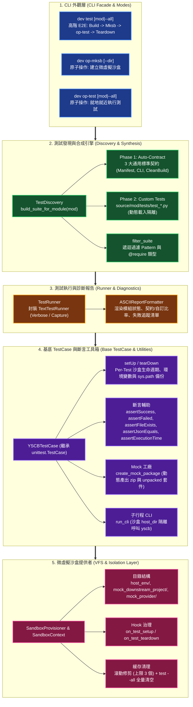
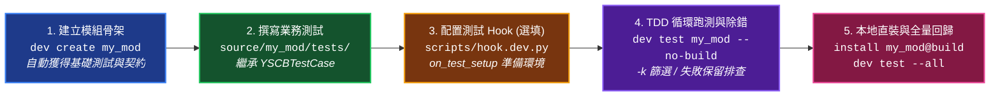

# 技術調研報告：現行測試架構全景與完善維度調研

> 調研主題：現行測試架構現狀梳理與潛在優化維度 (Current Test Architecture Landscape & Refinement Vectors)  
> 建立日期：2026-08-27  
> 所屬主計畫：`plans://2026_08_27_1506_dev_test_architecture_optimization/`  
> 調研狀態：`Concluded`  
> 模板版本：v1.0  

---

## 1. 現行測試架構全景與分層結構 (Architecture Landscape)

YS-Codebase 的測試體系由 `source/dev/dev/` 與 `source/dev/dev/testing/` 模組構成，劃分為五大核心階層：



---

## 2. 核心機制詳細盤點 (Detailed Mechanism Inventory)

### 2.1 雙軌測試套件合成 (Dual-Track Test Suite)
- **Phase 1：通用標準契約測試 (Universal Auto-Contract Tests)**
  - 每個模組**無須手動撰寫任何模板代碼**，由 `make_contract_suite(module_name)` 自動合成 3 個合約測試：
    1. `test_contract_manifest_schema`：驗證 `manifest.json` 必要欄位（`name`, `version`, `entry`）與命名吻合。
    2. `test_contract_entrypoint_valid`：驗證 `scripts/cli.py` 存在、Python AST 語法無誤且具備 `main(argv)` 進入點。
    3. `test_contract_clean_build`：驗證 `dev build <mod>` 純淨建置成功並產出 `.build.zip`。
- **Phase 2：模組自訂功能測試 (Custom Tests)**
  - 自動掃描 `source/<mod>/tests/test_*.py`。
  - 具備 `sys.modules` 清理機制（防止測試間 module 快取污染）與 `sys.path` 隔離重排。

### 2.2 測試維度標記與過濾系統 (`@require`)
- 透過 `@require(Requirement.LOGIC | HOST_CLI | NETWORK)` 裝飾測試方法。
- CLI 支援 `--type=<logic|host_cli|network>` 與 `-k <pattern>` 快速篩選。

### 2.3 `YSCBTestCase` 提供的測試工具鏈
- **斷言輔助函式**：
  - `assertSuccess(ret_code)` / `assertFailed(ret_code)`
  - `assertInOutput(expected, stdout)`
  - `assertFileExists(path_or_uri)`（支援語意 URI 如 `module://...`）
  - `assertJsonEquals(expected, path_or_uri)`
  - `assertExecutionTime(max_seconds)`（ContextManager 量測區塊耗時）
- **動態 Mock 套件生成器**：
  - `create_mock_package(name, version, deps, description)`：於沙盒 `mock_provider/` 中即時生成未打包目錄與 `.zip`，並維護 `index.json`。
- **子行程 CLI 隔離執行器**：
  - `run_cli(args, cwd, env)`：於獨立子行程調用沙盒內部的 `yscb.py`。

### 2.4 沙盒生命週期與環境隔離
- **完整隔離**：每個繼承 `YSCBTestCase` 的測試方法，在 `setUp()` 時皆生成獨立沙盒實例目錄於 `cache://dev/sandbox/sandbox_*`。
- **雙軌自動清理**：
  - 常態滾動上限：最多保留 3 個失敗沙盒，第 4 個生成時自動刪除最舊者。
  - `test --all` 成功全量清空：整批回歸通過時全量清空。

### 2.5 模組開發者視角：從零到交付的測試工作流 (Module Developer Journey)

從一個第三方或內部模組開發者的視角，對接測試體系的操作工作流如下：



#### 模組測試程式碼撰寫標準範例：
```python
# 檔案位置：source/<my_module>/tests/test_feature.py
from dev.testing import YSCBTestCase, require, Requirement
from my_module import core_logic

class TestMyFeature(YSCBTestCase):
    @require(Requirement.LOGIC)
    def test_pure_logic(self):
        """1. 純內部邏輯 / 演算法單元測試"""
        res = core_logic.calculate(10, 20)
        self.assertEqual(res, 30)
        self.mark_passed()

    @require(Requirement.LOGIC)
    def test_mock_package_and_vfs(self):
        """2. 涉及 Mock 套件與語意 URI 讀寫測試"""
        # 動態建立相依 Mock 套件
        pkg_dir = self.create_mock_package("mock_dep", "1.0.0")
        self.assertFileExists(f"{pkg_dir}/manifest.json")
        self.mark_passed()

    @require(Requirement.HOST_CLI)
    def test_cli_command(self):
        """3. 端到端 CLI 調用測試（於隔離沙盒子行程執行）"""
        ret, stdout, stderr = self.run_cli(["my-module", "do-action"])
        self.assertSuccess(ret)
        self.assertInOutput("Action Finished", stdout)
        self.mark_passed()
```

---

## 3. 現行架構優勢與可完善痛點對照 (Pros vs. Improvement Opportunities)

| 構面 | 現行狀態與優勢 | 潛在痛點 / 可完善維度 |
| :--- | :--- | :--- |
| **沙盒顆粒度與執行開銷** | 每個測試方法 100% 獨立乾淨沙盒，徹底避免狀態殘留。 | 🚨 **Per-Test 開銷高**：每個 test method 都要執行完整的目錄複製、寫組態、呼叫 hook。在測試案例達數十個時（如 `dev` 35 個測試），跑測耗時長（~40s）。缺少 Class-level 共用沙盒或 Lightweight MockContext（免實體沙盒）。 |
| **並行執行能力** | 循序單行程執行，邏輯簡單穩定。 | 🚨 **無並行加速**：模組與測試案例間無法透過多行程 (Multi-process) 同時跑測，未能充分利用多核心 CPU。 |
| **程式碼覆蓋率 (Coverage)** | 無內建 coverage 支援。 | 缺少 `dev test --coverage` 統計工具，無法得知模組實際被覆蓋的行數/分支比例。 |
| **Mock 工具鏈豐富度** | 具備基礎 `create_mock_package` 與 `set_module_config`。 | 缺少常用的進階 Mock 工具：例如 Mock HTTP/網絡服務、Mock Provider Repository、虛擬時間/時鐘（Freeze Gun）、假 Git 環境與暫存目錄 ContextManager。 |
| **測試生命週期 Hook** | 支援 `scripts/hook.dev.py` 的 `on_test_setup` 與 `on_test_teardown`。 | Hook 僅針對沙盒建立/銷毀，缺少測試案例級別（`before_each_test`, `after_each_test`）或自訂事件廣播機制。 |
| **結構化報告導出** | 具備精美 ASCII 終端報表與失敗追蹤。 | 缺少機器可讀輸出格式（如 `--json-report`、JUnit XML 導出），不便於 IDE 擴充或 CI 工具鏈自動整合。 |
| **測試參數彈性** | 支援 `--no-build`, `-k`, `--type`, `--keep-sandbox`。 | 缺少 `--fail-fast`（遇到第一個錯誤立即停止）、`--retry`（不穩定測試重試）或 `--shuffle`（隨機順序打亂）等進階參數。 |

---

## 4. 調研總結與推薦討論方向

現行測試架構在「**沙盒隔離度**」與「**合約規範化**」方面基礎非常穩健，但主要在以下三大方向具有顯著優化空間：

1. **效能與顆粒度優化**：輕量級測試模式、Class-Level 沙盒共享、或是多行程並行執行。
2. **開發與除錯體驗**：`--fail-fast` 快速失敗中斷、更豐富的 Mock 工具函式庫、或是 JSON 報告導出。
3. **品質度量**：整合程式碼覆蓋率（Coverage）度量。
