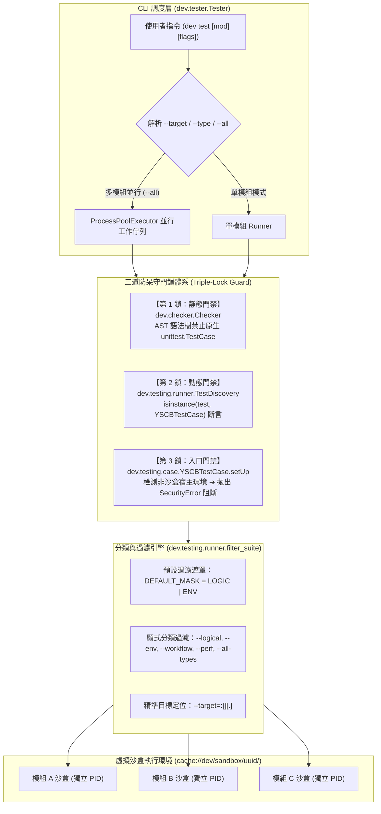
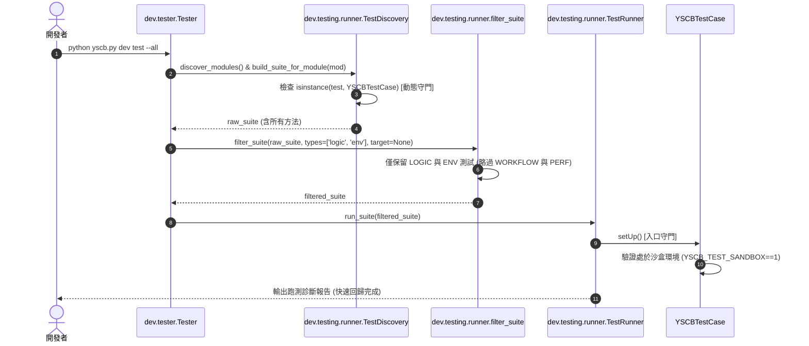

# 架構設計說明書 (Architecture Plan)

> 功能名稱：測試分類體系重構、效能深水區與沙盒型別安全防固 (Test Taxonomy, Performance & Sandbox Type Safety)  
> 建立日期：2026-08-27  
> 所屬主計畫：`plans://2026_08_27_1506_dev_test_architecture_optimization/`  
> 狀態：`Confirmed`  
> 模板版本：v1.2  

---

## 1. 系統架構與模組拓撲圖 (System Topology & Architecture)

---

## 2. 核心架構時序圖 (Sequence Diagrams)

### 2.1 測試分類過濾與目標定位時序圖

---

## 3. 技術選型與設計決策 (Design Decisions)

| 設計維度 | 決策方案 | 決策理由與替代方案對比 |
| :--- | :--- | :--- |
| **四層測試列舉** | `Requirement(Flag)` 包含 `LOGIC`, `ENV`, `WORKFLOW`, `PERF`, `ISOLATED_SANDBOX` | 採用 Python `enum.Flag` 支援位元 OR 組合（如 `@require(Requirement.LOGIC \| Requirement.ISOLATED_SANDBOX)`）。 |
| **預設過濾策略** | `DEFAULT_MASK = LOGIC \| ENV` | 保障日常開發與全量回歸可在秒級快速完成；重型 E2E 工作流與壓力測試需顯式開關觸發。 |
| **非標準入口阻斷** | `YSCBTestCase.setUp` 拋出 `SecurityError` | 防止任何在宿主裸跑之行為侵犯真實檔案系統，防禦強度超越靜態文件規範。 |
| **多模組並行跑測** | `concurrent.futures.ProcessPoolExecutor` | 各模組沙盒相互獨立，利用多核心將跑測耗時壓縮至單一最慢模組時間。 |
