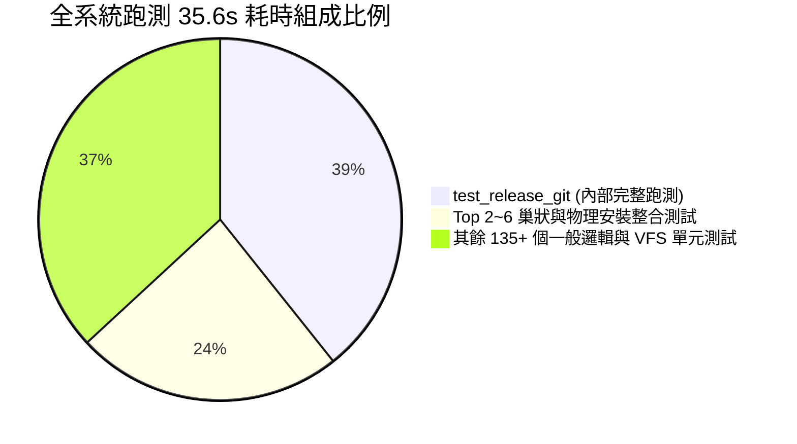

# 技術調研報告：測試執行瓶頸與耗時分析

> 調研主題：測試執行瓶頸與耗時分析 (Test Execution Bottleneck & Profiling Investigation)  
> 建立日期：2026-08-27  
> 所屬主計畫：`plans://2026_08_27_1506_dev_test_architecture_optimization/`  
> 調研狀態：`Concluded`  
> 模板版本：v1.0  

---

## 1. 全系統測試耗時現狀與總體分佈 (Overview)

在 `sub_02` 引入「預設共用沙盒」機制後，全系統 141 個測試案例在 Windows 實機環境的總執行耗時從 ~73 秒降低至 **35.6 秒**（加速超過 50%）。

---

## 2. 實機量測數據：Top 10 最耗時測試案例 (Top 10 Slowest Cases)

| 排名 | 單一耗時 | 佔總比 | 測試方法與所屬檔案路徑 | 核心耗時根因分析 |
| :---: | :---: | :---: | :--- | :--- |
| **#1** | **13.998s** | **39.3%** | `test_release_git_smart_skip_and_force` (`source/dev/tests/test_release_pipeline.py`) | **內部完整跑測守門**：`release_git` 在發布前會自動調用 `dev test core` 跑測守門，導致在跑 `dev` 測試時，內部又完整跑了一次 `core` 模組 70 個測試的端到端沙盒建立與執行。 |
| **#2** | **2.452s** | **6.9%** | `test_dev_test_high_level_orchestration` (`source/dev/tests/test_sandbox.py`) | **巢狀端到端沙盒測試**：調用子行程執行 `dev test core --contract-only`，包含前置構建、物化子沙盒與清理。 |
| **#3** | **1.919s** | **5.4%** | `test_remove_reverse_dependency_guard` (`source/core/tests/test_installer.py`) | **多套件物理安裝與依賴圖計算**：動態生成多個 Mock 套件、Zip 解壓縮、拓撲 DAG 反向依賴檢查與卸載。 |
| **#4** | **1.663s** | **4.7%** | `test_run_test_all_success_cleans_sandboxes` (`source/dev/tests/test_tester.py`) | **子行程跑測與全量清空檢驗**：調用測試執行器驗證沙盒目錄清空行為。 |
| **#5** | **1.348s** | **3.8%** | `test_remove_lifecycle_cache_cleaning_and_purge` (`source/core/tests/test_installer.py`) | **生命週期 Hook 觸發與解裝**：動態安裝模組並廣播生命週期 Hook、觸發資產熱重載與檔案持久化銷毀。 |
| **#6** | **1.126s** | **3.2%** | `test_shared_and_isolated_sandbox_dispatch` (`source/dev/tests/test_case.py`) | **沙盒分流綜合檢驗**：即時建立並銷毀獨立沙盒與共用沙盒。 |
| **#7** | **0.992s** | **2.8%** | `test_snapshot_and_restore` (`source/core/tests/test_engine.py`) | **快照打包與還原**：執行整庫檔案掃描、ZIP 壓縮與解壓還原。 |
| **#8** | **0.782s** | **2.2%** | `test_host_config_isolation_from_project_uri` (`source/core/tests/test_engine.py`) | **物理拓撲與宿主組態計算**。 |
| **#9** | **0.549s** | **1.5%** | `test_op_test_in_place_execution` (`source/dev/tests/test_sandbox.py`) | **本地就地跑測調度**。 |
| **#10**| **0.521s** | **1.5%** | `test_cyclic_dependency_protection` (`source/core/tests/test_uri.py`) | **循環協議解算與攔截**。 |

---

## 3. 關鍵瓶頸深度剖析與優化候選方向 (Optimization Strategies)

### 3.1 瓶頸 1：`test_release_git` 內部重複跑測 (14.0s)
- **現況根因**：`ReleasePipeline.release_git()` 設計上為了安全，在 `git tag` 前會呼叫 `tester.run(["test", mod])`。而在單元測試中，這導致重複跑一次 `core` 模組整套 70 個測試。
- **優化方向**：
  - **方案 A (Mock 測試跑測結果)**：在 `test_release_git` 單元測試中，Mock `tester.run` 直接回傳 0（成功），專注測試 `release_git` 本身的智慧略過與 Git 操作邏輯。
  - **方案 B (`--no-test` 參數支援)**：為 `release_git` 增加可選參數（或內部測試開關），單元測試中略過耗時的前置跑測。
  - **預期收益**：**瞬間減少約 13.5 秒**（總耗時直接降至 22s 左右）。

### 3.2 瓶頸 2：多套件物理安裝與 ZIP 解壓縮 I/O (3.5s)
- **現況根因**：`test_installer.py` 的測試建立大量實體 Mock ZIP 套件並頻繁解壓至 `mock_provider` 與 `modules/`。
- **優化方向**：
  - **方案**：複用 Mock 套件目錄或使用已編譯好的乾淨 Mock 模板快取，減少重複 ZIP 壓縮與解壓次數。

### 3.3 瓶頸 3：並行測試調度 (Parallel Test Execution)
- **現況根因**：目前 `TestRunner` 是單行程循序跑測，`agents-workflow`、`core`、`dev` 三大模組依序執行。
- **優化方向**：
  - **方案**：在 `dev test --all` 時支援多模組多行程並行（Multi-Process Suite Runner）。
  - **預期收益**：充分利用 CPU 多核心，總時間可進一步被最大模組耗時吞吐，降至 10~15 秒內。
