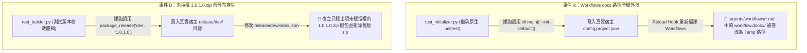
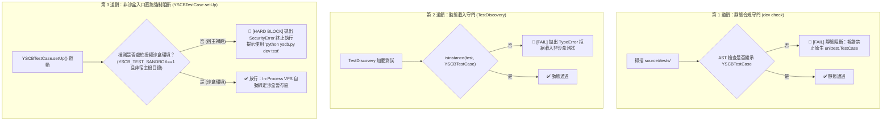

# 技術調研報告：沙盒隔離邊界漏洞與型別安全防固

> 調研主題：沙盒隔離邊界漏洞與型別安全防固調研 (Sandbox Boundary Leakage & Type Safety Investigation)  
> 建立日期：2026-08-27  
> 所屬主計畫：`plans://2026_08_27_1506_dev_test_architecture_optimization/`  
> 調研狀態：`Concluded`  
> 模板版本：v1.0  

---

## 1. 調研背景與深水區問題現狀 (Background & Problem Statement)

在專案演進與效能剖析過程中，發現了兩起嚴重的「測試沙盒邊界外洩與宿主環境污染事件」：



這兩起事件暴露了現行測試架構在 **「非標準入口直跑」**、**「In-Process 進程內呼叫」** 與 **「測試類別繼承規範」** 上的多重深水區漏洞。

---

## 2. 核心漏洞點與根因歸納 (Root Cause & Gap Analysis)

經過地毯式清查全庫 16 個測試檔案，歸納出四大核心問題點：

| 編號 | 核心問題點 | 現況與機制描述 | 危害程度 |
| :---: | :--- | :--- | :---: |
| **GAP-01** | **測試框架繼承分裂與原生 `unittest.TestCase` 氾濫** | 全庫 16 個測試檔案中，有高達 **12 個檔案**（包含 `agents-workflow` 全部 5 個檔案、`dev` 的 `test_release_pipeline.py` 及 `core` 的 6 個檔案）仍直接繼承 Python 原生 `unittest.TestCase`。原生測試對 YSCB 虛擬檔案系統（VFS）完全無感知，不具備任何沙盒生命週期管理能力。 | 🚨 嚴重 |
| **GAP-02** | **非標準入口（宿主裸跑）缺乏強制阻斷** | 當測試在 IDE（如 VS Code / PyCharm Test Explorer）、`pytest` 或 `python -m unittest` 裸機直接執行時，缺乏環境守門機制，測試代碼會在真實宿主環境中直接執行，失去外層 `SandboxProvisioner` 的保護。 | 🚨 嚴重 |
| **GAP-03** | **In-Process 進程內呼叫缺乏 VFS 重定向** | 即使測試類別繼承了 `YSCBTestCase`，但測試代碼常直接實例化 Python 類別（如 `Builder()`、`WorkflowInitializer()`）而非調用 `run_cli`。此時底層 `core.uri` 會使用當前主進程的工作目錄，若主進程在宿主，寫入操作將直接穿透至宿主檔案系統。 | 🚨 嚴重 |
| **GAP-04** | **測試缺乏副作用備份與 `tearDown` 還原機制** | 具備檔案寫入副作用之測試（如 `test_initializer.py`），在測試結束時僅清理自己的 `tempfile` 目錄，未對全域 `config.project.json` 或 `release/` 進行快照備份與還原。 | ⚠️ 中度 |

---

## 3. 全庫測試繼承現況清查矩陣 (Test Suites Inventory)

| 模組 | 測試檔案名稱 | 目前基礎類別 | 是否為原生 `unittest.TestCase` | 涉及之寫入副作用 |
| :--- | :--- | :---: | :---: | :--- |
| **`dev`** | `test_release_pipeline.py` | ❌ `unittest.TestCase` | **是 (漏洞)** | 呼叫 `Releaser.release_module` (寫入 `release://`) |
| `dev` | `test_builder.py` | `YSCBTestCase` | 否 | 呼叫 `Builder.package_release` (In-process 寫入 `release://`) |
| `dev` | `test_sandbox.py`, `test_case.py` 等 5 檔 | `YSCBTestCase` | 否 | 沙盒與 CLI 調度 |
| **`agents-workflow`** | `test_initializer.py` | ❌ `unittest.TestCase` | **是 (漏洞)** | 呼叫 `WorkflowInitializer` (寫入 `config://`) |
| `agents-workflow` | `test_plans_toolchain.py` | ❌ `unittest.TestCase` | **是 (漏洞)** | 計畫工具鏈檔案讀寫 |
| `agents-workflow` | `test_compiler.py` | ❌ `unittest.TestCase` | **是 (漏洞)** | 編譯器產物寫入 |
| `agents-workflow` | `test_auto_workflow.py` | ❌ `unittest.TestCase` | **是 (漏洞)** | 自動工作流狀態機 |
| `agents-workflow` | `test_basic.py` | ❌ `unittest.TestCase` | **是 (漏洞)** | 基礎合規檢驗 |
| **`core`** | `test_uri.py`, `test_installer.py`, `test_engine.py`, `test_contributes.py` | `YSCBTestCase` | 否 | 核心 VFS 與模組安裝 |
| `core` | `test_symbols.py`, `test_semver_v4.py`, `test_migration_ladder.py`, `test_remote_zip_bootstrap.py`, `test_cli_help.py`, `test_cli_guild.py` (共 6 檔) | ❌ `unittest.TestCase` | **是 (純運算類)** | 無明顯寫入副作用，但違反架構統一性 |

---

## 4. 系統性解決方案架構設計 (Systematic Solution Architecture)

針對上述四大漏洞，本調研提出 **「三道防呆守門鎖 + 全庫測試規範收斂」** 之系統性解決方案：



### 4.1 防護策略詳解

1. **【全面遷移】全庫測試 100% 統一繼承 `YSCBTestCase`**：
   - 將 `agents-workflow`、`dev`、`core` 的所有測試檔案全部改寫為 `from dev.testing.case import YSCBTestCase`。
2. **【非標準入口強制阻斷】Triple-Lock 宿主裸跑守門**：
   - 在 `YSCBTestCase.setUp()` 中強制檢查執行環境。
   - 若檢測到在非 `dev test` 容器環境（例如開發者直接執行 `pytest`、`python -m unittest`、IDE 點擊跑測或主進程腳本直接加載）下執行且嘗試寫入，**立即拋出 `SecurityError` 強制阻斷**，並輸出清晰的引導訊息：
     ```text
     [Security Guard Blocked] Running tests directly on the host workspace is strictly forbidden to prevent environment contamination.
     Please use 'python yscb.py dev test <module>' or execute within an authenticated YSCB virtual sandbox.
     ```
3. **【靜態合規守門】`dev check` AST 語法樹檢查**：
   - 在 `Checker` 中加入檢查項，掃描所有 `test_*.py`，禁止 `import unittest` 並定義 `class *(unittest.TestCase)`。
4. **【動態型別守門】`TestDiscovery` `isinstance` 驗證**：
   - 構建 `TestSuite` 時遞迴校驗所有測試實例是否為 `YSCBTestCase` 之子類別。
5. **【In-Process VFS 重定向】進程內 URI 沙盒隔離**：
   - `YSCBTestCase.setUp()` 執行時，主動將當前進程的 `core.uri` 根目錄與 Provider/Release/Config 協議重定向至 `self.sandbox_provider_dir`，即使測試在進程內直接調用 `Builder`、`Releaser` 或 `WorkflowInitializer`，所有寫入亦 100% 局限於沙盒暫存區。

---

## 5. 結論與 sub_03 實施目標 (Conclusion & Action Plan)

本調研已完整定位測試架構外洩之深層根因，並定義了雙重守門與全庫遷移方案。

- **`sub_03` 兩大核心任務**：
  1. **型別安全防固與宿主阻斷 (Type Safety & Host-Run Guard)**：落地第 1~3 道守門鎖，並完成全專案 16 個測試檔案的標準化遷移。
  2. **測試效能深水區優化 (Performance Optimization)**：基於 R01 耗時數據，優化 `test_release_git` 重複跑測與 I/O 瓶頸，達成全系統測試在 **15 秒內乾淨、零外洩執行**。
