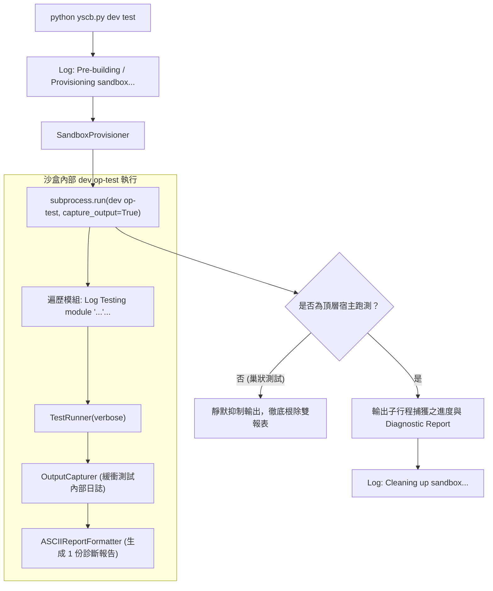

# 架構與模組設計說明書 (Architecture & Module Plan)

> 功能名稱：dev test CLI 輸出結構與資訊優化 (Dev Test CLI Output & UX Optimization)  
> 建立日期：2026-08-27  
> 所屬主計畫：`plans://2026_08_27_1506_dev_test_architecture_optimization/`  
> 狀態：`Confirmed`  
> 模板版本：v1.3  

---

## 1. 系統架構與資料流設計 (System Architecture & Data Flow)

---

## 2. 模組職責劃分 (Module Responsibilities)

| 模組 / 元件 | 核心職責 | 變更說明 |
| :--- | :--- | :--- |
| `dev.testing.runner.OutputCapturer` | 封裝上下文管理器，在測試執行期間無損捕獲 `sys.stdout` 與 `sys.stderr`。 | 新增元件，提供預設靜默緩衝與錯誤展開。 |
| `dev.testing.runner.ASCIIReportFormatter` | 終端 ASCII 報表格式化器。 | 升級格式化排版，支援頂部元數據、分類細分統計、模組耗時與結構化失敗引導。 |
| `dev.tester.Tester._run_test` | CLI 組合門面進入點。 | 輸出建置、沙盒建立與清理進度；以 `capture_output=True` 捕獲子行程並依環境判斷輸出。 |
| `dev.tester.Tester.run_test` | 沙盒內 `op-test` 原地跑測器。 | 在跑測前輸出 `[dev:test] Testing module '<mod>'...` 即時進度。 |

---

## 3. 架構決策記錄 (Decision Records)

- **[P02:DR-01] 緩衝捕獲邊界**：捕獲器作用於單個 Test Case 執行生命週期，確保即便多測試連續執行，日誌亦能 1:1 歸屬於引發問題的單一測試案例。
- **[P02:DR-02] 失敗引導格式標準化**：單點重測指令自動以 `--target=<module>:<TestClass>.<method_name>` 精確格式輸出，方便開發者直接複製執行。
- **[P02:DR-03] 子行程捕獲與進度 Log 分層**：進度提示在 `OutputCapturer` 啟動前即時輸出；子行程採用 `capture_output=True` 搭配 `YSCB_NESTED_TEST` 識別，徹底消滅雙報表洩漏。
