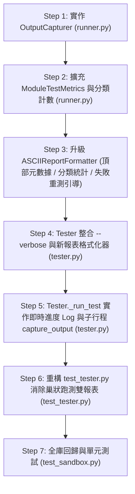

# 實作計畫與技術細節 (Implementation Plan)

> 功能名稱：dev test CLI 輸出結構與資訊優化 (Dev Test CLI Output & UX Optimization)  
> 建立日期：2026-08-27  
> 所屬主計畫：`plans://2026_08_27_1506_dev_test_architecture_optimization/`  
> 狀態：`Confirmed`  
> 模板版本：v1.4  

---

## 1. 實作步驟與依賴拓撲 (Implementation Steps)

---

## 2. 檔案變更清單 (File Impact Analysis)

| 檔案路徑 | 變更類型 | 變更職責說明 |
| :--- | :---: | :--- |
| `source/dev/dev/testing/runner.py` | Modify | 實作 `OutputCapturer`、`ModuleTestMetrics` 與升級 `ASCIIReportFormatter`。 |
| `source/dev/dev/tester.py` | Modify | 支援 `--verbose`、生命週期進度輸出、`subprocess.run` 捕獲子行程輸出並防止巢狀洩漏。 |
| `source/dev/tests/test_tester.py` | Modify | 設置巢狀識別以消除雙報表洩漏。 |
| `source/dev/tests/test_sandbox.py` | Modify | 新增輸出捕獲、頂部元數據與分類統計報表之單元測試。 |
| `docs/dev/user_guide.md` | Modify | 更新使用者手冊中 CLI 輸出範例與生命週期進度說明。 |

---

## 3. 知識庫文檔衝擊預排 (Documentation Impact Assessment)

| 維度 | 文件路徑 | 衝擊評估 | 預計更新內容 |
| :---: | :--- | :---: | :--- |
| **維度 2** | `docs/dev/user_guide.md` | Modify | §4.1 增補 `-v, --verbose` 旗標說明與新版 Diagnostic Report 輸出示範。 |

---

## 4. 架構靈魂拷問 (Architecture Soul-Searching)

> **拷問問題**：當測試執行過程中發生未捕獲之 Fatal Exception 或語法錯誤時，`OutputCapturer` 如何保證終端輸出不會被永久吞沒或遺失？  
> **決策防禦**：`OutputCapturer` 透過標準 `__enter__` / `__exit__` 搭配 `try...finally` 確保在任何異常分支下皆 100% 還原 `sys.stdout` 與 `sys.stderr`；且當測試結果包含 failure 或 error 時，`TestRunner` 自動將捕獲之日誌完整附加於失敗診斷區塊中，絕不丟失任何調試資訊。

---

## 5. 測試前置定稿 (Test-First Sign-off)

- `sub_04/P06_test_plan.md` 中所有測試案例（FT-01~05, ET-01~02, RT-01）均已完成需求覆蓋對齊，在此剛性定稿為 `Confirmed`。
