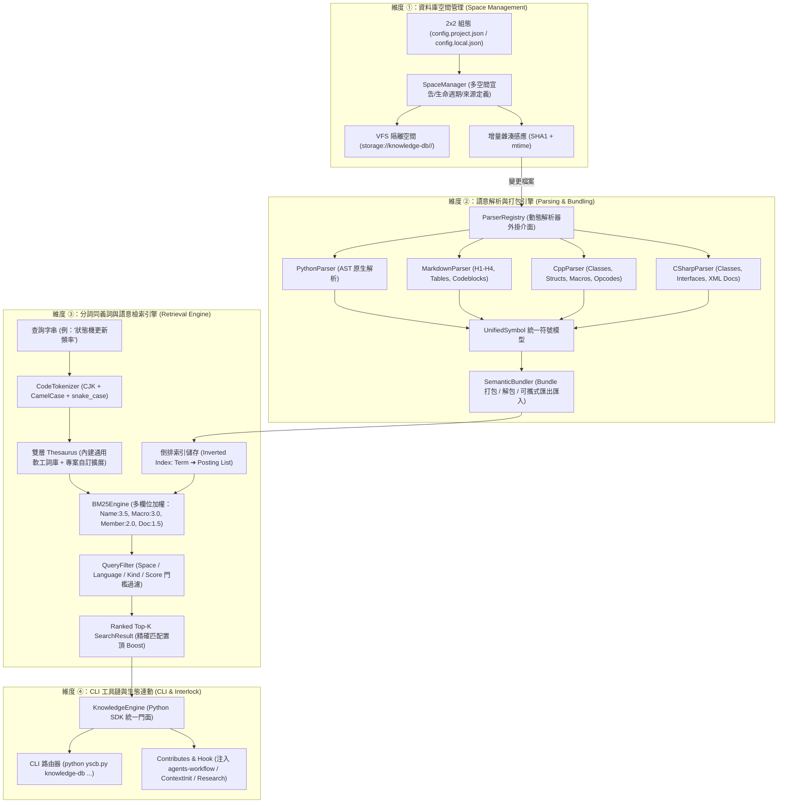

# 技術調研報告：knowledge-db 系統架構、四大子系統維度劃分與升級演進方案

> 調研主題：knowledge-db 模組系統架構與子系統維度拆分  
> 建立日期：2026-08-27  
> 所屬主計畫：`plans://2026_08_27_2127_knowledge_db/`  
> 調研狀態：Concluded  
> 模板版本：v1.0  

---

## 📌 1. 調研背景與演進目標

本專案旨在將已於參考專案 [`GC_VEX_V5`](https://github.com/ysnaive/GC_VEX_V5.git)（`.agents/knowledge_db/`）中驗證成熟之代碼圖譜與語意檢索原型，升級為 YS-Codebase 工具庫官方標準一等模組 **`knowledge-db`**。

### 核心演進目標
1. **傳承核心技術優勢**：100% 零外部相依 (Zero External Dependency，純 Python 3 標準庫)、多語言統一符號抽象 (`UnifiedSymbol`)、中文/代碼混合分詞 (`CodeTokenizer`)、雙層同義詞擴展 (`Thesaurus`)、多欄位加權 BM25 倒排索引檢索、以及 SHA1+mtime 毫秒級增量快取。
2. **突破原型單一專案侷限**：由原本單一專案硬編碼路徑（`.agents/knowledge_db/cache.json`）升級為具備 **「資料庫空間多實例管理 (Database Space)」**、**「標準語意打包 (Semantic Bundling)」**、**「全維度語意搜尋 (Semantic Search)」** 以及 **「YSCB 生態連動 (Ecosystem Interlock)」** 之企業級模組。

---

## 🏛️ 2. 全系統架構鳥瞰圖 (System Architecture)



---

## 🔍 3. 四大子系統維度深度剖析與設計提案

依據開發者指示，本調研將系統完整拆分為四大討論與設計分類維度：

### 📂 維度 ①：資料庫空間管理 (Database Space Management & VFS Storage)

#### 1. 核心需求與概念
- **多 Space 獨立定義**：專案可同時定義多個邏輯知識空間（例如 `default` 全域空間、`docs_only` 純文檔空間、`core_api` 核心符號空間、或特定子模組專屬空間）。
- **實體存儲協議**：各 Space 數據與索引完全隔離，存放於 `storage://knowledge-db/spaces/<space_name>/`。

#### 2. 2x2 組態矩陣整合方案
```json
// config.project.json (專案層級共享)
{
  "default_space": "default",
  "spaces": {
    "default": {
      "sources": ["project://source", "project://docs"],
      "excludes": ["**/__pycache__/**", "**/.git/**", "**/tests/**"],
      "file_patterns": ["*.py", "*.md", "*.cpp", "*.h", "*.cs"],
      "thesaurus": "project://config/thesaurus.json",
      "macro_rules": ["REGISTER_.*", "OPCODE_.*"]
    },
    "docs": {
      "sources": ["project://docs"],
      "excludes": [],
      "file_patterns": ["*.md"],
      "thesaurus": null
    }
  }
}
```

#### 3. 增量指紋比對與快取
- 維護 `fingerprints.json` 記錄每個檔案的 `sha1` 與 `mtime`。
- 只有指紋變更的檔案才進入解析佇列；未變更檔案直接沿用快取索引，確保全專案增量掃描在 `< 50ms` 內完成。

---

### 🧩 維度 ②：多語言語意解析與語意打包 (Semantic Parsing & Bundling)

#### 1. 統一符號資料模型 (`UnifiedSymbol`)
```python
@dataclass
class MemberInfo:
    name: str
    kind: str           # method, field, property, enum_item
    signature: str
    docstring: str = ""
    visibility: str = "public"

@dataclass
class UnifiedSymbol:
    id: str             # 全域唯一 hash: {space}:{file_path}:{name}:{kind}:{line}
    name: str           # 識別碼名稱 (如 KnowledgeEngine, PIDController)
    kind: str           # class, struct, function, interface, macro, doc_heading, table
    file_path: str      # 相對於專案根目錄之路徑
    line_number: int
    language: str       # python, markdown, cpp, csharp, etc.
    docstring: str = "" # 說明註解或 Markdown 節點內文
    signature: str = "" # 函式/方法簽名
    public_members: List[MemberInfo] = field(default_factory=list)
    tags: List[str] = field(default_factory=list)
    raw_content: str = "" # 代碼區塊或文檔片段
```

#### 2. 可插拔解析器外掛矩陣 (Pluggable Parsers)
| 解析器名稱 | 目標副檔名 | 核心解析技術 | 提取語意維度 |
| :--- | :--- | :--- | :--- |
| **`PythonParser`** | `.py` | Python 原生 `ast` 模組 (100% 語法樹) | Class, Function, AsyncFunc, Decorator, Args/Returns, Docstring, 公開成員 |
| **`MarkdownParser`** | `.md` | 正則狀態機 (Markdown AST 輕量模擬) | H1~H4 標題階層、表格結構、代碼區塊、清單條目、區塊說明 |
| **`CppParser`** | `.cpp`, `.h`, `.hpp` | 語意正則狀態機 + 巨集掃描器 | Class, Struct, Enum, 專案自訂巨集 (`REGISTER_OPCODE` 等), 繼承鏈, Docstring |
| **`CSharpParser`** | `.cs` | 語意正則狀態機 + XML Doc 提取器 | Namespace, Class, Interface, Property, Method, XML `<summary>` 註解 |

#### 3. 語意打包機制 (Semantic Bundler)
- **打包格式 (`.bundle.json` 或 `.kdb`)**：將某個 Space 完整的 `symbols`、`inverted_index`、`thesaurus` 與 `manifest` 封裝為自包含（Self-Contained）的發布包。
- **應用情境**：
  - 本地快取固化：Space 索引編譯為本地 Bundle 達成冷啟動毫秒級載入。
  - 可攜式分發：將大型 Codebase 知識庫打包導出，供 CI/CD 或下游 AI Agent 離線即時掛載。

---

### ⚡ 維度 ③：分詞、同義詞與語意檢索引擎 (Tokenization, Thesaurus & BM25 Retrieval)

#### 1. 代碼混合分詞器 (`CodeTokenizer`)
- **複合切分邏輯**：
  1. CJK 中文字元切分（支援單字與 2-gram 窗口滑動）。
  2. 程式碼識別碼切分（`camelCase` $\rightarrow$ `camel`, `case`；`snake_case` $\rightarrow$ `snake`, `case`；`ALL_CAPS_MACRO` $\rightarrow$ `ALL`, `CAPS`, `MACRO`）。
  3. 數字與英文混合（`V5_PID_Controller` $\rightarrow$ `V5`, `PID`, `Controller`）。
  4. 英文 Stemming 輕量詞幹還原與停用詞過濾。

#### 2. 雙層同義詞體系 (`Thesaurus`)
```text
[層級 1: 模組內建軟體工程通用詞庫] 
  - "狀態機" ➔ ["state_machine", "fsm", "state"]
  - "通訊/協議" ➔ ["telemetry", "protocol", "packet", "comm"]
  - "底盤/移動" ➔ ["chassis", "drivetrain", "drive"]
  - "控制器" ➔ ["controller", "pid", "driver"]
        │
        ▼ 增量深度合併 (Deep Merge)
[層級 2: 專案特化 thesaurus.json (config.project.json 配置)]
  - "遙測" ➔ ["telemetry_service", "radio_tx"]
  - "巨集" ➔ ["opcode_macro", "reg_opcode"]
```

#### 3. 倒排索引優化之多欄位加權 BM25 (`BM25Engine`)
- **倒排索引結構**：`Term ➔ List[(Symbol_ID, Field_Type, Term_Frequency)]`。
- **差異化欄位加權矩陣 (Field Weights)**：
  - **符號名稱 (`Name`)**：權重 **3.5**（最高優先級）
  - **巨集/識別碼 (`Macro/Opcode`)**：權重 **3.0**
  - **成員變數/方法 (`Members`)**：權重 **2.0**
  - **文檔內文/說明 (`Docstrings/Body`)**：權重 **1.5**
  - **繼承基底/標籤 (`Base/Tags`)**：權重 **1.2**
- **精確匹配置頂機制 (Exact Boost)**：若 Query 與符號名稱完全一致，賦予 $2.5\times$ 絕對加權置頂。
- **多維度查詢過濾 (Query Filter)**：
  ```python
  results = engine.search(
      query="狀態機更新機制",
      space="default",
      kind=["class", "function"],
      language=["python", "cpp"],
      top_k=5,
      min_score=1.5
  )
  ```

---

### 🌐 維度 ④：CLI 工具鏈、SDK 門面與生態整合 (CLI, SDK & Ecosystem Interlock)

#### 1. 統一 CLI 路由器與命令設計 (`yscb.py knowledge-db ...`)
| 指令語法 | 功能說明 |
| :--- | :--- |
| `python yscb.py knowledge-db space <list\|create\|status>` | 管理與檢視資料庫空間清冊 |
| `python yscb.py knowledge-db index [--space=<name>] [--full]` | 對指定或所有空間執行增量/全量索引構建 |
| `python yscb.py knowledge-db search <query> [--space=<name>] [-k <top_k>]` | 終端交互式語意檢索（支援 ASCII 格式化與 JSON 輸出） |
| `python yscb.py knowledge-db bundle <pack\|unpack\|inspect>` | 語意知識庫 Bundle 封裝與檢視工具鏈 |
| `python yscb.py knowledge-db status` | 檢視知識庫整體統計（符號數、空間大小、快取命中率） |
| `python yscb.py knowledge-db export-docs [output_dir]` | 自動萃取全 Codebase 結構並導出為標準 Markdown 地圖 |

#### 2. Python SDK 門面介面 (`KnowledgeEngine`)
```python
from yscb_core import ProjectContext
from knowledge_db import KnowledgeEngine, SearchQuery, SearchResult

engine = KnowledgeEngine(project_root=ProjectContext.get_project_root())
results = engine.search("PID 控制器的積分飽和處理", space="default", top_k=3)

for item in results:
    print(f"[{item.score:.2f}] {item.symbol.name} ({item.symbol.file_path}:{item.symbol.line_number})")
    print(f"  • 摘要: {item.symbol.docstring[:80]}...")
```

#### 3. 工作流與生態連動 (Agents-Workflow Interlock)
- 宣告 `contributes.core.commands`：自動註冊標準 CLI 命令清單與防呆對照表。
- 宣告 `contributes.agents-workflow`：向 AI Agent SOP（`ContextInit`、`Research`、`Discuss`）自動注入知識庫快查指引，使 Agent 在初始化階段即能透過 API 檢索專案代碼圖譜。
- 生命週期 Hook：在模組安裝或變更時自動觸發增量索引更新。

---

## 🗺️ 4. 分類型主計畫 (Umbrella) 子計畫拆分矩陣提案

本調研建議將 `plans://2026_08_27_2127_knowledge_db/` 主計畫拆分為以下四個循序漸進的 Full Track 子計畫：

| 子計畫編號 | 子計畫目錄名稱 | 核心聚焦維度 | 預估交付產物 |
| :---: | :--- | :--- | :--- |
| **`sub_01`** | `sub_01_space_management_and_schema` | 維度 ①：空間管理與資料架構 | • 模組骨架 (`source/knowledge-db/`)<br/>• `UnifiedSymbol`、`MemberInfo` 等 Schema<br/>• `SpaceManager` 多空間定義與 2x2 組態矩陣<br/>• `SHA1+mtime` 增量指紋比對器<br/>• `storage://` VFS 空間隔離存儲 |
| **`sub_02`** | `sub_02_parsers_and_semantic_bundler` | 維度 ②：多語言解析與打包引擎 | • `ParserRegistry` 動態外掛介面<br/>• `PythonParser` (AST)、`MarkdownParser`<br/>• `CppParser` (巨集正則)、`CSharpParser`<br/>• `SemanticBundler` 打包與解包工具鏈 |
| **`sub_03`** | `sub_03_tokenizer_thesaurus_and_bm25_retrieval` | 維度 ③：分詞同義詞與檢索引擎 | • `CodeTokenizer` (CJK + 代碼混合分詞)<br/>• `Thesaurus` 雙層同義詞增量合併器<br/>• `InvertedIndex` 倒排索引構建<br/>• `BM25Engine` 多欄位加權評分與精確 Boost<br/>• `QueryFilter` 空間與型態過濾 |
| **`sub_04`** | `sub_04_cli_sdk_and_workflow_interlock` | 維度 ④：CLI 工具鏈與生態整合 | • `KnowledgeEngine` SDK 統一門面 API<br/>• `yscb.py knowledge-db` 完整 CLI 子指令<br/>• `contributes.agents-workflow` 工作流注入<br/>• `_on_modules_changed` 自動增量索引 Hook<br/>• 全模組沙盒測試與 Dogfooding 驗證 |

---

## 🎯 5. 調研結論與後續步驟

1. **技術可行性**：本模組 100% 基於 Python 3 標準庫即可達成，無任何外部三方依賴，具備極高的啟動效能與跨平台穩定性。
2. **設計完善性**：四大維度職責分明、低耦合高內聚，完全符合 YS-Codebase 模組規範與 2x2 組態管理標準。
3. **後續步驟**：
   - 待開發者審閱本調研報告與四大維度拆分規劃。
   - 確認無誤後，將關鍵決策回填至 `P00_semantic_requirements.md` (Confirmed)，並正式立項啟動第一子計畫 `sub_01_space_management_and_schema`。
