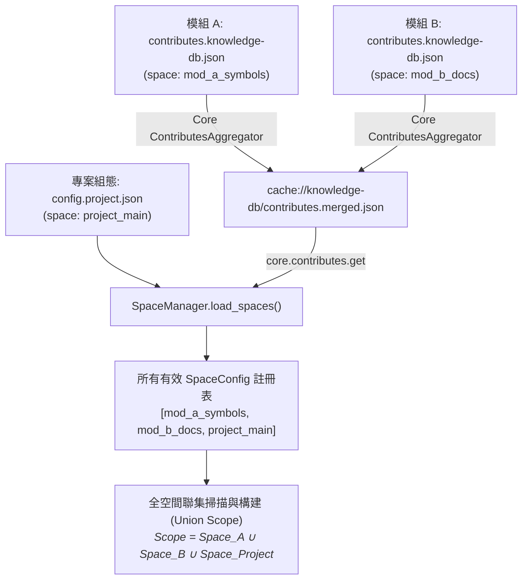

# 語意需求說明書 (Semantic Requirements Discovery)

> 功能名稱：knowledge-db 子計畫 01: 空間管理與資料架構 (Space Management & Data Schema)  
> 建立日期：2026-08-28  
> 所屬主計畫：`plans://2026_08_27_2127_knowledge_db/`  
> 狀態：Confirmed  
> 計畫類型：Feature  
> 模板版本：v1.1  

---

## 1. 使用者原始需求與意圖 (User Intent)

- **原始陳述**：作為 `knowledge-db` 模組的第一階段子計畫，需提前將規格定義完善（杜絕籠統概念）。實作基礎模組骨架、核心資料模型 Schema (UnifiedSymbol)、SpaceManager 多空間管理、2x2 組態矩陣與模組聯動注入雙軌空間定義機制、以及檔案增量指紋掃描比對引擎。
- **核心目標**：
  1. **模組骨架建立**：在 `source/knowledge-db/` 建立標準 YSCB 模組骨架、`manifest.json` 與進入點。
  2. **核心資料模型 (Data Schema)**：定義解耦之 `UnifiedSymbol`、`MemberInfo`、`SpaceConfig`、`ThesaurusConfig`、`FileFingerprint` 等核心不可變資料結構，提供無損 JSON 序列化/反序列化。
  3. **多空間管理與全域聯集架構 (SpaceManager)**：無須指定單一 `default_space`，直接接納所有模組注入與組態宣告之空間，最終處理範圍為**所有有效注入 Space 之聯集 (Union of Injected Spaces)**。
  4. **雙軌來源空間定義與 2x2 組態整合**：
     - **軌道 ① 模組聯動注入 (Module Contributes)**：支援透過 `module://<donor>/contributes.knowledge-db.json` 或 `manifest.json` 注入 donor 空間與同義詞組。
     - **軌道 ② 組態檔宣告與覆蓋 (2x2 Config Matrix)**：支援透過 `config.project.json` 與 `config.local.json` 自訂空間或覆蓋特定空間參數。
     - **階層優先權合併**：`Local Config` > `Project Config` > `Module Contributes`。
  5. **雙階增量指紋比對引擎 (Incremental Fingerprint Engine)**：以 `mtime`+`size` 快速初篩搭配 `SHA1` 精確校驗，支援單空間與全空間聯集掃描，輸出 `ScanDiffResult` (Added/Modified/Deleted/Unchanged) 並自動持久化。
- **邊界排除 (Explicitly Excluded)**：
  - 多語言 AST/Regex 解析器 (Parsers) 與語意打包引擎 (SemanticBundler) 留待 `sub_02` 實作。
  - 分詞器 (CodeTokenizer)、同義詞庫 (Thesaurus) 與 BM25 檢索引擎留待 `sub_03` 實作。
  - 對外 CLI 完整路由器與 SDK 門面連動留待 `sub_04` 實作。
  - 嚴格維持 100% 零外部相依 (Zero External Dependency，純 Python 3 標準庫)。

---

## 2. 核心討論與決策紀錄 (Discussion & Decisions)

### [P00:DR-01] 模組架構與 Manifest 宣告標準
- **模組結構拓撲**：
  ```text
  source/knowledge-db/
  ├── manifest.json                  # 模組元數據、依賴與 contributes 宣告
  ├── contributes.format.md          # 供其他模組參考之 contributes.knowledge-db 規格說明書
  ├── config.project.json            # 預設專案層級組態範本
  ├── scripts/
  │   ├── __init__.py
  │   └── cli.py                     # CLI 進入點骨架
  ├── knowledge_db/                  # 模組核心代碼包
  │   ├── __init__.py
  │   ├── schema.py                  # UnifiedSymbol, MemberInfo, SpaceConfig, ThesaurusConfig, Enums
  │   ├── exceptions.py              # KnowledgeDB 專屬例外階層
  │   ├── space.py                   # SpaceManager 多空間管理與雙軌聚合引擎
  │   └── scanner.py                 # FingerprintScanner 雙階增量比對引擎
  └── tests/                         # 單元測試套件 (繼承 YSCBTestCase)
      ├── __init__.py
      ├── test_schema.py
      ├── test_space.py
      └── test_scanner.py
  ```
- **`manifest.json` 宣告契約**：
  - `name`: `"knowledge-db"`, `version`: `"0.1.0.0"`, `entry`: `"scripts/cli.py"`
  - `dependencies`: `{"core": ">=1.0.0"}`
  - `contributes.core.uri_schemes`:
    - `knowledge.storage`: 映射至 `storage://knowledge-db/`

---

### [P00:DR-02] 核心資料結構與 Schema 契約 (Decoupled Unified Schema)

#### 1. 列舉型別 (Enums)
- **`SymbolKind`** (字串列舉)：
  - 代碼符號：`CLASS`, `STRUCT`, `FUNCTION`, `METHOD`, `INTERFACE`, `ENUM`, `MACRO`, `VARIABLE`, `CONSTANT`
  - 文檔符號：`DOC_HEADING_1`, `DOC_HEADING_2`, `DOC_HEADING_3`, `DOC_HEADING_4`, `DOC_TABLE`, `DOC_SECTION`
- **`LanguageType`** (字串列舉)：
  - `PYTHON`, `MARKDOWN`, `CPP`, `CSHARP`, `JSON`, `TEXT`, `UNKNOWN`
- **`SpaceOrigin`** (字串列舉)：
  - `CONTRIBUTED`（模組注入）, `PROJECT`（專案共用組態）, `LOCAL`（本機覆蓋組態）

#### 2. 成員模型 (`MemberInfo`)
```python
@dataclass(frozen=True)
class MemberInfo:
    name: str                           # 成員名稱 (如 run_cli, _init_db)
    kind: str                           # method, field, property, enum_item
    signature: str = ""                 # 簽名 (如 "(self, cmd: str) -> bool")
    docstring: str = ""                 # 成員說明文件
    visibility: str = "public"          # public, protected, private
    line_number: int = 0                # 定義所在行號

    def to_dict(self) -> dict: ...
    @classmethod
    def from_dict(cls, data: dict) -> "MemberInfo": ...
```

#### 3. 統一符號資料模型 (`UnifiedSymbol`)
```python
@dataclass(frozen=True)
class UnifiedSymbol:
    id: str                             # 唯一 ID: sha1(f"{space}:{file_path}:{name}:{kind}:{line_number}")
    name: str                           # 識別碼名稱 (如 KnowledgeEngine, PIDController)
    kind: str                           # SymbolKind 值的字串
    file_path: str                      # 相對於來源根目錄之路徑 (以 forward slash 正規化)
    line_number: int                    # 定義所在起始行號 (1-indexed)
    language: str                       # LanguageType 值的字串
    docstring: str = ""                 # 註解說明或 Markdown 內文摘要
    signature: str = ""                 # 函式/類別簽名 (如 "class KnowledgeEngine(BaseEngine)")
    members: List[MemberInfo] = field(default_factory=list) # 內部成員清單
    metadata: Dict[str, Any] = field(default_factory=dict)  # 擴充元數據 (如 end_line, tags, parent_symbol)

    @classmethod
    def compute_id(cls, space: str, file_path: str, name: str, kind: str, line_number: int) -> str:
        raw = f"{space}:{file_path}:{name}:{kind}:{line_number}"
        return hashlib.sha1(raw.encode("utf-8")).hexdigest()

    def to_dict(self) -> dict: ...
    @classmethod
    def from_dict(cls, data: dict) -> "UnifiedSymbol": ...
```

#### 4. 獨立解耦之空間組態模型 (`SpaceConfig`)
```python
@dataclass
class SpaceConfig:
    name: str                                           # 空間識別名稱 (如 "project_main", "core_symbols")
    description: str = ""                               # 空間用途說明
    include: List[str] = field(default_factory=list)    # 包含來源目錄/檔案 URI 清單 (必填)
    exclude: List[str] = field(default_factory=list)    # 排除路徑 Glob 清單 (選填，預設空清單)
    file_patterns: Optional[List[str]] = None           # 副檔名過濾 (選填，None 或省略時預設 include all 所有檔案)
    origin: str = "project"                             # SpaceOrigin (module:<donor>, project, local)

    def is_file_included(self, filename: str) -> bool:
        """若未指定 file_patterns 則預設全包含 (include all)；若有指定則依 pattern 比對"""
        if not self.file_patterns:
            return True
        return any(fnmatch.fnmatch(filename, pat) for pat in self.file_patterns)

    def to_dict(self) -> dict: ...
    @classmethod
    def from_dict(cls, name: str, data: dict, origin: str = "project") -> "SpaceConfig": ...
```

#### 5. 獨立解耦之同義詞庫資料結構 (`ThesaurusConfig`)
```python
# 同義詞組列表：每組為等價語意詞陣列
ThesaurusGroup = List[str]  # 例: ["狀態機", "FSM", "state_machine", "StatePattern"]

@dataclass
class ThesaurusConfig:
    groups: List[ThesaurusGroup] = field(default_factory=list)  # 同義詞群組清單
    origin: str = "project"                                     # 來源 (module:<donor>, project, local)

    def to_dict(self) -> dict: ...
    @classmethod
    def from_dict(cls, data: Any, origin: str = "project") -> "ThesaurusConfig": ...
```

---

### [P00:DR-03] 雙軌來源空間定義、無 default_space 與全域聯集架構 (SpaceManager)

#### 1. 模組注入與組態宣告標準 (Injection Sources & Formats)

##### 途徑 A：模組專屬獨立貢獻檔 (`module://<donor>/contributes.knowledge-db.json`)【推薦】
```json
{
  "spaces": {
    "agents_workflow_docs": {
      "description": "agents-workflow 工作流規範與文檔空間",
      "include": [
        "module://agents-workflow/assets/standards",
        "module://agents-workflow/assets/workflows"
      ],
      "exclude": [
        "**/__pycache__/**"
      ],
      "file_patterns": ["*.md"]
    }
  },
  "thesaurus": [
    ["工作流", "workflow", "pipeline", "流水線"],
    ["狀態機", "state_machine", "FSM"]
  ]
}
```
> **註**：`file_patterns` 為選填，省略時自動包含所有檔案類型 (include all)。

##### 途徑 B：模組 Manifest 宣告 (`module://<donor>/manifest.json`)
```json
{
  "name": "donor-module",
  "version": "1.0.0.0",
  "contributes": {
    "knowledge-db": {
      "spaces": {
        "donor_space": {
          "description": "Donor 模組專屬空間",
          "include": ["module://donor-module/source"],
          "exclude": ["**/__pycache__/**"]
        }
      },
      "thesaurus": [
        ["同義詞A", "synonym_a"]
      ]
    }
  }
}
```

##### 途徑 C：專案與本機組態定義 (`config://knowledge-db/config.project.json` / `config.local.json`)
```json
{
  "spaces": {
    "project_main": {
      "description": "專案全域代碼與文檔空間 (未指定 file_patterns 預設 include all)",
      "include": [
        "project://source",
        "project://docs"
      ],
      "exclude": [
        "**/__pycache__/**",
        "**/.git/**",
        "**/tests/**",
        "**/build/**",
        "**/release/**"
      ]
    }
  },
  "thesaurus": [
    ["知識庫", "knowledge_db", "knowledge_base", "vector_store"],
    ["增量掃描", "incremental_scan", "fingerprint"]
  ]
}
```

#### 2. 全空間聯集處理架構 (Union of All Spaces Pipeline)

- **核心架構公理**：
  1. **無 `default_space` 強制約束**：系統直接接納所有合法注入之 Space，各 Space 自治維護其 `include`, `exclude`, `file_patterns`。
  2. **全空間聯集 (Union Scope)**：全系統掃描、索引建置與未限定空間的檢索，處理範圍天然為**所有已註冊 Space 之聯集**。
  3. **優先權與覆蓋**：同名空間以 `Local Config` > `Project Config` > `Module Contributes` 覆蓋。

#### 3. SpaceManager 核心 API 契約
- `__init__(core_context=None, config_dir=None)`: 支援傳入 Core Context 或獨立組態目錄以利沙盒測試。
- `load_spaces() -> Dict[str, SpaceConfig]`: 執行雙軌聚合，回傳所有已注入空間 `{space_name: SpaceConfig}`。
- `load_thesaurus() -> List[List[str]]`: 聚合所有來源之同義詞群組陣列。
- `get_space(name: str) -> SpaceConfig`: 取得指定空間組態，若不存在拋出 `SpaceNotFoundError`。
- `list_spaces() -> List[SpaceConfig]`: 列出當前所有有效空間清單。
- `get_union_spaces() -> List[SpaceConfig]`: 取得所有空間之聯集清單（全量處理清單）。
- `resolve_space_include(space_name: str) -> List[Path]`: 將空間宣告之 `include` 語意 URI 清單解算為真實存在的本機絕對路徑清單；過濾無效路徑並發出 Warning。
- `get_space_storage_dir(space_name: str) -> Path`: 取得空間於 VFS 實體存儲路徑（`storage://knowledge-db/spaces/<space_name>/`）。

---

### [P00:DR-04] 雙階檔案增量指紋比對機制 (Incremental Fingerprint Engine)

#### 1. 指紋資料模型 (`FileFingerprint` & `ScanDiffResult`)
```python
@dataclass(frozen=True)
class FileFingerprint:
    relpath: str                        # 相對於來源目錄之相對路徑 (forward slash)
    source_root: str                    # 所屬來源根目錄之語意 URI 或絕對路徑
    mtime: float                        # 檔案最後修改時間戳 (秒)
    size: int                           # 檔案大小 (Bytes)
    sha1: str                           # 檔案內容 SHA-1 雜湊值 (40 位 hex)

    def to_dict(self) -> dict: ...
    @classmethod
    def from_dict(cls, data: dict) -> "FileFingerprint": ...

@dataclass
class ScanDiffResult:
    space_name: str
    added: List[FileFingerprint] = field(default_factory=list)      # 新增檔案清單
    modified: List[FileFingerprint] = field(default_factory=list)   # 內容變更檔案清單
    deleted: List[str] = field(default_factory=list)                # 刪除檔案之 relpath 清單
    unchanged: List[FileFingerprint] = field(default_factory=list) # 無變更檔案清單

    @property
    def has_changes(self) -> bool:
        return bool(self.added or self.modified or self.deleted)
```

#### 2. 雙階比對演算法 (Two-Stage Fingerprint Verification)
```mermaid
flowchart TD
    Start([遍歷 include 來源檔案]) --> FilterMatch{未被 exclude 排除 且<br/>(file_patterns 未定義 或 符合 pattern)?}
    FilterMatch -- No --> Skip[忽略該檔案]
    FilterMatch -- Yes --> CheckCache{快取中存在舊指紋?}
    
    CheckCache -- No --> ComputeSHA1[計算 SHA1 雜湊]
    ComputeSHA1 --> MarkAdded[標記為 ADDED]
    
    CheckCache -- Yes --> Stage1{Stage 1: mtime 與 size 完全一致?}
    Stage1 -- Yes --> MarkUnchanged[標記為 UNCHANGED / 直接跳過 I/O]
    Stage1 -- No --> Stage2[Stage 2: 讀取內容計算 SHA1 雜湊]
    
    Stage2 --> CompareSHA1{SHA1 與舊指紋一致?}
    CompareSHA1 -- Yes --> UpdateMtime[僅更新快取之 mtime / 標記為 UNCHANGED]
    CompareSHA1 -- No --> MarkModified[標記為 MODIFIED]
    
    MarkAdded & MarkUnchanged & UpdateMtime & MarkModified --> CheckDeleted{掃描結束: 檢驗舊指紋庫}
    CheckDeleted --> FindMissing[舊指紋存在但磁碟已不存在 ➔ 標記為 DELETED]
```

#### 3. 掃描器 API 契約 (`FingerprintScanner`)
- `scan_space(space_config: SpaceConfig, force: bool = False) -> ScanDiffResult`: 執行單一空間之增量指紋比對。
- `scan_all_spaces(spaces: Optional[List[SpaceConfig]] = None, force: bool = False) -> Dict[str, ScanDiffResult]`: 執行全空間聯集增量掃描，回傳 `{space_name: ScanDiffResult}`。
- `load_fingerprints(space_name: str) -> Dict[str, FileFingerprint]`: 讀取 `storage://knowledge-db/spaces/<space>/fingerprints.json`。
- `save_fingerprints(space_name: str, fingerprints: Dict[str, FileFingerprint]) -> None`: 以原子寫入方式更新指紋庫。

---

### [P00:DR-05] 專屬例外階層與邊界防禦機制 (Exception Hierarchy & Guardrails)

```python
class KnowledgeDBError(Exception):
    """knowledge-db 模組基礎例外"""

class SpaceNotFoundError(KnowledgeDBError):
    """指定的空間名稱不存在時拋出"""

class InvalidSpaceConfigError(KnowledgeDBError):
    """空間組態缺失必填欄位或格式錯誤時拋出"""

class SchemaValidationError(KnowledgeDBError):
    """UnifiedSymbol 或 MemberInfo 資料校驗失敗時拋出"""

class FingerprintCorruptedError(KnowledgeDBError):
    """指紋快取檔案損毀或不可讀時拋出"""
```

- **邊界防禦與自癒原則**：
  1. **指紋損毀自動自癒**：當 `fingerprints.json` 發生 JSON 解析錯誤時，系統發出 Warning 並自動降級為全量掃描（全部視為 Added），並於掃描後自動覆蓋修復，不導致流程中斷崩潰。
  2. **來源路徑寬容處理**：若某個 `source` 路徑不存在或無權限，記錄 Warning 並繼續掃描其他可用 sources，避免單一目錄失效拖垮全空間。
  3. **編碼安全防禦**：文字檔案讀取統一採用 `utf-8` 並附帶 `errors="replace"`，防止非 UTF-8 字元中斷掃描。

---

## 3. 開放議題與確認紀錄

- [x] **確認 1 (模組拓撲與 Manifest)**：`source/knowledge-db/` 結構、依賴宣告 (`core >= 1.0.0`) 與 `knowledge.storage` URI 定義確認。
- [x] **確認 2 (Schema 解耦與 ID 演算法)**：`UnifiedSymbol`、`MemberInfo`、`SpaceConfig`（`include`/`exclude`/可選 `file_patterns`）、`ThesaurusConfig`、`FileFingerprint` 資料模型與 Enums 定義確認。
- [x] **確認 3 (無 default_space 與全空間聯集架構)**：移除單一 default_space 強制約束，直接接納所有模組注入與組態宣告空間，最終處理範圍為所有有效空間之聯集（Union Scope）。
- [x] **確認 4 (雙階指紋掃描演算法)**：Stage 1 (mtime+size) + Stage 2 (SHA1) 雙階比對、單空間與全空間聯集掃描 (`scan_all_spaces`) 及自癒機制確認。
- [x] **確認 5 (例外階層與邊界防護)**：`KnowledgeDBError` 衍生體系與編碼防禦確認。
