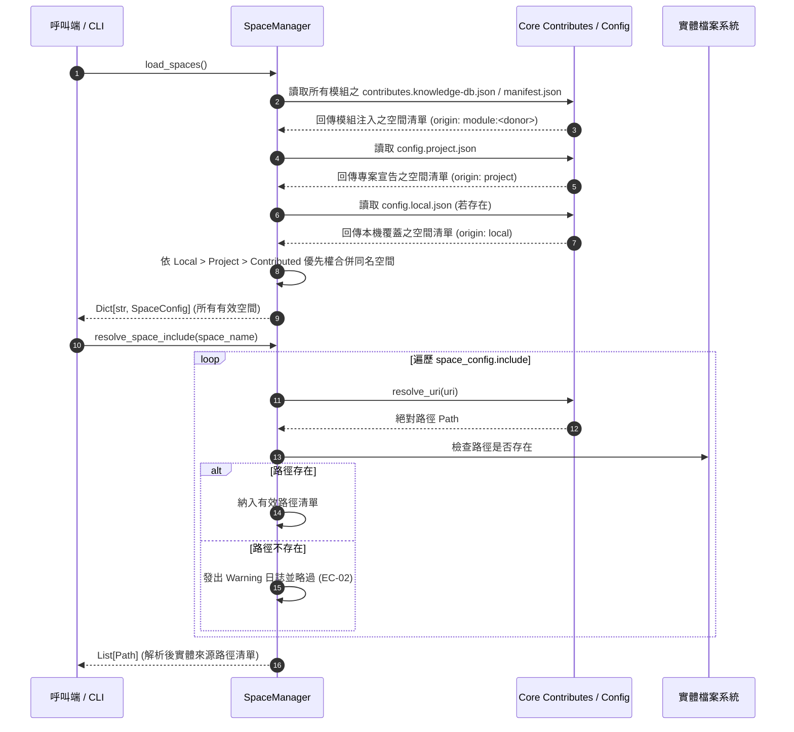
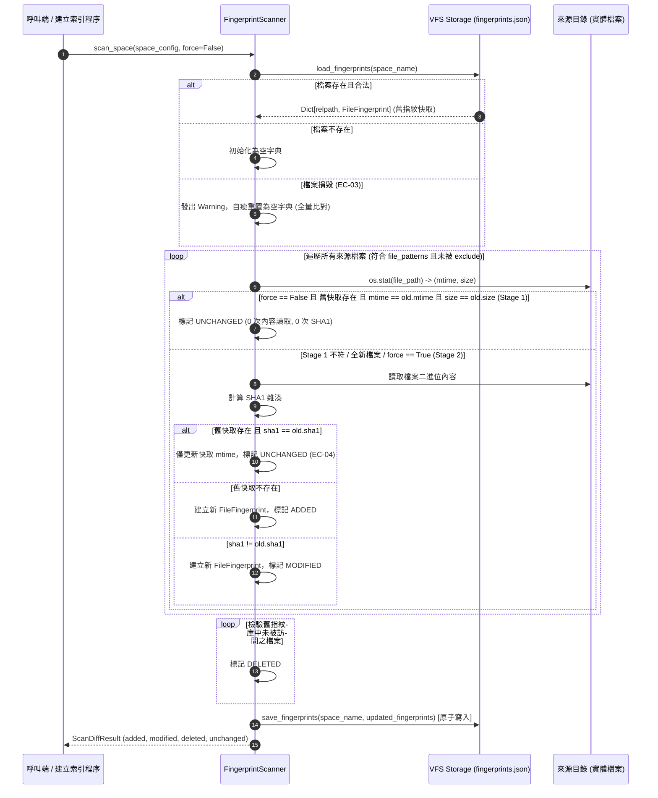

# 架構設計說明書 (Architecture Design)

> 功能名稱：knowledge-db 子計畫 01: 空間管理與資料架構 (Space Management & Data Schema)  
> 建立日期：2026-08-28  
> 所屬主計畫：`plans://2026_08_27_2127_knowledge_db/`  
> 狀態：Confirmed  
> 依據 P01：[P01_requirements_spec.md](./P01_requirements_spec.md)  
> 模板版本：v1.2  

---

## 1. 模組架構分層與職責邊界 (Layered Architecture)

```text
┌─────────────────────────────────────────────────────────────────────────────┐
│                       knowledge-db CLI 入口層 (scripts/cli.py)              │
│         提供子指令骨架、參數解析與 SpaceManager / Scanner 調度介面          │
└──────────────────────────────────────┬──────────────────────────────────────┘
                                       │
┌──────────────────────────────────────▼──────────────────────────────────────┐
│                    空間管理層 (knowledge_db/space.py)                       │
│  SpaceManager: 雙軌來源聚合 (Contributes + Config)、無 default_space 聯集   │
│  路徑解算 (resolve_space_include)、VFS 存儲目錄定位 (get_space_storage_dir) │
└──────────────────┬───────────────────────────────────┬──────────────────────┘
                   │                                   │
┌──────────────────▼───────────────────┐ ┌─────────────▼──────────────────────┐
│  增量指紋掃描層 (scanner.py)         │ │  資料模型與 Schema 層 (schema.py)  │
│  FingerprintScanner: 雙階比對引擎    │ │  UnifiedSymbol, MemberInfo         │
│  Stage 1 (mtime+size) + Stage 2(SHA1)│ │  SpaceConfig, ThesaurusConfig      │
│  FileFingerprint, ScanDiffResult     │ │  SymbolKind, LanguageType, Enums   │
│  原子寫入持久化 & 自癒容錯           │ │  to_dict / from_dict 序列化        │
└──────────────────┬───────────────────┘ └─────────────┬──────────────────────┘
                   │                                   │
┌──────────────────▼───────────────────────────────────▼──────────────────────┐
│               基礎例外層 (knowledge_db/exceptions.py)                        │
│  KnowledgeDBError, SpaceNotFoundError, InvalidSpaceConfigError, ...         │
└──────────────────────────────────────┬──────────────────────────────────────┘
                                       │
┌──────────────────────────────────────▼──────────────────────────────────────┐
│                    YSCB 核心基礎設施 (core.uri, stdlib)                     │
│  Core URI 協議 (module://, storage://, project://) & Python 3 標準庫        │
└─────────────────────────────────────────────────────────────────────────────┘
```

---

## 2. 核心資料流與循序圖 (Data Flow & Sequence Diagram)

### 2.1 雙軌空間聚合與聯集解算循序 (SpaceManager Aggregation)



### 2.2 雙階增量指紋比對循序 (Two-Stage Fingerprint Scanning)



---

## 3. 受影響檔案與新建檔案清單 (Impacted & New Files Inventory)

| 檔案路徑 | 類型 | 職責與變更說明 |
| :--- | :---: | :--- |
| `source/knowledge-db/manifest.json` | **New** | 模組元數據、依賴 `core >= 1.0.0` 與 `knowledge.storage` URI 宣告 |
| `source/knowledge-db/config.project.json` | **New** | 預設專案層級組態範本（宣告 `project_main` 空間範例） |
| `source/knowledge-db/contributes.format.md` | **New** | 擴充點規格說明文件，指導其他 Donor 模組注入空間與同義詞 |
| `source/knowledge-db/scripts/__init__.py` | **New** | CLI scripts 套件初始化 |
| `source/knowledge-db/scripts/cli.py` | **New** | CLI 進入點骨架與參數路由器 |
| `source/knowledge-db/knowledge_db/__init__.py` | **New** | 模組核心套件導出 (`SpaceManager`, `FingerprintScanner`, `UnifiedSymbol`, ...) |
| `source/knowledge-db/knowledge_db/exceptions.py` | **New** | 專屬例外階層 (`KnowledgeDBError`, `SpaceNotFoundError`, ...) |
| `source/knowledge-db/knowledge_db/schema.py` | **New** | 核心資料結構、Enums、序列化與 ID 計算演算法 |
| `source/knowledge-db/knowledge_db/space.py` | **New** | `SpaceManager` 多空間雙軌聚合、優先權覆蓋與路徑解算 |
| `source/knowledge-db/knowledge_db/scanner.py` | **New** | `FingerprintScanner` 雙階增量比對引擎與原子持久化 |
| `source/knowledge-db/tests/__init__.py` | **New** | 測試套件初始化 |
| `source/knowledge-db/tests/test_schema.py` | **New** | `UnifiedSymbol`, `MemberInfo`, `SpaceConfig`, Enums 單元測試 |
| `source/knowledge-db/tests/test_space.py` | **New** | `SpaceManager` 雙軌聚合、優先權與 URI 解算單元測試 |
| `source/knowledge-db/tests/test_scanner.py` | **New** | `FingerprintScanner` 雙階比對、變更偵測、自癒與原子寫入單元測試 |

---

## 4. 架構決策記錄 (Architecture Decision Records)

- **[P02:DR-01] 零外部相依與不可變資料結構**：核心資料模型 `UnifiedSymbol`、`MemberInfo`、`FileFingerprint` 採用 `@dataclass(frozen=True)`，完全使用 Python 3 原生標準庫（`hashlib`, `pathlib`, `json`, `fnmatch`），確保極致執行效能與全平台相容性。
- **[P02:DR-02] 依賴注入與沙盒測試架構**：`SpaceManager` 與 `FingerprintScanner` 支援傳入 `core_context` 或自訂 `config_dir`/`storage_dir`，使其在測試中可在隔離虛擬沙盒中獨立運作，杜絕全域狀態污染。
- **[P02:DR-03] 原子寫入與快取自癒機制**：指紋存儲採用 `NamedTemporaryFile` 寫入後以 `os.replace` 原子替換目標檔案；若快取損毀自動降級為全量掃描並修復，達成高強韌度（Resilience）。
