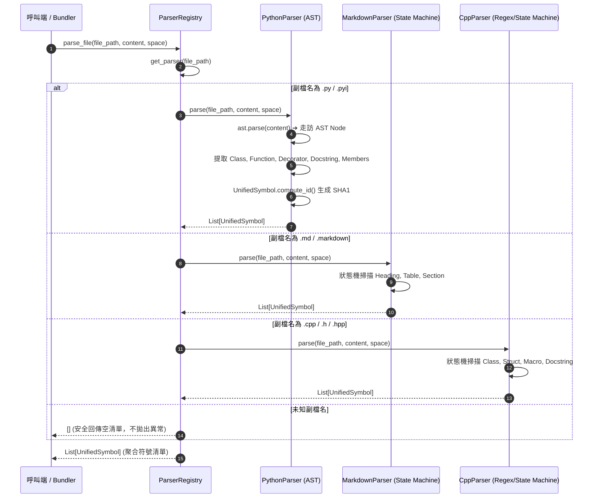

# 架構設計說明書 (Architecture Design)

> 功能名稱：knowledge-db 子計畫 02: 多語言解析與語意打包 (Parsers & Semantic Bundler)  
> 建立日期：2026-08-28  
> 所屬主計畫：`plans://2026_08_27_2127_knowledge_db/`  
> 狀態：Confirmed  
> 依據 P01：[P01_requirements_spec.md](./P01_requirements_spec.md)  
> 模板版本：v1.2  

---

## 1. 模組架構分層與職責邊界 (Layered Architecture)

```text
┌─────────────────────────────────────────────────────────────────────────────┐
│                      knowledge-db CLI 入口層 (scripts/cli.py)               │
│                  新增 bundle 指令：調度 Bundler 執行空間打包與導出          │
└──────────────────────────────────────┬──────────────────────────────────────┘
                                       │
┌──────────────────────────────────────▼──────────────────────────────────────┐
│                    語意打包層 (knowledge_db/bundler.py)                     │
│  SemanticBundle: 自包含資料模型 (版本、空間名、符號清單、同義詞、元數據)    │
│  SemanticBundler: bundle_space (協同 Scanner/Registry)、export、import      │
└──────────────────┬───────────────────────────────────┬──────────────────────┘
                   │                                   │
┌──────────────────▼───────────────────┐ ┌─────────────▼──────────────────────┐
│       解析器外掛與調度層             │ │       底層資料結構與空間管理       │
│    (knowledge_db/parsers/)           │ │  (knowledge_db/schema.py, space.py)│
│  - BaseParser (抽象基底類別)         │ │  UnifiedSymbol, MemberInfo         │
│  - ParserRegistry (註冊/優先權/分發) │ │  SpaceManager, SpaceConfig         │
│  - PythonParser (原生 AST 語法樹)    │ │  FileFingerprint, FingerprintScanner│
│  - MarkdownParser (H1-H4, 表格, 內文)│ └────────────────────────────────────┘
│  - CppParser (Class, Struct, Macro)  │
│  - CSharpParser (Class, XML Doc)     │
└──────────────────────────────────────┘
```

---

## 2. 核心資料流與循序圖 (Data Flow & Sequence Diagram)

### 2.1 多語言檔案解析循序圖 (File Parsing Sequence)



### 2.2 語意打包與導出循序圖 (Semantic Bundling Sequence)

```mermaid
sequenceDiagram
    autonumber
    participant Client as CLI / SDK
    participant Bundler as SemanticBundler
    participant SM as SpaceManager
    participant Scanner as FingerprintScanner
    participant Reg as ParserRegistry
    participant Storage as VFS Storage

    Client->>Bundler: bundle_space(space_config)
    Bundler->>SM: resolve_space_include(space_name)
    SM-->>Bundler: List[Path] (來源目錄清單)
    Bundler->>Scanner: scan_space(space_config)
    Scanner-->>Bundler: ScanDiffResult (確認所有檔案清單)
    loop 遍歷所有有效檔案
        Bundler->>Bundler: 讀取檔案文字內容 (utf-8, replace)
        Bundler->>Reg: parse_file(relpath, content, space_name)
        Reg-->>Bundler: List[UnifiedSymbol]
        Bundler->>Bundler: 收集符號至 all_symbols
    end
    Bundler->>SM: load_thesaurus()
    SM-->>Bundler: List[ThesaurusGroup]
    Bundler->>Bundler: 建立 SemanticBundle 物件
    Bundler->>Storage: export_bundle(bundle) [暫存檔 + os.replace 原子寫入]
    Storage-->>Bundler: bundle_file_path
    Bundler-->>Client: (SemanticBundle, bundle_file_path)
```



---

## 3. 受影響檔案與新建檔案清單 (Impacted & New Files Inventory)

| 檔案路徑 | 類型 | 職責與變更說明 |
| :--- | :---: | :--- |
| `source/knowledge-db/knowledge_db/parsers/__init__.py` | **New** | 解析器子套件導出 (`BaseParser`, `ParserRegistry`, `PythonParser`, ...) |
| `source/knowledge-db/knowledge_db/parsers/base.py` | **New** | `BaseParser` 抽象基底類別定義 |
| `source/knowledge-db/knowledge_db/parsers/registry.py` | **New** | `ParserRegistry` 動態外掛註冊與分發調度中心 |
| `source/knowledge-db/knowledge_db/parsers/python_parser.py` | **New** | `PythonParser` 原生 `ast` 模組語法樹解析器 |
| `source/knowledge-db/knowledge_db/parsers/markdown_parser.py` | **New** | `MarkdownParser` 狀態機標題/表格文檔解析器 |
| `source/knowledge-db/knowledge_db/parsers/cpp_parser.py` | **New** | `CppParser` C/C++ 類別/結構/巨集語意狀態機解析器 |
| `source/knowledge-db/knowledge_db/parsers/csharp_parser.py` | **New** | `CSharpParser` C# 類別/介面/XML 註解狀態機解析器 |
| `source/knowledge-db/knowledge_db/bundler.py` | **New** | `SemanticBundle` 資料結構與 `SemanticBundler` 打包引擎 |
| `source/knowledge-db/knowledge_db/__init__.py` | **Modify** | 匯出新增之 Parsers 與 Bundler 核心類別 |
| `source/knowledge-db/scripts/cli.py` | **Modify** | 擴充 `bundle` 指令骨架與參數解析 |
| `source/knowledge-db/manifest.json` | **Modify** | 在 commands 宣告 `bundle` 指令防呆資訊 |
| `source/knowledge-db/tests/test_parsers.py` | **New** | Python, Markdown, C++, C# 解析器與 Registry 單元測試 |
| `source/knowledge-db/tests/test_bundler.py` | **New** | SemanticBundle 序列化、打包、導出與導入單元測試 |

---

## 4. 架構決策記錄 (Architecture Decision Records)

- **[P02:DR-01] Python 原生 AST 解析與語法容錯**：`PythonParser` 採用 Python 原生 `ast` 模組，完整提取類別、函式、非同步函式、裝飾器、簽名與 Docstring；遇到語法錯誤時記錄 Warning 並回傳空清單，保證批次解析不崩潰。
- **[P02:DR-02] 零外部相依純狀態機解析矩陣**：Markdown、C++ 與 C# 解析器均採用純 Python 正則與階層狀態機實現，100% 杜絕第三方相依套件（如 tree-sitter 等），維持模組極致純淨性。
- **[P02:DR-03] Bundle 原子導出與跨平台可攜性**：`SemanticBundle` 採用純 JSON 序列化，包含完整符號模型與同義詞庫；導出時使用暫存檔搭配 `os.replace` 確保原子性。
