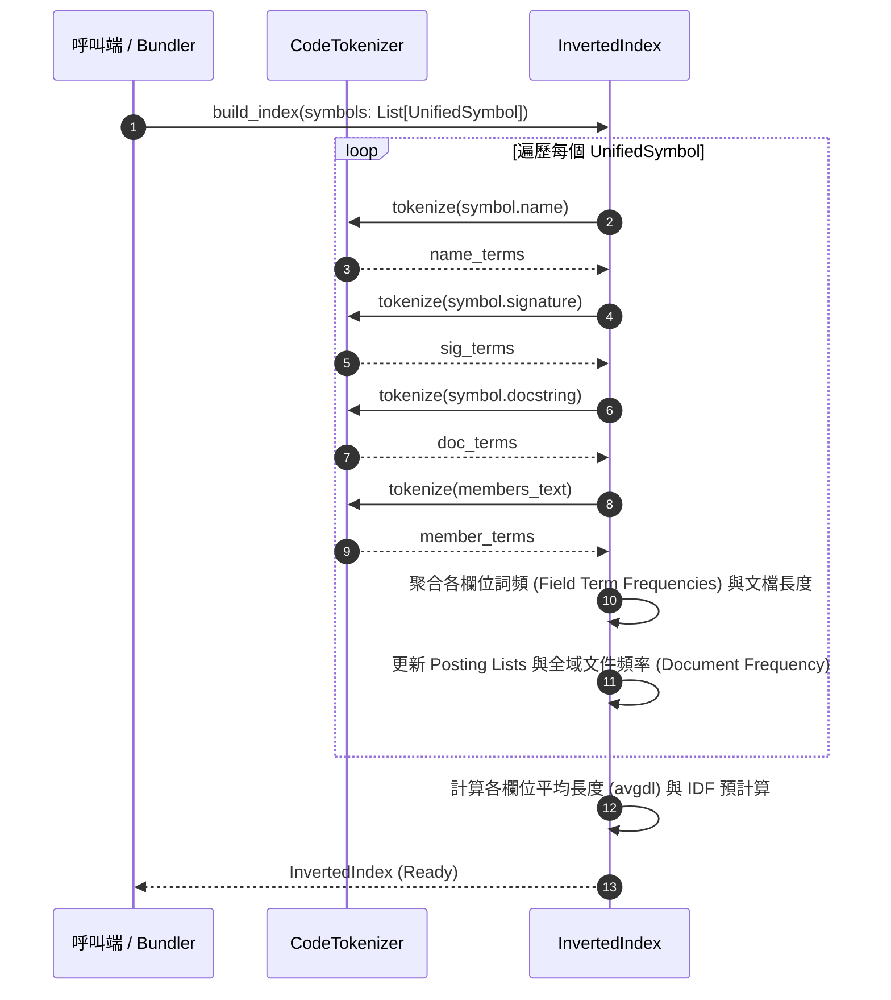
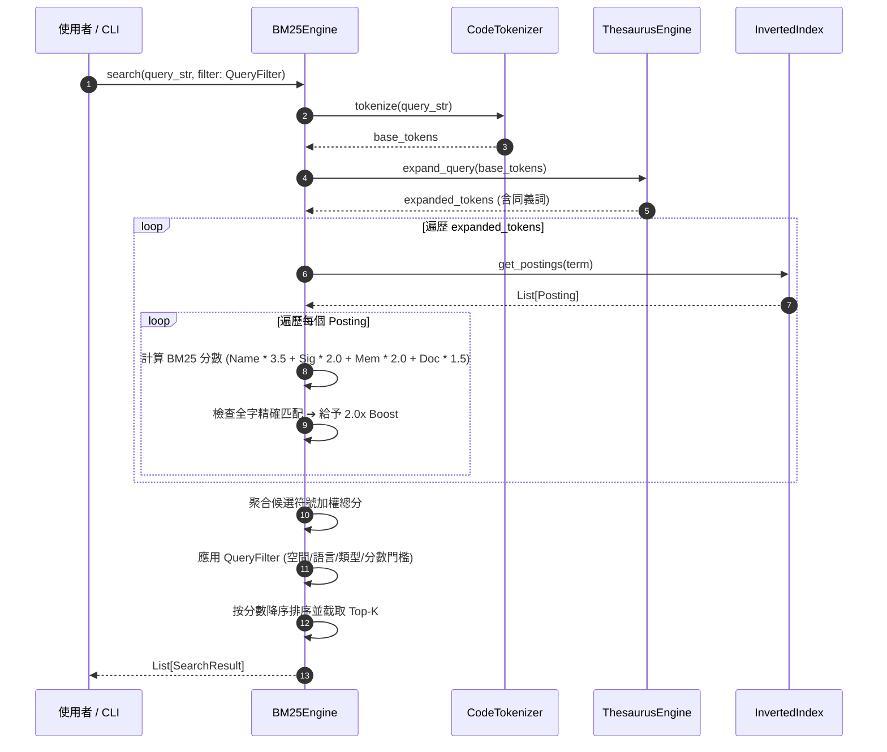

# 架構設計說明書 (Architecture Design)

> 功能名稱：knowledge-db 子計畫 03: 分詞、同義詞與 BM25 語意檢索引擎 (Tokenizer, Thesaurus & BM25 Retrieval)  
> 建立日期：2026-08-28  
> 所屬主計畫：`plans://2026_08_27_2127_knowledge_db/`  
> 狀態：Confirmed  
> 依據 P01：[P01_requirements_spec.md](./P01_requirements_spec.md)  
> 模板版本：v1.2  

---

## 1. 模組架構分層與職責邊界 (Layered Architecture)

```text
┌─────────────────────────────────────────────────────────────────────────────┐
│                      knowledge-db CLI 入口層 (scripts/cli.py)               │
│                  新增 search 指令：調度檢索引擎進行多空間檢索與格式化輸出   │
└──────────────────────────────────────┬──────────────────────────────────────┘
                                       │
┌──────────────────────────────────────▼──────────────────────────────────────┐
│                    語意檢索引擎層 (knowledge_db/retrieval.py)               │
│  - InvertedIndex: 記錄 Term ➔ Posting 清單 (doc_id, field_term_freqs, dl)  │
│  - BM25Engine: Okapi BM25 多欄位加權評分 (Name 3.5, Signature/Member 2.0) │
│  - QueryFilter: 空間、語言、類型、分數過濾                                 │
│  - SearchResult: 結構化檢索結果 (符號、分數、命中詞、摘要高亮)             │
└──────────────────┬───────────────────────────────────┬──────────────────────┘
                   │                                   │
┌──────────────────▼───────────────────┐ ┌─────────────▼──────────────────────┐
│         代碼/中文混合分詞層          │ │          雙層同義詞擴展層          │
│    (knowledge_db/tokenizer.py)       │ │    (knowledge_db/thesaurus.py)     │
│  - CodeTokenizer:                    │ │  - ThesaurusEngine:                │
│    - CJK 1-gram + 2-gram 滑動窗口    │ │    - 內建通用軟體工程詞庫          │
│    - 駝峰/底線/大寫標識符拆解        │ │    - 專案/空間自訂同義詞庫動態合併 │
│    - 停用詞過濾與小寫標準化          │ │    - 查詢端雙向同義詞擴展          │
└──────────────────────────────────────┘ └────────────────────────────────────┘
```

---

## 2. 核心資料流與循序圖 (Data Flow & Sequence Diagram)

### 2.1 倒排索引建立與符號向量化流程



### 2.2 查詢擴展與多欄位 BM25 評分檢索流程



---

## 3. 受影響檔案與新建檔案清單 (Impacted & New Files Inventory)

| 檔案路徑 | 類型 | 職責與變更說明 |
| :--- | :---: | :--- |
| `source/knowledge-db/knowledge_db/tokenizer.py` | **New** | `CodeTokenizer` 代碼駝峰/底線與 CJK 1-gram/2-gram 混合分詞器 |
| `source/knowledge-db/knowledge_db/thesaurus.py` | **New** | `ThesaurusEngine` 雙層同義詞合併與查詢擴展引擎 |
| `source/knowledge-db/knowledge_db/retrieval.py` | **New** | `InvertedIndex`、`BM25Engine`、`QueryFilter` 與 `SearchResult` |
| `source/knowledge-db/knowledge_db/__init__.py` | **Modify** | 匯出新增之 Tokenizer、Thesaurus 與 Retrieval 核心類別 |
| `source/knowledge-db/scripts/cli.py` | **Modify** | 擴充 `search` 語意查詢指令與結果高亮格式化輸出 |
| `source/knowledge-db/manifest.json` | **Modify** | 在 commands 宣告 `search` 指令防呆資訊 |
| `source/knowledge-db/tests/test_tokenizer.py` | **New** | 分詞器 CJK、駝峰代碼、停用詞單元測試 |
| `source/knowledge-db/tests/test_thesaurus.py` | **New** | 內建同義詞庫、自訂詞庫合併與查詢擴展單元測試 |
| `source/knowledge-db/tests/test_retrieval.py` | **New** | 倒排索引、BM25 多欄位加權評分與過濾單元測試 |

---

## 4. 架構決策記錄 (Architecture Decision Records)

- **[P02:DR-01] 零相依純原生代碼與 CJK 滑動分詞**：不依賴任何外部 C 庫或大型字典，透過正則拆解標識符並配合 CJK 單字與 2-gram 滑動，達到 100% 純標準庫與高精確度。
- **[P02:DR-02] BM25+ 演算法與平滑 IDF**：使用標準 Okapi BM25 公式，並對 IDF 進行 $\ln(1 + \frac{N - n + 0.5}{n + 0.5})$ 平滑處理，徹底消除高頻詞負分數問題。
- **[P02:DR-03] 符號多欄位加權與精確直擊置頂**：設定 Name 3.5、Signature 2.0、Member 2.0、Docstring 1.5 權重比，並針對精確名稱匹配給予 2.0x 置頂加權。
