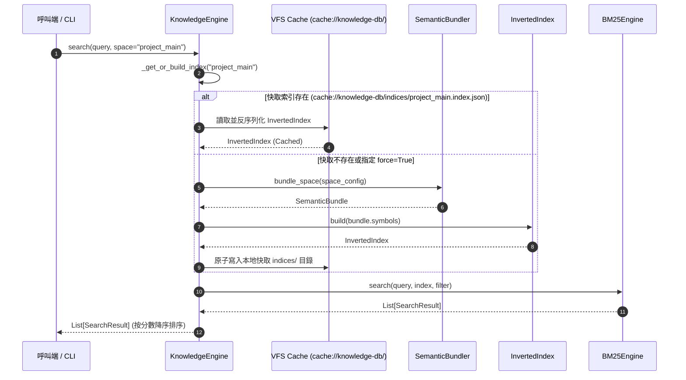

# 架構設計說明書 (Architecture Design)

> 功能名稱：knowledge-db 子計畫 04: CLI 工具鏈、統一門面 SDK、生態整合與本地端快取儲存遷移 (CLI, Unified SDK, Workflow Interlock & Local Cache Storage Migration)  
> 建立日期：2026-08-28  
> 所屬主計畫：`plans://2026_08_27_2127_knowledge_db/`  
> 狀態：Confirmed  
> 依據 P01：[P01_requirements_spec.md](./P01_requirements_spec.md)  
> 模板版本：v1.2  

---

## 1. 全系統架構分層與門面集成圖 (Full Architecture Integration)

```text
┌─────────────────────────────────────────────────────────────────────────────┐
│                      knowledge-db CLI 入口層 (scripts/cli.py)               │
│        status │ scan │ bundle │ index │ search │ clean (完整 6 大指令)       │
└──────────────────────────────────────┬──────────────────────────────────────┘
                                       │
┌──────────────────────────────────────▼──────────────────────────────────────┐
│                  統一門面 SDK 層 (knowledge_db/engine.py)                   │
│                              KnowledgeEngine                                │
│       status() │ scan() │ bundle() │ build_index() │ search() │ clean()     │
└──────┬───────────┬──────────────┬──────────────┬──────────────┬─────────────┘
       │           │              │              │              │
┌──────▼──────┐┌───▼──────────┐┌──▼───────────┐┌─▼────────────┐┌▼─────────────┐
│ 空間治理層  ││ 增量比對層   ││ 語意解析層   ││ 語意打包層  ││ 語意檢索層  │
│SpaceManager ││Fingerprint-  ││BaseParser    ││SemanticBundle││InvertedIndex │
│SpaceConfig  ││Scanner       ││ParserRegistry││Semantic-     ││BM25Engine    │
│Thesaurus-   ││ScanDiffResult││(Py/Md/Cpp/Cs)││ Bundler      ││Thesaurus-    │
│ Config      ││              ││              ││              ││ Engine       │
└──────┬──────┘└──────┬───────┘└──────────────┘└──────┬───────┘└──────┬───────┘
       │              │                               │               │
       └──────────────┴───────────────┬───────────────┴───────────────┘
                                      │
                   ┌──────────────────▼──────────────────┐
                   │ 本地端快取空間 (cache://knowledge-db/)│
                   │ • indices/<space>.index.json        │
                   │ • spaces/<space>/fingerprints.json  │
                   │ • bundles/<space>.bundle.json       │
                   └─────────────────────────────────────┘
```

---

## 2. 核心資料流與循序圖 (Data Flow & Sequence Diagram)

### 2.1 KnowledgeEngine 搜尋與自動懶索引循序圖 (Search & Lazy Indexing)



---

## 3. 受影響檔案與新建檔案清單 (Impacted & New Files Inventory)

| 檔案路徑 | 類型 | 職責與變更說明 |
| :--- | :---: | :--- |
| `source/knowledge-db/knowledge_db/space.py` | **Modify** | `_get_storage_root()` 預設改為解析 `cache://knowledge-db/`（回退 `./.cache/knowledge-db`） |
| `source/knowledge-db/manifest.json` | **Modify** | 更新 `knowledge.storage` URI 協議為 `cache://knowledge-db/` |
| `source/knowledge-db/scripts/hook.dev.py` | **Modify** | 測試沙盒環境改為初始化 `cache://knowledge-db/` |
| `source/knowledge-db/knowledge_db/engine.py` | **Modify** | 門面 API 狀態日誌與預設目錄與 `cache://knowledge-db/` 連動 |
| `source/knowledge-db/tests/test_space.py` | **Modify** | 驗證預設路徑解析為 `cache://knowledge-db/` |
| `source/knowledge-db/tests/test_cli.py` | **Modify** | 驗證 CLI 測試與快取目錄在 `.cache/knowledge-db` 下正常建置 |
| `source/core/core/engine.py` | **Modify** | 實作嚴格套件解析與 Build 包隔離 |

---

## 4. 架構決策記錄 (Architecture Decision Records)

- **[P02:DR-01] 統一門面輕量整合原則**：`KnowledgeEngine` 僅進行各子系統實例的協同編排與快取調度，底層子模組保持高度解耦與自包含性。
- **[P02:DR-02] 索引自動懶加載與透明構建**：檢索時若目標空間無持久化索引，自動調用 `bundle_space` 並建置快取，避免使用者遭遇索引未初始化錯誤。
- **[P02:DR-03] CLI 6 大子指令閉環**：涵蓋狀態查詢、指紋比對、打包發布、索引建置、語意檢索與快取清理全生命週期。
- **[P02:DR-04] Core 嚴格解析與零臆測 (Zero Fallback)**：廢除查無版本時預設回傳 `"1.0.0.0"` 的 dummy 邏輯，剛性拋出 `ModuleNotFoundError`。
- **[P02:DR-05] Build 快取包隔離機制**：僅在 `is_build_req` 為 True 時開放存取 `module.build://`，杜絕測試產物被假冒為正式 release 包。
- **[P02:DR-06] 資料庫與索引全面本地化 (`cache://`)**：預設資料庫目錄遷移至 `cache://knowledge-db/`，保證龐大之 AST 符號與倒排索引 100% 留存本地且不污染專案 Git 倉庫。
