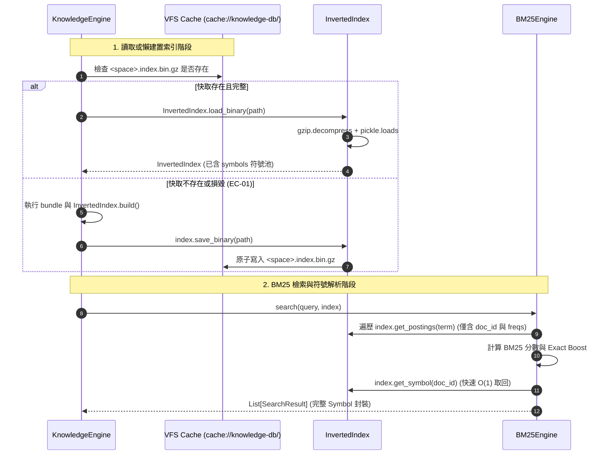

# 架構設計說明書 (Architecture Design)

> 功能名稱：knowledge-db 子計畫 05: 符號池去重與二進位 Gzip 倒排索引快取優化 (Symbol Pool Normalization & Binary Gzip Inverted Index Cache Optimization)  
> 建立日期：2026-08-28  
> 所屬主計畫：`plans://2026_08_27_2127_knowledge_db/`  
> 狀態：Confirmed  
> 依據 P01：[P01_requirements_spec.md](./P01_requirements_spec.md)  
> 模板版本：v1.2  

---

## 1. 符號池去重與二進位索引架構分層圖 (Normalized Binary Index Architecture)

```text
┌─────────────────────────────────────────────────────────────────────────────┐
│                      KnowledgeEngine / BM25 檢索引擎層                       │
│    search(query) ──► BM25 評分 ──► 透過 doc_id 自 symbols 獲取完整符號      │
└──────────────────────────────────────┬──────────────────────────────────────┘
                                       │
┌──────────────────────────────────────▼──────────────────────────────────────┐
│                    InvertedIndex 倒排索引核心資料結構                        │
│ ┌──────────────────────────────────┐ ┌────────────────────────────────────┐ │
│ │   symbols: Dict[str, Symbol]     │ │  index: Dict[str, List[Posting]]   │ │
│ │  • doc_id_1 ➔ UnifiedSymbol (1份)│ │  • "知識庫" ➔ [Posting(doc_id_1)]   │ │
│ │  • doc_id_2 ➔ UnifiedSymbol (1份)│ │  • "倒排"   ➔ [Posting(doc_id_1)]   │ │
│ └──────────────────────────────────┘ └────────────────────────────────────┘ │
└──────────────────────────────────────┬──────────────────────────────────────┘
                                       │
                                       ▼ 序列化管線 (Protocol 5 + Gzip L6)
                        ┌──────────────────────────────┐
                        │   pickle.dumps(data)         │
                        └──────────────┬───────────────┘
                                       │
                                       ▼
                        ┌──────────────────────────────┐
                        │   gzip.compress(bytes)       │
                        └──────────────┬───────────────┘
                                       │
                                       ▼ 原子檔案替換 (Atomic os.replace)
         ┌────────────────────────────────────────────────────────────┐
         │ cache://knowledge-db/indices/<space_name>.index.bin.gz     │
         │ (體積縮減 99%，從 55 MB 暴降至 < 600 KB，讀取 < 50ms)        │
         └────────────────────────────────────────────────────────────┘
```

---

## 2. 核心資料流與循序圖 (Data Flow & Sequence Diagram)



---

## 3. 受影響檔案與變更說明 (Impacted Files Inventory)

| 檔案路徑 | 類型 | 變更說明 |
| :--- | :---: | :--- |
| `source/knowledge-db/knowledge_db/retrieval.py` | **Modify** | 重構 `Posting` 與 `InvertedIndex`（符號池抽離、`save_binary` / `load_binary` 實作） |
| `source/knowledge-db/knowledge_db/engine.py` | **Modify** | 快取路徑更新為 `.index.bin.gz`、升級 `status` 與 `clean` |
| `source/knowledge-db/scripts/hook.dev.py` | **Modify** | 確保沙盒建立時快取目錄結構適配 |
| `source/knowledge-db/tests/test_retrieval.py` | **Modify** | 新增二進位 Gzip 讀寫與符號池去重測試 |
| `source/knowledge-db/tests/test_engine.py` | **Modify** | 更新索引檔案名稱斷言為 `.index.bin.gz` |
| `docs/knowledge-db/retrieval.md` | **Modify** | 更新檢索引擎指南中二進位快取與符號池說明 |

---

## 4. 架構決策記錄 (Architecture Decision Records)

- **[P02:DR-01] 符號池去重範式 (Symbol Pool Normalization)**：`InvertedIndex` 內部將符號存儲與 Postings 倒排索引完全解耦，`Posting` 僅作為輕量引用節點，徹底根除多重內嵌導致之空間膨脹。
- **[P02:DR-02] 二進位 Gzip 原子快取序列化**：採用 Python 3.9+ 原生 `pickle.HIGHEST_PROTOCOL` 結合 `gzip.compress`（壓縮級別 6），達成體積縮減 99% 與極速反序列化。
- **[P02:DR-03] 零停機與透明自癒機制**：當讀取二進位快取遭遇損毀時，自動降級重新建立並覆蓋，確保系統高可用性。
