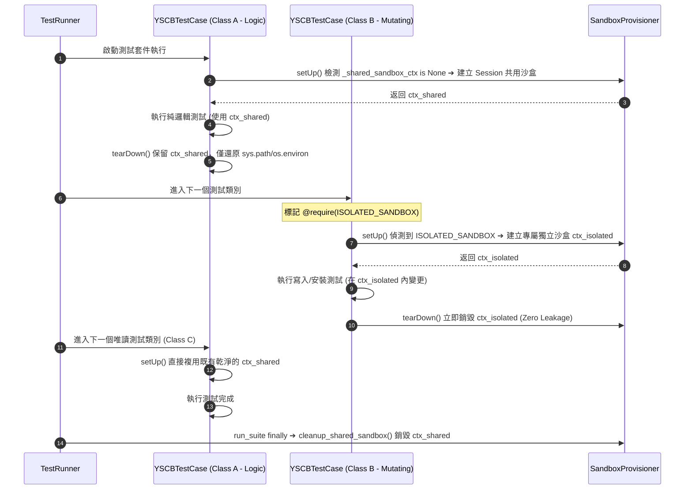

# 架構設計說明書 (Architecture Design)

> 功能名稱：測試框架 Session 層級共用沙盒與效能優化 (Test Session-Level Shared Sandbox Optimization)  
> 建立日期：2026-08-28  
> 所屬主計畫：無（獨立計畫）  
> 狀態：Confirmed  
> 模板版本：v1.2  

---

## 1. 模組架構分層與職責邊界 (Layered Architecture)

```text
[dev.testing.runner.TestRunner] ─────────── 跑測生命週期調度 (Session Root)
   │
   ├─► run_suite(suite)
   │     │
   │     ├─► runner.run(suite) ─────────── 執行所有測試案例 (In-Process)
   │     │      │
   │     │      ├─► YSCBTestCase.setUp() ──► 預設使用 YSCBTestCase._shared_sandbox_ctx (Session-Level)
   │     │      │                          └─► @require(ISOLATED_SANDBOX) ──► 專屬獨立沙盒
   │     │      └─► YSCBTestCase.tearDown()
   │     │
   │     └─► finally: YSCBTestCase.cleanup_shared_sandbox() ──► 統一回收 Session 沙盒
```

---

## 2. 核心資料流與循序圖 (Data Flow & Sequence Diagram)



---

## 3. 受影響檔案與新建檔案清單 (Impacted & New Files Inventory)

| 檔案路徑 | 類型 | 職責與變更說明 |
| :--- | :---: | :--- |
| `source/dev/dev/testing/case.py` | Modify | 將 `_class_sandbox_ctx` 重構為類別級全域 `_shared_sandbox_ctx`，實作 `cleanup_shared_sandbox()`，管理 Session-Level 生命週期。 |
| `source/dev/dev/testing/runner.py` | Modify | 在 `TestRunner.run_suite()` 加入 `finally: YSCBTestCase.cleanup_shared_sandbox()` 確保 Session 結束時自動安全釋放。 |
| `source/dev/tests/test_case.py` | Modify | 更新沙盒生命週期單元測試，驗證跨 Class 共用沙盒與 `ISOLATED_SANDBOX` 隔離機制。 |
| `source/core/tests/test_installer.py` | Modify | 標註 `@require(Requirement.ISOLATED_SANDBOX)` 防止 mock package 殘留。 |
| `source/core/tests/test_engine.py` | Modify | 標註 `@require(Requirement.ISOLATED_SANDBOX)` 防止循環依賴假模組與組態修改外溢。 |
| `source/core/tests/test_remote_zip_bootstrap.py` | Modify | 標註 `@require(Requirement.ISOLATED_SANDBOX)`。 |
| `source/agents-workflow/tests/test_targets.py` | Modify | 標註 `@require(Requirement.ISOLATED_SANDBOX)` 防止 targets 變更外溢。 |

---

## 4. 架構決策記錄 (Architecture Decision Records)

- **[P02:DR-01] 提升 `_shared_sandbox_ctx` 為類別層級 Session 單例**：`YSCBTestCase` 維護類別靜態屬性 `_shared_sandbox_ctx`，同一個進程內跨 Class 共享，由 `TestRunner.run_suite()` 在最外層保證 `finally` 清理。
- **[P02:DR-02] 獨立沙盒 Per-Method 自治銷毀**：標記 `Requirement.ISOLATED_SANDBOX` 之測試方法在 `setUp()` 建立全新沙盒，並在 `tearDown()` 時即時銷毀，與 Session 沙盒互不干涉。
